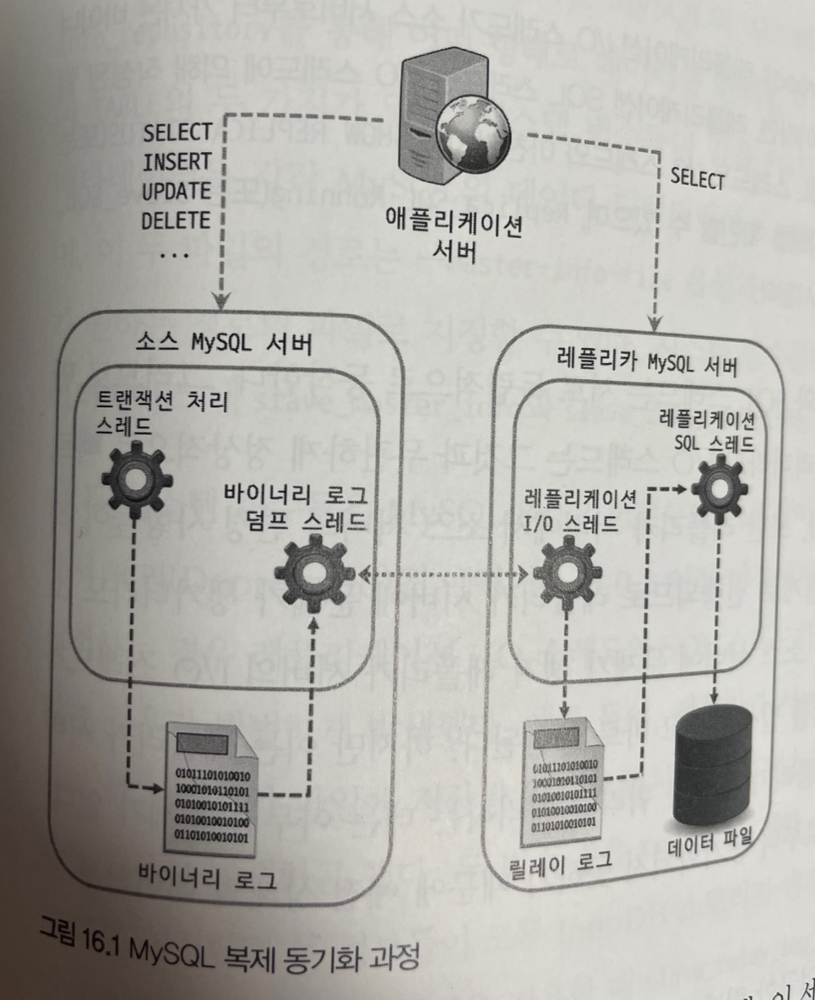
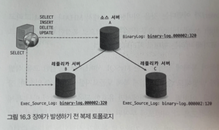
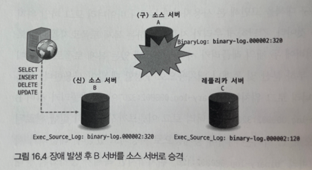
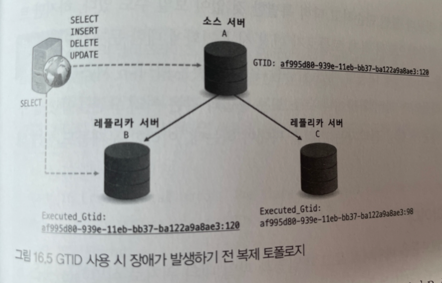
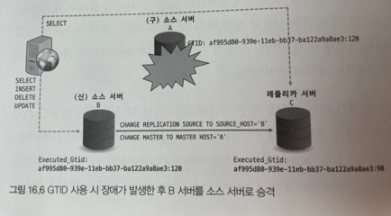
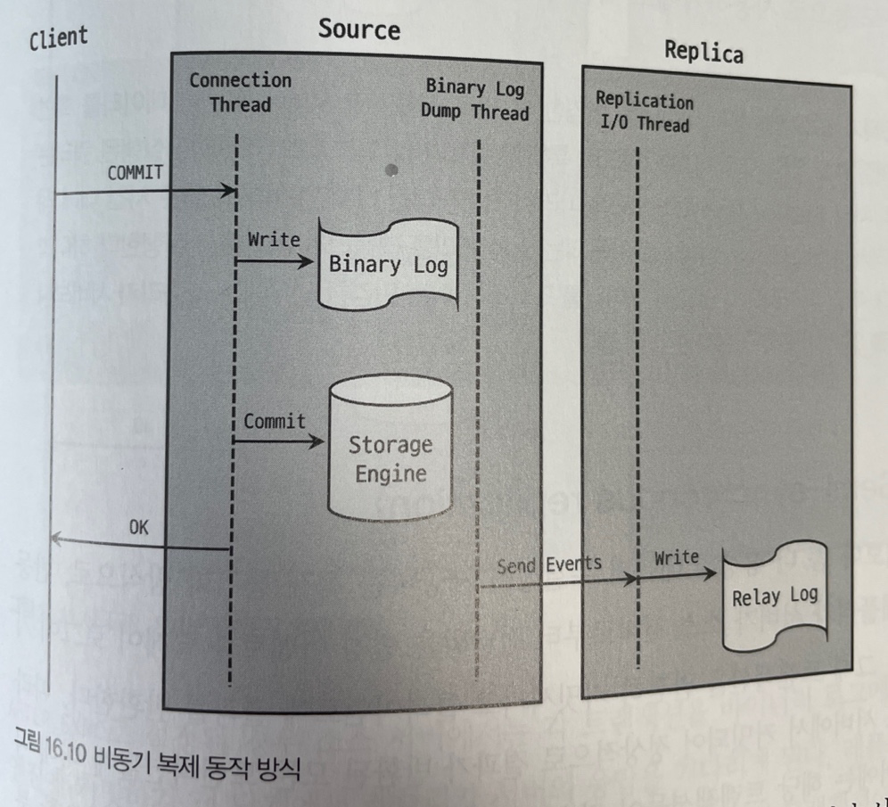
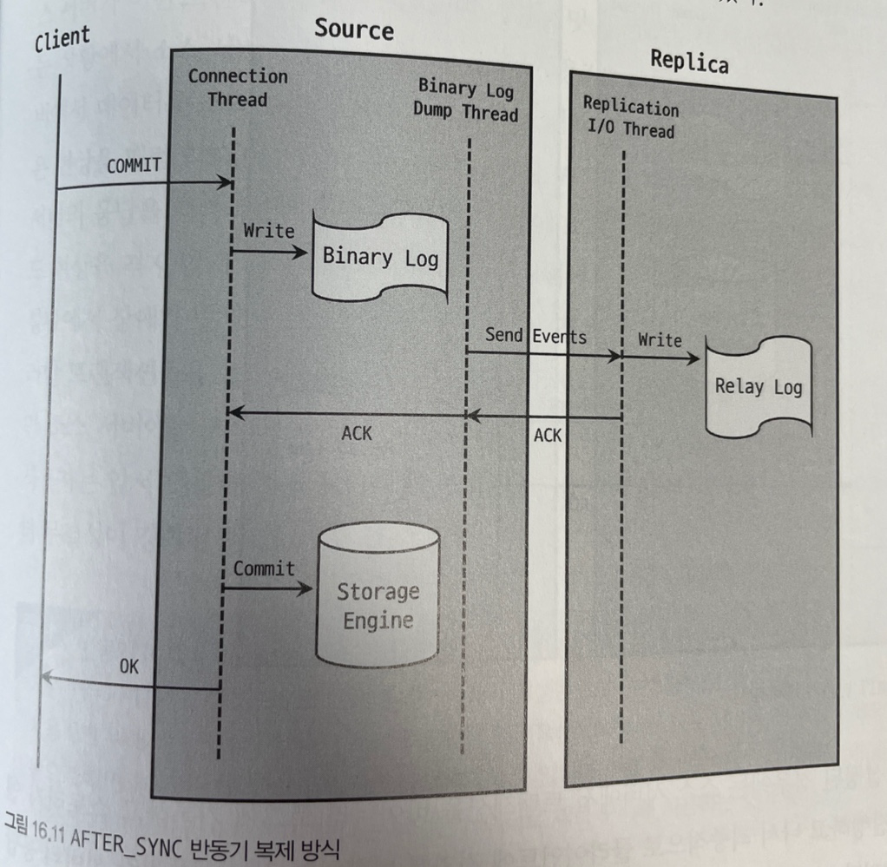
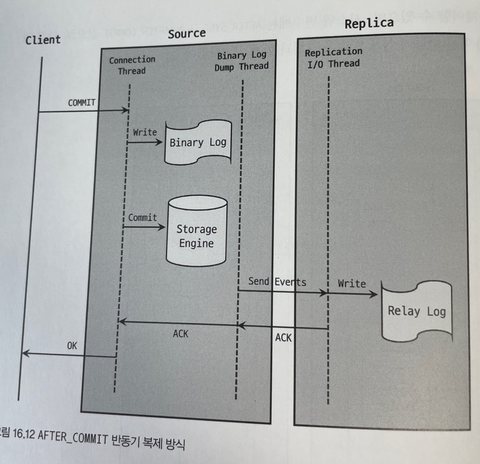

# 16. 복제
데이터베이스를 사용하고 운영할 때 가장 중요한 두 가지 요소를 꼽으라면 바로 `확장성`과 `가용성`이다.

서비스에서 발생하는 대용량 트래픽을 안정적으로 처리하기 위해서는 데이터베이스 서버의 확장이 필수적이며, 사용자가 항상 안정적인 서비스를 경험할 수 있게 하려면 DBMS서버 포함 하위 시스템들의 가용성이 반드시 뒷받침돼야 한다.

이 두 요소를 위해 일반적으로 사용되는 기술이 바로 `복제(Replication)`다.

## 16.1 개요
복제는 한 서버에서 다른 서버로 데이터가 동기화되는 것을 말하며, 원본 데이터를 가진 서버를 `소스(Source)서버`, 복제된 데이터를 갖는 서버를 `레플리카(Replica)서버`라고 부른다.

소스 서버에서 데이터 및 스키마에 대한 변경이 최초로 발생하며, 레플리카 서버에서는 이러한 변경 내역을 소스 서버로부터 전달받아 자신이 가지고 있는 데이터에 반영함으로써 소스 서버에 저장된 데이터와 동기화 시킨다.

일반적으로 서비스에서 사용될 DB 서버를 구축할 때는 메인으로 사용될 소스 서버 한 대와 복제를 통해 소스 서버와 동일한 데이터를 가진 레플리카 서버를 한 대 이상 함께 구축한다.

이는 서비스의 메인 DB 서버인 소스 서버에 문제가 생겼을 때를 대비하려는 목적이 제일 크지만, 그 외에도 이처럼 복제를 통해 레플리카 서버를 구축하는 데는 여러 가지 목적이 있다.

### 1. 스케일 아웃
서비스를 운영하다 보면 사용자가 늘어나고, 이에 따라 DB 서버로 유입되는 트래픽도 자연히 증가해 DB 서버의 부하가 높아진다.

스케일 업은 애플리케이션 단의 큰 변화 없이 늘어난 트래픽을 처리할 수 있다는 장점이 있지만, 일시적이라는 단점도 있다. 서버의 사양을 업그레이드한다 하더라도 한 대에서 처리할 수 있는 양에는 한계가 있기 때문이다.

만약 동일한 데이터를 가진 DB 서버를 한 대 이상 더 사용할 수 있다면 애플리케이션으로부터 실행되는 쿼리들을 분산시킬 수 있을 것이다.

이 같은 방법을 스케일 아웃이라고 하며, 스케일 아웃은 스케일 업 방식보다 갑자기 늘어나는 트래픽을 대응하는 데 훨씬 더 유연한 구조다. 복제를 사용해 DB 서버를 스케일 아웃할 수 있으며, 이를 통해 서비스를 좀 더 안정적으로 운영할 수 있다.

### 2. 데이터 백업
DB 서버에는 다양한 종류의 데이터가 저장되는데, 사용자의 실수로 데이터가 삭제되면 서비스 운영에 치명적인 영향을 줄 수 있다. 이러한 경우에 대비하기 위해선 DB 서버에 저장된 데이터들을 `주기적`으로 `백업`하는 것이 필수적이다.

보통은 데이터가 저장돼 있는 DB 서버에서 백업 프로그램이 실행되어 백업을 진행한다. 이처럼 동일한 서버 내에서 백업이 실행되는 경우 백업 프로그램과 DBMS가 서버의 자원을 공유해서 사용하기 때문에 백업으로 인해 DBMS에서 실행 중인 쿼리들이 영향을 받을 수 있으며, 심각한 경우에는 쿼리의 처리 속도가 느려져 서비스에 문제가 발생할 수 있다.

이 같은 문제를 방지하기 위해 주로 복제를 사용해 레플리카 서버를 구축하고, 데이터 백업은 레플리카 서버에서 실행한다. 이렇게 구축된 백업용 레플리카 서버는 소스 서버가 문제가 생겼을 때를 대비한 `대체 서버의 역할`을 하기도 한다.

### 3. 데이터 분석
분석용 쿼리는 대량의 데이터를 조회하는 경우가 많고, 또 집계 연산을 하는 등 쿼리 자체가 굉장히 복잡하고 무거운 경우가 대부분이라서 쿼리를 실행할 때 서버의 리소스를 많이 사용하게 된다.

이로 인해 서비스에서 사용되는 다른 쿼리들이 영향을 받을 수 있으므로 복제를 사용해 여분의 레플리카 서버를 구축해 분석용 쿼리만 전용으로 실행될 수 있는 환경을 만드는 것이 좋다.

### 4. 데이터의 지리적 분산
DB 서버와 애플리케이션 서버가 서로 떨어져 있는 경우 두 서버 간의 통신 시간은 떨어진 거리만큼 비례해서 늘어난다. 서비스의 응답 속도는 서버 간의 통신 속도에도 영향을 받으므로 사용자에게 빠른 응답 속도를 제공하려면 애플리케이션 서버와 DB 서버가 가까이 위치하는 것이 좋다.

만약 떨어져 있는 DB 서버의 위치를 이동시키지 못한다면 복제를 이용해 애플리케이션 서버가 위치한 곳에 기존 DB 서버에 대한 레플리카 서버를 새로 구축해 사용함으로써 응답 속도를 개선할 수 있다.

---

위 네 가지는 복제를 사용해서 얻을 수 있는 대표적인 이점이다.

<br>

## 16.2 복제 아키텍쳐
MySQL 서버에서 발생하는 모든 변경 사항은 별도의 로그 파일에 순서대로 기록되는데, 이를 `바이너리 로그`라고 한다.

바이너리 로그에는 데이터의 변경 내역뿐만 아니라 데이터베이스나 테이블의 구조 변경과 계정이나 권한의 변경 정보까지 모두 저장된다. 바이너리 로그에 기록된 각 변경 정보들을 `이벤트`라고도 한다.

MySQL의 복제는 이 바이너리 로그를 기반으로 구현됐는데, `소스 서버`에서 생성된 바이너리 로그가 레플리카 서버로 전송되고 `레플리카 서버`에서는 해당 내용을 `로컬 디스크`에 저장한 뒤 자신이 가진 데이터에 반영함으로써 소스 서버와 레플리카 서버 간에 데이터 동기화가 이뤄진다.

레플리카 서버에서 소스 서버의 바이너리 로그를 읽어 들여 따로 로컬 디스크에 저장해둔 파일을 릴레이 로그라 한다.



MySQL의 복제는 세 개의 스레드에 의해 작동하는데, 이 세 스레드 중 하나는 소스 서버에 존재하며, 나머지 두 개의 스레드는 레플리카 서버에 존재한다. 각 스레드의 역할은 다음과 같다.

- 바이너리 로그 덤프 스레드
  - 레플리카 서버는 데이터 동기화를 위해 소스 서버에 접속해 바이너리 로그 정보를 요청한다.
  - 소스 서버에서는 레플리카 서버가 연결될 때 내부적으로 `바이너리 로그 덤프 스레드`를 생성해서 바이너리 로그의 내용을 레플리카 서버로 전송한다.
  - 바이너리 로그 덤프 스레드는 레플리카 서버로 보낼 각 이벤트를 읽을 때 일시적으로 바이너리 로그에 잠금을 수행하며, 이벤트를 읽고난 후에는 바로 잠금을 해제한다.
- 레플리케이션 I/O 스레드
  - 복제가 시작되면 레플리카 서버는 I/O 스레드를 생성하고, 복제가 멈추면 I/O 스레드는 종료된다.
  - I/O 스레드는 소스 서버의 바이너리 로그 덤프 스레드로부터 바이너리 로그 이벤트를 가져와 로컬 서버의 파일로 저장하는 역할을 담당한다.
  - 소스 서버의 바이너리 로그를 읽어서 파일로 쓰는 역할만 하기 대문에 I/O 스레드라고 명명된 것이다.
- 레플리케이션 SQL 스레드
  - 레플리케이션 I/O 스레드가 소스 서버로부터 가져온 바이너리 로그 이벤트들을 `로컬 파일로 기록`하는 역할이라면, 레플리케이션 SQL 스레드는 I/O 스레드에 의해 작성된 릴레이 로그 파일의 이벤트들을 `읽고 실행`한다.

레플리카 서버에서 레플리케이션 I/O 스레드와 SQL 스레드는 서로 독립적으로 동작한다. 그러므로 만약 SQL 스레드에서 이벤트를 적용하는 게 느리더라도 I/O 스레드는 그것과 무관하게 정상적으로 빠르게 소스 서버로부터 이벤트를 읽어올 수 있다. 

또한 레플리카 서버에서 소스 서버의 변경 사항들이 적용되는 것은 소스 서버가 동작하는 것과는 별개로 진행되므로 레플맄타 서버에 문제가 생기더라도 소스 서버는 전혀 영향을 받지 않는다.

그러나 소스 서버에 문제가 생겨 레플리카 서버의 I/O 스레드가 정상적으로 동작하지 않게 되면 복제는 에러를 발생시키고 바로 중단된다. 하지만 이는 레플리카 서버의 복제 기능만 중단된 것이므로 여전히 레플리카 서버가 쿼리를 처리하는 데는 아무런 문제가 없다. 다만 레플리카 서버의 데이터는 소스 서버로부터 동기화되지 못하기 때문에 `예전 상태의 데이터`를 보게 된다.

복제가 시작되면 레플리카 서버는 앞에서 언급한 릴레이 로그를 비롯해 기본적으로 총 세 가지 유형의 복제 관련 데이터를 생성하고 관리한다.
- 릴레이 로그
  - 레플리케이션 I/O 스레드에 의해 작성되는 파일로, 소스 서버의 바이너리 로그에서 읽어온 이벤트(트랜잭션) 정보가 저장된다.
  - 릴레이 로그는 바이너리 로그와 마찬가지로 현재 존재하는 릴레이 로그 파일들의 목록이 담긴 인덱스 파일과 실제 이벤트 정보가 저장돼 있는 로그 파일들로 구성된다.
- 커넥션 메타데이터
  - 레플리케이션 I/O 스레드에서 소스 서버에 연결할 때 사용하는 DB 계정 정보 및 현재 읽고 있는 소스 서버의 바이너리 파일명과 파일 내 위치 값 등이 담겨 있다.
- 어플라이어 메타데이터
  - 레플리케이션 SQL 스레드에서 릴레이 로그에 저장된 소스 서버의 이벤트들을 레플리카 서버에 적용하는 컴포넌트를 어플라이어라고 한다.
  - 어플라이어 메타데이터는 최근 적용된 이벤트에 대해 해당 이벤트가 저장돼 있는 릴레이 로그 파일명과 파일 내 위치 정보 등을 담고 있으며, 레플리케잇견 SQL 스레드는 이 정보들을 바탕으로 레플리카 서버에 나머지 이벤트들을 적용한다.

커넥션 및 어플라이어 메타데이터는 MySQL의 시스템 변수인 `master_info_repository`와 `relay_log_info_repository`를 통해 어떤 형태로 데이터를 관리할지 설정할 수 있는데, 값으론 `FILE`과 `TABLE`의 두 가지가 있다.

시스템 변수들의 값을 FILE로 설정하면 커넥션 메타데이터와 어플라이어 메타데이터는 각가 MySQL의 데이터 디렉터리에서 `master.info`와 `relay-log.info`라는 파일로 관리된다.

시스템 변수들의 값을 TABLE로 설정하면 MySQL의 mysql 데이터베이스 내 `slave_master_info`와 `slave_relay_log_info` 테이블에 각각의 데이터가 저장된다.

8.0.2 버전부터 기본값이 TABLE로 변경됐으며, FILE 타입은 향후 제거될 예정이다.

<br>

## 16.3 복제 타입
MySQL의 복제는 소스 서버의 바이너리 로그에 기록된 변경 내역(바이너리 로그 이벤트)들을 식별하는 방식에 따라 `바이너리 로그 파일 위치 기반 복제`와 `글로벌 트랜잭션 ID 기반 복제`로 나뉘는데, 각 방식의 동작 원리와 구축 방법을 살펴보겠다.

### 바이너리 로그 파일 위치 기반 복제
레플리카 서버에서 소스 서버의 `바이너리 로그 파일명`과 `파일 내에서의 위치`로 개별 바이너리 로그 이벤트를 식별해서 복제가 진행되는 형태를 말한다.

일반적으로 복제를 처음 구축할 때 레플리카 서버에 소스 서버의 `어떤 이벤트 부터` 동기화를 수행할 것인가에 대한 정보를 설정해야 한다. 또한 복제가 설정된 레플리카 서버는 소스 서버의 `어느 이벤트까지` 로컬 디스크로 가져왔고 또 적용했는지에 대한 정보를 관리하며, 소스 서버에 해당 정보를 전달해 그 이후의 바이너리 로그 이벤트들을 가져온다.

따라서 소스 서버에서 발생한 `각 이벤트에 대한 식별`이 반드시 필요하다.

바이너리 로그 파일 위치 기반 복제에서는 이런 이벤트 하나하나를 소스 서버의 바이너리 로그 파일명과 파일 냉체서의 위치 값(File Offset)의 조합으로 식별한다. 레플리카 서버에서는 이처럼 각 이벤트들을 식별하고 자신의 적용 내역을 추적함으로써 복제를 일시적으로 중단할 수 있으며 재개할 때도 자신이 마지막으로 적용했던 이벤트 이후의 이벤트들부터 다시 읽어올 수 있다.

바이너리 로그 파일 위치 기반 복제에서 또 하나 중요한 부분은 바로 복제에 참여한 MySQL 서버들이 모두 고유한 `server_id`값을 가지고 있어야 한다는 점이다. 바이너리 로그에는 각 이벤트별로 `이 이벤트가 최초로 발생한 MySQL 서버를 식별하기 위해` 부가적인 정보도 함께 저장되는데, 바로 MySQL 서버의 `server_id`값이다.

바이너리 로그 파일 위치 기반 복제에서는 바이너리 로그 파일에 기록된 이벤트가 레플리카 서버에 설정된 `server_id`값과 동일한 `server_id`값을 가지는 경우 레플리카 서버에선 해당 이벤트를 적용하지 않고 무시하게 된다. 자신의 서버에서 발생한 이벤트로 간주해서 적용하지 않기 때문이다.

### 글로벌 트랜잭션 아이(GTID) 기반 복제
바이너리 로그 파일 위치 기반 복제 방식의 문제는 식별이 바이너리 로그 파일이 저장돼 있는 소스 서버에서만 유효하다는 것이다. 동일한 이벤트가 레플리카 서버에서도 동일한 파일명의 동일한 위치에 저장된다는 보장이 없다.

한마디로 복제에 투입된 서버들마다 동일한 이벤트에 대해 서로 다른 식별 값을 갖게 되는 것이다.

이렇게 복제를 구성하는 서버들이 서로 호환되지 않는 정보를 이용해 복제를 진행함으로써 복제의 토폴로지를 변경하는 작업은 때로 거의 불가능할 때도 많았다. 복제 토폴로지 변경은 주로 복제에 참여한 서버들 중에서 일부 서버에 장애가 발생했을 때 필요한데, 토폴로지 변경이 어렵다는 것은 그만큼 복제를 이용한 장애 복구가 어렵다는 것을 의미한다.

만약 소스 서버에서 발생한 각 이벤트들이 복제에 참여한 모든 MySQL 서버들에서 동일한 고유 식별값을 가진다면 어떨까? 그렇다면 장애가 발생해도 좀 더 손쉽게 토폴로지를 변경할 수 있으며, 장애 복구에 소요되는 시간도 줄어들 것이다.

이처럼 `소스 서버에서만 유효한 고유 식별 값`이 아닌 `복제에 참여한 전체 MySQL 서버들에서 고유`하도록 각 이벤트에 부여된 식별 값을 글로벌 트랜잭션 아이디라고 하며, 이를 기반으로 복제가 진행되는 형태를 GTID기반 복제라 한다.

<br>

#### GTID의 필요성



위 그림은 하나의 소스 서버에 두 개의 레플리카 서버가 연결돼 있는 복제 토폴로지다. 이런 형태는 주로 레플리카 서버를 읽기 부하 분산 및 통계나 배치용으로 구성할 때 많이 사용된다.

위 그림에서는 현재 소스 서버의 A의 바이너리 로그 위치는 `binary-log.000002:320`이며, 레플리카 서버 B는 완전히 동기화되어 똑같이 `binary-log.000002:320` 바이너리 로그 이벤트까지 완전히 실행 완료된 상태다.

B 서버는 SELECT 쿼리 분산용으로, C 서버는 배치나 통계용으로 사용되고 있었다. 레플리카 서버 C는 조금 지연이 발생해서 소스 서버의 `binary-log.000002:123`위치까지만 복제가 동기화된 상태였다.

그런데 이때 소스 서버인 A가 장애가 발생하면서 서버가 비정상적으로 종료됐다고 가정해보자. 그러면 레플리카 서버 B와 C 중에서 하나를 소스 서버로 승격하고, A 서버로 연결돼 있던 클라이언트 커넥션을 새로 승격된 소스 서버로 교체하고자 할 것이다.

이때 당연히 완전히 동기화돼 있는 레플리카 서버 B를 소스 서버로 승격할 것이다.



이제 위 그림과 같이 복제는 모두 끊어지고, B 서버로 사용자 트래픽이 유입되고 있다. 그러나 C 서버는 여전히 동기화되지 않은 상태여서 서비스에서 SELECT 용도로 사용할 수가 없는 상태다.

B 서버가 새로운 소스 서버로 승격되면서 클라이언트의 쿼리 요청이 B 서버로 들어오기 시작하는데, 이미 B 서버는 SELECT 쿼리의 부하 분산용이었기 때문에 분산 SELECT 쿼리 처리와 더불어 기존 소스 서버의 역할까지 겹치면서 과부하 상태가 될 것이다. 그러면 기존 B 서버의 SELECT 쿼리를 C 서버로 옮겨서 실행하면 될 것이다.

하지만 안타깝게도 C 서버는 동기화가 되지 않은 상태에서 A 서버가 종료돼 버렸으므로 복제를 최종 시점까지 동기화할 방법이 없다.

물론 완전히 불가능한 것은 아니다. 레플리카 서버 B의 릴레이 로그가 지워지지 않고 남아있었다면(릴레이 로그에는 소스 서버의 바이너리 로그 위치가 함께 기록돼 있으므로) B 서버의 릴레이 로그를 가져와서 필요한 부분만 실행하면 복구가 가능하다.

하지만 일반적으로 MySQL 서버의 릴레이 로그는 불필요한 시점에 자동 삭제되므로 이 방법은 상당히 제한적이라고 볼 수 있다. 또한 수동으로 직접 확인해보는 방법도 있을 수 있다. 그런데 이게 말처럼 간단한 문제가 아닐뿐더러 자동화는 더 어렵다.

그럼 글로벌 트랜잭션 아이디로 복제가 되는 상황을 한번 고려해보자.



위 그림과 같이 글로벌 트랜잭션 아이디를 이용해 복제가 구성돼 있으며, 소스 서버의 현재 GTID는 위와 같고, 레플리카 서버 B는 완전히 동기화된 상태이며, 레플리카 서버 C는 ~~~:98 까지만 동기화된 상태이다.

이 상태에서 소스 서버인 A에 장애가 발생하면 그림과 같이 B 서버를 C 서버의 소스 서버가 되도록 C 서버에서 `CHANGE REPLICATION SOURCE TO SOURCE_HOST='B'`, `SOURCE_PORT=3306;` 명령을 실행한다.

이때 B 서버의 바이너리 로그 파일명이 무엇인지, 그리고 바이너리 로그 파일에서 어느 위치부터 이벤트를 가져와야 하는지 입력할 필요가 없다. A 서버에서 GTID가 `~~:98` 이었던 트랜잭션은 B,C 서버에서도 동일한 GTID를 갖기 때문이다.

그래서 C 서버는 현재 `~~:98` 트랜잭션까지 실행했으므로 B 서버로 복제를 다시 연결할때도 B 서버에서 `~~:98` 이후의 바이너리 로그 이벤트를 가져와서 동기화하면 되기 때문이다.

이렇게 레플리카 서버 C가 새로운 소스 서버인 B와 동기화할 수 있도록 준비되면 이제 클라이언트의 쿼리 요청을 B 서버와 C 서버로 나눠서 실행할 수 있게 하면 된다.



사실 GTID의 개념은 단순해보일 수도 있지만, 트랜잭션의 아이디를 글로벌하게 확장함으로써 복제 토폴로지 변경 시 동기화에 대한 문제가 아주 간단하게 해결돼 버렸다.

<br>

#### 글로벌 트랜잭션 아이디
바이너리 로그 파일에 기록된 이벤트들을 바이너리 로그 파일명과 파일 내의 위치로 식별하는 것은 물리적인 방식이라고 할 수 있다.

반면 GTID는 논리적인 의미로서 물리적인 파일의 이름이나 위치와는 전혀 무관하게 생성된다. MySQL의 GTID는 서버에서 커밋된 각 트랜잭션과 연결된 고유 식별자로, 해당 트랜잭션이 발생한 서버에서 고유할뿐만 아니라 `그 서버가 속한 복제 토폴로지 내 모든 서버에서 고유하다.`

GTID는 `커밋되어 바이너리 로그에 기록된 트랜잭션에 한해서만 할당`되며, 데이터 읽기만 수행하는 SELECT 쿼리나 혹은 `sql_log_bin` 설정이 비활성화돼 있는 상태에서 발생한 트랜잭션은 바이너리에 기록되지 않으므로 GTID가 할당되지 않는다.

GTID는 소스 아이디와 트랜잭션 아이디 값의 조합으로 생성되는데, 두 값은 다음과 같이 콜론 문자(:)로 구분되어 표시된다.
```
GTID = [source_id]:[transaction_id]
```

소스 아이디는 `트랜잭션이 발생된 소스 서버`를 식별하기 위한 값으로, MySQL 서버의 `server_uuid`시스템 변수 값을 사용한다. 트랜잭션 아이디는 서버에서 커밋된 트랜잭션 순서대로 부여되는 값으로 1부터 1씩 단조 증가하는 형태로 발급된다.

<br>

## 16.5 복제 동기화 방식
MySQL에서는 소스 서버와 레플리카 서버 간의 복제 동기화에 대해 두 가지 방식을 제공한다.

하나는 오래전부터 사용돼온 비동기 복제(Asynchronous replication) 방식이며, 다른 하나는 반동기 복제(Semi-synchronous replication) 방식이다.

### 비동기 복제(Asynchronous replication)



MySQL의 복제는 기본적으로 비동기 방식으로 동작한다. 비동기 방식이란 소스 서버가 자신과 복제 연결된 레플리카 서버에서 변경 이벤트가 정상적으로 전달되어 적용됐는지를 확인하지 않는 방식이다.

소스 서버에서 커밋된 트랜잭션은 바이너리 로그에 기록되며, 레플리카 서버에서는 주기적으로 신규 트랜잭션에 대한 바이너리 로그를 소스 서버에 요청한다. 

비동기 복제 방식에서 소스 서버는 레플리카 서버로 변경 이벤트가 잘 전달됐는지, 실제로 적용됐는지 알지 못하며 이에 대한 어떠한 보장도 하지 않는다. 이로 인해 소스 서버에 장애가 발생하면 소스 서버에서 최근까지 적용된 트랜잭션이 레플리카 서버로 전송되지 않을 수 있다.
즉, 누락된 트랜잭션이 존재하게 되는 것이다. 

따라서 만약 소스 서버 장애로 인해 레플리카 서버를 새로운 소스 서버로 승격시키는 경우 사용자는 이 레플리카 서버가 `소스 서버로부터 전달받지 못한 트랜잭션이 있는지 직접 확인`하고 그런 것들이 있다면 필요 시 레플리카 서버에 `수동으로 다시 적용`해야 한다.

이처럼 비동기 복제는 소스 서버가 레플리카 서버의 동기화 여부를 보장하지 않는다는 것이 가장 큰 단점이지만 소스 서버가 각 트랜잭션에 대해 레플리카 서버로 전송되는 부분을 고려하지 않기 때문에 트랜잭션 처리에 있어서도 좀 더 빠른 성능을 보이고, 아울러 레플리카 서버에 문제가 생기더라도 소스 서버는 아무런 영향도 받지 않는다는 장점이 있다.

비동기 복제 방식은 소스 서버에 레플리카 서버를 여러 대 연결한다 해도 소스 서버에서 큰 성능 저하가 없으므로 레플리카 서버를 확장해서 읽기 트래픽을 분산하는 용도로 제격이라 할 수 있다. 또한 레플리카 서버에 무거운 쿼리가 실행되어 성능 저하가 있다고 하더라도 소스 서버와는 무관한 일이므로 분석 용도 등으로 사용하기에도 적합하다.

### 반동기 복제(Semi-synchronous replication)
반동기 복제는 비동기 복제보다 좀 더 향상된 데이터 무결성을 제공하는 복제 동기화 방식으로, 반동기 복제에서 소스 서버는 레플리카 서버가 소스 서버로부터 전달받은 변경 이벤트를 릴레이 로그에 기록 후 `응답(ACK)`을 보내면 `그때 트랜잭션을 완전히 커밋`시키고 클라이언트에 결과를 반환한다.

따라서 반동기 복제에서는 소스 서버에서 커밋되어 정상적으로 결과가 반환된 모든 트랜잭션들에 대해 `적어도 하나의 레플리카 서버에는 해당 트랜잭션들이 전송됐음을 보장`한다.

하지만 여기서 중요한 부분은 바로 레플리카 서버에 `전송`됐음을 보장한다는 것이지, 실제로 복제된 트랜잭션이 레플리카 서버에 `적용`되는 것까지 보장한다는 것은 아니다. 그래서 이 동기화 방식의 이름이 반동기인 것이다.

반동기 복제에서는 소스 서버가 트랜잭션 처리 중 `어느 지점에서 레플리카 서버의 응답(ACK)을 기다리느냐`에 따라 소스 서버에서 장애가 발생했을 때 사용자가 겪을 수 있는 문제 상황이 조금 다를 수 있다.

사용자는 `rpl_semi_sync_master_wait_point` 시스템 변수를 통해 소스 서버가 레플리카 서버의 응답을 기다리는 지점을 제어할 수 있으며, 시스템 변수에는 `AFTER_SYNC` 또는 `AFTER_COMMIT` 값으로 설정 가능하다. 각 설정 값에 따른 반동기 복제 방식을 그림과 함께 살펴보자.



`AFTER_SYNC`로 설정된 경우 소스 서버에서는 각 트랜잭션을 바이너리 로그에 기록하고 난 후 `스토리지 엔진에 커밋하기 전 단계`에서 레플리카 서버의 응답을 기다리게 된다.

레플리카 서버로부터 정상적으로 응답이 내려오면 소스 서버는 그때 스토리지 엔진을 커밋해서 트랜잭션에 대한 처리를 완전히 끝내고 트랜잭션을 실행한 클라리언트에 그 처리 결과를 반환한다.



`AFTER_COMMIT`으로 설정된 경우에는 소스 서버에서 트랜잭션을 바이너리 로그에 기록하고 스토리지 엔진에서의 `커밋도 진행하고` 나서 최종적으로 `클라이언트에 결과를 반환하기 전에` 레플리카 서버의 응답을 기다린다.

처음 반동기 복제가 도입됐을 때는 스토리지 엔진 커밋까지 완료 후 대기하는 `AFTER_COMMIT`방식으로만 동작했었다. 이후 버전에서 `AFTER_SYNC` 방식이 새로 도입됐으며, 현재 8.0 버전에서 기본적으로 설정된 동작 방식은 `AFTER_SYNC`다.

- AFTER_SYNC
  - 소스 서버에 장애가 발생했을 때 팬텀 리드가 발생하지 않음
    - `AFTER_COMMIT`에서는 트랜잭션이 스토리지 엔진 커밋까지 처리된 후 레플리카 서버의 응답을 기다리는데, 이처럼 스토리지 엔진 커밋까지 완료된 데이터는 다른 세션에서도 조회가 가능하다.
    - 이로 인해 소스 서버가 어떤 트랜잭션에 대해 스토리지 엔진 커밋 후 레플리카 서버로부터 아직 응답을 기다리고 있는 상황에서 소스 서버에 장애가 발생한 경우, 사용자는 이후 새로운 소스 서버로 승격된 레플리카 서버에서 데이터를 조회할 때 자신이 이전 소스 서버에서 조회했던 데이터를 보지 못할 수도 있다.
  - 장애가 발생한 소스 서버에 대해 좀 더 수월하게 복구 처리가 가능
    - 소스 서버에서 커밋됐으나 레플리카 서버로 복제는 되지 않은 상황에서 장애가 발생한 소스 서버를 재사용하는 경우, `AFTER_COMMIT` 방식과 다르게 수동으로 롤백시키지 않아도 된다.
    - `AFTER_SYNC` 방식에서는 레플리카 서버에 복제되지 않았지만 소스 서버에서는 커밋되어 실제 데이터에 반영된 트랜잭션들이 존재하지 않으므로 사용자는 위에 언급한 롤백처리를 수동으로 할 필요가 없다.
    - `AFTER_SYNC`는 `AFTER_COMMIT`보다 좀 더 데이터 무결성이 강화된 방식이라고 할 수 있다.

반동기 복제는 트랜잭션 처리 도중 레플리카 서버의 응답을 기다리므로 비동기 방식보다 트랜잭션의 처리 속도가 더 느릴 수 있다. 최소 레플리카 서버로 응답을 요청하고 전달받기까지의 네트워크 왕복 시간만큼 더 걸린다고 할 수 있으며, 만약 레플리카 서버에서 응답이 늦어지는 경우 그만큼 트랜잭션 처리가 더 지연될 수 있다.

이처럼 네트워크로 통신하는 부분으로 인해 반동기 복제는 물리적으로 가깝게 위치한 레플리카 서버와의 복제에 더 적합하다고 할 수 있다.

사용자는 타임아웃 시간을 설정하여 소스 서버는 지정된 타임아웃 시간 동안 레플리카 서버의 응답이 없으면 자동으로 비동기 복제 방식으로 전환하게 만들 수 있다.

<br>

## 16.6 복제 토폴로지
### 싱글 레플리카 복제 구성
싱글 레플리카 복제는 위 그림과 같이 하나의 소스 서버에 하나의 레플리카 서버만 연결돼 있는 복제 형태를 말한다.

가장 기본적인 형태로, 제일 많이 사용되는 형태라고 할 수 있다. 

이러한 복제 형태에서는 보통 애플리케이션 서버는 소스 서버에만 직접적으로 접근해 사용하고 레플리카 서버에는 접근하지 않으며, 레플리카 서버는 소스 서버에서 장애가 발생했을 때 사용될 수 있는 예비 서버 및 데이터 백업 수행을 위한 용도로 많이 사용된다.

만약 이 같은 형태에서 애플리케이션 서버가 레플리카 서버에서도 서비스용 읽기 쿼리를 실행한다고 하면 레플리카 서버에 문제가 발생한 경우 서비스 장애 상황이 도래할 수 있다.

따라서 이렇게 소스 서버와 레플리카 서버가 일대일로 구성된 형태에서는 레플리카 서버를 정말 예비용 서버로서만 사용하는게 제일 적합하다고 할 수 있다.

물론 서비스와는 연관이 없는 배치 작업이나 어드민 툴에서 사용되는 쿼리들은 레플리카 서버에서 실행되도록 구현해도 무방하다. 이러한 쿼리들은 레플리카 서버에 문제가 생겨 쿼리 실행이 제대로 이뤄지지 않더라도 서비스 동작에 영향을 미치지 않기 때문이다.

### 멀티 레플리카 복제 구성
멀티 레플리카 복제는 위 그림과 같이 하나의 소스 서버에 2개 이상의 레플리카 서버를 연결한 복제 형태로, 보통 싱글 레플리카 복제 구성에서 추가적인 용도를 위해 여분의 레플리카 서버가 더 필요해졌을 때 자주 사용되는 형태이다.

새로 오픈한 서비스에서는 보통 싱글 레플리카 복제 구성을 택한다. 서비스 오픈 초기에는 DB 서버로 유입되는 쿼리 요청이 매우 적기 때문이다.

이후 서비스의 트래픽이 크게 증가하면 소스 서버 한 대에서만 쿼리 요청을 처리하기에는 벅찰 수 있는데, 이렇게 증가된 쿼리 요청은 대부분의 경우 쓰기보다는 읽기 요청이 더 많으므로 사용자는 멀티 레플리카 형태로 복제 구성을 전환해 읽기 요청 처리를 분산시킬 수 있다.

이러한 경우에선 레플리카 서버 한 대는 예비용으로 남겨두는 것이 좋다. 레플리카 서버로 서비스 읽기 요청이 들어오는 경우 해당 레플리카 서버는 소스 서버만큼 중요해지며, 그 외 다른 용도로 사용되는 레플리카 서버들도 지정된 시간 내에 쿼리 처리가 반드시 수행돼야 하는 등의 요건이 있을 수 있다.

따라서 이러한 레플리카 서버들은 장애가 발생했을 때 최대한 빠르게 복구돼야 하며, 그렇지 못한 경우에는 다른 레플리카 서버가 문제가 발생한 레플리카 서버로 유입되는 쿼리 요청을 전부 넘겨받아야 한다.

쿼리 요청을 넘겨받은 레플리카 서버는 별다른 문제가 없을 수도 있지만, 만약 넘겨진 쿼리 요청으로 인해 부하가 높아져 성능 저하가 발생하는 경우 기존에 유입되던 쿼리 요청 및 넘겨진 쿼리 요청들 모두 원활하게 처리되지 못할 수 있다.

따라서 이 같은 상황을 대비해 대체 서버 및 백업 수행 용도 외에는 최소한의 용도로만 사용되는 예비용서버 한 대를 남겨놓는 것이 좋으며, 이렇게 예비용으로 남겨진 서버는 소스 서버의ㅏ 대체 서버 겸 다른 레플리카 서버의 대체 서버로도 사용할 수 있다.

### 듀얼 소스 복제 구성
듀얼 소스 복제 구성은 두 개의 MySQL 서버가 서로 소스 서버이자 레플리카 서버로 구성돼 있는 형태를 말한다.

듀얼 소스 구성은 두 서버 모두 쓰기가 가능하다는 것이 제일 큰 특징이며, 각 서버에서 변경한 데이터는 복제를 통해 다시 각 서버에 적용되므로 양쪽에서 쓰기가 발생하지만 두 서버는 서로 동일한 데이터를 갖게 된다.

듀얼 소스 구성에서는 목적에 따라 두 서버를 `ACTIVE-PASSIVE` 또는 `ACTIVE-ACTIVE`형태로 사용할 수 있다.

`ACTIVE-PASSIVE`는 하나의 MySQL 서버에서만 쓰기 작업이 수행되는 형태를 말하는데, 이는 싱글 레플리카 복제 구성과 동일하다고 생각할 수 있지만 예비 서버인 다른 MySQL 서버가 바로 쓰기 작업이 가능한 상태이기 대문에 쓰기 작업이 수행되고 있는 서버에서 문제 발생 시 별도의 설정 변경 없이 바로 예비용 서버로 쓰기 작업을 전환할 수 있다는 점이 다르다.

따라서 `ACTIVE-PASSIVE` 형태는 한 서버에서 다른 서버로 바로 쓰기가 전환될 수 있는 환경이 필요한 경우 주로 사용된다.

`ACTIVE-ACTIVE` 형태는 두 서버 모두에 쓰기 작업을 수행하는 형태로,. 지리적으로 매우 떨어진 위치에서 유입되는 쓰기 요청도 원활하게 처리하기 위해 주로 사용된다.

