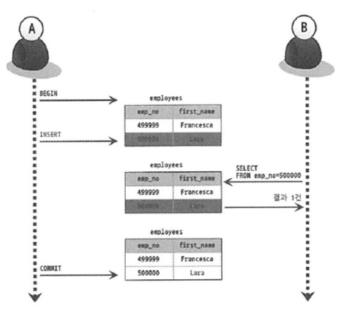
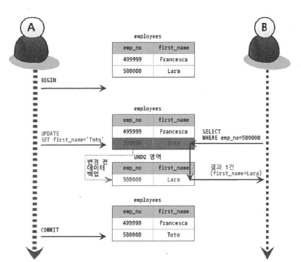

# 05. 트랜잭션과 잠금
트랜잭션은 작업의 완전성을 보장해주는 것이다. 논리적인 작업 셋을 모두 완벽하게 처리하거나, 처리하지 못할 경우에는 원 상태로 복구해서 작업의 일부만 적용되는 현상이 발생하지 않게 만들어주는 기능이다.

잠금(Lock)은 동시성을 제어하기 위한 기능이고, 트랜잭션은 정합성을 보장하기 위한 기능이다.
잠금은 여러 커넥션에서 동시에 동일한 자원(레코드나 테이블)을 요청할 경우 순서대로 한 시점에는 하나의 커넥션만 변경할 수 있게 해주는 역할을 한다.
격리 수준은 하나의 트랜잭션 내에서 또는 여러 트랜잭션 간의 작업 내용을 어떻게 공유하고 차단할 것인지를 결정하는 레벨을 의미한다.

## 5.1 트랜잭션
### MySQL에서의 트랜잭션
MySQL에서 InnoDB는 트랜잭션을 지원하고, MyISAM, MEMORY는 트랜잭션을 지원하지 않는다.

만약 tab 테이블에 3이 들어있는 상태에서INSERT INTO tab (col) VALUES (1), (2), (3); 쿼리를 실행한다면, InnoDB 테이블에선 1, 2 모두 들어가지 않지만, MyISAM이나 MEMORY 테이블에선 1과 2를 저장하고, 3을 저장하려는 순간 키 중복 오류가 발생하고 앞서 저장한 1과 2는 그대로 두고 쿼리 실행을 종료해 버린다. 이는 쿼리 중 오류가 발생했을 때 전체를 원 상태로 만드는 트랜잭션의 원칙을 따르지 않는 것이다. 이러한 현상을 부분 업데이트(Partial Update)라 하며, 테이블 데이터의 정합성을 맞추는데 상당한 어려움을 가져온다.

### 주의사항
트랜잭션은 DBMS의 커넥션과 동일하게 꼭 필요한 최소의 코드에만 적용하는 것이 좋다. 이는, 프로그램 코드에서 트랜잭션의 범위를 최소화하라는 의미이다.

다음은 사용자가 게시판에 게시물을 작성한 후 저장 버튼을 클릭했을 때 서버에서 처리하는 내용을 순서대로 정리한 것이다.
```
1) 처리 시작
  -> 데이터베이스 커넥션 생성
  -> 트랜잭션 시작
2) 사용자의 로그인 여부 확인
3) 사용자의 글쓰기 내용의 오류 여부 확인
4) 첨부로 업로드된 파일 확인 및 저장
5) 사용자의 입력 내용을 DBMS에 저장
6) 첨부 파일 정보를 DBMS에 저장
7) 저장된 내용 또는 기타 정보를 DBMS에서 조회
8) 게시물 등록에 대한 알림 메일 발송
9) 알림 메일 발송 이력을 DBMS에 저장
  <- 트랜잭션 종료(COMMIT)
  <- 데이터베이스 커넥션 반납
10) 처리 완료
```
위 처리 절차 중에서 DMBS의 트랜잭션 처리에 좋지 않은 영향을 미치는 부분을 나눠서 살펴보자.

- 실제로 DBMS에 데이터를 저장하는 작업(트랜잭션)은 5번부터 시작된다. 2~4번의 절차가 아무리 빨리 처리되더라도 트랜잭션에 포함시킬 필요는 없다. 일반적으로 DB 커넥션은 개수가 제한적이어서 각 단위의 프로그램이 커넥션을 소유하는 시간이 길어질수록 사용 가능한 여유 커넥션의 개수는 줄어들 것이다. 그리고 어느 순간에는 각 단위 프로그램에서 커넥션을 가져가기 위해 기다려야 하는 상황이 발생할 수 있다.
- 8번 작업이 가장 위험하다. 메일 전송이나 FTP 파일 전송 작업 또는 네트워크를 통해 원격 서버와 통신하는 등과 같은 작업은 어떻게 해서든 DBMS의 트랜잭션 내에서 제거하는 것이 좋다. 프로그램이 실행되는 동안 메일 서버와 통신할 수 없는 상황이 발생한다면 웹 서버뿐 아니라 DBMS 서버까지 위험해지는 상황이 발생할 것이다.
- 5,6번 작업은 반드시 하나의 트랜잭션으로 묶고, 7번 작업은 데이터의 단순 확인 및 조회이므로 트랜잭션에 포함할 필요는 없다.(별도로 트랜잭션을 사용하지 않아도 됨) 9번 작업은 이전 트랜잭션(5, 6번 작업)에 함께 묶지 않고 별도의 트랜잭션으로 분리하는 것이 좋다.

이를 고려해 수정하면 다음과 같다.

```
1) 처리 시작
2) 사용자의 로그인 여부 확인
3) 사용자의 글쓰기 내용의 오류 여부 확인
4) 첨부로 업로드된 파일 확인 및 저장
  -> 데이터베이스 커넥션 생성(또는 커넥션 풀에서 가져오기)
  -> 트랜잭션 시작
5) 사용자의 입력 내용을 DBMS에 저장
6) 첨부 파일 정보를 DBMS에 저장
  <- 트랜잭션 종료(COMMIT)
7) 저장된 내용 또는 기타 정보를 DBMS에서 조회
8) 게시물 등록에 대한 알림 메일 발송
  -> 트랜잭션 시작
9) 알림 메일 발송 이력을 DBMS에 저장
  <- 트랜잭션 종료(COMMIT)
  <- 데이터베이스 커넥션 종료(또는 커넥션 풀에 반납)
10) 처리 완료
```
여기서 설명하려는 바는 프로그램의 코드가 데이터베이스 커넥션을 가지고 있는 범위와 트랜잭션이 활성화돼 있는 프로그램의 범위를 최소화해야 한다는 것이다.

또한 프로그램의 코드에서 라인 수는 한두 줄이라고 하더라도 네트워크 작업이 있는 경우에는 반드시 트랜잭션에서 배제해야 한다.

## 5.2 MySQL의 잠금
MySQL에서 사용되는 잠금은 크게 스토리지 엔진 레벨과 MySQL 엔진 레벨로 나눌 수 있다. 

MySQL 엔진 레벨의 잠금은 모든 스토리지 엔진에 영향을 미치지만, 스토리지 엔진 레벨의 잠금은 스토리지 엔진 간 상호 영향을 미치지는 않는다. MySQL 엔진에서는 테이블 데이터 동기화를 위한 테이블 락 이외에도 테이블의 구조를 잠그는 메타데이터 락(Metadata Lock), 사용자의 필요에 맞게 사용할 수 있는 네임드 락(Named Lock) 기능이 있다.

### 글로벌 락
`FLUSH TABLES WITH READ LOCK` 명령으로 획득할 수 있으며, MySQL에서 제공하는 잠금 가운데 가장 범위가 크다.

한 세션에서 글로벌 락을 획득하면 다른 세션에서 SELECT를 제외한 대부분의 `DDL 문장이나 DML 문장`을 실행하는 경우 글로벌 락이 해제될 때까지 해당 문장이 대기 상태로 남는다.

글로벌 락이 영향을 미치는 범위는 MySQL 서버 전체이며, 작업 대상 테이블이나 데이터베이스가 다르더라도 동일하게 영향을 미친다. 여러 데이터베이스에 존재하는 MyISAM이나 MEMORY 테이블에 대해 mysqldump로 일관된 백업을 받아야 할 때는 글로벌 락을 사용해야 한다.

글로벌 락은 MySQL 서버 전체에 큰 영향을 미치기 때문에 웹 서비스용 서버에서는 가급적 사용하지 않는 것이 좋다. 또한 MySQL 8.0 부터는 InnoDB가 기본 스토리지 엔진으로 채택되면서 좀 더 가벼운 글로벌 락의 필요성이 생겼고, Xtrabackup이나 Enterprise Backup과 같은 백업 툴들의 안정적인 실행을 위해 백업 락이 도입됐다.

특정 세션에서 백업 락을 획득하면 모든 세션에서 다음과 같이 테이블의 스키마나 사용자의 인증 관련 정보를 변경할 수 없게 된다.
- 데이터베이스 및 테이블 등 모든 객체 생성 및 변경, 삭제
- REPAIR TABLE과 OPTIMIZE TABLE 명령
- 사용자 관리 및 비밀번호 변경

### 테이블 락
개별 테이블 단위로 설정되는 잠금으로, 명시적(LOCK TABLES table_name [ READ | WRITE ]) 또는 묵시적으로 특정 테이블의 락을 획득할 수 있다. 

명시적으로 획득한 잠금은 UNLOCK TABLES 명령으로 잠금을 반납(해제)할 수 있다. 명시적인 테이블 락도 특별한 상황이 아니면 애플리케이션에서 직접 사용할 필요가 거의 없다. 명시적으로 테이블을 잠그는 작업은 글로벌 락과 동일하게 온라인 작업에 상당한 영향을 미치기 때문이다.

묵시적 테이블 락은 MyISAM이나 MEMORY 테이블에 데이터를 변경하는 쿼리를 실행하면 발생한다. MySQL 서버가 `데이터가 변경되는 테이블`에 잠금을 설정하고 데이터를 변경한 후, 잠금을 해제하는 식으로 사용된다.

하지만 InnoDB 테이블의 경우 스토리지 엔진 차원에서 `레코드 기반의 잠금`을 제공하기 때문에 단순 데이터 변경 쿼리로 인해 묵시적인 테이블 락이 설정되지는 않는다. 정확히는 InnoDB 테이블에도 테이블 락이 설정되지만, 대부분의 데이터 변경(`DML`) 쿼리에서는 무시되고 스키마를 변경하는 쿼리(`DDL`)의 경우에만 영향을 미친다.

### 네임드 락
`GET_LOCK()` 함수를 이용해 임의의 문자열에 대해 잠금을 설정할 수 있다.

이 잠금의 특징은 대상이 테이블이나 레코드 또는 `AUTO_INCREMENT`와 같은 데이터베이스 객체가 아니라는 것이다. 단순히 사용자가 지정한 문자열(String)에 대해 획득하고 반납(해제)하는 잠금이다.

네임드 락은 많은 레코드에 대해 복잡한 요건으로 레코드를 변경하는 트랜잭션에 유용하게 사용할 수 있다. 배치 프로그램처럼 한 번에 많은 레코드를 변경하는 쿼리는 데드락의 원인이 되곤 하는데, 이러한 경우에 동일 데이터를 변경하거나 참조하는 프로그램끼리 분류해서 네임드 락을 걸고 쿼리를 실행하면 아주 간단히 해결할 수 있다.

MySQL 8.0 버전부터는 네임드 락을 중첩해서 사용할 수 있게 됐으며, 현재 세션에서 획득한 네임드 락을 한 번에 모두 해제하는 기능도 추가됐다.

### 메타데이터 락
데이터베이스 객체(테이블이나 뷰 등)의 이름이나 구조를 변경하는 경우에 획득하는 잠금이다. 이 잠금은 명시적으로 획득하거나 해제할 수 있는 것이 아니고 `RENAME TABLES tab_a TO tab_b`와 같이 테이블의 이름을 변경하는 경우 자동으로 획득하는 잠금이다.

## 5.3 InnoDB 스토리지 엔진 잠금
InnoDB 스토리지 엔진은 MySQL에서 제공하는 잠금과는 별개로 스토리지 엔진 내부에서 레코드 기반의 잠금 방식을 탑재하고 있다. 이 때문에 MyISAM보다는 훨씬 뛰어난 동시성 처리를 제공할 수 있다. 하지만, 이원화된 잠금 처리 탓에 InnoDB 스토리지 엔진에서 사용되는 잠금에 대한 정보는 MySQL 명령을 이용해 접근하기가 상당히 까다롭다.

### InnoDB 스토리지 엔진의 잠금
InnoDB 스토리지 엔진은 레코드 기반의 잠금 기능을 제공하며, 잠금 정보가 상당히 작은 공간으로 관리되기 때문에 레코드 락이 페이지 락으로, 또는 테이블 락으로 레벨업되는 경우(락 에스컬레이션)는 없다. 또한 레코드 락 뿐만 아니라 레코드와 레코드 사이의 간격을 잠그는 갭(GAP) 락이란 잠금이 있다.

- 레코드락
  - 레코드 자체만을 잠그는 것을 레코드 락이라고 한다. 다른 상용 DBMS의 레코드 락과 동일한 역할을 하지만, 한 가지 중요한 차이는 InnoDB 스토리지 엔진은 레코드 자체가 아니라 인덱스의 레코드를 잠근다는 점이다. 인덱스가 하나도 없는 테이블이라도 내부적으로 자동 생성된 클러스터 인덱스를 이용해 잠금을 설정한다.
- 갭 락
  - 레코드 자체가 아니라 레코드와 바로 인접한 레코드 사이의 간격만을 잠그는 것을 의미한다. 갭 락의 역할은 레코드와 레코드 사이의 간격에 새로운 레코드가 생성(INSERT)되는 것을 제어하는 것이다. 갭 락은 그 자체보다 넥스트 키 락의 일부로 자주 사용된다.
- 넥스트 키 락
  - 레코드 락과 갭 락을 합쳐 놓은 형태의 잠금이다. 바이너리 로그에 기록되는 쿼리가 레플리카 서버에서 실행될 때 소스 서버에서 만들어 낸 결과와 동일한 결과를 만들어내도록 보장하는 것이 주 목적이다. 하지만 이 잠금으로 인해 데드락이 발생하는 경우가 있기 때문에, 가능하면 바이너리 로그 포맷을 ROW 형태로 바꿔서 넥스트 키 락이나 갭 락을 줄이는 것이 좋다.
- 자동 증가 락
  - MySQL에서는 자동 증가하는 숫자 값을 추출(채번)하기 위해 AUTO_INCREMENT라는 칼럼 속성을 제공한다. InnoDB 스토리지 엔진에서는 이를 위해 내부적으로 AUTO_INCREMENT 락이라 하는 테이블 수준의 잠금을 사용한다.
  - 이 잠금은 INSERT나 REPLACE와 같은 새 레코드를 저장하는 쿼리에서만 필요하고, 트랜잭션과 관계 없이 AUTO_INCREMENT 값을 가져오는 순간에만 락이 걸렸다가 즉시 해제된다.
  - 이 락은 테이블에 단 하나만 존재하기 때문에 두 개의 INSERT 쿼리가 동시에 실행되는 경우 하나의 쿼리가 AUTO_INCREMENT 락을 걸면 나머지 쿼리는 AUTO_INCREMENT 락을 기다려야 한다. MySQL 5.1 이상부터는 innodb_autoinc_lock_mode라는 시스템 변수를 이용해 자동 증가 락의 작동 방식을 변경할 수 있다.

### 인덱스와 잠금
InnoDB의 잠금은 레코드를 잠그는 것이 아니라 인덱스를 잠그는 방식으로 처리한다. 변경해야 할 레코드를 찾기 위해 검색한 인덱스의 레코드를 모두 락을 걸어야 한다. 만약 인덱스가 없다면 테이블을 풀 스캔하면서 UPDATE 작업을 수행하게 된다. 이 때문에 MySQL의 InnoDB에서는 인덱스 설계가 매우 중요하다.

### 레코드 수준의 잠금 확인 및 해제
5.1 이상 버전에서는 레코드 잠금과 잠금 대기에 대한 조회가 가능하다.

## 5.4 MySQL의 격리 수준
트랜잭션의 격리 수준(isolation level)이란 여러 트랜잭션이 동시에 처리될 때 특정 트랜잭션이 다른 트랜잭션에서 변경하거나 조회하는 데이터를 볼 수 있게 허용할지 말지를 결정하는 것이다.

격리 수준은 크게 4가지로 나뉜다. READ UNCOMMITED는 일반적인 데이터베이스에서는 거의 사용하지 않고, SERIALIZABLE 또한 동시성이 중요한 DB에선 거의 사용되지 않는다. 격리 수준이 높아질수록 동시 처리 성능이 떨어지는데, 사실 SERIALIZABLE이 아니면 크게 성능 저하는 발생하지 않는다.

격리 수준을 이야기 할 때 항상 같이 언급되는 세 가지 부정합의 문제점들은 다음과 같다.

||DIRTY READ|NON-REPETABLE READ|PHANTOM READ|
|:--:|:--:|:--:|:--:|
|READ UNCOMMITTED|O|O|O|
|READ COMMITTED|X|O|O|
|REPETABLE READ|X|X|O(InnoDB는 없음)|
|SERIALIZABLE|X|X|X|

Oracle에선 주로 READ COMMITTED 수준을 많이 사용하고, MySQL에서는 REPETABLE READ를 주로 사용한다.

### READ UNCOMMITED

이 격리 수준에선 각 트랜잭션의 변경 내용이 COMMIT이나 ROLLBACK 여부와 상관 없이 다른 트랜잭션에서 접근할 수 있다.

위 예시에서의 문제점은 A가 롤백하더라도 B에서는 "Lara"를 정상적인 사원이라 생각하고 계속 처리할 것이라는 점이다. 
이처럼 어떤 트랜잭션에서 처리한 작업이 완료되지 않았는데도 다른 트랜잭션에서 볼 수 있는 현상을 `더티 리드(Dirty read)`라 하고, 더티 리드가 발생하는 격리 수준이 `READ UNCOMMITTED`이다. 

더티 리드 현상은 데이터가 나타났다가 사라졌다 하는 현상을 초래하므로 애플리케이션 개발자와 사용자를 상당히 혼란스럽게 한다. 이 격리 수준은 RDBMS 표준에서는 트랜잭션의 격리 수준으로 인정하지 않을 정도로 정합성에 문제가 많은 격리 수준이다.

### READ COMMITED

READ COMMITTED는 Oracle의 디폴트 격리 수준이며, 온라인 서비스에서 가장 많이 선택되는 격리 수준이다. READ COMMITTED는 말 그대로 COMMIT이 완료된 데이터만 다른 트랜잭션에게 보여진다.

변경된 레코드를 참조할 경우, 커밋되기 전이라면 테이블이 아닌 `언두 영역`에 백업된 레코드에서 값을 가져온다.

READ COMMITTED에서는 `NON-REPEATABLE READ`라는 부정합의 문제가 있다. 하나의 트랜잭션 내에서 똑같은 쿼리를 실행했을 때 항상 같은 결과를 가져와야 한다는 "REPETABLE READ" 정합성에 어긋나는 것이다. 이러한 부정합 현상은 일반적인 웹 프로그램에서는 크게 문제되지 않을 수 있지만, 하나의 트랜잭션에서 `동일 데이터를 여러 번 읽고 변경하는 작업`이 금전적인 처리와 연결되면 문제가 될 수 있다.

### REPEATABLE READ
InnoDB 스토리지 엔진에서 기본으로 사용되는 격리 수준이다. InnoDB 스토리지 엔진은 트랜잭션이 ROLLBACK될 가능성에 대비해 변경되기 전 레코드를 언두(Undo) 공간에 백업해두고 실제 레코드 값을 변경한다. 

REPETABLE READ는 `MVCC`를 위해 `언두 영역`에 백업된 이전 데이터를 이용해 `동일 트랜잭션 내`에서는 `동일한 결과`를 보여줄 수 있도록 한다.

이는 READ COMMITTED 수준도 동일한데, 둘의 차이는 언두 영역에 백업된 레코드의 몇 번째 이전 버전까지 찾아 들어가냐에 있다.


REPETABLE READ에서도 `팬텀 리드(Phantom read)`라는 부정합이 발생할 수 있다. 다른 트랜잭션에서 수행한 변경 작업에 의해 레코드가 보였다 안보였다 하는 현상을 말한다.

> 팬텀리드(Phantom Read)는 데이터베이스 관리 시스템(DBMS)에서 발생하는 일관성 문제 중 하나로, 트랜잭션 격리 수준에 따라 발생할 수 있다. 팬텀리드는 특정 트랜잭션이 동일한 쿼리를 두 번 실행할 때, 처음 쿼리에는 없던 새로운 데이터가 두 번째 쿼리 결과에 포함되는 현상을 의미한다.

`SELECT ... FOR UPDATE` 쿼리는 SELECT하는 레코드에 쓰기 잠금을 걸어야하는데, 언두 레코드에는 잠금을 걸 수 없다. 따라서 `SELECT ... FOR UPDATE`나 `SELECT ... LOCK IN SHARE MODE`로 조회되는 레코드는 언두 영역의 변경 전 데이터를 가져오는 것이 아니라 현재 레코드의 값을 가져오게 되는 것이다.


### SERIALIZABLE
가장 단순한 격리 수준이면서 동시에 가장 엄격한 격리 수준이다. 그만큼 동시 처리 성능도 다른 트랜잭션 격리 수준보다 떨어진다. 읽기 작업도 공유 잠금(읽기 잠금)을 획득해야만 하며, 동시에 다른 트랜잭션은 그러한 레코드를 변경하지 못하게 된다. 즉, 한 트랜잭션에서 읽고 쓰는 레코드를 다른 트랜잭션에서 절대 접근할 수 없는 격리 수준이다.

SERIALIZABLE 격리 수준에선 일반적인 DBMS에서 일어나는 PHANTOM READ가 발생하지 않는다. InnoDB 스토리지 엔진에서도 갭 락과 넥스트 키 락 덕분에 `REPEATABLE READ` 격리 수준에서 `이미 팬텀 리드가 발생하지 않기 때문에` 굳이 SERIALIZABLE을 사용할 필요성은 없어 보인다.