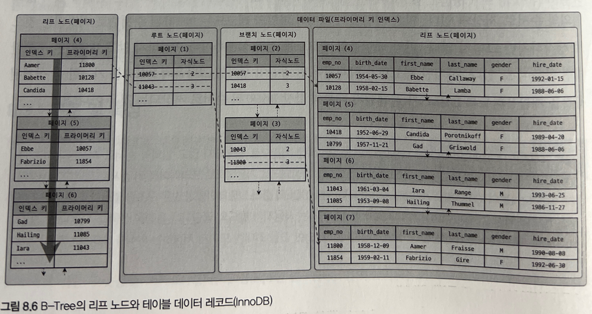

# 08. 인덱스
## 8.1 디스크 읽기 방식
데이터베이스의 성능 튜닝은 어떻게 디스크 I/O를 줄이느냐가 관건일 때가 상당히 많다.

### 하드 디스크 드라이브(HDD)와 솔리드 스테이트 드라이브(SSD)
컴퓨터에서 CPU나 메모리 같은 주요 장치는 대부분 전자식 장치지만 하드 디스크 드라이브는 `기계식`장치다. 그래서 데이터베이스 서버에서는 항상 디스크 장치가 병목이 된다.

이러한 기계식 하드 디스크 드라이브를 대체하기 위해 전자식 저장 매체인 SSD가 많이 출시되고 있다.
SSD는 기존 하드 디스크 드라이브에서 데이터 저장용 플래터(원판)을 제거하고 그 대신 `플래시 메모리`를 장착하고 있다. 그래서 디스크 원판을 기계적으로 회전시킬 필요가 없으므로 아주 빨리 데이터를 읽고 쓸 수가 있다.
`플래시 메모리`는 전원이 공급되지 않아도 데이터가 삭제되지 않는다.

디스크의 헤더를 움직이지 않고 한 번에 많은 데이터를 읽는 순차I/O에서는 SSD가 하드 디스크 드라이브보다 조금 빠르거나 거의 비슷한 성능을 보인다. 하지만, SSD의 장점은 기존 하드 디스크 드라이브보다 `랜덤 I/O`가 훨씬 빠르다는 것이다.

데이터 베이스 서버에서 순차 I/O 작업은 그다지 비중이 크지 않고 랜덤 I/O를 통해 작은 데이터를 읽고 쓰는 작업이 대부분이므로 SSD의 장점은 DBMS용 스토리지에 최적이라고 볼 수 있다.

### 랜덤 I/O와 순차 I/O
랜덤 I/O라는 표현은 하드 디스크 드라이브의 플래터를 돌려서 읽어야 할 데이터가 저장된 위치로 디스크 헤더를 이동시킨 다음 데이터를 읽는 것을 의미하는데, 사실 순차 I/O 또한 이 작업 과정은 동일하다. 그럼 랜덤 I/O와 순차 I/O는 어떤 차이가 있을까?

순차 I/O는 3개의 페이지(3 * 16KB)를 디스크에 기록하기 위해 1번 시스템 콜을 요청했지만, 랜덤 I/O는 3개의 페이지를 디스크에 기록하기 위해 3번 시스템 콜을 요청한다. 즉, 디스크에 기록할 위치를 찾기 위해 헤드를 각각 1번, 3번 움직인 것이다. 

결국 디스크의 성능은 디스크의 헤더의 위치 이동 없이 얼마나 많은 데이터를 한 번에 기록하느냐에 의해 결정된다고 볼 수 있다. 그래서 여러 번 쓰기 또는 읽기를 요청하는 랜덤 I/O 작업이 작업 부하가 훨씬 더 크다.

데이터베이스의 대부분의 작업은 이러한 작은 데이터를 빈번히 읽고 쓰기 때문에 MySQL 서버에는 그룹 커밋이나 바이너리 로그 버퍼 또는 InnoDB 로그 버퍼 등의 기능이 내장되어 있다.

쿼리를 튜닝해서 랜덤 I/O를 순차 I/O로 바꿔 실행할 방법은 그다지 많지 않다. 일반적으로 쿼리를 튜닝하는 것은 랜덤 I/O 자체를 줄여주는 것이 목적이라고 할 수 있다. 여기서 랜덤 I/O를 줄인다는 것은 쿼리를 처리하는 데 꼭 필요한 데이터만 읽도록 쿼리를 개선하는 것을 의미한다.

## 8.2 인덱스란?
DBMS에서 데이터베이스 테이블의 모든 데이터를 검색해서 원하는 결과를 가져오려면 시간이 오래 걸린다.

그래서 칼럼(또는 칼럼들)의 값과 해당 레코드가 저장된 주소를 키와 값의 쌍으로 삼아 인덱스를 만들어 두는 것이다.
또한 칼럼의 값을 주어진 순서로 미리 정렬해서 보관한다. 이 때문에 DBMS의 인덱스도 데이터가 저장될 때마다 항상 값을 정렬해야 하기 때문에 INSERT, UPDATE, DELETE 문장의 처리가 느려진다.
결론적으로 DBMS에서 인덱스는 `데이터의 저장`(INSERT, UPDATE, DELETE)의 성능을 `희생`하고 그 대신 `데이터의 읽기 속도`를 높이는 기능이다.

테이블의 인덱스를 하나 더 추가할지 말지는 `데이터의 저장 속도`를 어디까지 희생할 수 있는지, `읽기 속도`를 얼마나 더 빠르게 만들어야 하느냐에 따라 결정해야 한다. SELECT 쿼리 문장이 WHERE 조건절에 사용되는 칼럼이라 해서 전부 인덱스로 생성하면 데이터 저장 성능이 떨어지고 인덱스의 크기가 비대해져 오히려 역효과만 불러올 수 있다.

인덱스는 데이터를 관리하는 방식과 중복 값의 허용 여부 등에 따라 여러 가지로 나눌 수 있다. 인덱스를 역할별로 구분한다면 프라이머리 키와 보조 키(세컨더리 인덱스)로 구분할 수 있다.

- Primary Key
  - 그 레코드를 대표하는 칼럼의 값으로 만들어진 인덱스를 의미
  - 식별자라고 부르며, NULL을 허용하지 않으며 중복을 허용하지 않는다.
- Secondary Index
  - PK를 제외한 모든 인덱스이다.

유니크 인덱스는 PK와 성격이 비슷하고 대체해서 사용할 수도 있다고 해서 대체 키라고도 하는데, 별도로 분류하기도 하고 그냥 세컨더리 인덱스로 분류하기도 한다.인덱스를 데이터 저장 방식(알고리즘) 별로 구분할 경우 대표적으로 B-Tree 인덱스와 Hash 인덱스로 구분할 수 있다. 그리고 최근에는 Fractal-Tree 인덱스나 로그 기반의 Merge-Tree 인덱스와 같은 알고리즘을 사용하기도 한다.

- B-Tree 인덱스 알고리즘
  - 가장 일반적으로 사용되는 인덱스 알고리즘. 칼럼의 값을 변형하지 않고 원래의 값을 이용해 인덱싱하는 알고리즘이다. MySQL 서버에서는 위치 기반 검색을 지원하기 위한 R-Tree 인덱스 알고리즘이 있는데, 이 역시 B-Tree의 응용이다.
- Hash 인덱스 알고리즘
  - 칼럼의 값으로 해시값을 계산해서 인덱싱하는 알고리즘. 매우 빠른 검색을 지원하며, 주로 메모리 기반의 데이터베이스에서 많이 사용한다.

데이터 중복 허용 여부로 분류하면 유니크 인덱스와 유니크하지 않은 인덱스로 구분할 수 있다. 유니크 여부는 옵티마이저에게 상당히 중요한 단서가 되는데, 동등 조건으로 검색할 때 하나의 레코드만 찾으면 더 이상 찾지 않아도 되기 때문이다.

인덱스의 기능별로 분류하면 전문 검색용 인덱스나 공간 검색용 인덱스 등이 있다.

## 8.3 B-Tree 인덱스
B-Tree는 데이터베이스의 인덱싱 알고리즘 가운데 가장 일반적으로 사용되고, 가장 먼저 도입된 알고리즘이다. 아직도 가장 범용적인 목적으로 사용된다. 일반적으로 DBMS에서는 주로 B+-Tree 또는 B*-Tree가 사용된다. 참고로 B는 Binary가 아니라 Balanced이다.

B-Tree는 칼럼의 원래 값을 변형시키지 않고 인덱스 구조체 내에서는 항상 정렬된 상태로 유지한다. 전문 검색같은 특별한 경우를 제외한 대부분의 인덱스는 거의 B-Tree를 활용한다.

### 구조 및 특성
B-Tree는 트리 구조의 최상위에 하나의 루트 노드가 있고 그 하위에 자식 노드가 붙어 있는 형태다. 최하위 노드를 리프 노드라 하고, 중간의 노드들을 브랜치 노드라고 한다.

데이터베이스에서 인덱스와 실제 데이터가 저장된 데이터는 따로 관리되는데, 인덱스의 `리프 노드`는 항상 실제 `데이터 레코드`를 찾아가기 위한 주솟값을 가지고 있다.


위 그림에서와 같이 인덱스의 키 값은 모두 정렬되어 있지만, 데이터 파일의 레코드는 정렬돼 있지 않고 임의의 순서로 저장돼 있다.

데이터 파일의 레코드는 INSERT 된 순서대로 저장되는 것으로 생각하지만 그렇지 않다. 만약 테이블의 레코드를 전혀 삭제하거나 변경하지 않고 INSERT만 수행한다면 맞을 수도 있다. 하지만 레코드가 삭제되어 빈 공간이 생기면 그 다음의 INSERT는 가능한 한 삭제된 공간을 재활용하도록 DBMS가 설계되기 때문에 항상 INSERT된 순서로 저장되는 것은 아니다.




MyISAM과 InnoDB 스토리지 엔진에서의 인덱스에서 가장 큰 차이는 세컨더리 인덱스를 통해 레코드를 찾아가는 방법이다. MyISAM 테이블은 세컨더리 인덱스가 물리적인 주소를 가지는 반면, InnoDB 테이블은 프라이머리 키를 주소처럼 사용하기 때문에 논리적인 주소를 가진다고 볼 수 있다. 그래서 InnoDB 테이블에서 인덱스를 통해 레코드를 읽을 때는 인덱스에 저장돼 있는 프라이머리 키 값을 이용해 `프라이머리 키 인덱스를 한 번 더 검색한 뒤`, 프라이머리 키 인덱스의 리프 페이지에 저장돼 있는 레코드를 읽는다.

즉, InnoDB 스토리지 엔진에서는 모든 세컨더리 인덱스 검색에서 데이터 레코드를 읽기 위해서는 반드시 `프라이머리 키를 저장하고 있는 B-Tree`를 다시 한번 검색해야 한다.

### B-Tree 인덱스 키 추가 및 삭제
#### 추가
새로운 키 값이 B-Tree에 저장될 때 테이블의 스토리지 엔진에 따라 새로운 키 값이 즉시 인덱스에 저장될 수도 있고 아닐 수도 있다.

B-Tree에 저장될 때는 저장될 키 값을 이용해 B-Tree 상태의 적절한 위치를 검색해야 한다. 저장될 위치가 결정되면 레코드의 키 값과 대상 레코드의 주소 정보를 B-Tree 리프 노드에 저장한다. 리프 노드가 꽉 찬 경우, 리프 노드가 `분리`(Split) 돼야 하는데, 이는 상위 브랜치 노드까지 처리의 범위가 넓어진다. 이 때문에 B-Tree는 상대적으로 `쓰기 작업`에 비용이 많이 든다.

MyISAM이나 MEMORY 스토리지 엔진은 INSERT 문장이 실행되면 즉시 새로운 키 값을 인덱스에 추가한다. 반면, InnoDB 테이블에서는 필요하다면 인덱스 키 추가 작업을 나중에 처리한다. 하지만 PK나 유니크 인덱스의 경우 중복 체크가 필요하기 때문에 즉시 반영된다.

#### 삭제
삭제는 간단하다. 해당 키 값이 저장된 리프 노드를 찾아 그냥 삭제 마크만 하면 작업이 완료된다. 인덱스 키 삭제로 인한 마킹 작업 또한 디스크 쓰기가 필요하기 때문에 이 작업 역시 디스크 I/O가 필요한 작업이다. MySQL 5.5 이상 버전의 InnoDB 스토리지 엔진에서는 이 작업 또한 버퍼링되어 지연 처리될 수도 있다.
MyISAM이나 MEMORY 스토리지 엔진의 테이블에서는 체인지 버퍼와 같은 기능이 없으므로 인덱스 키 삭제가 완료된 후 쿼리 실행이 완료된다.

#### 변경
변경될 값에 따라 저장될 리프 노드가 결정되기 때문에 단순히 인덱스 상의 `키 값만 변경하는 것은 불가능`하다. 변경 작업은 먼저 `키 값을 삭제` 후, `다시 새로운 키 값을 추가`하는 형태로 처리된다. 마찬가지로 InnoDB 스토리지 엔진을 사용하는 테이블에 대해서는 이 작업 모두 체인지 버퍼를 활용해 지연 처리 될 수 있다.

#### 검색
INSERT, UPDATE, DELETE 작업을 할 때 인덱스 관리에 따르는 추가 비용을 감당하면서 인덱스를 구축하는 이유는 바로 빠른 검색을 위해서다. 인덱스를 검색하는 작업은 B-Tree 루트 노드부터 시작해 브랜치 노드를 거쳐 최종 리프 노드까지 이동하면서 비교 작업을 수행하는데, 이 과정을 "트리 탐색"이라 한다.
인덱스 트리 탐색은 SELECT 뿐만 아니라 UPDATE나 DELETE의 경우에도 사용할 수 있다.

B-Tree 인덱스를 이용한 검색은 100% 일치 또는 값의 일부분만 일치하는 경우에 사용할 수 있다. 중요한 것은 인덱스의 키 값에 변형이 가해진 후에는 B-Tree의 빠른 검색 기능을 이용할 수 없다는 것이다. 이미 변형된 값은 B-Tree 인덱스에 존재하는 값이 아니기 때문에, 함수나 연산을 수행한 결과로 정렬하거나 검색하는 작업은 B-Tree 인덱스의 장점을 이용할 수 없다.

InnoDB 스토리지 엔진에서 인덱스는 더 특별한 의미가 있다. InnoDB 테이블에서 지원하는 레코드 잠금이나 넥스트 키락(갭락)이 검색을 수행한 인덱스를 잠근 후 테이블의 레코드를 잠그는 방식으로 구현돼 있다. 따라서 UPDATE나 DELETE 문장이 실행될 때 테이블에 적절히 사용할 수 있는 인덱스가 없으면 불필요하게 많은 레코드를 잠근다. 심지어 테이블의 모든 레코드를 잠글 수도 있다.

InnoDB 스토리지 엔진에서는 인덱스의 설계가 중요하고 많은 부분에 영향을 미친다는 점을 기억하자.

### B-Tree 인덱스 사용에 영향을 미치는 요소
#### 인덱스 키 값의 크기
InnoDB 스토리지 엔진은 디스크에 데이터를 저장하는 가장 기본 단위를 페이지(Page) 또는 블록(Block)이라 하며, 디스크의 모든 읽기 및 쓰기 작업의 최소 단위가 된다. 또한 페이지는 InnoDB 스토리지 엔진의 버퍼 풀에서 데이터를 버퍼링하는 기본 단위이기도 하다. 인덱스도 결국 페이지 단위로 관리 되며, 앞서 루트와 브랜치, 리프 노드를 구분한 기준이 바로 페이지 단위다.

MySQL의 B-Tree에서 자식 노드의 개수는 인덱스의 페이지 크기와 키 값의 크기에 따라 결정된다. 
innodb_page_size 시스템 변수를 이용해 4~64KB 사이의 값을 선택할 수 있는데, 기본값은 16KB이다. 
인덱스 키가 16바이트이고, 자식 노드 주소가 12바이트라고 가정했을 때, 하나의 인덱스 페이지에는 16 * 1024/(16+12) = 585개를 저장할 수 있다. 
만약 인덱스 키 값이 두 배인 32바이트로 늘어났을 때는 16 * 1024/(32+12) = 372개를 저장할 수 있다. 
SELECT 쿼리가 레코드 500개를 읽어와야 한다면 후자의 경우에는 최소 `두 번 이상 디스크에서 읽어와야 한다.`

결국 인덱스를 구성하는 키 값의 크기가 커지면 디스크로부터 읽어야 하는 횟수가 늘어나고, 그만큼 느려진다는 것을 의미한다.

또한 인덱스 키 값의 길이가 길어진다는 것은 전체적인 인덱스의 크기가 커진다는 것을 의미한다. 하지만 인덱스를 캐시해 두는 InnoDB의 버퍼 풀이나 MyISAM의 키 캐시 영역은 크기가 제한적이기 때문에 하나의 레코드를 위한 인덱스 크기가 커지면 커질수록 메모리에 캐시해 둘 수 있는 레코드 수는 줄어든다. 그 결과 자연히 메모리의 효율이 떨어지게 된다.

#### B-Tree의 깊이
트리의 깊이는 상당히 중요하지만 직접 제어할 방법은 없다. B-Tree의 깊이는 값을 검색할 때 몇 번이나 랜덤하게 디스크를 읽어야 하는지와 직결된다. 인덱스 키 값의 크기가 커지면 하나의 인덱스 페이지가 담을 수 있는 인덱스 키 값의 개수가 적어지고, 그 때문에 같은 레코드 건수라 하더라도 B-Tree의 깊이가 깊어져서 디스크 읽기가 더 많이 필요하게 된다.

#### 선택도(기수성, Cardinality)
선택도 또는 기수성은 모든 인덱스 키 값 가운데 유니크한 값의 개수를 의미한다. 중복된 키 값이 많아질수록 기수성은 낮아진다. 인덱스는 선택도가 높을수록 검색 대상이 줄어들기 때문에 빠르게 처리된다. 참고로 선택도가 좋지 않아도 정렬이나 그루핑과 같은 작업을 위해 인덱스를 만드는 것이 훨씬 나은 경우도 있다.

#### 읽어야 하는 레코드의 건수
인덱스를 토앻 테이블의 레코드를 읽는 것은 인덱스를 거치지 않고 바로 테이블의 레코드를 읽는 것보다 높은 비용이 드는 작업이다.

따라서 인덱스를 이용한 읽기의 손익 분기점이 얼마인지 판단할 필요가 있다.

일반적인 DBMS의 옵티마이저에서는 인덱스를 통해 레코드 1건을 읽는 것이 테이블에서 직접 레코드 1건을 읽는 것 보다 4~5배 정도 비용이 더 많이 드는 작업인 것으로 예측한다.

즉, 인덱스를 통해 읽어야 할 레코드의 건수가 전체 테이블 레코드의 20~25%를 넘어서면 인덱스를 이용하지 않고 테이블을 모두 직접 읽어서 필요한 레코드만 가려내는 방식으로 처리하는 것이 효율적이다.

### B-Tree 인덱스를 통한 데이터 읽기
MySQL이 인덱스를 이용하는 방법은 크게 세 가지가 있다.
- 인덱스 레인지 스캔
- 인덱스 풀 스캔
- 루스(Loose) 인덱스 스캔

#### 인덱스 레인지 스캔
인덱스의 접근 방법 가운데 가장 대표적인 접근 방식으로, 인덱스 풀 스캔이나 루스 인덱스 스캔보다 빠르다.
인덱스 레인지 스캔은 검색해야 할 인덱스의 범위가 결정됐을 때 사용하는 방식이다. 검색하려는 값의 수나 검색 결과 레코드 건수와 관계없이 레인지 스캔이라고 표현한다.


위 그림처럼 시작 위치를 찾으면 그때부터는 리프 노드의 레코드만 순서대로 읽으면 된다. 최종적으로 스캔을 멈춰야 할 지점까지 다다르면 지금까지 읽은 레코드를 사용자에게 반환하고 쿼리를 끝낸다.

이처럼 차례대로 쭉 읽는 것을 스캔이라고 표현한다. 만약 스캔하다가 리프 노드의 끝까지 읽으면 리프 노드 간의 링크를 이용해 다음 리프 노드를 찾아서 다시 스캔한다.

중요한 것은 어떤 방식으로 스캔하든 관계없이, 해당 인덱스를 구성하는 칼럼의 정순 또는 역순으로 정렬된 상태로 레코드를 가져온다는 것이다. 이는 별도의 정렬 과정이 수반되는 것이 아니라 인덱스 자체의 정렬 특성 때문에 자동으로 그렇게 된다.

또한 중요한 것은 인덱스의 리프 노드에서 검색 조건에 일치하는 건들은 데이터 파일에서 레코드를 읽어오는 과정이 필요하다는 것이다. 이때 리프 노드에 저장된 레코드 주소로 데이터 파일의 레코드를 읽어오는데, 레코드 한 건 한 건 단위로 랜덤 I/O가 한 번씩 일어난다.

인덱스 레인지 스캔은 크게 다음과 같이 3단계로 나뉜다.
1. 인덱스 탐색: 인덱스에서 조건을 만족하는 값이 저장된 위치를 찾는다.
2. 인덱스 스캔: 1번에서 탐색된 위치부터 필요한 만큼 인덱스를 차례대로 읽는다.
3. 2번에서 읽어 들인 인덱스 키와 레코드 주소를 이용해 레코드가 저장된 페이지를 가져오고, 최종 레코드를 읽어온다.

쿼리가 필요로 하는 데이터에 따라 3번 과정은 필요하지 않을 수도 있는데, 이를 커버링 인덱스라고 한다. 커버링 인덱스로 처리되는 쿼리는 디스크의 레코드를 읽지 않아도 되기 때문에 랜덤 I/O가 상당히 줄어들고 그만큼 성능이 빨라진다.

#### 인덱스 풀 스캔


인덱스 레인지 스캔과 마찬가지로 인덱스를 사용하지만, 인덱스의 처음부터 끝까지 모두 읽는 방식이다. 대표적으로 쿼리의 조건절에 사용된 컬럼이 인덱스의 첫 번째 칼럼이 아닌 경우 인덱스 풀 스캔 방식이 사용된다. 인덱스가 (A, B, C)로 만들어져 있는데 쿼리의 조건절에서는 B나 C 칼럼으로 검색하는 경우이다.

보통 인덱스의 크기가 테이블의 크기보다 작기 때문에 테이블 풀 스캔보다는 효율적이다. 쿼리가 인덱스에 명시된 칼럼만으로 조건을 처리할 수 있는 경우 주로 사용된다.

쿼리가 인덱스에 명시된 칼럼만으로 조건을 처리할 수 있는 경우 주로 이 방식이 사용된다. 인덱스뿐만 아니라 데이터 레코드까지 모두 읽어야 한다면 절대 이 방식으로 처리되지 않는다.

#### 루스 인덱스 스캔


이름 그대로 느슨하게, 또는 듬성듬성하게 인덱스를 읽는 방식이다. 앞의 두 방식은 반대로 타이트 인덱스 스캔으로 분류한다.

인덱스 레인지 스캔과 비슷하게 동작하지만 중간에 필요하지 않은 인덱스 키 값은 무시하고 넘어간다. 일반적으로 GROUP BY 또는 집합 함수 가운데 MAX(), MIN() 함수 최적화에 사용된다.

### 다중 칼럼 인덱스


실제 서비스용 데이터베이스에서는 2개 이상의 칼럼을 포함하는 인덱스가 더 많이 사용된다. 이러한 인덱스를 다중 칼럼 인덱스(또는 복합 칼럼 인덱스)라 한다.

중요한 것은 인덱스의 두 번째 칼럼은 첫 번째 칼럼에 의존해서 정렬돼 있다. 즉, 두 번째 칼럼의 정렬은 첫 번째 칼럼이 똑같은 레코드에서만 의미가 있다는 것이다. 따라서 다중 칼럼 인덱스에서는 인덱스 내에서 각 칼럼의 위치(순서)가 상당히 중요하다.

### B-Tree 인덱스의 정렬 및 스캔 방향
인덱스를 생성할 때 설정한 정렬 규칙에 따라 인덱스의 키 값은 항상 오름차순이거나 내림차순으로 정렬되어 저장된다. 하지만 어떤 인덱스가 오름차순으로 생성됐다고 해서 그 인덱스를 오름차순으로만 읽을 수 있는 것은 아니다. 어느 방향으로 인덱스를 읽을지는 쿼리에 따라 옵티마이저가 실시간으로 만들어내는 실행 계획에 따라 결정된다.

MySQL 8.0 버전부터는 다음과 같은 형태의 정렬 순서를 혼합한 인덱스도 생성할 수 있게 됐다.

```
CREATE INDEX ix_teamname_userscore ON employees (team_name ASC, user_score DESC);
```

## 8.7 멀티 밸류 인덱스
전문 검색 인덱스를 제외한 모든 인덱스는 인덱스 키 값과 데이터 레코드는 1:1의 관계를 갖는다. 멀티 밸류 인덱스는 하나의 데이터 레코드가 여러 개의 키 값을 가질 수 있는 형태의 인덱스이다. 일반적으로 이러한 형태는 정규화에 위배되지만, 최근 많은 RDBMS들이 JSON 데이터 타입을 지원하기 시작하면서 JSON의 배열 타입의 필드에 저장된 원소들에 대한 인덱스 수요가 발생해서 8.0버전부터 생긴 인덱스이다.

멀티 밸류 인덱스를 사용하려면 일반적인 조건 방식을 사용하면 안 되고, 반드시 다음 함수들을 이용해서 검색해야 옵티마이저가 인덱스를 활용한 실행 계획을 만든다.
- MEMBER OF()
- JSON_CONTAINS()
- JSON_OVERLAPS()

## 8.8 클러스터링 인덱스
MySQL 서버에서 클러스터링은 테이블의 레코드를 비슷한 것(PK를 기준으로)들끼리 묶어 저장하는 형태로 구현되는데, 이는 주로 비슷한 값들을 동시에 조회하는 경우가 많다는 점에서 착안했다. MySQL에서 클러스터링 인덱스는 InnoDB 스토리지 엔진에서만 지원하며, 나머지 스토리지 엔진에서는 지원되지 않는다.

### 클러스터링 인덱스
클러스터링 인덱스는 테이블의 PK에 대해서만 적용되는 내용이다. 즉, PK 값이 비슷한 레코드끼리 묶어서 저장하는 것을 클러스터링 인덱스라고 표현한다. 여기서 중요한 것은 PK 값에 의해 레코드의 저장 위치가 결정된다는 것이다. 또한 PK 값이 변경된다면 그 레코드의 물리적인 저장 위치가 바뀌어야 한다는 것을 의미하기도 한다. PK 값으로 클러스터링 된 테이블은 PK 값 자체에 대한 의존도가 상당히 크기 때문에 PK를 매우 신중히 결정해야 한다.

클러스터링 인덱스는 PK 값에 의해 레코드의 저장 위치가 결정되기 때문에 인덱싱 알고리즘보단 테이블 레코드의 저장 방식이라 볼 수 있다. 일반적으로 InnoDB와 같이 항상 클러스터링 인덱스로 저장되는 테이블은 PK 기반의 검색이 매우 빠르며, 대신 레코드의 저장이나 PK의 변경이 상대적으로 느리다.

보통 B-Tree 인덱스도 인덱스 키 값으로 정렬이 되어 있지만, 레코드 자체가 PK 기준으로 정렬되어 저장되어 있지 않기 때문에 클러스터링 인덱스/테이블이라 하지 않는다.

클러스터링 인덱스는 B-Tree와 비슷한 구조를 갖고 있다. 하지만 보조 인덱스를 위한 B-Tree의 리프 노드와는 달리 클러스터링 인덱스의 리프 노드에는 레코드의 모든 칼럼이 저장되어 있다. 즉, 클러스터링 테이블은 그 자체가 하나의 인덱스 구조로 관리된다.

PK가 없는 InnoDB 테이블의 경우 다음 우선순위대로 PK를 대체할 칼럼을 선택한다.
- PK가 있으면 기본적으로 PK를 클러스터링 키로 선택
- NOT NULL 옵션의 유니크 인덱스 중 첫 번째 인덱스를 클러스터링 키로 선택
- 자동으로 유니크한 값을 가지도록 증가되는 칼럼을 내부적으로 추가한 후, 클러스터링 키로 선택

### 세컨더리 인덱스에 미치는 영향
MyISAM이나 MEMORY 테이블 같은 클러스터링되지 않은 테이블은 INSERT 될 때 처음 저장된 공간에서 절대 이동하지 않는다. 데이터 레코드가 저장된 주소는 내부적인 레코드 아이디(ROWID) 역할을 한다. 그리고 PK나 세컨더리 인덱스의 각 키는 그 주소(ROWID)를 이용해 실제 데이터 레코드를 찾아온다. 따라서 MyISAM 테이블이나 MEMORY 테이블에서는 PK와 세컨더리 인덱스는 구조적으로 아무런 차이가 없다.

InnoDB 테이블에서 세컨더리 인덱스가 실제 레코드가 저장된 주소를 갖고 있다면 클러스터링 키 값이 변경될 때마다 데이터 레코드의 주소가 변경되고 그때마다 해당 테이블의 모든 인덱스에 저장된 주솟값을 변경해야 할 것이다. 이런 오버헤드를 줄이기 위해 InnoDB 테이블의 모든 세컨더리 인덱스는 해당 레코드가 저장된 주소가 아닌 PK를 저장하도록 구현돼 있다.

PK로 클러스터링 된 InnoDB와 그렇지 않은 MyISAM 테이블에서의 레코드 조회 방식의 차이는 다음과 같다.

- MyISAM: 세컨더리 인덱스를 검색해서 레코드의 주소를 확인한 후, 레코드의 주소를 이용해 최종 레코드를 가져옴
- InnoDB: 세컨더리 인덱스를 검색해 레코드의 PK 값을 확인한 후, PK 인덱스를 검색해서 최종 레코드를 가져옴

### 클러스터링 인덱스의 장점과 단점
#### 장점
- PK(클러스터링 키)로 검색할 때 처리 성능이 매우 빠름 (특히, PK를 범위 검색하는 경우 매우 빠름)
- 테이블의 모든 보조 인덱스가 PK를 가지고 있기 때문에 인덱스만으로 처리될 수 있는 경우가 많음 (이를 커버링 인덱스라 한다.)
- 읽기가 빠름

#### 단점
- 테이블의 모든 세컨더리 인덱스가 클러스터링 키를 갖기 때문에 클러스터링 키 값의 크기가 클 경우 전체적으로 인덱스의 크기가 커짐
- 세컨더리 인덱스를 통해 검색할 때 PK로 다시 한번 검색해야 하므로 처리 성능이 느림
- INSERT할 때 PK에 의해 레코드의 저장 위치가 결정되기 때문에 처리 성능이 느림
- PK를 변경할 때 레코드를 DELETE하고 INSERT하는 작업이 필요하기 때문에 처리 성능이 느림
- 생성 및 수정이 느림

### 클러스터링 테이블 사용 시 주의사항
#### 클러스터링 인덱스 키의 크기
클러스터링 테이블의 모든 세컨더리 인덱스가 PK값을 포함하기 때문에 PK의 크기가 커질수록 세컨더리 인덱스도 커진다.
#### PK는 AUTO-INCREMENT보다는 업무적인 칼럼으로 생성(가능한 경우)
InnoDB의 PK는 클러스터링 키로 사용되며, 이 값에 의해 레코드의 위치가 결정된다. PK는 매우 중요한 역할을 하기 때문에 대부분 검색에서 빈번하게 사용되는 것이 일반적이다. 그렇기 때문에 그 칼럼의 크기가 크더라도 업무적으로 해당 레코드를 대표할 수 있다면 그 칼럼을 PK로 설정하는 것이 좋다.
#### PK는 반드시 명시할 것
가끔 PK가 없는 테이블을 자주 보게 되는데, 가능하면 AUTO_INCERMENT 칼럼을 이용해서라도 PK는 생성하는 것을 권장한다. InnoDB 테이블에서 PK를 정의하지 않으면 InnoDB 스토리지 엔진이 내부적으로 일련번호 칼럼을 추가한다. 하지만 이 칼럼은 사용자가 접근할 수 없기 때문에 검색에 이용할 수 없다.
#### AUTO-INCREMENT 칼럼을 인조 식별자로 사용할 경우
PK의 크기가 길어도 세컨더리 인덱스가 필요하지 않다면 그대로 PK를 사용하는 것이 좋다. 세컨더리 인덱스도 필요하고 PK의 크기도 길다면 AUTO_INCREMENT 칼럼을 추가하고 이를 PK로 설정하면 된다. 이렇게 PK를 대체하기 위해 인위적으로 추가된 PK를 인조 식별자라 한다. 로그 테이블과 같이 조회보다는 INSERT 위주의 테이블들은 AUTO_INCREMENT를 이용한 인조 식별자를 PK로 설정하는 것이 성능 향상에 도움이 된다.

## 8.9 유니크 인덱스
유니크는 인덱스라기보다는 제약 조건에 가깝다. 말 그대로 테이블이나 인덱스에 같은 값이 두 개 이상 저장될 수 없음을 의미하는데, MySQL에서는 인덱스없이 유니크 제약만 설정할 수 없다. NULL도 저장할 수 있는데, NULL은 특정 값이 아니므로 두 개 이상 저장될 수 있다. MySQL에서 PK는 기본적으로 NULL을 허용하지 않는 유니크 속성이 자동 부여된다.

### 유니크 인덱스와 일반 세컨더리 인덱스 비교
둘은 사실 구조상 차이는 없다.

#### 인덱스 읽기
유니크 인덱스가 빠르다 생각할 수 있으나, 성능상 차이가 별로 없다. 유니크 인덱스는 한 건만 읽는 반면, 유니크하지 않은 세컨더리 인덱스는 한 건 더 읽어야 하는데, 이 작업은 디스크 읽기가 아닌 CPU에서 칼럼값을 비교하기 때문에 성능상 영향이 거의 없다.

#### 인덱스 쓰기
유니크 인덱스의 키 값을 쓸 때는 중복된 값이 있는지 없는지 체크하는 과정이 한 단계 더 필요하다. 그래서 유니크하지 않은 세컨더리 인덱스의 쓰기보다 느리다.
MySQL에서는 유니크 인덱스에서 중복 값을 체크할 때는 읽기 잠금을 사용하고, 쓰기를 할 대는 쓰기 잠금을 사용하는데 이 과정에서 데드락이 아주 빈번히 발생한다. 또한 InnoDB 스토리지 엔진에서는 인덱스 키의 저장을 버퍼링하기 위해 체인지 버퍼가 사용되기 때문에 인덱스의 저장/변경 작업이 빨리 처리된다. 하지만 유니크 인덱스는 반드시 중복 체크를 하기 때문에 작업 자체를 버퍼링하지 못한다.

#### 유니크 인덱스 사용 시 주의사항
꼭 필요한 경우라면 유니크 인덱스를 생성하는 것은 당연하다. 하지만 성능이 더 좋아질 것으로 생각하고 불필요하게 생성하는 것은 좋지 않다. 또한, 유니크 인덱스는 일반 다른 인덱스와 같은 역할을 하기 때문에 중복해서 인덱스를 생성할 필요는 없다.

## 8.10 외래키
MySQL에서 외래키는 InnoDB 스토리지 엔진에서만 생성할 수 있으며, 외래키 제약이 설정되면 자동으로 연관되는 테이블의 칼럼에 인덱스까지 생성된다. 외래키가 제거되지 않은 상태에서는 자동으로 생성된 인덱스를 삭제할 수 없다.

InnoDB의 외래키 관리에는 다음 두 가지 특징이 있다.

- 테이블의 변경(쓰기 잠금)이 발생하는 경우에만 잠금 경합(잠금 대기)이 발생한다.
- 테이블의 변경(쓰기 잠금)이 발생하는 경우에만 잠금 경합(잠금 대기)이 발생한다.

### 자식 테이블의 변경이 대기하는 경우
자식 테이블의 외래 키 칼럼의 변경은 부모 테이블의 확인이 필요한데, 이 상태에서 부모 테이블의 해당 레코드가 쓰기 잠금이 걸려 있으면 해당 쓰기 잠금이 해제될 때까지 기다리게 되는 것이다.

이것이 InnoDB의 외래키 관리의 첫 번째 특징에 해당한다.

자식 테이블의 외래키가 아닌 컬럼의 변경은 외래키로 인한 잠금 확장이 발생하지 않는다. 이것이 InnoDB의 외래키의 두 번째 특징에 해당한다.

### 부모 테이블의 변경 작업이 대기하는 경우
id가 1인 부모 키를 참조하는 자식 테이블의 레코드를 변경하면 자식 테이블의 레코드에 대해 쓰기 잠금을 획득한다. 이 상태에서 다른 커넥션이 부모 테이블에서 id가 1인 레코드를 삭제하는 경우 이 쿼리는 자식 테이블의 레코드에 대한 쓰기 잠금이 해제될 때까지 기다려야 한다.

이는 자식 테이블이 생성될 때 정의된 외래키의 특성(ON DELETE CASCADE) 때문에 부모 레코드가 삭제되면 자식 레코드도 동시에 삭제되는 식으로 작동하기 때문이다.
