# ✍🏻 10. 알림 시스템 설계
알림 시스템을 갖춘 애플리케이션 프로그램은 고객에게 중요할 만한 정보를 비동기적으로 제공한다.

알림 시스템은 단순히 모바일 푸시 알림에 한정되지 않는다. 사실 알림 시스템은 모바일 푸시 알림, SMS 메세지, 그리고 이메일의 세 가지로 분류할 수 있다.

<br>

## 알림 유형별 지원 방안
각각의 알림 메커니즘이 어떻게 동작하는지부터 알아보자.

<br>

### ios 푸시 알림
ios에서 푸시 알림을 보내기 위해선 세 가지 컴포넌트가 필요하다.

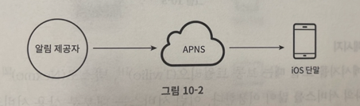

- 알림 제공자(provider)
  - 알림 요청을 만들어 애플 푸시 알림 서비스(APNS)로 보내는 주체다. 알림 요청을 만들려면 다음과 같은 데이터가 필요하다.
    - 단말 토큰 : 알림 요청을 보내는 데 필요한 고유 식별자다.
    - 페이로드 : 알림 내용을 담은 JSON 딕셔너리다.
    - APNS : 애플이 제공하는 원격 서비스다. 푸시 알림을 ios 장치로 보내는 역할을 담당한다.
    - ios 단말 : 푸시 알림을 수신하는 사용자 단말이다.

<br>

### 안드로이드 푸시 알림
안드로이드 푸시 알림도 비슷한 절차로 전송된다.

APNS 대신 FCM(Firebase Cloud Messaging)을 사용한다는 점만 다르다.

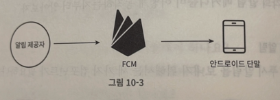

<br>

### SMS 메시지
SMS 메시지를 보낼 때는 보통 트윌리오, 넥스모 같은 제3 사업자의 서비스를 많이 사용한다. 이런 서비스는 대부분 상용 서비스라서 이용요금을 내야 한다.

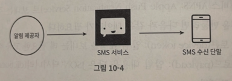

<br>

### 이메일
대부분의 회사는 고유 이메일 서버를 구축할 역량은 갖추고 있다.

그럼에도 많은 회사가 상용 이메일 서비스를 이용한다. 그중 유명한 서비스로 센드그리드, 메일침프가 있다.

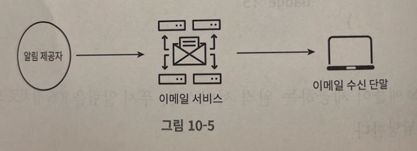

<br>

아래 그림은 지금까지 살펴본 알림 유형 전부를 한 시스템으로 묶은 결과다.

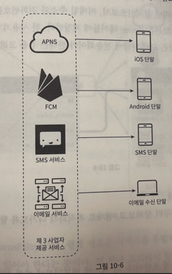

<br>

## 연락처 정보 수집 절차
알림을 보내려면 모바일 단말 토큰, 전화번호, 이메일 주소 등의 정보가 필요하다.

아래 그림과 같이 사용자가 우리 앱을 설치하거나 처음으로 계정을 등록하면 API 서버는 해당 사용자의 정보를 수집하여 데이터베이스에 저장한다.

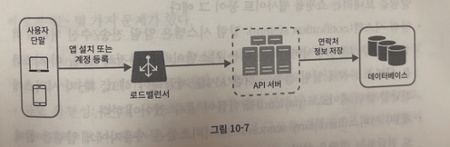

이 데이터베이스에 연락처 정보를 저장할 테이블 구조는 아래 그림과 같다.

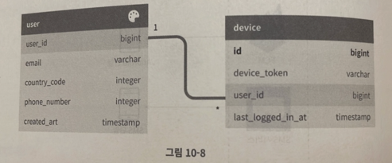

필수 정보만 담은 개략적인 설계안으로서, 이메일 주소와 전화번호는 user 테이블에 저장하고, 단말 토큰은 device 테이블에 저장한다.

한 사용자가 여러 단말을 가질 수 있고, 알림은 모든 단말에 전송되어야 한다는 점을 고려하였다.

<br>

## 알림 전송 및 수신 절차

### 개략적 설계안(초안)
아래 그림은 초안이다. 각 시스템 컴포넌트에 대한 설명은 그 아래에 있다.

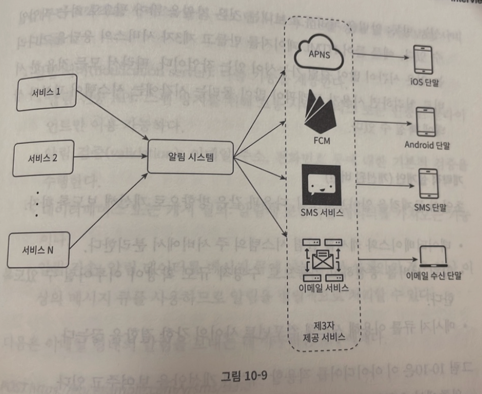

- 1부터 N까지의 서비스
  - 이 서비스는 각각 마이크로서비스일수도 있고, 분산 시스템 컴포넌트일 수도 있다.
- 알림 시스템
  - 알림 시스템은 알림 전송/수신 처리의 핵심이다. 우선은 1개 서버만 사용하는 시스템이라고 가정하자. 이 시스템은 서비스 1~N에 알림 전송을 위한 API를 제공해야 하고, 제3자 서비스에 전달할 알림 페이로드를 만들어 낼 수 있어야 한다.
- 제 3자 서비스
  - 이 서비스들은 사용자에게 알림을 실제로 전달하는 역할을 한다. 제3자 서비스와의 통합을 진행할 때 유의사항은 확장성이다. 쉽게 새로운 서비스를 통합하거나 기존 서비스를 제거할 수 있어야 한다는 뜻이다.
- ios, 안드로이드, SMS, 이메일 단말
  - 사용자는 자기 단말에서 알림을 수신한다.

이 설계에는 몇 가지 문제가 있다.

- SPOF
  - 알림 서비스에 서버가 하나밖에 없다는 것은, 그 서버에 장애가 생기면 전체 알림 서비스에 장애로 이어진다는 것이다.
- 규모 확장성
  - 한 대 서비스로 푸시 알림에 관계된 모든 것을 처리하므로, 데이터베이스나 캐시 등 중요 컴포넌트의 규모를 개별적으로 늘릴 방법이 없다.
- 성능 병목
  - 알림을 처리하고 보내는 것은 자원을 많이 필요로 하는 작업일 수 있다.
  - 예를 들어 HTML 페이지를 만들고 제3자 서비스의 응답을 기다리는 일은 시간이 많이 걸릴 수 있는 작업이다.
  - 따라서 모든 것을 한 서버로 처리하면 사용자 트래픽이 많이 몰리는 시간에는 시스템이 과부하 상태에 빠질 수 있다.

<br>

### 개략적 설계안 (개선된 버전)
초안의 문제점을 알았으니 다음과 같은 방향으로 개선하자.

- 데이터베이스와 캐시를 알림 시스템의 주 서버에서 분리한다.
- 알림 서버를 증설하고 자동으로 수평적 규모 확장이 이루어질 수 있도록 한다.
- 메시지 큐를 이용해 시스템 컴포넌트 사이의 강한 결합을 끊는다.

아래 그림은 이 아이디어를 적용할 시스템 개선안을 보여주고 있다.

왼쪽에서 오른쪽 순서로 살펴보자.

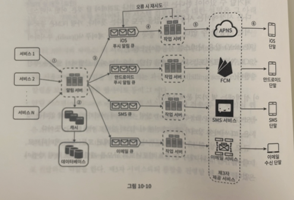

- 1부터 N까지의 서비스
  - 알림 시스템 서버의 API를 통해 알림을 보낼 서비스들
- 알림 서버
  - 알림 전송 API : 스팸 방지를 위해 보통 사내 서비스 또는 인증되니 클라이언트만 이용 가능하다.
  - 알림 겅증 : 이메일 주소, 전화번호 등에 대한 기본적 검증을 수행한다.
  - 데이터베이스 또는 캐시 질의 : 알림에 포함시킬 데이터를 가져오는 기능이다.
  - 알림 전송 : 알림 데이터를 메시지 큐에 넣는다. 본 설계안의 경우 하나 이상의 메시지 큐를 사용하므로 알림을 병렬적으로 처리할 수 있다.
- 캐시
  - 사용자 정보, 단말 정보, 알림 템플릿 등을 캐시한다.
- 데이터베이스
  - 사용자, 알림, 설정 등 다양한 정보를 저장한다.
- 메시지 큐
  - 시스템 컴포넌트 간 의존성을 제거하기 위해 사용한다. 
  - 다량의 알림이 전송되어야 하는 경우를 대비한 버퍼 역할도 한다.
  - 본 설계안에선 알림의 종류별로 별도 메시지 큐를 사용하였다.
  - 따라서 제 3자 서비스 가운데 하나에 장애가 발생해도 다른 종류의 알림은 정상 동작하게 된다.
- 작업 서버
  - 메시지 큐에서 전송할 알림을 꺼내서 제 3자 서비스로 전달하는 역할을 담당하는 서버다.

이제 이 컴포넌트들이 어떻게 협력하여 알림을 전송하게 되는지 살펴보자.

1. API를 호출하여 알림 서버로 알림을 보낸다.
2. 알림 서버는 사용자 정보, 단말 초큰, 알림 설정 같은 메타데이터를 캐시나 데이터베이스에서 가져온다.
3. 알림 서버는 전송할 알림에 맞는 이벤트를 만들어서 해당 이벤트를 위한 큐에 넣는다. 가령 ios 푸시 알림 이벤트는 ios 푸시 알림 큐에 넣어야 한다.
4. 작업 서버는 메시지 큐에서 알림 이벤트를 꺼낸다.
5. 작업 서버는 알림을 제 3자 서비스로 보낸다.
6. 제3자 서비스는 사용자 단말로 알림을 전송한다.

<br>

## 상세 설계
아래 내용들에 대해 지금까지 설계한 내용을 기반으로 상세하게 알아보자.

- 안정성
- 추가로 필요한 컴포넌트 및 고려사항
  - 알림 템플릿, 알림 설정, 전송률 제한, 재시도 메커니즘, 보안, 큐에 보관된 알림에 대한 모니터링과 이벤트 추적등이 이에 해당한다.
- 개선된 설계안

<br>

### 안정성
분산 환경에서 운영될 알림 시스템을 설계할 때는 안정성을 반드시 고려해야 한다.

- 데이터 손실 방지
  - 알림 전송 시스템의 가장 중요한 요구사항 중 하나는 어떤 상황에서도 알림이 소실되면 안 된다는 것이다. 알림이 지연되거나 순서가 틀려도 ok, 사라지면 곤란.
  - 이 요구사항을 만족하기 위해 알림 시스템은 알림 데이터를 데이터베이스에 보관하고 재시도 메커니즘을 구현해야 한다.
  - 아래 그림과 같이 알림 로그 데이터베이스를 유지하는 것이 한 가지 방법이다.
  
    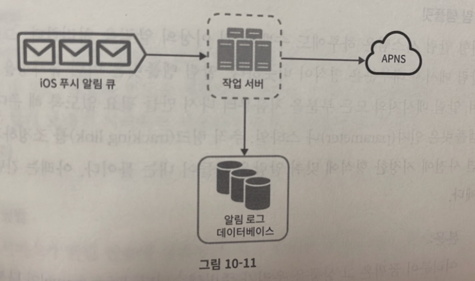
- 알림 중복 전송 방지
  - 같은 알림이 여러 번 반복되는 것을 완전히 막는 것은 가능하지 않다. 대부분의 경우 알림은 딱 한번 전송되겠지만 분산 시스템 특성상 가끔은 같은 알림이 중복될 수 있다.
  - 보내야 할 알림이 도착하면 그 이벤트 ID를 검사하여 이전에 본 적이 있는 이벤트인지 살피고, 중복된 이벤트라면 버리고 그렇지 않으면 발송한다.

<br>

### 추가로 필요한 컴포넌트 및 고려사항
알림 시스템은 이보다 훨씬 복잡하다.

- 알림 템플릿
  - 대형 알림 시스템은 하루에도 수백만 건 이상의 알림을 처리한다. 그런데 그 알림 메시지 대부분은 형식이 비슷하다. 알림 템플릿은 이런 유사성을 고려해 알림 메시지의 모든 부분을 처음부터 다시 만들 필요 없게 해준다.
  - 알림 템플릿은 인자나 스타일, 추적 링크를 조정하기만 하면 사전에 지정한 형식에 맞춰 알람을 만들어 내는 틀이다. 아래는 간단한 예제다.
  ```
  본문:
  안녕하세요 [item_name]이 다시 입고 되었습니다! [date]까지 주문 가능.  
  ```
  - 템플릿을 사용하면 전송될 알림들의 형식을 일관성 있게 유지할 수 있고, 오류 가능성도 줄이고, 알림 작성 시간도 줄일 수 있다.
- 알림 설정
  - 사용자는 이미 너무 많은 알림을 받고 있어서 쉽게 피곤함을 느낀다.
  - 따라서 아래와 같이 알림 설정 테이블을 마련하자.
  ```
  user_id    bigInt
  channel    varchar  #알림이 전송될 채널. 푸시 알림, 이메일, SMS 등
  opt_in     boolean  #해당 채널로 알림 받을 것인지 여부
  ```
- 전송률 제한
  - 사용자에게 너무 많은 알림을 보내지 않기 위해 한 사용자가 받을 수 있는 알림의 빈도를 제한한다.
- 재시도 방법
  - 제3자 서비스가 알림 전송에 실패하면, 해당 알림을 재시도 전용 큐에 넣는다.
- 푸시 알림과 보안
  - ios와 안드로이드 앱의 경우, 알림 전송 API는 appKey와 appSecret을 사용하여 보안을 유지한다.
- 큐 모니터링
  - 알림 시스템을 모니터링 할 때 중요한 메트릭 하나는 큐에 쌓인 알림의 개수이다.
  - 이 수가 너무 크면 작업 서버들이 이벤트를 빠르게 처리하지 못하고 있다는 뜻이다.
  - 그런 경우엔 작업 서버를 증설하는 게 바람직할 것이다.
  
    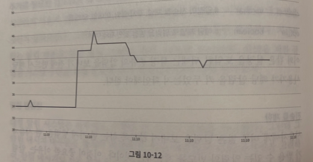
- 이벤트 추적
  - 알림 확인율, 클릭율, 실제 앱 사용으로 이어지는 비율 같은 메트릭은 사용자를 이해하는데 중요하다.
  - 데이터 분석 서비스는 보통 이벤트 추적 기능도 제공한다.
  - 따라서 보통 알림 시스템을 만들면 데이터 분석 서비스와도 통합해야만 한다.
    
    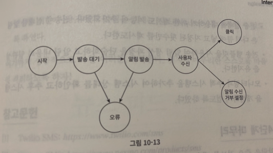

<br>

### 수정된 설계안
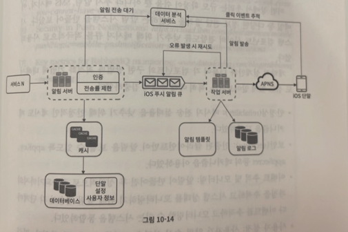

- 알림 서버에 인증과 전송률 제한 기능이 추가 되었다.
- 전송 실패에 대응하기 위한 재시도 기능이 추가되었다. 전송에 실패한 알림은 다시 큐에 넣고 지정된 횟수만큼 재시도 한다.
- 전송 템플릿을 사용하여 작업을 단순화하고 내용으 일관성을 유지한다.
- 모니터링과 추적 시스템을 추가한다.