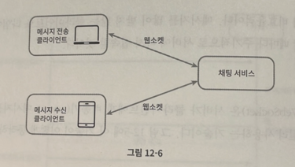

# ✍🏻 12. 채팅 시스템 설계
요구 사항은 아래와 같다.

- 응답지연이 낮은 일대일 채팅 기능
- 최대 100명까지 참여가능한 그룹 채팅 기능
- 사용자의 접속상태 표시 기능
- 다양한 단말 지원. 하나의 계정으로 여러 단말에 동시 접속 지원
- 푸시 알림

# 설계안 그리기
채팅 시스템의 경우 클라이언트는 모바일 앱이거나 웹 애플리케이션이다.

클라이언트는 서로 직접 통신하지 않는다. 대신, 각 클라이언트는 위에 나열한 모든 기능을 지원하는 채팅 서비스와 통신한다.

우선, 기본 기능에 집중하자. 이 채팅 서비스는 아래 기능을 제공해야 한다.

- 클라이언트들로부터 메시지 수신
- 메시지 수신자 결정 및 전달
- 수신자가 접속 상태가 아닌 경우엔 접속할 때까지 해당 메시지 보관

아래 그림에 클라이언트와 채팅 서비스 사이의 관계를 요약해보았다.

채팅을 시작하려는 클라이언트는 네트워크 통신 프로토콜을 사용하여 서비스에 접속한다.

대부분의 클라이언트/서버 애플리케이션에서 요청을 보내는 것은 클라이언트인데, 채팅 시스템의 경우도 마찬가지다. 메세지 송신 클라이언트(sender)가 이 역할을 한다.

위 그림에서 송신 클라이언트는 수신 클라이언트에게 전달할 메시지를 채팅 서비스에 보낼 때, 오랜 세월 검증된 HTTP 프로토콜을 사용한다.

채팅 서비스와의 접속에는 keep-alive 헤더를 사용하면 효율적인데, 클라이언트와 서버 사이의 연결을 끊지 않고 계속 유지할 수 있어서다.

TCP 접속 과정에서 발생하는 핸드셰이크 횟수를 줄일 수 있음은 물론이다. HTTP는 메시지 전송 용도론 괜찮은 선택이며, 페이스북 같은 많은 대중적 채팅 프로그램이 초기에 HTTP를 사용했다.

하지만 메시시 수신 시나리오는 더 복잡하다.

HTTP는 클라이언트가 연결을 만드는 프로토콜이며, 서버에서 클라이언트로 임의 시점에 메시지를 보내는 데는 쉽게 쓰일 수 없다. 서버가 연결을 만드는 것처럼 동작할 수 있도록 하기 위해 많은 기법이 존재하는데,  폴링, 롱폴링, 웹소켓 등이 그런 기술이다.

 

## 폴링
아래 그림처럼, 폴링은 클라이언트가 주기적으로 서버에게 새 메시지가 있냐고 물어보는 방법이다. 폴링 비용은 폴링을 자주하면 할수록 올라간다.

답해줄 메시지가 없는 경우엔 서버 자원이 불필요하게 낭비된다는 문제도 있다.

 

## 롱 폴링
폴링은 여러 가지로 비효율적일 수 있어서 나온 기법이 롱 폴링이다.

롱 폴링의 경우 클라이언트는 새 메시지가 반환되거나 타임아웃 될 때까지 연결을 유지한다.

클라이언트는 새 메세지를 받으면 기존 연결을 종료하고 서버에 새로운 요청을 보내어 모든 절차를 다시 시작한다. 이 방법엔 다음과 같은 약점이 있다.

- 메세지를 보내는 클라이언트와 수신하는 클라이언트가 같은 채팅 서버에 접속하게 되지 않을 수도 있다. HTTP 서버들은 보통 무상태서버다. 로드밸런싱을 위해 라운드 로빈 알고리즘을 사용하는 경우, 메시지를 받은 서버는 해당 메시지를 수신할 클라이언트와의 롱 폴링 연결을 갖고 있지 않은 서버일 수 있다는 것이다.
- 서버 입장에서는 클라이언트가 연결을 해제했는지 아닌지 알 좋은 방법이 없다.
- 여전히 비효율적이다. 메시지를 많이 받지 않는 클라이언트도 타임아웃이 일어날 때마다 주기적으로 서버에 다시 접속할 것이다.

 

## 웹 소켓
서버가 클라이언트에게 비동기 메시지를 보낼 때 가장 널리 사용하는 기술이다.

아래 그림은 이 기술이 어떻게 동작하는지를 보인다.

웹 소켓 연결은 클라이언트가 시작한다.

한번 맺어진 연결은 항구적이며 양방향이다. 이 연결은 처음엔 HTTP 연결이지만 특정 핸드셰이크 절차를 거쳐 웹소켓 연결로 업그레이드된다.

일단 이 항구적인 연결이 만들어지고 나면 서버는 클라이언트에게 비동기적으로 메시지를 전송할 수 있다.

웹소켓은 일반적으로 방화벽이 있는 환경에서도 잘 동작한다. 80이나 443처럼 HTTP/HTTPS 프로토콜이 쓰는 기본 포트번호를 그대로 쓰기 때문이다.

웹소켓은 양방향 메시지 전송까지 가능케 하므로 웹소켓 대신 HTTP를 굳이 고집할 이유가 없어졌다.

아래 그림에 어떻게 웹소켓이 메시지 전송이나 수신에 쓰일 수 있는지 간략히 제시한다.

웹소켓을 이용하면 메시지를 보낼 때나 받을 때 동일한 프로토콜을 사용할 수 있으므로 설계뿐 아니라 구현도 단순하고 직관적이다.

유의할 것은 웹소켓 연결은 항구적으로 유지되어야 하기 때문에 서버 측에서 연결 관리를 효율적으로 해야 한다는 것이다.

 

# 개략적 설계안
이제 클라이언트와 서버 사이의 주 통신 프로토콜로 웹소켓을 사용하기로 결정한다.

하지만 다른 부분에선 굳이 웹소켓을 쓸 필요는 없다. (회원가입, 로그인, 사용자 프로필 등)

이번 장에서 다루는 채팅 시스템은 세 부분으로 나누어 볼 수 있다.

즉 무상태 서비스, 상태유지 서비스, 그리고 제 3자 서비스 연동의 세 부분으로 나누어 살펴볼 수 있다.

 

## 무상태 서비스
이 설계안에서 무상태 서비스는 로그인, 회원가입, 사용자 프로파일 표시 등을 처리하는 전통적인 요청/응답 서비스다.

무상태 서비스는 로드밸런서 뒤에 위치한다. 로드밸런서가 하는 일은 요청을 그 경로에 맞는 서비스로 정확하게 전달하는 것이다.

로드밸런서 뒤에 오는 서비스는 모놀리틱 서비스일 수도 있고 마이크로서비스일 수도 있다.

이들 가운데 좀 더 자세히 볼 것은 '서비스 탐색' 서비스이다.

이 서비스는 클라이언트가 접속할 채팅 서버의 DNS 호스트명을 클라이언트에게 알려주는 역할을 한다.

 

## 상태 유지 서비스
본 설계안에서 유일하게 상태유지가 필요한 서비스는 채팅 서비스다.

각 클라이언트가 채팅 서버와 독립적인 네트워크 연결을 유지해야 하기 때문이다.

클라이언트는 보통 서버가 살아 있는 한 다른 서버로 연결을 변경하지 않는다.

 

## 제3자 서비스 연동
채팅 앱에서 가장 중요한 제3자 서비스는 푸시 알림이다. 새 메시지르 ㄹ받았다면 앱이 실행중이 아니더라도 알림을 받아야하기 때문이다.

 

## 규모 확장성
트래픽 규모가 얼마 안될땐 방금 모든 기능을 서버 한 대로 구현할 수 있다.

서버 한 대로 얼마나 많은 접속을 동시 허용할 수 있는가를 생각해봐야 한다.

이번 장에서 다루는 시스템의 경우엔 동접자가 1M 이라고 가정할것인데, 접속당 10K의 서버 메모리가 필요하다고 본다면 10GB 메모리만 있으면 모든 연결을 다 처리할 수 있을 것이다.

하지만 그 정도 규모의 트래픽을 서버 한 대로 처리하려하지 않을 것이다.(면접관들은) 거기엔 여러가지 이유가 있는데 SPOF도 그 가운데 하나다.

하지만 서버만 한 대 갖는 설계안에서 발전 시킨다면 문제는 없다.

아래와 같은 설계안을 보자.

위 그림에서 유의할 것은 실시간으로 메시지를 주고받기 위해 클라이언트는 채팅 서버와 웹소켓 연결을 끊지 않고 유지한다는 것이다.

- 채팅 서버는 클라이언트 사이에 메시지를 중계하는 역할을 담당한다.
- 접속 상태 서버는 사용자의 접속 여부를 관리한다.
- API 서버는 로그인, 회원가입, 프로필 변경 등 그 외 나머지 전부를 처리한다.
- 알림 서버는 푸시 알림을 보낸다.
- 키-값 저장소에는 채팅 이력을 보관한다. 시스템에 접속한 사용자는 이전 채팅 이력을 전부 보게 될 것이다.

 

## 저장소
이제 서버도 준비되었고 제3자 서비스 연동도 끝났다고 하자.

중요한 것 하나는 어떤 데이터베이스를 쓰느냐다.

관계형 데이터베이스를 쓸 것인가 아니면 NoSQL을 채택할 것인가? 이 질문에 대한 올바른 답을 하기 위해 중요하게 따져야 할 것은, 데이터의 유형과 읽기/쓰기 연산의 패턴이다.

채팅 시스템이 다루는 데이터는 보통 두 가지다.

첫 번째는 사용자 프로필, 설정, 친구 목록 처럼 일반적인 데이터다. 이런 데이터는 안정성을 보장하는 관계형 데이터베이스에 보관한다.

다중화와 샤딩은 이런 데이터의 가용성과 규모확장성을 보증하기 위해 보편적으로 사용하는 기술이다.

두 번째 유형의 데이터는 채팅 시스템에 고유한 데이터로, 바로 채팅 이력이다. 이 데이터를 어떻게 보관할지 결정하려면 읽기/쓰기 연산 패턴을 이해해야 한다.

- 채팅 이력 데이터의 양은 엄청나다. 페이스북 메신저는 매일 600억 개의 메시지를 처리한다고 한다.
- 이 데이터 가운데 빈번하게 사용되는 것은 주로 최근에 주고받은 메시지다. 대부분의 사용자는 오래된 메시지는 들여다보지 않는다.
- 사용자는 대체로 최근에 주고받은 메시지 데이터만 보게 되는 것이 사실이나, 검색 기능을 이용하거나, 특정 사용자가 언급된 메시지를 보거나, 특정 메시지로 점프하거나 하여 무작위적인 데이터 접근을 하게 되는 일도 있다. 데이터 계층은 이런 기능도 지원해야 한다.
- 1:1 채팅 앱의 경우 읽기:쓰기 비율은 대략 1:1 정도다.

이 모두를 지원할 데이터베이스를 고르는 것은 아주 중요한 일이다. 본 설계안의 경우엔 키-값 저장소를 추천할 것인데, 그 이유는 다음과 같다.

- 키-값 저장소는 수평적 규모확장이 쉽다.
- 키-값 저장소는 데이터 접근 지연시간이 낮다.
- 관계형 데이터베이스는 데이터 가운데 롱 테일에 해당하는 부분을 잘 처리하지 못하는 경향이 있다. 인덱스가 커지면 데이터에 대한 무작위적 접근을 처리하는 비용이 늘어난다.
- 이미 많은 안정적인 채팅 시스템이 키-값 저장소를 채택하고 있다. 페이스북 메신저나 디스코드가 그 사례다.

 

## 데이터 모델
키-값 저장소를 데이터 계층 기술로 사용하기로 했으니, 메시지 데이터를 어떻게 보관할 것인지 자세히 살펴보도록 하자.

 

### 1:1 채팅을 위한 메시지 테이블
아래 그림은 1:1 채팅을 지원하기 위한 메시지 테이블의 사례다.

이 테이블의 기본 키는 message_id로, 메시지 순서를 쉽게 정할 수 있도록 하는 역할도 담당한다.

created_at 을 사용하여 메시지 순서를 정할 수는 없는데, 서로 다른 두 메시지가 `동시에` 만들어질 수 있기 때문이다.

 

### 그룹 채팅을 위한 메시지 테이블

위 그림은 그룹 채팅을 위한 메시지 테이블의 사례다.

(channel_id, message_id)의 복합키를 기본 키로 사용한다.

채널은 채팅 그룹과 같은 뜻이고, 이 channel_id는 파티션 키로도 사용할 것인데, 그룹 채팅에 적용될 모든 쿼리는 특정 채널 대상으로 할 것이기 때문이다.

 

### 메시지 ID
message_id를 만드는 기법은 자세히 논의할 만한 가치가 있는 흥미로운 주제다.

message_id는 메시지들의 순서도 표현할 수 있어야 한다. 그러기 위해선 다음과 같은 속성을 만족해야 한다.

- message_id의 값은 고유해야 한다.
- ID 값은 정렬 가능해야 하며 시간 순서와 일치해야 한다. 즉, 새로운 ID는 이전 ID보다 큰 값이어야 한다.

이 두 조건을 어떻게 만족시킬 것인가?

RDBMS라면 auto_increment가 대안이 될 수 있겠지만 NoSQL은 보통 해당 기능을 제공하지 않는다.

두 번째 방법은 스노플레이크 같은 전역적 64-bit 순서 번호 생성기를 이용하는 것이다.

마지막 방법은 지역적 순서 번호 생성기를 이용하는 것이다.
여기서 지역적이라 함은, ID의 유일성은 같은 그룹 안에서만 보증하면 충분하다는 것이다. 전역적 ID 생성기에 비해 구현하기 쉬운 접근법이다.

 

# 상세 설계
채팅 시스템의 경우에는 서비스 탐색, 메시지 전달흐름, 그리고 사용자 접속 상태를 표시하는 방법 정도가 좀 더 자세히 살펴볼만한 부분이다.

 

## 서비스 탐색
이 기능의 주된 역할은 클라이언트에게 가장 적합한 채팅 서버를 추천하는 것이다.

이때 사용되는 기준으로는 클라이언트의 위치, 서버의 용량 등이 있다. 

서비스 탐색 기능을 구현하는데 널리 쓰이는 오픈 소스 솔루션으로는 아파치 주키퍼 같은 것이 있다.

사용 가능한 모든 채팅 서버를 여기 등록시켜 두고, 클라이언트가 접속을 시도하면 사전에 정한 기준에 따라 최적의 채팅 서버를 골라 주면 된다.

아래 그림은 주키퍼로 구현한 서비스 탐색 기능이 어떻게 동작하는지를 보여준다.

1. 사용자 A가 시스템에 로그인을 시도한다.
2. 로드밸런서가 로그인 요청을 API 서버들 가운데 하나로 보낸다.
3. API 서버가 사용자 인증을 처리하고 나면 서비스 탐색 기능이 동작하여 해당 사용자를 서비스할 최적의 채팅 서버를 찾는다. 
4. 3번 과정에서 반환된 채팅 서버와 사용자 A는 웹소켓 연결을 맺는다.

 

## 메세지 흐름
1:1 채팅 메시지으 ㅣ처리 흐름과 여러 단말 간 메시지 동기화 과정을 살펴보고, 그룹 채팅 메시지의 처리흐름도 살펴보자.

 

### 1:1 채팅 메시지 처리 흐름
아래 그림은 1:1 채팅에서 사용자 A가 B에게 보낸 메시지가 어떤 경로로 처리되는지를 보여준다.

1. 사용자 A가 채팅 서버 1로 메시지 전송
2. 채팅 서버 1은 ID 생성기를 사용해 해당 메시지의 ID 결정
3. 채팅 서버 1은 해당 메시지를 메시지 동기화 큐로 전송
4. 메시지가 키-값 저장소에 보관됨
5. 사용자 B가 접속 중인 경우 메시지는 사용자 B가 접속 중인 채팅 서버로 전송됨, 사용자 B가 접속 중이 아니면 푸시 알림 메시지를 푸시 알림 서버로 보냄
6. 채팅 서버 2는 메세지를 사용자 B에게 전송. 사용자 B와 채팅 서버 2 사이엔 웹소켓 연결이 있는 상태이므로 그것을 이용

 

### 여러 단말 사이의 메시지 동기화
아래는 한 사례다.

위 그림에서 사용자 A는 전화기와 랩톱의 두 대 단말을 이용하고 있다.

사용자 A가 전화기에서 채팅 앱에 로그인한 결과로 채팅 서버 1과 해당 단말 사이에 웹소켓 연결이 만들어져 있고, 랩톱에서 로그인한 결과로 역시 별도 웹소켓이 채팅 서버 1에 연결되어 있는 상황이다.

각 단말은 cur_max_message_id 라는 변수를 유지하는데, 해당 단말에서 관측된 가장 최신 메시지의 ID를 추적하는 용도다. 아래 두 조건을 만족하는 메시지는 새 메시지로 간주한다.

- 수신자 ID가 현재 로그인한 사용자 ID와 같다.
- 키-값 저장소에 보관된 메시지로서, 그 ID가 cur_max_message_id보다 크다.

cur_max_message_id는 단말마다 별도로 유지 관리하면 되는 값이라 키-값 저장소에서 새 메시지를 가져오는 동기화 작업도 쉽게 구현할 수 있다.

 

### 소규모 그룹 채팅에서의 메세지 흐름
1:1 채팅에 비해 더 복잡하다.

아래 그림을 보자.

위 그림은 사용자 A가 그룹 채팅 방에서 메시지를 보냈을 때 어떤 일이 벌어지는지 보여준다.

해당 그룹에 3명의 사용자가 있다고 하자.

우선 사용자 A가 보낸 메시지가 사용자 B와 C의 메세지 동기화 큐에 복사된다. 이 큐를 사용자 각각에 할당된 메시지 수신함 같은 것으로 생각해도 무방할 것이다.

이 설계안은 소규모 그룹 채팅에 적합한데, 이유는 다음과 같다.

- 새로운 메시지가 왔는지 확인하려면 자기 큐만 보면 되니까 메시지 동기화 플로가 단순하다.
- 그룹이 크지 않으면 메시지를 수신자별로 복사해서 큐에 넣는 작업의 비용이 문제가 되지 않는다.

하지만 많은 사용자를 지원해야 하는 경우라면 똑같은 메시지를 모든 사용자의 큐에 복사하는게 바람직하지 않을 것이다.

지금 설명한 메시지 흐름을 수신자 관점에서 살펴보면, 한 수신자는 여러 사용자로부터 오는 메시지를 수신할 수 있어야 한다.

따라서 각 사용자의 수신함, 즉 메시지 동기화 큐는 아래 그림고 같이 여러 사용자로부터 오는 메세지를 받을 수 있어야 한다.

 

## 접속상태 표시
사용자의 접속 상태를 표시하는 것은 상당수 채팅 애플리케이션의 핵심적 기능이다.

채팅 애플리케이션을 사용하다 보면 사용자의 프로필 이미지나 대화명 옆에 녹색 점이 붙어 있는 것을 보게 되는데, 이것이 바로 사용자가 접속중임을 나타낸다.

이번 절에선 그 녹색 점을 표현하기 위해 무엇이 필요한지 자세히 살펴보겠다.

개략적 설계안에서는 접속상태 서버를 통해 사용자의 상태를 관리한다고 했었다. 접속상태 서버는 클라이언트와 웹소켓으로 통신하는 실시간 서비스의 일부라는 점에 유의하라.

사용자의 상태가 바뀌는 시나리오는 몇 가지가 있는데, 지금부터 하나씩 살펴보자.

 

### 사용자 로그인
사용자 로그인 절차에 대해선 "서비스 탐색"절에서 설명한 바 있다.

클라이언트와 실시간 서비스 사이에 웹소켓 연결이 맺어지고 나면 접속상태 서버는 A의 상태와 last_active_at 타임스탬프 값을 키-값 저장소에 보관한다. 이 절차가 끝나고 나면 해당 사용자는 접속 중인 것으로 표시될 것이다.

 

### 로그아웃
사용자 로그아웃은 아래와 같은 절차를 거친다.

키-값 저장소에 보관된 사용자 상태가 online에서 offline으로 바뀌게 된다는 점에 유의하자. 이 절차가 끝나고 나면 UI 상에서 사용자의 상태는 접속 중이 아닌 것으로 표시될 것이다.

 

### 상태 정보의 전송
그렇다면 사용자 A와 친구관계에 있는 사용자들은 어떻게 해당 사용자의 상태 변화를 알게 될까?

아래 그림은 그 원리를 보여준다.

상태정보 서버는 발행-구독 모델을 사용하는데, 즉 각각의 친구관계마다 채널을 하나씩 두는 것이다.

가령 사용자 A의 접속상태가 변경되었다고 하자. 그 사실을 세 개 채널, 즉 A-B, A-C, A-D에 쓰는 것이다.

그리고 A-B는 사용자 B가 구독하고, A-C는 사용자 C가, A-D는 사용자 D가 구독하도록 하는 것이다.

이렇게 하면 친구 관계에 있는 사용자가 상태정보 변화를 쉽게 통지 받을 수 있게 된다.

클라이언트와 서버 사이의 통신에는 실시간 웹소켓을 사용한다.

이 방안은 그룹크기가 작을 땐 효과적이다.

그룹크기가 더 커지면 이런 식으로 접속상태 변화를 알려서는 비용이나 시간이 많이 들게 되므로 좋지 않다. 가령 그룹 하나에 100000 사용자가 있다고 하자.

그러면 상태변화 1건당 100000개의 이벤트 메시지가 발생할 것이다. 이런 성능 문제를 해소하는 한 가지 방법은 사용자가 그룹 채팅에 입장하는 순간에만 상태 정보를 읽어가게 하거나, 친구 리스트에 있는 사용자의 접속 상태를 갱신하고 싶으면 수동으로 하도록 유도하는 것이다.

# 마무리
1:1 채팅과 그룹채팅을 전부 지원하는 채팅 시스템의 아키텍처를 살펴보았다.

면접 말미에 시간이 남으면 아래와 같은 내용을 논의해도 좋을 것이다.

- 채팅 앱을 확장하여 사진이나 비디오 등의 미디어를 지원하도록 하는 방법
  - 클라우드 저장소, 섬네일 생성, 압축 방식 등
- 캐시
  - 클라이언트에 이미 읽은 메시지를 캐시해 두면 서버와 주고받는 데이터 양을 줄일 수 있다.
- 로딩 속도 개선
  - 슬랙은 사용자의 데이터, 채널 등을 지역적으로 분산하는 네트워크를 구축하여 앱 로딩 속도를 개선하였다.
- 오류 처리
  - 채팅 서버 오류
    - 채팅 서버 하나가 죽으면 서비스 탐색 기능(주키퍼 같은)이 동작하여 클라이언트에게 새로운 서버를 배정하고 다시 접속할 수 있도록 해야 한다.
  - 메시지 재전송
    - 재시도나 큐는 메시지의 안정적 전송을 보장하기 위해 흔히 사용되는 기법이다.