# ✍🏻 05. 안정 해시 설계
수평적 규모 확장성을 달성하기 위해서는 요청 또는 데이터를 서버에 균등하게 나누는 것이 중요하다. 안정 해시는 이 목표를 달성하기 위해 보편적으로 사용하는 기술이다.

하지만 우선 이 해시 기술이 풀려고 하는 문제부터 좀 더 자세히 살펴보자.

## 해시 키 재배치(rehash)문제
N개의 캐시 서버가 있다고 하자. 이 서버들에 부하를 균등하게 나누는 보편적 방법은 아래의 해시 함수를 사용하는 것이다.
```
serverIndex = hash(key) % N (N = 서버개수)
```

예제를 통해 어떻게 동작하는지 알아보자. 총 4대의 서버를 사용한다고 하자.

아래의 표는 주어진 각각의 키에 대해서 해시 값과 서버 인덱스를 계산한 예제다.

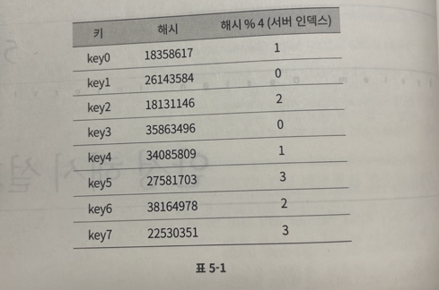

특정한 키가 보관된 서버를 알아내기 위해, 나머지 연산을 `f(key) % 4`와 같이 적용하였다.

예를 들어 위 식을 적용한 값이 1이면, 클라이언트는 캐시에 보관된 데이터를 가져오기 위해 서버 1에 접속하여야 한다.

아래 그림은 본 예제에서 키 값이 서버에 어떻게 분산되는지 보여준다.

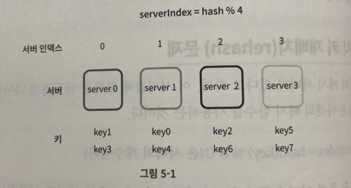

이 방법은 서버 풀의 크기가 고정되어 있을 때, 그리고 데이터 분포가 균등할 때는 잘 동작한다.

하지만 서버가 추가되거나 기존 서버가 삭제되면 문제가 생긴다.

예를 들어 1번 서버가 장애를 일으켜 동작을 중단했다고 하자. 그러면 서버 풀의 크기는 3으로 변한다.

그 결과로, 키에 대한 해시 값은 변하지 않지만 나머지 연산을 적용하여 계산한 서버 인덱스 값은 달라질 것이다. 서버 수가 1개 줄어들었기 때문이다.

따라서 아래의 표와 같은 결과를 얻는다.

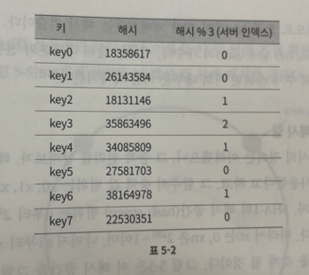

아래는 변화된 키 분포를 보여준다.

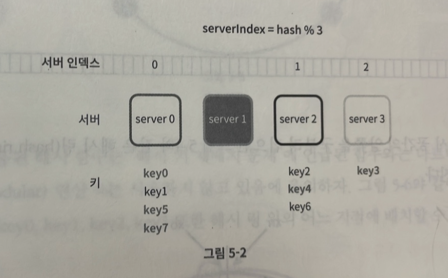

위 그림(분포)에서 보인대로, 장애가 발생한 1번 서버에 보관되어 있는 키 뿐만 아닌 대부분의 키가 재분배 되었다.

1번 서버가 죽으면 대부분 캐시 클라이언트가 데이터가 없는 엉뚱한 서버에 접속하게 된다는 뜻이다.

그 결과로 대규모 캐시미스가 발생하게 될 것이다. 안정 해시는 이 문제를 효과적으로 해결하는 기술이다.

<br>

## 안정 해시
위키피디아에 따르면 "안정 해시는 해시 테이블 크기가 조정될 때 평균적으로 오직 k/n 개의 키만 재배치하는 해시 기술이다. 여기서 k는 키의 개수이고 n은 슬롯의 개수이다. 이와는 달리 대부분의 전통적 해시 테이블은 슬롯의 수가 바뀌면 거의 대부분의 키를 재배치한다."

<br>

### 해시 공간과 해시 링
이제 안정 해시의 정의는 이해했으니, 그 동작 원리를 살펴보자.

해시 함수 f로는 SHA-1을 사용한다고 하고, 그 함수의 출력 값 범위는 x0,x1,x2,x3, ... ,xn과 같다고 하자.

SHA-1의 해시 공간 범위는 0부터 2^(160) - 1 까지라고 알려져 있다.

따라서 x0은 0, xn은 2^(160) - 1 이며, 나머지 x1 부터 xn-1 까지는 그 사이의 값을 갖게 될 것이다.

아래 그림은 이 해시 공간을 그림으로 표현한 것이다.

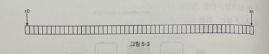

이 해시 공간의 양쪽을 구부려 접으면 아래와 같은 해시 링이 만들어진다.

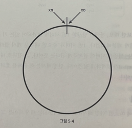

<br>

### 해시 서버
이 해시 함수 f를 사용하면 서버 IP나 이름을 이 링 위의 어떤 위치에 대응시킬 수 있다.

아래 그림은 4개의 서버를 이 해시 링 위에 배치한 결과다.

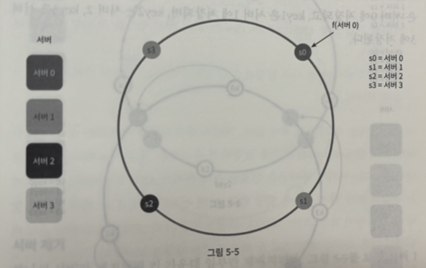

<br>

### 해시 키
여기 사용된 해시 함수는 `해시 키 재배치 문제`에 언급된 함수와는 다르며, 나머지 연산 %는 사용하지 않고 있음에 유의하자.

아래 그림고 같이, 캐시할 키 key0, key1, key2, key3 또한 해시 링 위의 어느 지점에 배치할 수 있다.

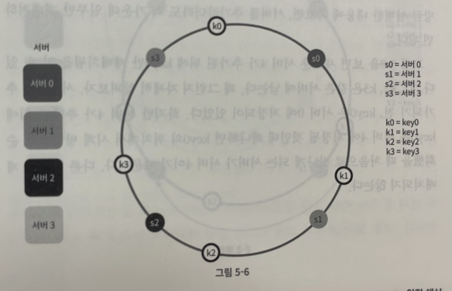

<br>

### 서버 조회
어떤 키가 저장되는 서버는, 해당 키의 위치로부터 시계 방향으로 링을 탐색해 나가면서 만나는 첫 번째 서버다.

아래 그림이 이과정을 보여준다. 따라서 key0은 서버 0에 저장되고, key1은 서버 1에 저장되며, key2는 서버 2, key3은 서버3에 저장된다.

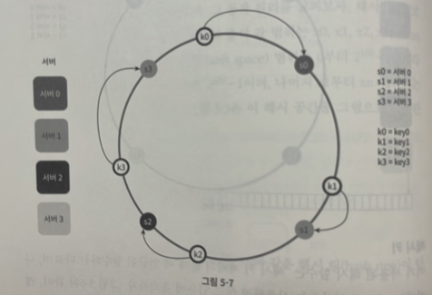

<br>

### 서버 추가
방금 설명한 내용에 따르면, 서버를 추가하더라도 키 가운데 일부만 재배치하면 된다.

아래 그림을 ㅂ면 새로운 서버 4가 추가된 뒤에 key0만 재배치됨을 알 수 있다.

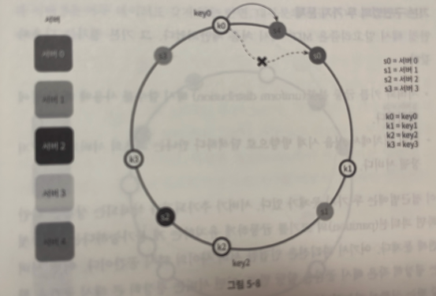

k1,k2,k3은 같은 서버에 남는다. 왜 그런지 자세히 살펴보자.

서버 4가 추가되기 전, key0은 서버 0에 저장되어 있었다.

하지만 서버 4가 추가된 뒤에 key0은 서버 4에 저장될 것인데 왜냐하면 key0의 위치에서 시계 방향으로 순회 시 처음으로 만나는 서버가 서버 4이기 때문이다.

다른 키들은 재배치되지 않는다.

<br>

### 서버 제거
하나의 서버가 제거되면 키 가운데 일부만 재배치된다.

아래 그림을 보면 서버 1이 삭제되었을 때 key1 만이 서버 2로 재배치됨을 알 수 있다. 나머지 키에는 영향이 없다.

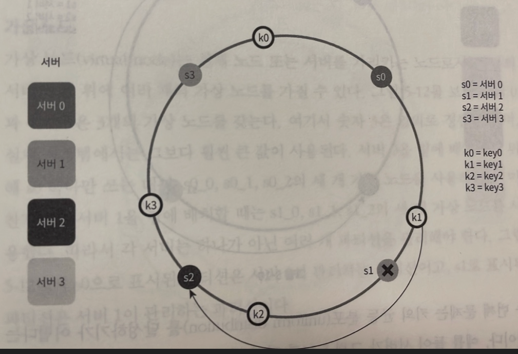

<br>

### 기본 구현법의 두 가지 문제
안정 해시 알고리즘은 MIT에서 처음 제안되었다. 그 기본 절차는 다음과 같다.

- 서버와 키를 균등 분포 해시 함수를 사용해 해시 링에 배치한다.
- 키의 위치에서 링을 시계 방향으로 탐색하다 만나는 최초의 서버가 키가 저장될 서버다.

이 접근법엔 두 가지 문제가 있다.

서버가 추가되거나 삭제되는 상황을 감안하면 파티션의 크기를 균등하게 유지하는게 불가능하다는 것이 첫 번째 문제다.

여기서 파티션은 인접한 서버 사이의 해시 공간이다.

어떤 서버는 굉장히 작은 해시 공간을 할당 받고, 어떤 서버는 굉장히 큰 해시 공간을 할당 받는 상황이 가능하다는 것이다.

아래 그림은 s1이 삭제되는 바람에 s2의 파티션이 다른 파티션 대비 거의 두 배로 커지는 상황을 보여준다.


두 번째 문제는 키의 균등 분포를 달성하기 어렵다는 것이다.

예를 들어 서버가 아래 그림과 같이 배치되어 있다고 해보자.

서버1과 서버3은 아무 데이터도 갖지 않는 반면, 대부분의 키는 서버 2에 보관될 것이다.

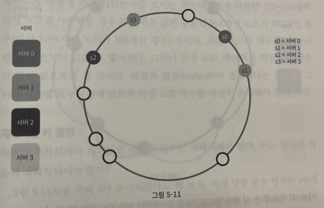

이 문제를 해결하기 위해 제안된 기법이 가상 노드 또는 복제라 불리는 기법이다.

<br>

### 가상 노드
가상 노드는 실제 노드 또는 서버를 가리키는 노드로서, 하나의 서버는 링 위에 여러 개의 가상 노드를 가질 수 있다.

아래 그림을 보면 서버0과 서버1은 3개의 가상 노드를 갖는다.

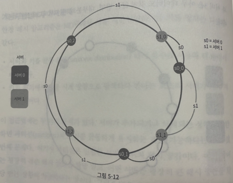

여기서 숫자 3은 임의로 정한 것이며, 실제 시스템에서는 그보다 훨씬 큰 값이 사용된다.

서버 0을 링에 배치하기 위해 s0하나만 쓰는 대신 s0_0, s0_1, s0_2의 세 개 가상 노드를 사용했다. 서버 1도 마찬가지 이다.

따라서 각 서버는 하나가 아닌 여러 개 파티션을 관리해야 한다.

아래 그림에서 s0으로 표시된 파티션은 서버 0이 관리하는 파티션이고, s1로 표시된 파티션은 서버 1이 관리하는 파티션이다.

키의 위치로부터 시계방향으로 링을 탐색하다 만나는 최초의 가상 노드가 해당 키가 저장될 서버가 된다.

아래 그림은 그에 해당하는 예제다. 

k0가 저장되는 서버는 k0의 위치로부터 링을 시계방향으로 탐색하다 만나는 최초의 가상노드 s1_1가 나타내는 서버, 즉 서버 1이다.

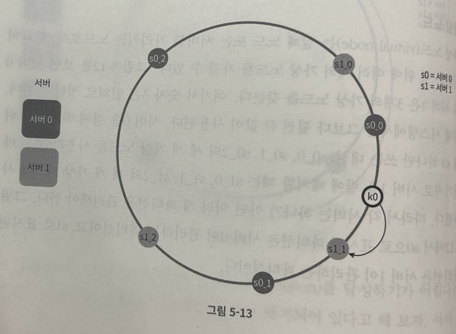

가상 노드의 개수를 늘리면 키의 분포는 점점 더 균등해진다.

표준 편차가 작아져서 데이터가 고르게 분포되기 때문이다. 표준 편차는 데이터가 어떻게 퍼져 나갔을지를 보이는 척도다.

그러나 가상 노드 데이터를 저장할 공간은 더 많이 필요하게 될 것이다.

타협적 결정이 필요하다는 뜻이다. (trade-off)

그러니 시스템 요구사항에 맞도록 가상 노드 개수를 적절히 조정해야 할 것이다.

<br>

### 재배치할 키 결정
서버가 추가되거나 제거되면 데이터 일부는 재배치해야 한다. 어느 범위의 키들이 재배치되어야 할까?

아래 그림처럼 서버 4가 추가되었다고 해 보자. 이에 영향 받은 범위는 s4부터 그 반시계 방향에 있는 첫 번째 서버 s3까지이다.

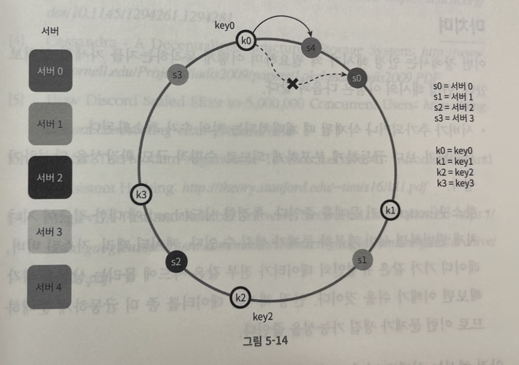

즉 s3부터 s4 사이에 있는 키들을 s4로 재배치해야 한다.

서버 s1이 아래와 같이 삭제되면 s1부터 그 반시계 방향에 있는 최초 서버 s0 사이에 있는 키들이 s2로 재배치 되어야 한다.

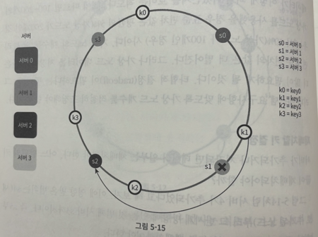

<br>

## 마치며
안정 해시가 왜 필요하며 어떻게 동작하는지를 자세히 살펴보았다.

안정 해시의 이점은 다음과 같다.

- 서버가 추가되거나 삭제될 때 재배치되는 키의 수가 최소화된다.
- 데이터가 보다 균등하게 분포하게 되므로 수평적 규모 확장성을 달성하기 쉽다.
- 핫스팟 키 문제를 줄인다. 특정한 샤드에 대한 접근이 지나치게 빈번하면 서버 과부하 문제가 생길 수 있다. 안정 해시는 데이터를 좀 더 균등하게 분배하므로 이런 문제가 생길 가능성을 줄인다.

