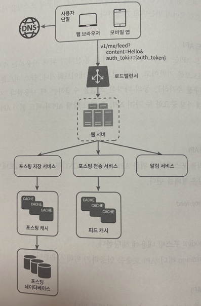
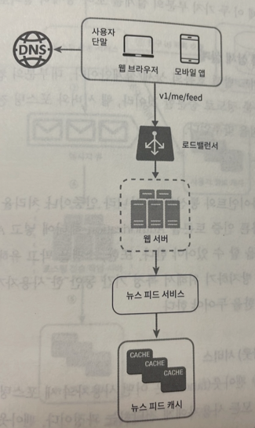
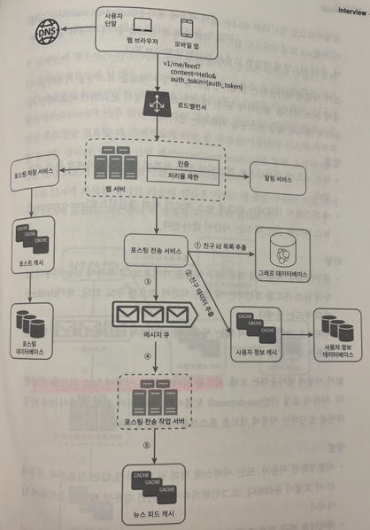
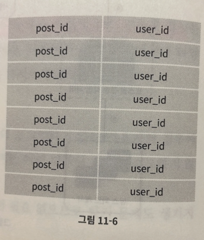
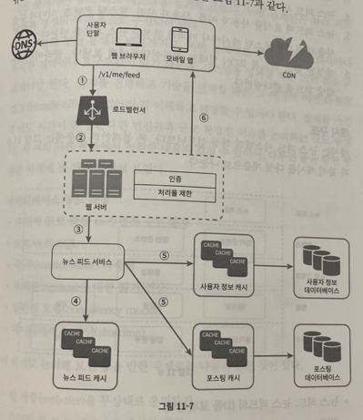
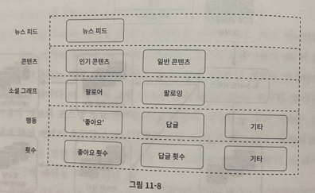

# ✍🏻 11. 뉴스 피드 시스템 설계
# 개략적 설계안 그리기
1. 피드 발행 : 사용자가 스토리를 포스팅하면 해당 데이터를 캐시와 데이터베이스에 기록한다. 새 포스팅은 친구의 뉴스 피드에도 전송된다.
2. 뉴스 피드 생성 : 지면 관계상 뉴스 피드는 모든 친구의 포스팅을 시간 흐름 역순으로 모아서 만든다고 가정한다.

 

## 뉴스 피드 API
뉴스 피드 API는 클라이언트가 서버와 통신하기 위해 사용하는 수단이다.

HTTP 프로토콜 기반이고, 상태 정보를 업데이트하거나, 뉴스 피드를 가져오거나, 친구를 추가하는 등의 다양한 작업을 수행하는 데 사용된다.

- 피드 발행 API
  - 새 스토리를 포스팅하기 위한 API다. HTTP POST 형태로 요청을 보내면 된다. 다음과 같은 형태를 띤다.
    - POST /v1/me/feed
  - 인자
    - 바디 : 포스팅 내용에 해당한다.
    - Authorization 헤더 : API 호출을 인증하기 위해 사용한다.
- 피드 읽기 API
  - 뉴스 피드를 가져오는 API다. 다음 형태를 띤다.
    - GET /v1/me/feed
  - 인자
    - Authorization 헤더 : API 호출을 인증하기 위해 사용한다.

 

## 피드 발행
피드 발행 시스템의 개략적 형태는 아래와 같다.

- 사용자
  - 모바일 앱이나 브라우저에서 새 포스팅을 올리는 주체다. POST /v1/me/feed API를 사용한다.
- 로드밸런서
  - 트래픽을 웹 서버들로 분산한다.
- 웹 서버
  - HTTP 요청을 내부 서비스로 중계하는 역할을 담당한다.
- 포스팅 저장 서비스
  - 새 포스팅을 데이터베이스와 캐시에 저장한다.
- 포스팅 전송 서비스
  - 새 포스팅을 친구의 뉴스 피드에 푸시한다. 뉴스 피드 데이터는 캐시에 보관하여 빠르게 읽어갈 수 있도록 한다.
- 알림 서비스
  - 친구들에게 새 포스팅이 올라왔음을 알리거나, 푸시 알림을 보내는 역할을 담당한다.

 

## 뉴스 피드 생성
이번엔 뉴스 피드가 어떻게 만들어지는지 살펴보겠다.

개략적인 설계는 아래와 같다.

- 사용자
  - 뉴스 피드를 읽는 주체다. GT /v1/me/feed API를 사용한다.
- 로드 밸런서
  - 트래픽을 웹 서버들로 분산한다.
- 웹 서버
  - 트래픽을 뉴스 피드 서비스로 보낸다.
- 뉴스 피드 서비스
  - 캐시에서 뉴스 피드를 가져오는 서비스다.
- 뉴스 피드 캐시
  - 뉴스 피드를 렌더링할 때 필요한 피드 ID를 보관한다.

 

# 상세 설계

## 피드 발행 흐름 상세 설계
아래 그림은 피드 발행 흐름의 상세 설계안이다. 대부분의 컴포넌트는 개략적 설계안에서 다룬 정도로 충분할 것이라, 웹 서버와 포스팅 전송 서비스에 초점을 맞추었다.

 

### 웹 서버
웹 서버는 클라이언트와 통신할 뿐 아니라 인증이나 처리율 제한 등의 기능도 수행한다.

올바른 인증 토큰을 Authorization 헤더에 넣고 API를 호출하는 사용자만 포스팅을 할 수 있어야 한다.

또한, 스팸을 막고 유해한 콘텐츠가 자주 올라오는 것을 방지하기 위해 특정 기간 동안 한 사용자가 올릴 수 있는 포스팅 수에 제한을 두어야 한다.

 

### 포스팅 전송 서비스
어떤 사용자의 새 포스팅을 그 사용자의 친구 관계에 있는 모든 사용자에게 전달하는 과정이다.

위 기능엔 두 가지 모델이 있는데 하나는 쓰기 시점에 포스팅을 전송하는 모델이고, 다른 하나는 읽기 시점에 포스팅을 전송하는 모델이다.

이 각각의 동작 원리를 좀 더 자세히 살펴본후, 우리 시스템에 적합한 모델은 무엇인지 알아보자.

- 쓰기 시점에 포스팅 전달하는 모델 (push 모델)
  - 새로운 포스팅을 기록하는 시점에 뉴스 피드를 갱신하게 된다. 다시 말해, 포스팅 완료 시 바로 해당 사용자의 캐시에 해당 포스팅을 기록하는 것이다.
  - 장점
    - 뉴스 피드가 실시간으로 갱신되며 친구 목록에 있는 사용자에게 즉시 전송된다.
    - 새 포스팅이 기록되는 순간에 뉴스 피드가 이미 갱신되므로 뉴스 피드를 읽는데 드는 시간이 줄어든다.
  - 단점
    - 친구가 많은 사용자의 경우 친구 목록을 가져오고 그 목록에 있는 사용자 모두의 뉴스 피드를 갱신하는 데 많은 시간이 필요할 수 있다. 핫키라고 부르는 문제다.
    - 서비스를 자주 이용하지 않는 사용자의 피드까지 갱신해야 하므로 자원 낭비다.
- 읽기 시점에 포스팅 전달하는 모델 (pull 모델)
  - 피드를 읽어야 하는 시점에 뉴스 피드를 갱신한다. 따라서 요청 기반 모델이다. 사용자가 본인 홈페이지나 타임라인을 로딩하는 시점에 새로운 포스트를 가져오게 된다.
  - 장점
    - 비활성화된 사용자, 또는 서비스에 거의 로그인하지 않는 사용자의 경우에는 이 모델이 유리하다. 로그인하기까지는 어떤 컴퓨팅 리소스도 소모하지 않는다.
    - 데이터를 친구 각각에 푸시하는 작업이 필요없으므로 핫키 문제도 없다.
  - 단점
    - 뉴스 피드를 읽는데 많은 시간이 소요될 수 있다.

 

본 설계안의 경우엔 이 두가지 방법을 결합하여 장점은 취하고 단점을 버린다.

뉴스 피드를 빠르게 가져올 수 있도록 하는건 아주 중요하므로 대부분의 사용자에 대해선 푸시 모델을 사용한다.

친구나 팔로워가 아주 많은 사용자의 경우엔 팔로워로 하여금 해당 사용자의 포스팅을 필요할 때 가져가도록 하는 풀 모델을 사용하여 시스템 과부하를 방지한다.

아울러 안정 해시를 통해 요청과 데이터를 보다 고르게 분산하여 핫키 문제를 줄여본다.

이전에 제시한 설계안 가운데 포스팅 전달 서비스에 관한 부분만 따로 뗴어 아래 그림으로 가져왔다.

아래와 같이 동작한다.

1. 그래프 데이터베이스에서 친구 ID 목록을 가져온다. 그래프 데이터베이스는 친구 관계나 친구 추천을 관리하기 적합하다.
2. 사용자 정보 캐시에서 친구들 정보를 가져온다. 그런 후에 사용자 설정에 따라 친구들중 일부를 걸러낸다.(mute 시)
3. 친구 목록과 새 스토리의 포스팅 ID를 메시지 큐에 넣는다.
4. 포스팅 전송 작업 서버가 메시지 큐에서 데이터를 꺼내어 뉴스 피드 데이터를 뉴스 피드 캐시에 넣는다. 뉴스 피드 캐시는 `<포스팅ID, 사용자ID>`의 순서쌍을 보관하는 매핑 테이블이다. 사용자 정보와 포스팅 정보 전부를 이 테이블에 저장하지 않는 이유는, 그렇게 하면 메모리 요구량이 지나치게 늘어날 수 있기 때문이다. 따라서 ID만 보관한다. 또한 메모리 크기를 적정 수준으로 유지하기 위해, 이 캐시의 크기에 제한을 둔다(어차피 최근 스토리들만 보기 때문에 캐시미스 확률 적다)

 

## 피드 읽기 흐름 상세 설계
뉴스 피드를 읽는 과정 전반의 상세 설계안은 아래 그림과 같다.

그림에 보인대로, 이미지나 비디오와 같은 미디어 콘텐츠는 CDN에 저장하여 빨리 읽어갈 수 있도록 하였다.

이제 클라이언트가 뉴스 피드를 어떻게 읽어가는지 단계별로 알아보자.

1. 사용자가 뉴스 피드를 읽으려는 요청을 보낸다. 요청은 /v1/me/feed 로 전송될 것이다.
2. 로드밸런서가 요청을 웹 서버 가운데 하나로 보낸다.
3. 웹 서버는 피드를 가져오기 위해 뉴스 피드 서비스를 호출한다.
4. 뉴스 피드 서비스는 뉴스 피드 캐시에서 포스팅 ID 목록을 가져온다.
5. 뉴스 피드에 표시할 사용자 이름, 사용자 사진, 포스팅 콘텐츠, 이미지 등을 사용자 캐시와 포스팅 캐시에서 가져와 완전한 뉴스 피드를 만든다.
6. 생성된 뉴스 피드를 JSON 형태로 클라이언트에게 보낸다. 클라이언트는 해당 피드를 렌더링한다.

 

## 캐시 구조
캐시는 뉴스 피드 시스템의 핵심 컴포넌트다. 본 설계안의 경우엔 아래 그림과같이 캐시를 다섯 계층으로 나눈다.

- 뉴스 피드 : 뉴스 피드의 ID를 보관한다.
- 콘텐츠 : 포스팅 데이터를 보관한다. 인기 콘텐츠는 따로 보관한다.
- 소셜 그래프 : 사용자 간 관계 정보를 보관한다.
- 행동 : 포스팅에 대한 사용자의 행위에 관한 정보를 보관한다. 포스팅에 대한 좋아요, 답글 등등이 이에 해당하낟.
- 횟수 : '좋아요' 횟수, 응답 수 , 팔로워 수, 팔로잉 수 등의 정보를 보관한다.

 

# 마무리
이번 설계안은 뉴스 피드 발행과 생성의 두 부분으로 구성되어 있다.

다른 설계 면접 문제와 마찬가지로, 이번 문제에도 정답은 없다.

설계를 마친 후에도 시간이 좀 남는다면 면접관과 규모 확장성 이슈를 논의하는 것도 좋겠다. 아래는 다루면 좋을 만한 주제들이다.

### 데이터베이스 규모 확장
- 수직적 vs 수평적 규모확장
- SQL vs NoSQL
- master-slave 다중화
- 복제본에 대한 읽기 연산
- 일관성 모델
- 데이터베이스 샤딩

### 기타
- 웹 계층을 무상태로 운영하기
- 가능한 한 많은 데이터를 캐시할 방법
- 여러 데이터 센터를 지원할 방법
- 메시지 큐를 사용하여 컴포넌트 사이의 결합도 낮추기
- 핵심 메트릭에 대한 모니터링. ex) 트래픽이 몰리는 시간대의 QPS(Queries per Second), 사용자가 뉴스 피드를 새로고침할때의 지연시간 등이 이에 해당한다.