# ✍🏻 04. 처리율 제한 장치의 설계
네트워크 시스템에서 처리율 제한 장치는 클라이언트 또는 서비스가 보내는 트래픽의 처리율을 제어하기 위한 장치다.

HTTP를 예로 들면 이 장치는 특정 기간 내에 전송되는 클라이언트의 요청 횟수를 제한한다.

API 요청 횟수가 제한 장치에 정의된 임계치를 넘어가면 추가로 도달한 모든 호출은 처리가 중단(block)된다.

- 사용자는 초당 2회 이상 새 글을 올릴 수 없다.
- 같은 IP 주소로는 하루에 10개 이상의 계정을 생성할 수 없다.
- 같은 디바이스로는 주당 5회 이상 리워드를 요청할 수 없다.

이런 처리율 장치를 두면 좋은 점을 살펴보자.

- Dos(Denial of Service) 공격에 의한 자원 고갈을 방지할 수 있다.처리율 제한 장치는 추가 요청에 대해선 처리를 중단함으로써 DoS 공격을 방지한다.
- 비용을 절감한다. 추가 요청에 대한 처리를 제한하면 서버를 많이 두어도 되지 않아도 되고, 우선순위가 높은 API에 더 많은 자원을 할당할 수 있다. 아울러 제3자 API에 사용료를 지불하고 있는 회사들에겐 매우 중요하다.(과금 방지)
- 서버 과부하를 막는다. 봇(bot)에서 오는 트래픽이나 사용자의 잘못된 이용 패턴으로 유발된 트래픽을 걸러내는데 처리율 제한 장치를 활용할 수 있다.

# 요구사항
- 설정된 처리율을 초과하는 요청은 정확하게 제한한다.
- 낮은 응답시간 
  - 이 처리율 제한 장치는 HTTP 응답시간에 나쁜 영향을 주어서는 곤란하다.
- 가능한 한 적은 메모리를 써야 한다.
- 분산형 처리율 제한
  - 하나의 처리율 제한 장치를 여러 서버나 프로세스에서 공유할 수 있어야 한다.
- 예외 처리
  - 요청이 제한되었을 때는 그 사실을 사용자에게 분명하게 보여주어야 한다.
- 높은 결함 감내성
  - 제한 장치에 장애가 생기더라도 전체 시스템에 영향을 주어선 안된다.

 

# 개략적 설계안
기본적인 클라이언트 - 서버 통신 모델을 사용하자.

 

## 처리율 제한 장치는 어디에 둘 것인가?
직관적으로 보자면 이 장치는 클라이언트 측에 둘 수도 있고, 서버 측에 둘 수도 있을 것이다.

- 클라이언트 측에 둔다면
  - 일반적으로 클라이언트는 처리율 제한을 안정적으로 걸 수 있는 장소가 못 된다. 클라이언트 요청은 쉽게 위변조가 가능해서다. 모든 클라이언트의 구현을 통제하는 것도 어려울 수 있다.
- 서버 측에 둔다면
  - 아래 그림은 서버 측에 제한 장치를 두는 한 가지 방법을 보여준다.
  
      

다른 방법도 있다. 처리율 제한 장치를 API 서버에 두는 대신, 처리율 제한 미들웨어를 만들어 해당 미들웨어로 하여금 API 서버로 가는 요청을 통제하는 것이다. 아래 그림을 보라.

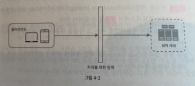

위 그림의 설계에서 처리율 제한이 어떻게 동작하는지는 아래 그림과 같다.

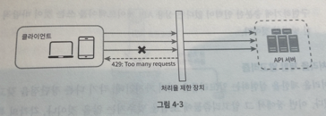

API 서버의 처리율이 초당 2개의 요청으로 제한된 상황에서, 클라이언트가 3번째 요청을 앞의 두 요청과 같은 초 범위 내에서 전송하였다고 해 보자.

앞선 두 요청은 API 서버로 전송될 것이다. 하지만 세 번째 요청은 처리율 제한 미들웨어에 의해 가로막히고 클라이언트로는 HTTP 상태 코드 429가 반환된다.

HTTP 상태 코드 429는 사용자가 너무 많은 요청을 보내려고 했음 (Too many requests)을 알린다.

MSA의 경우, 처리율 제한 장치는 보통 API 게이트웨이라 불리는 컴포넌트에 구현된다.

API 게이트웨이는 처리율 제한, SSL 종단, 사용자 인증, IP 허용목록 관리 등을 지원하는 완전 위탁관리형 서비스, 즉 클라우드 업체가 유지 보수를 담당하는 서비스다.

처리율 제한 장치를 어디에 두어야 할지는 현재 기술 스택이나 엔지니어링 인력, 우선순위, 목표에 따라 달라질 수 있다.

일반적으로 적용될 수 있는 몇 가지 지침을 나열해 보면 다음과 같다.

- 프로그래밍 언어, 캐시 서비스 등 현재 사용하고 있는 기술 스택을 점검하라. 현재 사용하는 프로그래밍 언어가 서버 측 구현을 지원하기 충분할 정도로 효율이 높은지 확인하라.
- 여러분의 사업 필요에 맞는 처리율 제한 알고리즘을 찾아라. 서버 측에서 모든 것을 구현하기로 했다면, 알고리즘은 자유롭게 선택할 수 있다. 하지만 제3 사업자가 제공하는 게이트웨이를 사용하기로 했다면 선택지는 제한될 수도 있다.
- 여러분의 설계가 마이크로서비스에 기반하고 있고, 사용자 인증이나 IP 허용목록 관리 등을 처리하기 위해 API 게이트웨이를 이미 설계에 포함시켰다면 처리율 제한 기능 또한 게이트웨이에 포함시켜야 할 수도 있다.
- 처리율 제한 서비스를 직접 만드는 데는 시간이 든다. 처리율 제한 장치를 구현하기에 충분한 인력이 없다면 상용 API 게이트웨이를 쓰는 것이 바람직한 방법일 것이다.

 

## 처리율 제한 알고리즘
처리율 제한을 실현하는 알고리즘은 여러 가지인데, 각기 다른 장단점을 갖고 있다. 널리 알려진 인기 알고리즘으로는 다음과 같은 것들이 있다.

- 토큰 버킷
- 누출 버킷
- 고정 윈도 카운터
- 이동 윈도 로그
- 이동 윈도 카운터

 

## 토큰 버킷 알고리즘
토큰 버킷 알고리즘은 처리율 제한에 폭넓게 이용되고 있다. 간단하고, 알고리즘에 대한 세간의 이해도도 높은 편이며 인터넷 기업들이 보편적으로 사용하고 있다.

토큰 버킷 알고리즘의 동작 원리는 다음과 같다.

- 토큰 버킷은 저장된 용량을 갖는 컨테이너다. 이 버킷에는 사전 설정된 양의 토큰이 주기적으로 채워진다. 토큰이 꽉 찬 버킷에는 더 이상의 토큰은 추가되지 않는다. 아래 그림의 예제는 용량이 4인 버킷이다. 토큰 공급기는 이 버킷에 매초 2개의 토큰을 추가한다. 버킷이 가득 차면 추가로 공급된 토큰은 버려진다.
  
    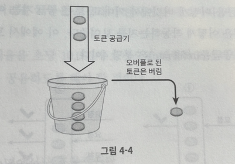
- 각 요청은 처리될 때마다 하나의 토큰을 사용한다. 요청이 도착하면 버킷에 충분한 토큰이 있는지 검사하게 된다. 아래 그림은 그 과정을 보여준다.
  - 충분한 토큰이 있는 경우, 버킷에서 토큰 하나를 꺼낸 후 요청을 시스템에 전달한다.
  - 충분한 토큰이 없는 경우, 해당 요청은 버려진다.
    
     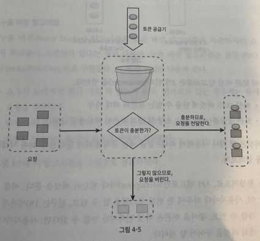

아래 그림은 토큰을 어떻게 버킷에서 꺼내고, 토큰 공급기는 어떻게 동작하며, 처리 제한 로직은 어떻게 작동하는지를 보여준다. 이 예에서 토큰 버킷의 크기는 4이다. 토큰 공급률은 분당 4이다.

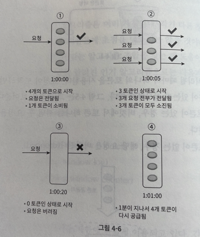

이 토큰 버킷 알고리즘은 2개의 인자를 받는다.

- 버킷 크기 : 버킷에 담을 수 있는 토큰의 최대 개수
- 토큰 공급률 : 초당 몇 개의 토큰이 버킷에 공급되는가

버킷은 몇 개나 사용해야 하나? 공급 제한 규칙에 따라 달라진다. 다음 사례들을 살펴보자.

- 통상적으로, API 엔드포인트마다 별도의 버킷을 둔다. 예를 들어, 사용자마다 하루에 한 번만 포스팅을 할 수 있고, 친구는 150명까지 추가할 수 있고, 좋아요 버튼은 다섯 번까지만 누를 수 있다면, 사용자마다 3개의 버킷을 두어야 할 것이다.
- IP 주소별로 처리율 제한을 적용해야 한다면 IP 주소마다 버킷을 하나씩 할당해야 한다.
- 시스템의 처리율을 초당 10000개 요청으로 제한하고 싶다면, 모든 요청이 하나의 버킷을 공유하도록 해야 할 것이다.

### 장점
- 구현이 쉽다.
- 메모리 사용 측면에도 효율적이다.
- 짧은 시간에 집중되는 트래픽도 처리 가능하다. 버킷에 남은 토큰이 있기만 하면 요청은 시스템에 전달될 것이다.

### 단점
- 이 알고리즘은 버킷 크기와 토큰 공급률이라는 두 개의 인자를 가지고 있는데, 이 값을 적절히 튜닝하는 것은 까다로운 일이다.

 

## 누출 버킷 알고리즘
누출 버킷 알고리즘은 토큰 버킷 알고리즘과 비슷하지만 요청 처리율이 고정되어 있다는 점이 다르다.

누출 버킷 알고리즘은 보통 FIFO 큐로 구현한다. 그 동작 원리는 다음과 같다.

- 요청이 도착하면 큐가 가득 차 있는지 본다. 빈자리가 있는 경우에는 큐에 요청을 추가한다.
- 큐가 가득 차 있는 경우에는 새 요청은 버린다.
- 지정된 시간마다 큐에서 요청을 꺼내어 처리한다.

아래 그림을 보자.

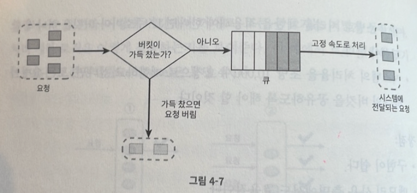

누출 버킷 알고리즘은 다음의 두 인자를 사용한다.

- 버킷 크기 : 큐 사이즈와 같은 값이다. 큐에는 처리될 항목들이 보관된다.
- 처리율 : 지정된 시간당 몇 개의 항목을 처리할지 지정하는 값이다. 보통 초 단위로 표현된다.

### 장점
- 큐의 크기가 제한되어 있어 메모리 사용량 측면에서 효율적이다.
- 고정된 처리율을 갖고 있기 때문에 안정적 출력이 필요한 경우에 적합하다.

### 단점
- 단시간에 많은 트래픽이 몰리는 경우 큐에는 오래된 요청들이 쌓이게 되고, 그 요청들을 제때 처리 못하면 최신 요청들은 버려지게 된다.
- 두 개의 인자를 올바르게 튜닝하기 까다로울 수 있다.

 

## 개략적인 아키텍처
처리율 제한 알고리즘의 기본 아이디어는 단순하다. 얼마나 많은 요청이 접수되었는지를 추적할 수 있는 카운터를 추적 대상별로 두고, 이 카운터의 값이 어떤 한도를 넘어서면 한도를 넘어 도착한 요청은 거부하는 것이다.

그렇다면 이 카운터는 어디 보관할 것인가? 데이터베이스는 디스크 접근 때문에 느리니까 사용하면 안 될 것이다. 메모리 상에서 동작하는 캐시가 바람직한데, 빠른데다 시간에 기반한 만료 정책을 지원하기 때문이다.

이례로 레디스는 처리율 제한 장치를 구현할 때 자주 사용되는 메모리 기반 저장장치로서, INCR과 EXPIRE의 두 가지 명령어를 지원한다.

- INCR : 메모리에 저장된 카운터의 값을 1만큼 증가시킨다.
- EXPIRE : 카운터에 타임아웃 값을 설정한다. 설정된 시간이 지나면 카운터는 자동으로 삭제된다.

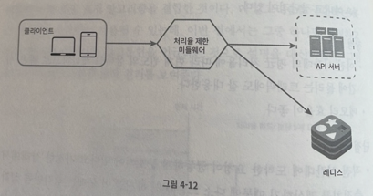

동작 원리는 다음과 같다.

- 클라이언트가 처리율 제한 미들웨어에게 요청을 보낸다.
- 처리율 제한 미들웨어는 레디스의 지정 버킷에서 카운터를 가져와서 한도에 도달했는지 아닌지를 검사한다.
  - 한도에 도달했다면 요청은 거부된다.
  - 한도에 도달하지 않았다면 요청은 API 서버로 전달된다. 한편 미들웨어는 카운터의 값을 증가시킨 후 다시 레디스에 저장한다.

 

# 상세 설계
위 그림을 봐선 아래와 같은 사항은 알 수가 없다.

- 처리율 제한 규칙은 어떻게 만들어지고 어디에 저장되는가?
- 처리가 제한된 요청들은 어떻게 처리되는가?

 

## 처리율 제한 규칙
이런 규칙들은 보통 설정 파일 형태로 디스크에 저장된다.

 

## 처리율 한도 초과 트래픽의 처리
어떤 요청이 한도 제한에 걸리면 API는 HTTP 429 응답을 클라이언트에게 보낸다.

경우에 따라서는 한도 제한에 걸린 메시지를 나중에 처리하기 위해 큐에 보관할 수도 있다.

### 처리율 제한 장치가 사용하는 HTTP 헤더
클라이언트는 자기 요청이 처리율 제한에 걸리고 있는지를(throttle) 어떻게 감지할 수 있나?

자기 요청이 처리율 제한에 걸리기까지 얼마나 많은 요청을 보낼 수 있는지 어떻게 알 수 있나? 답은 HTTP 응답 헤더에 있다.

이번 장에서 설계하는 처리율 제한 장치는 다음의 HTTP 헤더를 클라이언트에게 보낸다.

- X-Ratelimit-Remaining : 윈도 내에 남은 처리 가능 요청의 수
- X-Ratelimit-Limit : 매 윈도마다 클라이언트가 전송할 수 있는 요청의 수
- X-Ratelimit-Retry-After: 한도 제한에 걸리지 않으려면 몇 초 뒤에 요청을 다시 보내야 하는지 알림

사용자가 너무 많은 요청을 보내면 429 too many requests 오류를 X-Ratelimit-Retry-After 헤더와 함께 반환하도록 한다.

 

## 상세 설계
아래 그림은 상세한 설계 도면이다.

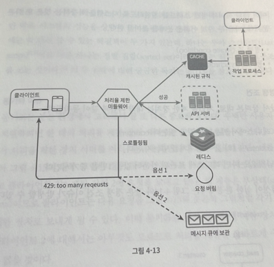

- 클라이언트가 요청을 서버에 보내면 요청은 먼저 처리율 제한 미들웨어에 도달한다.
- 처리율 제한 미들웨어는 제한 규칙을 캐시에서 가져온다. 아울러 카운터 및 마지막 요청의 타임스탬프를 레디스 캐시에서 가져온다. 가져온 값들에 근거하여 해당 미들웨어는 다음과 같은 결정을 내린다.
  - 해당 요청이 처리율 제한에 걸리지 않은 경우에는 API 서버로 보낸다.
  - 해당 요청이 처리율 제한에 걸렸다면 429 too many requests 에러를 클라이언트에 보낸다. 그 요청은 그대로 버릴 수도 있고 메시지 큐에 보관할 수도 있다.

 

## 분산 환경에서의 처리율 제한 장치의 구현
단일 서버를 지원하는 처리율 제한 장치를 구현하는 것은 어렵지 않다. 하지만 여러 대의 서버와 병렬 스레드를 지원하도록 시스템을 확장하는 것은 또 다른 문제다. 다음 두 가지 어려운 문제를 풀어야 한다.

- 경쟁 조건
- 동기화

 

### 경쟁 조건
앞서 살펴본 대로, 처리율 제한 장치는 대략 다음과 같이 동작한다.

- 레디스에서 카운터의 값을 읽는다 (counter)
- counter+1 의 값이 임계치를 넘는지 본다.
- 넘지 않는다면 레디스에 보관된 카운터 값을 1만큼 증가시킨다.

병행성이 심한 환경에서는 아래 그림과 같은 경쟁 조건 이슈가 발생할 수 있다.

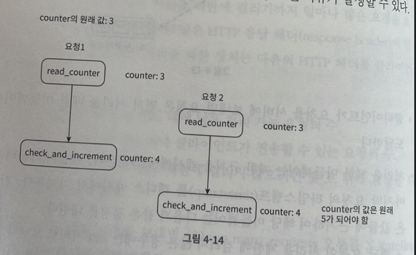

레디스에 저장된 변수 counter 값이 3이라고 하자. 그리고 두 개 요청을 처리하는 스레드가 각각 병렬로 counter 값을 읽었으며 그 둘 가운데 어느쪽도 아직 변경된 값을 저장하지는 않은 상태라 해보자. 

둘 다 다른 요청의 처리 상태는 상관하지 않고 counter에 1을 더한 값을 레디스에 기록할 것이다. 

그리고 counter의 ㄱ밧은 올바르게 변경되었다고 믿을 것이다. 하지만 counter의 값은 5가 되어야 한다.

경쟁 조건 문제를 해결하는 가장 널리 알려진 해결책은 락(lock)이다. 하지만 락은 시스템의 성능을 상당히 떨어뜨린다는 문제가 있다.

위 설계의 경우 락 대신 쓸 수 있는 해결책이 두 가지 있다.
- 루아 스크립트
- 정렬 집합 (레디스 자료구조) 사용

이 두가지 전략에 대해 궁금하면 구글링 해보자.

 

### 동기화 이슈
동기화는 분산 환경에서 고려해야 할 또 다른 중요한 요소다.

수백만 사용자를 지원하려면 한 대의 처리율 제한 장치 서버로는 충분하지 않을 수 있다.

그래서 처리율 제한 장치 서버를 여러 대 두게 되면 동기화가 필요해진다. 

예를 들어 아래 그림의 왼쪽 그림의 경우 클라이언트 1은 제한 장치 1에 요청을 보내고 클라이언트 2는 제한 장치2 에 요청을 보내고 있다.

웹 계층은 무상태이므로 클라이언트는 다음 요청을 아래 그림의 오른쪽 그림처럼 각기 다른 제한 장치로 보내게 될 수 있다. 이때 동기화를 하지 않는다면 제한 장치 1은 클라이언트 2에 대해선 아무것도 모르므로 처리율 제한을 올바르게 수행할 수 없을 것이다.

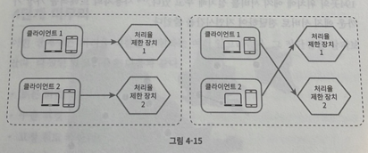

이에 대한 한 가지 해결책은 고정 세션(sticky session)을 활용하여 같은 클라이언트로부터의 요청은 항상 같은 처리율 제한 장치로 보낼 수 있도록 하는 것이다.

하지만 이 방법은 추천하고 싶지 않은데, 규모면에서 확장 가능하지도 않고 유연하지도 않기 때문이다. 더 나은 해결책은 레디스와 같은 중앙 집중형 데이터 저장소를 쓰는 것이다.

이 접근법에 기반한 설계가 아래 그림과 같다.

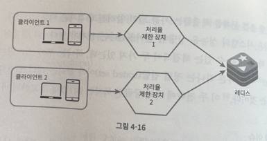

 

### 성능 최적화
지금까지 살펴본 설계는 두 가지 지점에서 개선이 가능하다.

우선, 여러 데이터센터를 지원하는 문제는 처리율 제한 장치에 매우 중요한 문제라는 것을 상기하자. 데이터센터에서 멀리 떨어진 사용자를 지원하려다 보면 지연시간이 증가할 수밖에 없기 때문이다.

대부분의 클라우드 서비스 사업자는 시계 곳곳에 에지 서버를 심어놓고 있다.

사용자의 트래픽을 가장 가까운 에지 서버로 전달하여 지연시간을 줄인다.

두 번째로 고려해야 할 것은 제한 장치 간에 데이터를 동기화할 때 최종 일관성 모델을 사용하는 것이다.

이 일관성 모델이 생소하다먄 6장의 데이터 일관성 항목을 참고하자.