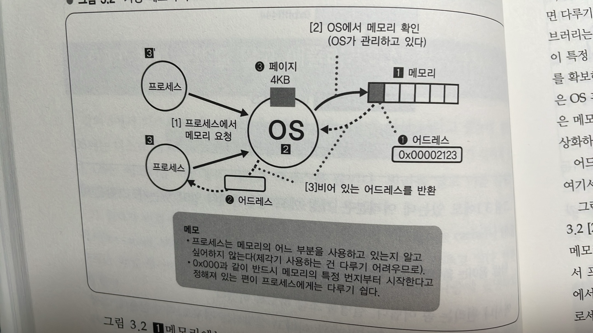
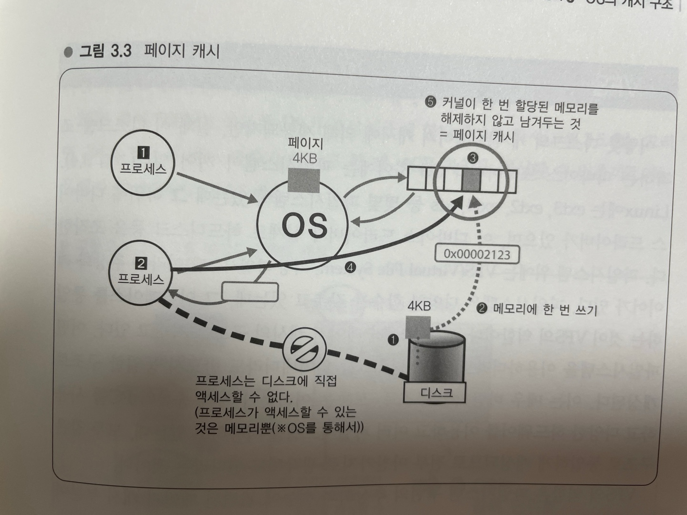
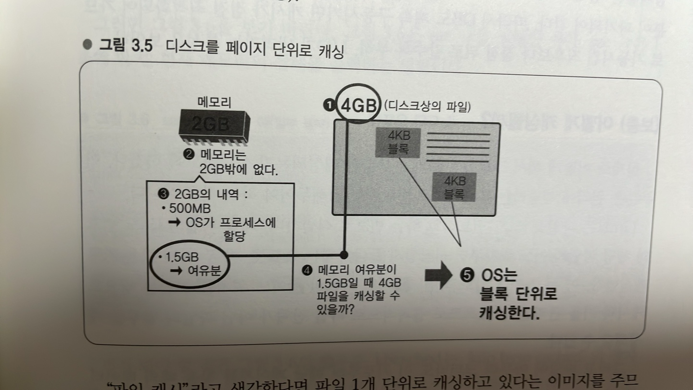
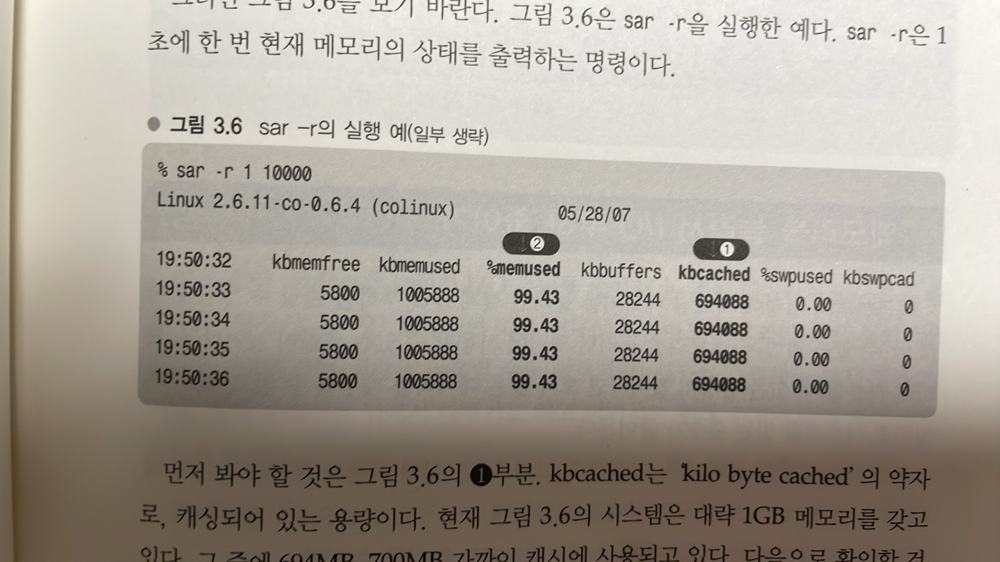
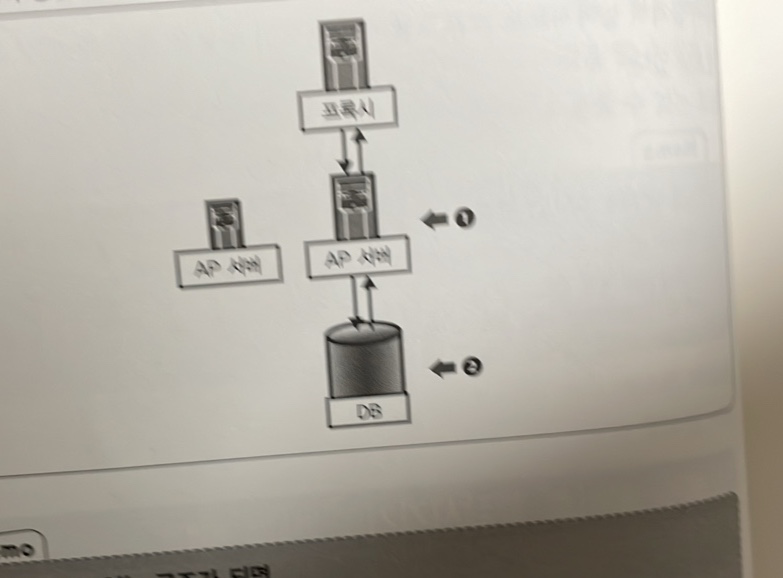
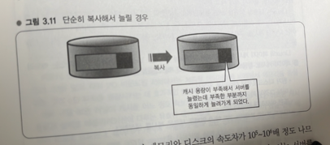
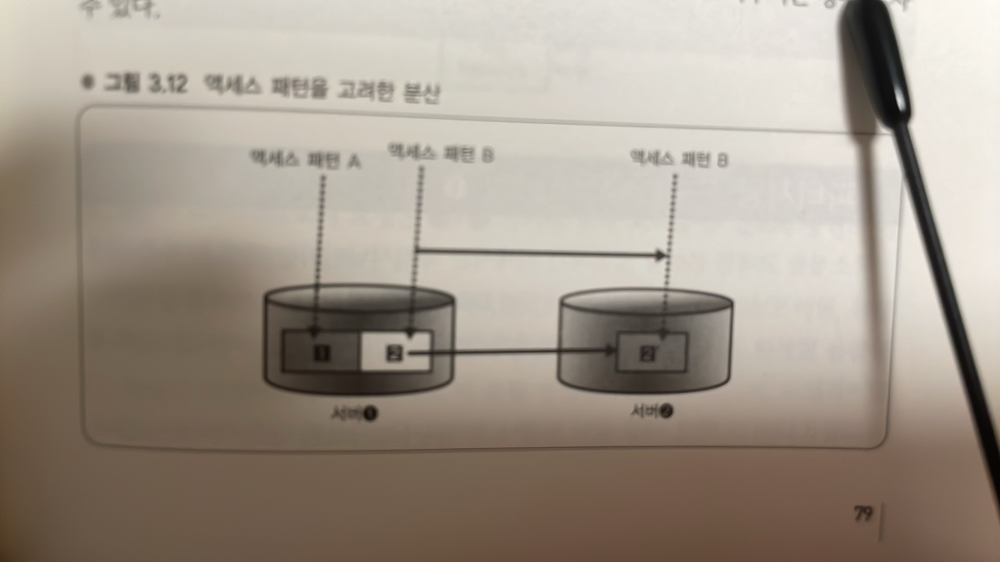
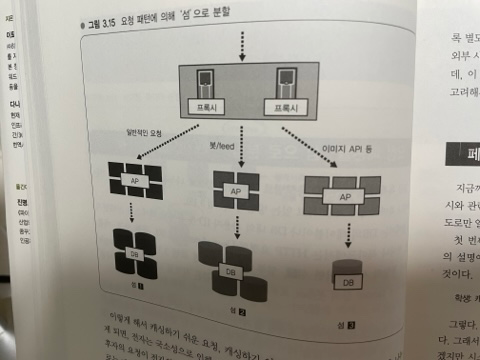

> 대규모 데이터를 다룰 때의 포인트
### I/O 대책에 대한 기반은 OS에 있다.
3장에서는 메모리나 디스크를 시작으로 하드웨어상에 얹혀 있는 OS에 관한 얘기로 옮겨 가겠다.

# 강의 8. OS의 캐시 구조
## OS의 캐시 구조를 알고 애플리케이션 작성하기
> 페이지 캐시

강의 5에서 디스크와 메모리 간 속도차가 10^5~10^6배 이상 난다고 했는데, 원래 OS에는 디스크 내의 데이터에 빠르게 액세스할 수 있도록 하는 구조가 갖춰져 있다.

OS는 메모리를 이용해서 디스크 액세스를 줄인다. 원리를 알고 이를 전제로 애플리케이션을 작성하면 OS에 상당부분을 맡길 수 있다.

그 원리가 바로 OS 캐시다. Linux의 경우는 페이지 캐시나 파일 캐시, 버퍼 캐시라고 하는 캐시 구조를 갖추고 있다.

여기서는 '페이지 캐시'라고 하겠다. Linux 페이지 캐시의 특성을 확실히 알아 두어야 한다는 것이 앞으로 설명할 내용이다.

### Linux(x86)의 페이징 구조를 예로
여러분은 가상 메모리에 관해서 알고 있는가? 스왑은 어떤가?

역시나 원리는 좀 어렵다. 설명을 조금 하도록 하겠다.

책에 따라서는 '가상 메모리 = 스왑'이라고 설명하는 경우도 적지 않는데, 그렇지는 않다.

OS는 '가상 메모리 구조'를 갖추고 있다. 가상 메모리 구조는 논리적인 선형 어드레스를 물리적인 물리 어드레스로 변환하는 것이다.

## 가상 메모리 구조
가상 메모리 구조가 존재하는 가장 큰 이유는 물리적인 하드웨어를 OS에서 추상화하기 위해서다. 아래 그림을 바탕으로 가상 메모리를 좀더 자세히 살펴보도록 하자. 

그림에서 1은 메모리, 2는 OS, 3은 애플리케이션 프로세스다.

메모리에는 (1)과 같은 주소(=어드레스)가 붙어 있다. (1)에는 0x00002123 이라는 32비트 주소가 붙어 있다.

그러나 (1)의 어드레스를 직접 프로그램에서 사용하게 되면 여러 곤란한 일이 일어난다.

따라서 프로세스에서 메모리를 필요로 하게 되면 느닷없이 (1)의 어드레스를 가져오는 것이 아니라 위 그림과 같이 OS가 (1)메모리에서 비어 있는 곳을 찾는다.

(1) 메모리는 OS가 관리하고 있으며, 그림 처럼 비어 있는 곳을 반환할 때 (1)의 0x00002123과는 다른 어드레스 (2)를 반환한다.

그 이유는 개별 프로세스에서는 메모리의 어느 부분을 사용하는지 관여하지 않고, '반드시 특정 번지부터 시작' 또는 '0x000 부터 시작'하는 것으로 정해져 있으면 다루기 쉽기 때문이다.

프로세스 내에서 이 특정 어드레스는 예약되어 있다. 이때 만일 시작주소가 각기 다르다면 메모리를 확보해야 할 주소위치를 찾기가 매우 어려울 것이다.

여기서 포인트는 OS라는 것은 메모리를 직접 프로세스로 넘기는 것이 아니라 일단 커널 내에서 메모리를 추상화하고 있다는 점이다. 이것이 가상 메모리 구조이다.

어드레스를 매핑한다는 점 이외에도 어드레스 변환에는 다양한 이점이 있는데, 생략한다.

강의 5에서 디스크의 경우에도 OS가 모아서 읽어낸다고 했는데, 그림의 [2]에서 메모리를 확보할 때에도 그와 마찬가지 방식으로 (3)과 같이 메모리 1바이트씩 액세스하는게 아니라 적당히 4KB 정도를 블록으로 확보해서 프로세스에 넘긴다.

여기서 1개의 블록을 '페이지'라고 한다. OS는 프로세스에서 메모리를 요청받으면 페이지를 1개 이상, 필요한 만큼 페이지를 확보해서 프로세스에 넘기는 작업을 수행한다.

## Linux의 페이지 캐시 원리
OS는 확보한 페이지를 메모리상에 계속 확보해두는 기능을 갖고 있다.

프로세스가 디스크로부터 데이터를 읽어내는 과정을 살펴보도록 하자.

OS는 위 그림의 (1)과 같이 우선 디스크로부터 4KB 크기의 블록을 읽어낸다.

읽어낸 것은 (2)와 같이 한 번은 메모리상에 위치시켜야 한다. 왜냐하면 프로세스는 디스크에 직접 액세스할 수 없기 때문이다.

어디까지나 프로세스가 액세스할 수 있는 것은 가상 메모리다. 

따라서 OS는 그림의 (2)와 같이 읽어낸 블록을 메모리에 쓴다.

그리고 나서 OS는 그 메모리 주소 (3)를 프로세스 ([1])에 (가상 어드레스로서)알려준다.

그러면 프로세스가 해당 메모리인 (3)에 액세스하게 된다.

데이터 읽기를 마친 프로세스([1])가 '이번 디스크 읽기는 끝나고 데이터는 전부 ㅊ퍼리했으므로 더 이상 불필요'하게 됐어도 (3)을 해제하지 않고 남겨둔다.

그렇게 하면 다음에 다른 프로세스([2])가 같은 디스크인 (1)에 액세스할 때에는 남겨두었던 페이지를 사용할 수 있으므로 디스크를 읽으러 갈 필요가 없게 된다.

이것이 페이지 캐시다. 즉, 커널이 한 번 할당한 메모리를 해제하지 않고 계속 남겨두는 것이 페이지 캐시의 기본이다.(5)

### 페이지 캐시의 친숙한 효과
이는 예외인 경우를 제외하고 모든 I/O에 투과적으로 작용한다. 즉, Linux에서는 디스크에 데이터를 읽으러 가면 꼭 한 번은 메모리로 가서 데이터가 반드시 캐싱된다.

따라서 두 번째 이후의 액세스가 빨라진다.

OS를 계속 가동시켜 두면 메모리가 허락하는 한 디스크 상의 데이터를 계속 캐싱하게 된다. 따라서 OS를 계속 가동시켜 두면 빨라진다.

따라서 재부팅하면 디스크를 읽어낼 때 캐시가 비어있으므로 속도가 느려진다. 그래서 부팅 직후에는 캐시에 없어서 디스크 I/O가 발생하기 쉬우므로 다소 버벅거리는 느낌이 드는 것이다.

## VFS
이렇듯 디스크의 캐시는 페이지 캐시에 의해 제공되지만, 실제 이 디스크를 조작하는 디바이스 드라이버와 OS 사이에는 파일시스템이 끼어있다.

Linux 에는 ext3, ext2, ext4, xfs 등 몇몇 파일 시스템이 있는데 그 하위에 디바이스 드라이버가 있으며, 이 디바이스 드라이버가 실제로 하드디스크 등을 조작한다.

파일 시스템 위에는 VFS(Visual File System)이라는 추상화 레이어가 있다.

파일 시스템은 다양한 함수를 갖추고 있는데, 그 인터페이스를 통일하는 것이 VFS의 역할이다.

또한 VFS가 페이지 캐시의 구조를 지니고 있다. 어떤 파일 시스템을 이용하더라도, 어떤 디스크를 읽어내더라도 반드시 동일한 구조로 캐싱된다.

이는 매우 바람직한 구조로, 보통은 여러분이 여러 종류의 PC를 사용하고 다양한 하드웨어를 이용하고 여러 파일시스템을 사용하고 있는데, 모두 같은 구조로 동일하게 캐싱되므로 전부 마찬가지로 생각해도 된다는 것이다.

VFS의 역할은 파일시스템 구현의 추상화와 성능에 관련된 페이지 캐시 부분이다. 그 부분은  이 정도로만 알아두어도 OK.

## Linux는 페이지 단위로 디스크를 캐싱한다

그림을 살펴보자.

예를 들어 (1)의 디스크상에 4GB 정도의 매우 큰 파일이 있고, (2)의 메모리가 2GB밖에 없다고 하자.

2GB중에 500MB 정도를 OS가 프로세스에 할당했다고 하자. 

그러면 이제 '1.5GB 정도 여유가 있다고 할 때, 4GB 파일을 캐싱할 수 있을까?'라는 문제가 발생한다.

"파일 캐시"라고 생각한다면 파일 1개 단위로 캐싱하고 있다는 이미지를 주므로 4GB는 캐싱할 수 없다고 생각할 수 있지만, 실제로는 그렇지 않다.

OS는 (5)와 같이 읽어낸 블록 단위만으로 캐싱할 수 있는 범위가 정해진다. 여기서는 디스크상에 배치되어 있는 4KB 블록만을 캐싱하므로 특정 파일의 일부분만, 읽어낸 부분만을 캐싱할 수 있다.

이렇게 디스크를 캐싱하는 단위가 페이지다.

### LRU
메모리 여유분이 1.5GB 있고 파일을 4GB 전부 읽게 되면 어떻게 될까?

구조상으로는 LRU(Least Recently Used), 가장 오래된 것을 파기하고 가장 새로운 것을 남겨 놓는 형태로 되어 있어서 최근에 읽은 부분이 캐시에 남고 과거에 읽은 부분이 파기되어 간다.

따라서 DB도 계속 구동시키면 캐시가 점점 최적화되어 가므로 기동시킨 직후보다 점점 뒤로 갈수록 부하, I/O가 내려가는 특성을 보인다.

### 보충) 어떻게 캐싱될까?
> i노드와 오프셋

실제로 어떻게 해서 그림의 (5)의 일부분만 캐싱되는지 설명하도록 하겠다.

Linux는 파일을 i노드 번호라고 하는 번호로 식별하며, 해당 파일의 i노드 번호와 해당 파일의 어느 위치 부터 시작할지를 나타내는 오프셋, 이 두 가지 값을 키로 캐싱한다.

이 두 가지를 키로 하면 '[1] 어떤 파일의 [2] 어느 위치를' 이라는 쌍으로 캐시의 키를 관리할 수 있으므로 결과적으로 파일 전체가 아닌 파일의 일부를 캐싱해갈 수 있다.

그리고 파일이 아무리 크더라도 이 키로부터 해당 페이지를 찾을 때의 데이터 구조는 최적화되어 있다. 

OS(=커널) 내부에서 사용되고 있는 데이터 구조는 Radix Tree 라고 하며, 파일이 아무리 커지더라도 캐시 탐색속도가 떨어지지 않도록 개발된 데이터 구조다.

따라서 커다란 파일의 일부분을 캐싱하더가 작은 파일의 일부분을 캐싱하더라도 동일한 속도로 캐시를 찾을 수 있도록 되어있다.

## 메모리가 비어 있으면 캐싱
> sar로 확인해보기

우선 Linux는 메모리가 비어 있으면 전부 캐싱한다.

여기에는 제한이 없어서 Linux는 비어 있는 메모리 공간에 계속해서 디스크 내용을 캐싱해간다.

한편 프로세스에서 메모리를 요청했을 때 캐시로 인해 더 이상 메모리가 남아있지 않다면 오래된 캐시를 버리고 프로세스에 메모리를 확보해준다.

sysstat라는 패키지를 설치하면 sar이 포함되어 있으니 설치하기 바란다.

sar -r 은 1초에 한 번 현재 메모리의 상태를 출력하는 명령이다.

아래 사진을 보자.

먼저 봐야 할 것은 (1)부분. kbcached는 'kilo byte cached'의 약자로, 캐싱되어 있는 용량이다.

현재 시스템은 대략 1GB의 메모리를 갖고 있다. 그 중에 694MB, 700MB 가까이 캐시에 사용되고 있다.

다음으로 확인할 것이 (2)의 %memused 부분. 메모리를 99% 정도 사용하고 있다.

메모리를 99%나 사용 중이고 게다가 그 중에 700MB 정도를 캐시에 할당하고 있다. 이것을 페이지 캐시 원리를 모르고 보면 '내 PC, 메모리가 완전 부족하네!', '1GB밖에 없는데 캐시에 700MB나 사용하다니!' 라고 당황할 수도 있겠지만, 실제로는 그렇지가 않다.

메모리가 비어 있는 곳에 OS가 조금씩 디스크를 캐싱하고 있는 것일 뿐이다.

캐시 이외에 메모리가 필요해지면 오래된 캐시가 파기된다. 그러므로 나중에 조금 다루겠지만, 예를 들어 디스크에 데이터가 수 GB 정도만 존재한다면 메모리를 8GB 정도 쌓아두면 전부 캐시에 올라가게 된다.

## 메모리를 늘려서 I/O 부하 줄이기
메모리를 늘리면 캐시에 사용할 수 있는 용량이 늘어나고, 캐시에 사용할 수 있는 용량이 늘어나면 보다 많은 데이터를 캐싱할 수 있고, 많이 캐싱되면 디스크를 읽는 횟수가 줄어든다.

메모리를 4GB에서 8GB로 늘려보니 프로세스가 작업을 수행할 때 I/O 대기를 거의 하지 않는 것을 살펴볼 수 있다(사진 생략)

이것이 의미하는 것은 4GB에서는 전부 캐싱할 수 없었으나 8GB로 늘리고 나니 데이터베이스상의 파일을 대부분 캐시로 올릴 수 있었다는 것이다.

이와 같이 '메모리를 늘려서 I/O 부하를 줄이자'는 것이 데이터가 많아졌을 때의 기본 방침이다.

## 페이지 캐시는 투과적으로 작용한다
한 가지 더 실례를 들어보자.

# 강의 9. I/O 부하를 줄이는 방법
## 캐시를 전제로 한 I/O 줄이는 방법
강의 8에서 살펴본 바와 같이 캐시에 의한 I/O 경감효과는 매우 크다.

캐시를 전제로 I/O를 줄이기 위한 대책을 세워가는 것이 유효하다는 것을 알 수 있을 것이다. 이것이야말로 I/O 대책의 기본이다. 이로부터 도출할 수 있는 두 가지 포인트를 두 가지 소개한다.

첫 번째 포인트는 "데이터 규모에 비해 물리 메모리가 크면 전부 캐싱할 수 있으므로 이 점을 생각할 것." 다루고자 하는 데이터의 크기에 주목하자는 것이다.

또한 대규모 데이터 처리에는 데이터 압축이 중요하다고 했는데, 압축해서 저장해두면 디스크 내용을 전부 그대로 캐싱해둘 수 있는 경우가 많다.

또 하나는 경제적인 비용과의 밸런스를 고려하고자 한다는 점이다.

최근에는 메모리가 8GB~16GB 정도가 일반적인 서버 한 대의 메모리 구성이다. 최근의 서버는 납품될 때 대체적으로 메모리가 8GB~16GB 정도 탑재되어 있다.

AP 서버는 메모리가 그렇게 많이 필요하지는 않으므로 4GB 정도지만, DB 서버는 그 정도의 메모리가 탑재되어 있다.

메모리가 32GB나 64GB정도 되어야 캐싱할 수 있다고 하면, 하드웨어 비용이 급격히 높아지므로 소프트웨어로 메모리 사용을 줄일 수 있도록 노력해야 할 필요도 있다.

> 데이터 규모 < 물리 메모리 이면 전부 캐싱할 수 있다.

## 복수 서버로 확장시키기
> 캐시로 해결될 수 없는 규모일 경우

메모리를 늘려서 전부 캐싱할 수 있다면 좋겠지만, 당연히 데이터를 전부 캐싱할 수 없는 규모가 될 수가 있다. 그렇게 되면 어떻게 할 것인가?

여기서 먼저 복수 서버로 확장시키는 방안을 생각해볼 필요가 있다.

아래 그림을 보기 바란다.

(1)의 AP 서버를 늘려야 하는 이유는 기본적으로 CPU 부하를 낮추고 분산시키기 위해서다.

한편, 그림 (2)의 DB 서버를 늘려야 할 때는 반드시 부하 때문만은 아니고 오히려 캐시 용량을 늘리고자 할 때 혹은 효율을 높이고자 할 때인 경우가 많다.

따라서 (1)과 (2)를 늘리는 것은 둘다 서버를 늘리는 것이지만 필요한 리소스, 요구되는 리소스가 전혀 다르다.

DB 서버는 '늘리면 좋다'라는 논리가 들어맞지 않는다.

## 단순히 대수만 늘려서는 확장성을 확보할 수 없다
캐시 용량을 늘려야 한다고 했는데, 사실 단순히 대수를 늘리는 것만으로는 안된다.

왜냐하면, 예를 들어 아래 그림과 같이 단순히 데이터를 복사해서 대수를 늘리게 되면 애초에 캐시 용량이 부족해서 늘렸는데 그 부족한 부분도 그대로 늘려가게 되는 것이다.

즉, 그림의 검은 부분이 변함없이 캐싱되지 않는 상황이 된다.

앞서 말한 대로 경우에 따라 메모리와 디스크의 속도차가 10^5~10^6배 정도 나므로, 결국 검은 부분에 액세스한 순간에 느려지는 것은 변함이 없다.

이는 서버를 늘림으로써 시스템 전체로서는 아주 조금은 빨라질지도 모르지만, 증설비용에 대비해서 성능향상은 극히 부족한 것이다. 확장성을 확보하려고 할 때 서버를 늘려서 10배에서 100배 정도는 빨라져야 한다.

따라서 단순히 대수를 늘리는 것은 좋은 방안이 아니다. 

# 강의 10. 국소성을 살리는 분산
## 국소성을 고려한 분산이란?
캐시 용량을 늘리기 위해 어떻게 하면 여러 대의 서버로 확장시킬 수 있는지에 대해 알아봦.

이를 위해서는 국소성을 고려해서 분산시키도록 한다. 국소성은 locality라고도 한다.

앞선 강의의 그림에서는 데이터를 그대로 복제했다. 그와 달리 데이터에 대한 액세스 패턴을 고려하는 분산시키는 것을 국소성을 고려한 분산이라고 한다.

위 그림이다.

(1)의 DB서버에 액세스 패턴 A일 때는 [1]로 액세스가 많이 오고 액세스 패턴 B일 때는 [2]로 오는 것 처럼, 데이터로 액세스하는 경향에 대한 처리방식에 따라 특정한 방향으로 치우치는 경우가 자주 있다.

예를 들어 하테나 북마크를 보면 '인기 엔트리' 페이지를 표시하는 경우엔 인기 엔트리용 데이터베이스의 캐시 테이블을 많이 액세스하지만, 자신의 북마크 테이블을 액세스할 때, 즉 필자자신의 북마크 테이블에 액세스하는 것과는 액세스 패턴이 전혀 다르다.

여기서 인기 엔트리로 액세스할 때는 DB 서버 (1)의 [1], 그렇지 않을 때는 DB 서버 (2)의 [2]로 요청을 분배한다.

그렇게 하면 액세스 A는 DB서버(1)의 [1], 액세스 B는 DB 서버(2)의 [2]로 각각 분산된다.

이와 같이 분배하면 [2]로의 액세스는 사라진다.

서버 (1)과 (2) 양측에 별다른 액세스 패턴을 고려하지 않고 분배한 경우, [2]로의 액세스는 여전히 계속되므로 서버(1)이 데이터 영역[2]도 캐싱해야 할 필요가 있다.

그러나 그림처럼 액세스 패턴을 고려했다면, [2] 부분은 더 이상 액세스 되지 않으므로 그만큼 캐시영역을 다른 곳으로 돌릴 수 있다.

서버(2)에서도 동일하게 생각할 수 있다.

결국 시스템 전체로서는 메모리에 올라간 데이터량이 늘어나게 된다.

## 파티셔닝
> 국소성을 고려한 분산 1

국소성을 고려한 분산을 실현하기 위해서는 `파티셔닝`이라는 방법을 자주 사용한다.

파티셔닝은 한 대였던 DB 서버를 여러 대의 서버로 분할하는 방법을 말한다. 분할 방법은 여러 가지가 있지만, 간단한 것은 '테이블 단위 분할'이다.

예를 들어 아래와 같은 테이블들이 있다고 하자.
1) entry 테이블
2) bookmark 테이블
3) tag 테이블
4) keyword 테이블

(1)(2)는 같이 액세스하는 경우가 많으므로 같은 서버에 위치시키고 있다. 그 밖에도 몇 종류가 동일 서버에 저장되어 있으며, 크기로는 개당 2GB 정도의 테이블이 여러 개, 대략 16GB 정도의 메모리를 탑재한 머신을 준비해두면 전부 메모리에 올릴 수 있다.

(3)(4) 테이블은 각각 꽤 커서 10GB 정도 된다. 이를 (1) + (2)와 같은 서버에 저장하게 되면 16GB로는 전부 캐싱할 수 없게 된다. 그러므로 (1)+(2)+(3)+(4)를 나누어 캐싱할 수 있도록 한다.

여기까지가 이른바 테이블 단위 파티셔닝이다.

다른 분할 방법으로는 `테이블 데이터 분할`이 있다.

특정 테이블 하나를 여러 개의 작은 테이블로 분할한다. 이것이 테이블 데이터 분할이다.

하테나 다이어리에서는 ID(id:~)의 첫 문자로 파티셔닝을 하고 있다.

예를 들어 ID의 첫 문자가 a~c인 사람의 데이터는 `서버[1]`, d~f인 사람의 데이터는 `서버[2]`와 같이 나눈다.

id:naoya는 n~p인 `서버[3]`으로 결정되었고, id:yaotti는 id:naoya와는 다른 `서버[4]`에 있다.

id:naoya에 대한 요청이 올때는 [3]에만 액세스하면 되므로 서버[3]에서 캐싱되는 것은 n~p로 시작하는 id를 가진 사람들의 데이터만 캐싱하면 되므로 메모리 측면에서는 국소성이 작용하고, 서버[3]에 있는 사용자는 전부 액세스할 수 있으므로, 이만 캐싱하면 되는 형태가 된다.

이 분할의 문제점은 분할의 입도를 크거나 작게 조절할 때 데이터를 한 번 병합해야 한다는 번거로움이 존재한다.

## 요청 패턴을 '섬'으로 분할
> 국소성을 고려한 분산 2

`용도별로 시스템을 섬으로 나누는 방법`도 있다.

앞에서는 DB 테이블이나 DB내의 사용자 ID 첫 문자로 액세스를 분배했지만, 하테나 북마크에서는 HTTP 요청의 User-Agent나 URL 등을 보고, 예를 들어 통상의 사용자이면 섬[1], 일부 API 요청이면 섬[3], Googlebot이나 Yahoo! 등의 봇이면 섬[2]와 같은 식으로 나누는 방법을 사용한다.

검색 봇은 특성상 아주 오래된 웹 페이지에도 액세스하러 오지만, 사람은 광범위하게 액세스 한다.

그렇게 되면 캐시가 작용하기 어렵다. 

동일한 페이지에 잇따라 방문하는 경우엔 캐시로 성능을 끌어올리기 쉽지만, 이처럼 광범위한 액세스에는 그럴 수가 없다.

그러나 봇에 대해 그렇게 빨리 응답할 필요는 없으므로 섬으로 나눠놓는다.

한편, 봇 이외의 액세스, 즉 사용자로부터의 액세스는 최상위 페이지나 인기 엔트리 페이지 등 최신, 인기 페이지에 거의 액세스가 집중되므로 빈번하게 참조되는 부분은 캐싱하기 쉽다.

이렇게 해서 캐싱하기 쉬운 요청, 캐싱하기 어려운 요청을 처리하는 섬을 나누게 되면, 전자는 국소성으로 인해 안정되고 높은 캐시 적중률을 낼 수 있게 된다.

후자의 요청이 전자의 캐시를 어지럽히므로 섬으로 나누는 경우에 비해 전체적으로는 캐시 효율이 떨어진다.

## 페이지 캐시를 고려한 운용의 기본 규칙
지금까지 캐시를 고려한 데이터 등을 분할하는 방법에 대해 얘기했다. 

페이지 캐시와 관련해서는 운용면에서도 생각해야 할 부분이 있으므로 파악해두자.

첫 번째 포인트는 OS 가동 직후에 서버를 투입하지 않는다는 것. 답은 캐시가 쌓여 있지 않아서이다.

갑자기 배치하면 캐시가 없으므로 오직 디스크 액세스만 발생하게 된다. 그래서 실제로 현재 하테나 북마크 정도의 규모가 되면 서버가 내려간다.

그렇다면 어떻게 해야 할까?

OS를 시작해서 기동하면 `자주 사용하는 DB의 파일을 한 번 cat해준다.` 그렇게 하면 전부 메모리에 올라간다. 그렇게 한 후에 로드밸런서에 편입시킨다.

다음 포인트는 성능평가나 부하시험에 대해서다. 차후에 여러분이 성능평가나 부하시험을 실시할 때 기억해야 할 것들이 있다.

`초깃값을 버려야 한다.` 최초의 캐시가 최적화되어 있지 않은 단계에 '대략 5000요청/초'라고 해도 캐시가 올라가 있지 않았을 때와 올라가 있을 때 낼 수 있는 속도는 완전히 다르다.

따라서 성능평가나 부하시험도 `캐시가 최적화된 후`에 실시할 필요가 있다.