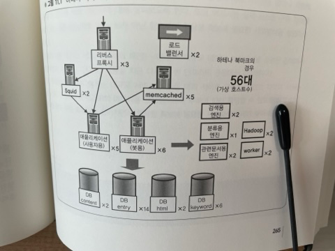

# ✍🏻 011. 대규모 데이터 처리를 지탱하는 서버/인프라 입문 - 웹 서비스의 백엔드

## 하테나의 인프라 스트럭쳐
11장~15장 강의의 테마는 하테나의 인프라스트럭쳐다. 좀더 저수준으로 설명하게 되므로 이 점을 의식해서 살펴보기 바란다.

11장에선 엔터프라이즈와 웹 서비스, 클라우드와 자체구축 인프라 등 몇 가지를 비교해가면서 하테나 인프라의 특징을 살펴보기로 하자.

# 강의 29. 엔터프라이즈 vs 웹 서비스
## 웹 서비스의 인프라
> 중요시되는 세 가지 포인트

웹 서비스의 인프라에서 중요시되는 것은 어떤 점일까? 포인트를 세 가지 소개한다.

첫 번째는 `저비용 고효율`이 중시된다.

이를 위해선 뭔가 희생해야만 하는 상반관계(trade-off)가 있는데, 가장 이해하기 쉽게 100%의 신뢰성은 목표로 하지 않도록 한다.

물론 비용을 들인다면 얼마든지 꽤 높은 신뢰성을 추구할 수는 있지만, 이 부분은 과감히 접고 오히려 비용을 낮춰서 효율을 높이는 방향으로 추진하고 있다.

두 번째 포인트로는 `확장성이나 응답성 등에 대한 설계를 중요시한다.`. 

서비스의 성장속도를 모르거나 사용자 경험을 위해 서비스의 응답성이 중요한 경우도 있다.

따라서 100% 신뢰성을 추구하기 보다 장래를 위해 제대로 확장할 것.

99%의 시간대는 양호한 응답이 이루어지도록 하는 등 기술적으로 중점을 둔 설계가 중요하다.

마지막으로 세 번째 포인트. 웹 서비스에서는 서비스 사양이 이리저리 바뀌는 경우가 있다.

하테나 다이어리나 하테나 북마크 등에서는 기능이 빈번하게 추가되고 있으므로 여기에 유연하게 대응할 수 있는 인프라여야만 한다.

따라서 세 번째 포인트로 `개발속도를 중시한 인프라로 구성해가는 것`도 매우 중요한 점이다.

예를 들면 애플리케이션 배포를 가능한 한 간편하게, 또한 배포할 때 마침 처리 중인 요청에 영향이 없도록하고, 필요한 서버를 즉시 추가할 수 있도록 해두며, 배포한 코드에 문제가 발견됐을 때에는 곧바로 이전 상태도 돌아갈 수 있도록 대처하고 있다.

# 강의 30. 클라우드 vs 자체구축 인프라
## 클라우드 컴퓨팅
앞서 언급한대로 웹 서비스는 저비용 고효율이 중시되는 영역이며, 이 점에서 최근에 유행하는 '클라우드 컴퓨팅', '클라우드'도 주목해야 할 키워드가 되고 있다.

## 클라우드의 장단점
클라우드의 최대 장점은 '확장성'에 있다.

한편, 단점은 Amazon EC2등 각각의 클라우드 서비스마다 독자적인 사양에 대응할 필요가 있다는 점이다.

2010년 4월 기준 EC2의 예로 보면, 호스트 사양만 준비되어 있고 획일적이므로 메모리를 대량으로 늘리려고 해도 어느 정도 이상은 늘릴 수 없다거나 I/O 성능이 그다지 빠르지 않는 호스트밖에 없다.

또한 EC2로 작동시키고 있는 노드도 때때로 정지하는 경우도 있다. 자기 실수가 아닌데도 때떄로 정지한다는 것이 좀처럼 심정적으로 납득이 가지 않는 것이다.

## 자체구축 인프라의 장점
1. 하드웨어 구성을 유연하게 할 수 있다.
2. 서비스로부터의 요청에 유연하게 대응할 수 있다.
3. 병목현상을 제어할 수 있다.

(1)유연한 하드웨어 구성의 예로, 메모리 탑재량을 늘렸으면 하는 요구가 높아지고 있다는 점을 들 수 있다.

이와 같은 영역에선 소프트웨어 레벨에서 분산처리를 하는 것도 중요하지만, 막상 때가 되면 메모리를 얼마든지 탑재할 수 있다는 옵션이 마련되어 있으면 안심할 수 있다.

클라우트 컴퓨팅의 경우는 상한선이 정해져 있으므로 그 부분에서 제어를 자유롭게 할 수 없다.

또한 자체적으로 인프라를 구축하면 SSD를 도입해서 I/O 성능을 단번에 올리는 등 다양한 선진적인 하드웨어를 투입해서 서버 한계를 점점 높일 수 있다.

그러나 클라우드 컴퓨팅을 사용하고 있는 한 주어진 선택방안 내에서 선택할 수 밖에 없고, 그 안에서 해결해야 한다는 제약이 있는 상태에서 운영해야 하므로 자체구축 인프라에서 실현 가능한 레벨의 유연성은 잃게 된다.

다음으로 (2) 서비스로부터의 요청에 대한 유연한 대응에 관한 예로, 단순히 대수를 늘리는 것뿐 아니라, 예를 들어 네트워크 측면에서 가까운 구성으로 갖추고 싶다거나 데이터를 대량으로 쌓을 수 있도록 하는 등의 요청에 대한 대응이 있을 수 있다.

하지만 이 부분은 클라우드 컴퓨팅에서도 개선하갈 수 있는 부분이므로 반드시 자체 구축만이 좋다라고 할순 없겟지만 현시점에선 자체구축의 장점으로 생각해도 지장이 없을 것이다.

마지막으로 (3) 병목현상 제어다.

이것은 로드밸런서나 네트워크 등에서 발생하는 문제로 시스템 규모가 커지면 무시할 수 없는 영역이 된다.

클라우드 컴퓨팅 내의 내부서버 간 통신이 어느 정도가 되면 병목이 되는지, 로드밸런서에 큰 부하를 주었을 때 실제 어떤 거동을 하고 어디에서 병목이나 지연이 발생하는지는 Amazon을 시작으로 해서 클라우드 환경을 제공하는 측의 기술에 의존할 수 밖에 없게 된다.

## 하테나의 서비스 규모
웹 서비스의 특징에 입각해서 하테나의 특징을 복습해보자.

하테나는 실제 2010년 4월 기준 등록 사용자 수 150만명, 1900만 UU, 트래픽은 피크 시 850Mbps 정도 나오는 중견 서비스 규모다.

서버 대수는 600대로, 가상화해서 1,300대 정도의 규모다.

## 하테나 북마크 시스템 구성도

시스템 구성도는 위 그림과 같다.

리버스 프록시가 3대, AP 서버가 11대, DB 서버가 24대, 캐시 서버가 7대, 로드밸런서가 2대, 그 밖의 엔진이 9대로 합계 56대로 구성되어 있다.

각각의 서버는 가상화되어 있으므로 물리적인 대수는 실제로는 좀더 적은 수로 되어 있다.

전체적인 구조는 (리버스)프록시와 애플리케이션과 DB라는 3층 구조로 되어 있다.

AP서버와 DB서버 비율이 1:2 정도가 된다. 이 비율은 애플리케이션 로직의 복잡성이나 DB로 오는 쿼리의 복잡성에 따라 변하지만, 이 정도 비율이 적정하다고 생각하고 있다.

또한 일부 서버는 사용자용, 봇용과 같이 요청 특성에 따라 나뉘어 있어 안정적으로 높은 성능을 발휘할 수 있도록 하고 있다.
