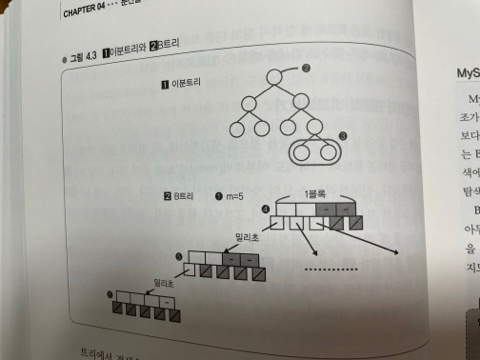

# ✍🏻 04. 분산을 고려한 MySQL 운용
## 분산된 시스템 알기
> 애플리케이션을 만들기 전에 알아두어야 할 MySQL 분산 노하우
메모리와 디스크의 속도차와 그로 인한 I/O 분산의 어려움, 그리고 이를 전제로 시스템을 어떻게 구축/운용할 것인가가 서서히 분명해지는 것 같다.
제4장은 DB 레이어로 얘기를 옮겨서 DB 스케일아웃 전략에 대해 자세히 살펴보도록 하자.

# 강의 11. 인덱스를 올바르게 운용하기
> 분산을 고려한 MySQL 운용의 대전제

## 분산을 고려한 MySQL 운용, 세 가지 포인트
첫 번째 포인트 `OS 캐시 활용`이라는 것은 이전 장의 연장선상에 있다.

두 번째 포인트는 `인덱스`이다.

MySQL뿐만 아니라 RDBMS에는 이런 구조가 마련되어 있다. 이러한 인덱스를 적절하게 설정하는 것이 매우 중요하다.

세 번째 포인트는 `확장을 한다는 전제로 시스템을 설계해둔다`는 것이다.

## OS 캐시 활용
이에 대해선 앞에서 많이 설명했으니 이해하고 있을 것이다.

전체 데이터 크기에 주의해서 데이터량이 물리 메모리보다 가능한 적어지도록 유지한다. 메모리가 부족할 경우엔 증설한다. 증설에 대해선 판단 포인트도 함께 설명했었다.

이제부터 MySQL에서의 요점에 대해 깊이 파고들어가 보자.

MySQL에서는 처음에 create table로 스키마를 결정한다. 이는 규모가 굉장히 커지면 상당히 중요해진다.

앞서 설명했던 하테나 북마크의 경우와 같이 3억 레코드 정도 되면 1 레코드에 칼럼을 1개, 예를 들어 8바이트 정도의 칼럼을 추가하면 8 X 3억 바이트 만큼의 데이터가 늘어나는 것이다.

8 X 3억이므로 그 것만으로 3GB. 스키마를 조금 변경하는 것만으로 기가바이트 단위로 데이터가 증감한다.

따라서 스키마 변경, 칼럼 변경에 주의를 기울여야만 한다.

대량의 데이터를 저장하려는 테이블은 레코드가 가능한 한 작아지도록 컴팩트하게 설계하도록 하자.

정수 int형은 32비트이므로 4바이트, 문자열이 8비트니가 1바이트와 같이 기본적인 수치는 머리에 새겨두도록 하자.

MySQL의 각각의 데이터형에 이 데이터형을 사용하면 대략 몇 바이트의 오버헤드가 있는지와 같은 것은 메뉴얼에 있지만, 이것도 어느정도 머리에 넣어두면 도움이 된다.

### 정리
- OS 캐시활용
  - 전체 데이터 크기에 주의
    - 데이터량 < 물리 메모리 를 유지
    - 메모리가 부족할 경우에는 증설 등
  - 스키자 설계가 데이터 크기에 미치는 영향을 고려한다.

## 인덱스의 중요성
> B 트리

알고리즘-데이터 구조에서 탐색을 할 때는 기본적으로 트리(탐색트리)가 널리 사용된다.

인덱스는 주로 탐색을 빠르게 하기 위한 것으로, 그 내부 데이터 구조로는 트리가 사용된다.

MySQL의 인덱스는 기본적으로 B+트리 라는 데이터 구조다.

B트리는 트리를 구성하는 각 노드가 여러 개의 자식을 가질 수 있는 '다분 트리'다. 도한 데이터 삽입이나 삭제를 반복한 경우에도 트리의 형태에 치우침이 생기지 않는 '평형 트리'이기도 하다.

B트리는 하드디스크 상에 구축하기에 알맞은 데이터 구조이므로 DB에서 자주 사용된다.

B트리에 의해 어떻게 탐색이 빨라지는지를 알아보자. B트리에 데이터를 삽입할 때는 일정한 규칙에 따라 삽입할 필요가 있는데, 그 규칙 덕분에 검색할 때 일부 노드를 순회하는 것만으로 자연스럽게 찾고자 하는 데이터에 도달하게 된다.

먼저 루트에서 시작해서 각 노드에 찾고 있는 값이 저장되어 있는지를 확인한다.

없으면 자식을 찾아간다. 이대 찾는 값의 대소관계로 어떤 자식을 찾아가면 될지가 한 번에 결정될 수 있는 규칙이 사용된다.

이에 따라 검색을 할 때 최대 트리 높이만큼의 횟수만 자식을 찾아가면 되므로 탐색이 빨라지는 것이다.

트리의 높이는 데이터 건수 n에 대해 반드시 log n이 되므로 계산량은 O(log n)이다.

### 이분트리와 B트리 비교해보기
잘 알려져 있는 탐색트리로는 B트리 이외에도 이분트리(바이너리 트리)등이 있다.

위 그림의 [1]이 이분트리다.

이분트리는 노드의 자식이 반드시 2개 이하다. 반면 [2], B트리는 노드의 자식이 여러개 있으며, 2개보다 훨씬 많다.

실제로 B트리의 노드 개수는 'm=몇개'라는 상수로 결정된다.

동일한 트리지만 이분트리와 B트리에서 어떤 점이 다를까?

이분트리는 (2) 노드가 반드시 하나로 정해져 있고 (3)은 두 개로 정해져 있지만, B트리는 m=5처럼 개수가 정해진다.

B트리는 이 수를 조정함으로써 (4)의 크기를 4KB 등으로 할 수 있다. 즉, 각 노드의 크기를 적당한 사이즈로 정할 수 있다.

이 점이 B트리의 장점이다.

여기서 노드의 크기라는 것이 제3장에서 설명한 디스크의 페이지와 매우 밀접한 관계가 있다.

(4)의 노드 1개로 디스크의 1블록만큼을 할당하면, B트리로 디스크 상에 저장했을 때 (5)를 1블록, (6)을 1블록 ... 과 같이 각 노드를 딱 1블록만큼으로 해서 저장할 수 있다.

감이 좋은 사람은 벌써 눈치챘을 것이다. 앞에서 OS는 디스크에서 데이터를 읽을 때 블록 단위로 읽어낸다고 했다.

또한 강의 5에서 '디스크 원반이 빙글빙글, 헤드가 윙'이라는 얘기를 했는데, 임의의 위치에 있는 데이터를 읽어내려면 물리적인 동작, 다시말해 디스크 seek이 발생하고, 여기서 밀리초 단위로 시간이 걸리며 느리다는 것도 설명했다.

트리에서 검색을 할 때는 노드에서 노드로 트리를 순회한다. 

B트리의 경우, 각 노드를 한 블록에 모아서 저장되도록 구성할 수 있으므로 디스크 seek 발생횟수를 노드를 찾아갈 때만으로 최소화할 수 있다. OS가 한 번에 읽어내서 메모리에 캐싱하게 되므로 같은 노드 내의 데이터는 디스크 Seek 없이 탐색 가능하다.

한편, 이분트리는 특정 노드를 모아서 1블록에 저장하는 등의 작업이 어렵다.

그러므로 이분트리를 디스크 상에 저장하는 데 있어서 디스크 구조에 최적화할 수가 없다. 그 결과, 디스크 상의 이분트리를 검색하려고 하면 여기저기 블록에 분산되어 있는 데이터를 다 읽어야 하므로 디스크 seek 횟수가 많아지게 된다.

B+ 트리에 대해 간단히 말하면, 각 노드 내에 자식 노드로의 포인터만 가지고 있고 포인터 이외에 데이터로서의 실제 값 등은 제일 마지막인 리프 노드에만 가지고 있는 구조이다.

### MySQL에서 인덱스 만들기
MySQL 에서 인덱스를 만들면 B트리의 변종인 B+트리에 의한 트리 데이터 구조가 생긴다.

지금 살펴본 것처럼 탐색에서는 처음부터 실 데이터를 살펴가는 것보다 인덱스의 트리를 순회하는 편이 더 빠르다.

바로 이를 위한 구조를 만들어 주는 B트리(B+트리)는 이론적으로 탐색 계산량이 O(log n)으로 보장되므로 선형탐색에서 O(n)으로 찾는 것보다 B트리로 찾는 게 더 빠르다. 이것이 바로 인덱스로 탐색하면 빨라지는 원리다.

## 인덱스의 효과
인덱스의 효과에 대해 대략 정리해보면 다음과 같다.

- [예] 4,000만 건 태그 테이블에서의 탐색
  - 인덱스 없음 = 선형탐색
    - O(n) -> 최대 4000만번 탐색
  - 인덱스 있음 = B트리로 이분탐색
    - O(log n) -> log 4000만 = 최대 25.25번

차이가 엄청나다.

또한 계산량 측면에서 개선될 뿐만 아니라 디스크 구조에 최적화된 인덱스를 사용해서 탐색함으로써 디스크 seek 횟수면에서도 개선된다.

### 인덱스 효과의 예
강의 4의 마지막 절인 '대규모 데이터로의 쿼리'의 그림에서 본 바와 같이 인덱스를 태우지 않고 select를 하면 200초를 기다려도 결과가 반환되지 않던 것이, 인덱스를 제대로 걸어서 검색하면 0.00초로 순식간에 반환하게 된다.

대규모가 되면 될수록 인덱스를 준비해놓느냐 아니냐에 따라 차이가 나게 된다. 사실 개인적인 용도의 작은 애플리케이션 정도면 인덱스를 전혀 사용하지 않아도 충분한 속도로 동작한다.
ㅁㄴㅇㅁㄴ
데이터 건수가 1000건 정도라면 오히려 트리를 먼저 순회하는 오버헤드가 더 커서 그냥 처음부터 찾아 내려가는 편이 더 빠른 경우가 많다. 그러나 크기가 커지면 인덱스 없이는 시작부터 액세스할 수 없는 상황이 되므로 인덱스는 매우 중요하다.

### [보충] 인덱스의 작용 - MySQL의 특성
MySQL의 인덱스 사양에는 약간의 특성이 있는데, 인덱스를 걸어놓고 있는 칼럼을 대상으로 한 쿼리라도 던지는 SQL에 따라서는 그것이 사용되거나 사용되지 않기도 한다.

- 기본적으로 인덱스가 사용되는 것은..
  - where, order by, group by의 조건에 지정된 칼럼

예를 들면 `select * from entry where url = 'http://..'`라는 쿼리는 where 절에 url 칼럼을 지정하고 있다. 따라서 url 칼럼에 인덱스가 걸려 있다면 사용된다.

- 인덱스로서 작용하는 것은..
  - 명시적으로 추가한 인덱스
  - PK, Unique 제약

MySQL은 명시적으로 인덱스를 추가한 경우 외에도 PK나 UNIQUE 제약을 건 칼럼에도 인덱스를 갖고 있다.

- MySQL 인덱스의 함정
  - 복수 칼럼에 동시에 인덱스를 태우고자 할 경우는 복합 인덱스를 사용해야만 한다.

문제가 바로 복수의 칼럼이 인덱스 작용의 대상이 되는 경우다.

예를 들어 `select * from entry where url like 'http://naver.ne/%' order by timestamp`라는 쿼리가 있다고 하자.

url 과 timestamp 각각에 인덱스를 설정했다고 하면 이 경우에 어떻게 될까?

url과 timestamp의 인덱스 양쪽이 모두 사용되어 url 인덱스에서 고속으로 url을 검색하고, 범위가 좁혀진 레코드를 timestamp 인덱스에서 고속으로 정렬해주는 걸 기대했지만 그렇게 되지 않는다.

이 경우는 어느 한쪽의 인덱스만 사용된다. 즉, 검색이나 정렬 중 어느 한쪽은 인덱스를 사용하지 않는 처리가 수행된다.

MySQL은 한 번의 쿼리에서 하나의 인덱스만 사용한다는 특성을 갖고 있는 것이 그 원인이다.

위 쿼리에선 (url, timestamp)를 한 쌍으로 한 복합 인덱스를 설정해야 뜻하던 바를 이룰 수 있다.

## 인덱스가 작용하는지 확인하는 법
> explain 명령

sql을 던지기전에 explain 명령을 실행하면 이 인덱스가 작용하는지 여부를 전부 조사해준다.

위 사진에서 [1]의 표를 보자.

eid는 엔트리 번호다. 표에 나타난 견해로는 이 쿼리로 검색했을 때 키로서 가능성이 있는 키의 이름(possible_keys)은 eid, 실제로 사용되고 있는 것(key)은 eid의 인덱스로, 조사한 것은 rows의 1행뿐이라는 평가결과다.

[2]는 SQL내에 use index로 탐색 조건을 하고자 하는 eid와는 굳이 다른 칼럼의 인덱스를 일부러 사용하고 있는 에다.

당연히 인덱스가 작용하지 않으므로 [2]의 쿼리에 대해 작용하는 인덱스는 없다.

결과적으로 얼마나 탐색했는지를 보면 962만 이상의 레코드를 탐색해서 겨우 1건 발견한 셈이다.

### explain 명령에서 속도에 유의하라
자신이 SQL 을 수반하는 프로그램을 개발할 때 속도에 신경 쓰고자 할 때는 explain 명령으로 자신이 던지려고 하는 SQL에 제대로 인덱스가 작용하는지 여부를 확인하면서 개발하면 좋다.

인덱스의 작용법이라는 의미에선 Extra열도 중요하다. 

Extra에는 Using where 이외에 Using filesort나 Using temporary와 같은 항목이 나올 경우가 있다.

각각 레코드 정렬에 외부 정렬(외부 파일을 사용한 정렬)이나 임시 테이블이 필요하다는 의미다.

기본적으론 Using filesort나  Using temporary가 나오는 것은 그다지 틀이 좋은 쿼리라고 할 수 없으므로 가능한 한 나오지 않도록 쿼리 및 인덱스르 튜닝할 필요가 있다.

# 강의 12. MySQL의 분산
> 확장을 전제로 한 시스템 설계

이제는 '분산'. 제 3장까지는 DB를 늘려서 분산하자는 얘기가 있었다. 그러면 MySQL의 분산은 어떻게 실현해갈 것인가? 이것이 바로 강의 12의 주제다.

MySQL에는 기본 기능으로 레플리케이션 기능이 있다.

레플리케이션이란 마스터를 정하고 마스터를 뒤따르는 서버(슬레이브)를 정해두면 마스터에 쓴 내용을 슬레이브가 폴링해서 동일한 내용으로 자신을 갱신하는 기능이다.

슬레이브는 마스터의 레플리카가 되는 것이다. 이렇게 해서 동일한 내용의 서버를 여러 대 마련할 수가 있다.

마스터/슬레이브로 레플리케이션해서 서버를 여러 대 준비하게 되면, 위 그림과 같은 구성으로 AP 서버에서는 로드 밸런서를 경유해서 슬레이브로 질의한다.

이렇게 해서 쿼리를 여러 서버로 분산할 수 있다.

이때 애플리케이션 구현에서 select 등 참조 쿼리만 로드밸런서로 흘러가도록 한다.

갱신 쿼리는 마스터로 직접 던진다. 갱신 쿼리를 슬레이브로 던지게 되면 슬레이브와 마스터 간 내용을 동기화할 수 없다.

MySQL은 마스터와 슬레이브간 내용의 불일치를 감지해서 레플리케이션을 중지해버린다. 이렇게 해서 오류로 이어진다.

아울러 슬레이브 앞단에 로드밸런서를 사용하고 있는데, 로드밸런서를 사용하지 않는 방법도 있다.

애플리케이션 측에서 분배까지 제어하거나 MySQL Proxy와 같은 것을 사용하는 것이다.

## 마스터/슬레이브의 특징
> 참조계열은 확장하고 갱신계열은 확장하지 않는다.

위 그림을 다시 보자.

금방 알아차렸겠지만, 이 구성에선 마스터를 분산할 수 없다는 문제가 있다.

'참조 계열 쿼리는 슬레이브로 분산하면 되지만, 갱신계열 쿼리를 분산할 수는 없지 않은가?' 라는 문제다.

그리고 또 한가지, 마스터의 다중화를 어떻게 할 것인가라는 문제도 당연히 발생한다.

참조계열 쿼리는 확장을 위해 서버를 늘리면 되는데, 다만 서버를 늘린다고는 해도 앞서 말했듯이 대수를 늘리기보다도 메모리에 맞추는 것이 중요하다.

한편, 마스터는 확장할 수 없다. 반드시 할 수 없는건 아니지만 갱신계열 쿼리가 늘어나면 상당히 험난해진다.

그렇지만 이 부분에서는 웹 애플리케이션의 특성이 있는데, 웹 애플리케이션에선 대략 90% 이상이 참조계열 쿼리다. 쓰기는 상대적으로 훨씬 적다.

따라서 웹 애플맄테이션에선 참조계열에 비하면 마스터가 병목이 되어 곤란한 상황이 발생하는 경우는 그렇게 많지 않다.

### 갱신/쓰기 계열을 확장하고자 할 때
> 테이블 분할, key-value 스토어

드물지만 마스터에 엄청난 쓰기 작업이 발생하는 애플리케이션을 개발하는 경우가 있을 수 있다.

이런 것을 개발할 때 마스터의 테이블이 과부하가 걸리는 경우가 있다.

이런 경우에도 역시나 테이블을 분할해서 테이블 크기를 작게 해준다. 그러면 분할로 인해 쓰기작업이 분산된다.

테이블 파일이 분산되면 동일 호스트 내에서 여러 디스크를 가지고 분산시킬 수도 있으며, 서로 다른 서버로 분산할 수도 있다.

다음으로, 처음부터 RDBMS를 사용하지 않는 방법도 생각해 볼 수 있다.

하테나에서 쓰기작업이 너무 많아서 RDBMS를 사용하지 않는 실제 사례로는 우고메모(움직이는 메모)의 동영상 재생횟수를 표시하고 있는 부분이다.

사용자가 영상을 재생할 때마다 갱신이 일어난다. 여기는 쓰기작업 횟수가 많아서  RDB로는 확장할 수 없어서 key-value 스토어를 사용한다.

단순히 값을 저장하고 꺼낼 뿐이므로 RDB가 갖는 복잡한 통계처리나 범용적인 정렬처리가 필요하지 않다면, key-value 스토어는 오버헤드도 적고 압도적으로 빠르며 확장하기 쉽다.

그리고 굳이 말하지는 않았는데, 애플리케이션 측면에서 연구해서 처음부터 쓰기 작업 횟수를 줄이는 것은 당연히 해야 할 연구일 것이다.

# 강의 13. MySQl의 스케일 아웃과 파티셔닝
## MySQL의 스케일 아웃 전략
이전 강의들에서 설명한 기본적인 MySQL의 스케일아웃 전략으로는 데이터가 메모리에 올라가는 크기면 메모리에 올리고, 올라가지 않으면 메모리를 증설하는 것이었다.

그리고 '인덱스는 제대로 걸자' 였다.

'메모리 증설이 불가능하다면 파티셔닝'이라는 것을 제3장 마지막 강의10에서 조금 살펴보았다. 이제는 파티셔닝에 대해 좀더 보충설명을 하도록 하겠다.

## 파티셔닝(테이블 분할)에 관한 보충
파티셔닝이란 테이블A와 테이블B를 서로 다른 서버에 놓아서 분산하는 방법이다.

강의 10에서 많은 설명을 했는데 위 그림에 정리해두었다.

복습해보면, 파티셔닝은 국소성을 활용해서 분산할 수 있으므로 캐시가 유효하고 그래서 파티셔닝은 효과적이라는 얘기였다.

## 파티셔닝을 전제로 한 설계
파티셔닝에 관한 것 중 또 하나 잊어서는 안 될 것이 파티셔닝을 전제로 한 설계, 이것이 중요하다.

하테나 북마크의 테이블은 entry(N)와 tag(1)가 나뉘어져 있다.

가끔 이 두 테이블을 함께 사용하고자 할 경우가 있다.

예를 들면 어떤 태그를 포함하는 엔트리 목록을 뽑고자 한다고 하자.

위 상황과 같이 entry와 tag가 1대 n 관계로 RDBMS에서는 이런 데이터를 뽑을 때에는 entry와 tag 두 테이블을 결합하는 JOIN 쿼리를 던진다.

그러나 JOIN 쿼리를 던지기 위해서는 entry와 tag를 분할할 수 없다. 왠지 알겠는가?

위 그림에서 [1] entry 테이블과 [2] tag 테이블을 다른 머신에 올리고 싶은데, MySQL에서는 서로 다른 서버에 있는 테이블을 JOIN하는 기능이 기본적으론 없다.

그러므로 JOIN을 사용한다면 tag 테이블과 entry 테이블을 다른 서버에 위치시킬 수 없다.

하지만 JOIN을 사용하지 않는다면, 예를 들어 그림의 (1)과 같이 tag 테이블에 질의해서 (2)처럼 'perl'이라는 태그를 포함하는 엔트리의 eid를 1,2,5,8,10과 같이 쭉 뽑아내서 이 ID를 포함하는 entry 테이블의 레코드를 뽑아내는 것(3)과 같은 식으로 쿼리를 둘(1,3)로 나눠서 하면 뽑아낼 수 있다.

따라서 기본적으로 JOIN 쿼리는 대상이 되는 테이블을 앞으로도 서버 분할하지 않을 것이라고 보장할 수 있을 때에만 사용한다.

강의 10의 '파티셔닝' 절에서 entry와 bookmark 테이블은 동일한 호스트에 놓여 있다고 했었다.

entry와 bookmark 테이블, 이 둘은 상당히 긴밀하게 결합하고 있는 테이블이므로 애플리케이션 설계면에서는 다른 서버로 나눈다는 것은 있을 수 없다.

그러므로 entry와 bookmark 테이블은 함께 놓고 JOIN하고 있다.

다만 tag와 entry 테이블은 그다지 밀접하게 결합하고 있지 않고, 테이블의 데이터 크기를 볼 때 반드시 분할해야 한다는 것을 알고 있으므로 JOIN하지 않는 방침을 취하고 있다.

애플리케이션 개발자가 이 점에 주의하지 않고 열심히 JOIN 쿼리를 던지게 되면 나중에 곤란해진다.

경험이 부족할 경우 이 부근의 요점을 알지 못해서 코드를 리뷰해보면 부주의하게 JOIN하고 있었다... 라는 수정문구가 들어가 있는 경우가 있다.

## JOIN 배제
> where... in... 이용

INNER JOIN하고 있는 SQL 예가 위 그림이다.

이와 같이 `INNER JOIN bookmark`를 하고 있는 쿼리가 있고 이것으로 정확하게 결과를 얻을 수 있다.

그러나 이렇게 하지 않아도 위 그림과 같이 (1)에서 먼저 북마크를 뽑아낸 다음에 (2)의 eid in에 (0, 4, 5, 6, 7)을 넣어서 뽑아내면 동일한 데이터를 얻을 수 있다.

## 파티셔닝의 상반관계
파티셔닝으로 분산할 수 있는데, 사실 파티셔닝에는 상반관계가 존재한다.

파티셔닝의 좋은 점은 부하가 내려가고 국소성이 늘어나서 캐시 효과가 높아진다는 점이었다.

한편으로는 물론 나쁜 점도 있다.

### 운용이 복잡해진다

우선 운용이 복잡해진다. 앞서 본 위 그림의 entry와 tag처럼 서버가 둘로 나뉘어지고, 게다가 용도가 다른 서버가 생기는 것이다.

같은 하테나 북마크의 DB지만 이 서버는 무슨 일을 하고 저 서버는 무슨 일을 하는지를 머릿속으로 파악해야 하므로 운용이 복잡해진다.

장애가 발생했을 때나 혼란한 상황에 빠졌을 때 이 내용이 머릿속에 들어있지 않으면 민첩 대응이 힘들다.

### 고장률이 높아진다
대수가 늘어나는 만큼 고장확률이 높아지는 문제도 있다.

내장애성을 생각할 때 한 가지 중요한 얘기가 있다.

분할과 동반해서 머신을 늘릴 때는 1대만 늘려서는 끝나지 않는다.

분할의 예가 위 그림이다.

A라는 호스트(DB)가 있고, 이를 분할해서 A'와 A''로 나누었다고 하자.

이때 서버는 이전까지 1대였던 것을 2대 늘린 것으로 끝나면 누구도 고생하지 않겠지만, 그렇게 되지 않고 A서버가 4대 있고 이를 분할한 후에는 8대가 된다.

그러면 여기서 퀴즈. 서버가 4대 있을 때 분할하면 8대가 필요. 왜일까?

### 다중화에 필요한 서버 대수는 몇 대?
그러면 다른 퀴즈. 애초에 왜 A 서버가 4대 필요한 것일까?

운용은 경험이 없으면 어려운 건가? 답은 다중화다. 1대밖에 없다면 고장 나면 끝이다. 특히 DB서버니까. 

위 그림으로 살펴보자.

다중화도 앞서의 마스터/슬레이브 관련 내용을 생각해보면, 마스터가 1대 있고 슬레이브가 3대로 [1]과 같이 다중화하는 것이다.

그렇게 하면, 만을 슬레이브가 1대 고장 나더라도 괜찮을 뿐 아니라 마스터가 고장 나더라도 슬레이브가 살아있으므로 슬레이브 중에 1대를 마스터로 해주면 OK다(1')

그렇다면 [2]면 되지 않을까 싶다.

### 수현 - 이 부분부터는 현재 mysql 8.0 버전과 다른 이야기 같아서 다시 제대로 알아보고 현재에도 해당되는 내용인지 체크 해야 함

다시말해, 마스터 1대 + 슬레이브 2대 = 합계 3대만 있으면 충분하지 않은가라고 생각할 수 있는데, 그렇지 않고 [1]과 같이 마스터 1대 + 슬레이브 3대 = 4대로 하는 이유를 알겠는가?

의외로 이 부분은 좀처럼 알아채지 못할 수도 있다. 우리들도 운용을 하기 시작하고 깨달았다.

[2]와 같이 3대가 1세트로 되어 있고 마스터 1대 + 슬레이브 2대라고 할 때 만일 슬레이브가 1대 고장 났다고 하자(a).

하지만 다른 쪽 슬레이브가 동작하고 있으니 '다행이다, 좋아, 복구하자'라면서 새로운 DB 서버를 준비해왔다. 그런데 여기서 데이터를 복사해야 한다.

이때 남아있던 슬레이브를 중지하지 않으면 복사할 수 없다. 그러면 서비스가 중지된다.

만일 마스터를 중지하면 쓰기 작업을 할 수 없게 되고 슬레이브를 중지하면 참조할 수 없게 되므로, 서비스를 중지하지 않으면 복구할 수 없게 된다(c).

그러나 [1]과 같이 슬레이브가 3대가 있으면, 1대가 고장 나더라도 남은 2대 중에 1대를 중지하고 새로운 서버로 데이터를 복사해서 고장 난 슬레이브 이외의 슬레이브 3대를 정리해서 복구할 수 있다.

이렇게 해서 무정지 복구를 할 수 있다. 따라서 다중화를 완벽하게 고려하자면 4대를 1세트로 생각할 필요가 있는 것이다.

### 애플리케이션의 용도와 서버 대수
이번 절의 첫 부분에서 낸 퀴즈에서 본 것처럼 분할하면 4대였던 것이 갑자기 8대가 되었다.

3대로 분할하면 12대가 되어 점점 더 늘어나게 된다.

무정지가 필수 조건인지 여부는 해당 애플리케이션의 용도에도 의존하므로 반드시 4대가 필요하다고는 할 수 없다.

### 서버 대수와 고장률
그러므로 분할하면 대수가 한꺼번에 늘어나게 된다. 그렇게 되면 당연히 고장 확률도 올라가고 여기저기서 고장이 발생한다.

그렇게 보면 착착 분할해간다고 해도 꼭 좋다고 할 수 만도 없는 것이다. 요즘 메모리는 2GB에 수천 엔이므로 메모리를 늘림으로써 대응할 수 있다고 하면 그렇게 하는 편이 분할하지 않아도 되므로 더 수월하다.

그러므로 역시나 제품의 가격대를 생각해볼 필요가 있으며, 똑같이 분할하더라도 어느 쪽이 더 저렴할지 어느 쪽이 더 운용하기 편할지를 빈틈없이 생각할 필요가 있다.

### 요약
- 파티셔닝의 상반관계
  - 좋은 점
    - 부하가 내려간다
    - 국소성이 증가해서 캐시 효과가 높아진다.
  - 나쁜 점
    - 운용이 복잡해진다. 고장확률이 높아진다.
    - 운용이 복잡해지면 그만큼 경제적인 비용이 든다.
    - 메모리는 요즘 2 GB에 수천 엔
  - 파티셔닝은 어디까지나 마지막 카드
