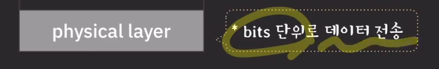

- 네트워크
  - 컴퓨터나 기타 기기들이 리소스를 공유하거나 데이터를 주고 받기 위해 유선 혹은 무선으로 연결된 통신 체계
  - 기능들
    - 애플리케이션 목적에 맞는 통신 방법 제공
    - 신뢰할 수 있는 데이터 전송 방법 제공
    - 네트워크 간의 최적의 통신 경로 결정
    - 목적지로 데이터 전송
    - 노드 사이의 데이터 전송
  - 통신 기능이 제대로 동작하기 위해서는 참여자들 사이에 약속된 통신 방법이 있어야 한다.
    - 네트워크 프로토콜
      - 네트워크 통신을 하기 위해서 통신에 참여하는 주체들이 따라야 하는 형식,절차,규약
    - 이 모든 기능을 단 하나의 프로토콜로 구현할 수 없다.
      - 모듈화
        - 어떻게 모듈화 할 것인가
        - 각 기능이 계층별로 동작하는 것 같다.
      - 그렇게 해서 나온 것이 OSI model (7 layer) : 범용적인 네트워크 구조
      - TCP/IP stack(4 layer)
        - 인터넷에 특화된 네트워크 구조

---

## OSI 7 layer

- 각 레이어에 맞게 프로토콜이 세분화돼서 구현
- 각 레이어의 프로토콜은 하위 레이어의 프로토콜이 제공하는 기능을 사용하여 동작

 

- application layer
  - 
- presentation layer
  - 
- session layer
  - 
- transport layer
  - 
- network layer
  - 
- data link layer
  - 
- physical layer
  - 

---

---
## 예제) 유튜브 채널에 댓글 작성
- 애플리케이션 레이어에서 작성한 정보를 헤더에 담아 프레젠테이션 레이어로 보냄
  - 
- 프레젠테이션 레이어에서도 정보를 헤더에 담아서 세션 레이어로 보냄
- 세션 레어어에서도 정보를 헤더에 담아서 쌓인 헤더 전체를 트랜스포트 레이어로 내려 보냄
- 트랜스포트 레이어는 실제로 어플리케이션 간의 데이터 통신을 담당하기 때문에 목적지 어플리케이션까지 데이터를 보내기 위해 필요한 여러 정보들을 헤더에 담고 네트워크 레이어로 내림
- 네트워크 레이어는 네트워크 안에서 실행되고 있는 호스트 사이의 통신을 담당하기 때문에 복잡한 네트워크에서 어떻게 목적지 호스트로 보낼 것인지를 해결해줘야 함. 
  - 그렇게 하기 위해서 목적지의 IP주소를 확인하고 어디로 데이터를 보내야 하는지 결정을 하게 됨
  - 정보를 담아 헤더에 담고 데이터 링크 레이어에 담음
  - 
- 데이터 링크 레이어도 담아서 피지컬 레이어로 담음
- 피지컬 레이어는 받은 헤더를 비트 단위로 라우터로 전송함
  - 
- 이 `라우터`의 피지컬 레이어 에서는 비트 단위로 전송받은 데이터를 헤더 모습으로 만든 뒤 데이터 링크 레이어로 올려줌
- 데이터 링크 레이어 에선 헤더를 확인해 이것저것 처리를 하고 데이터 링크 부분의 헤더는 떼어내고 네트워크 레이어로 올려줌
- 네트워크 헤더에 있는 목적지 IP 주소 정보를 받고, 어디로 요청을 보내야 할지 확인 후 다시 데이터 링크 레이어로 내려줌
  - 
- 데이터 링크 레이어에선 위 두 노드 사이의 연결을 맡는다. 정보를 담아 헤더에 붙인 후 피지컬 레이어로 내림
- 피지컬 레이어는 다음 라우터로 비트 단위로 보냄
- (반복)
- 그 다음 유튜브 호스트 서버에게 비트로 이뤄진 헤더 데이터를 보냄
- 이 데이터를 헤더를 분해하며 쭉쭉 올그렇게 처음 댓글 정보를 꺼냄

---
