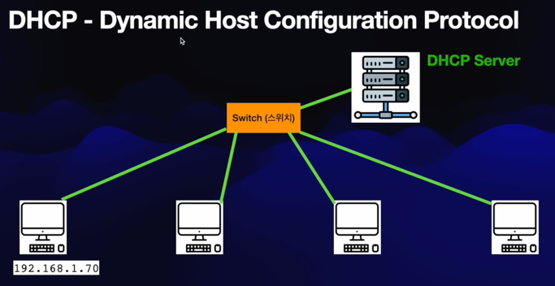

## IPv4 Address

### Class A Network

### Class B Network

### Class C Network

---

## IPv4 Address Subnet Mask

### 서브네팅

 

- .0과 .255는 사용 못함

 

## 클래스 C 네트워크 서브네팅

## Public vs Private IPv4 주소

 

- 그래서 만약 private ip를 가지는 컴퓨터를 사용한다면 ip 패킷을 해당 public ip를 갖는 라우터 등에 전달을 함. 그럼 그 라우터가 인터넷과 연결됨

 

 

- private ip는 위치정보가 없기에 외부에서 접근 못하는 문제 가짐

## IP 할당 - Static vs DHCP
- DHCP를 사용한다는 것은 IP 주소가 자동으로 할당된다는 것
- 라우터는 DHCP를 사용하지 않고 , static으로, 이미 메뉴얼로 설정이 되어 있음
  - 그 이유는 라우터는 ip주소가 딱 정해져 있어야 그 라우터로 인터넷을 이용할 수 있으니..

 

