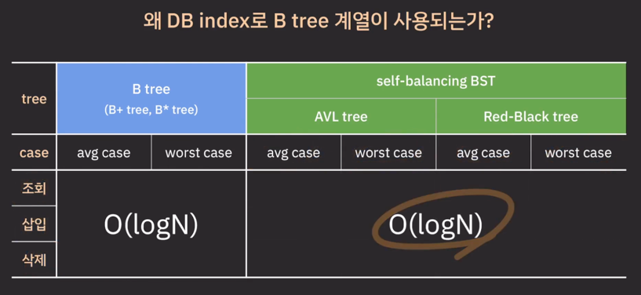
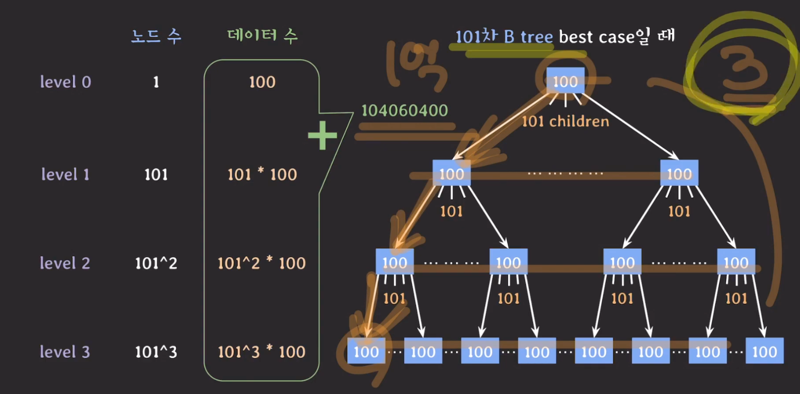
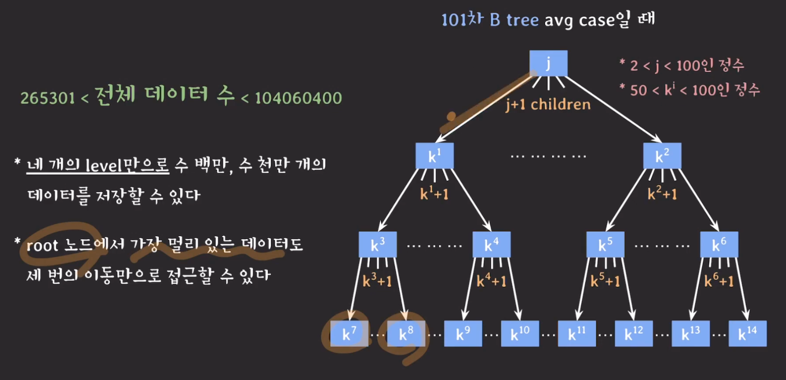

---

 

---
- AVL tree index(b)와 B tree index(b)로 탐색했을 때의 비교
  - 
    - 루트 노드의 데이터만 메모리에 올라와 있는 상태
- AVL tree index(b)
  - 
  - 
  - 
  - 
- 5차 B tree index(b)
  - 
  - 
  - 
- 비교
  - 
  - 
  - 
  - 
    - 필요없는 데이터
      - 
    - 사용될 양이 충분한 데이터
      - 
---
- B tree의 강력함
  - 
    - 
  - 
    - 
  - 

---
- B tree 계열을 DB 인덱스로 사용하는 이유
  - 
- hash index를 쓰는건?
  - 