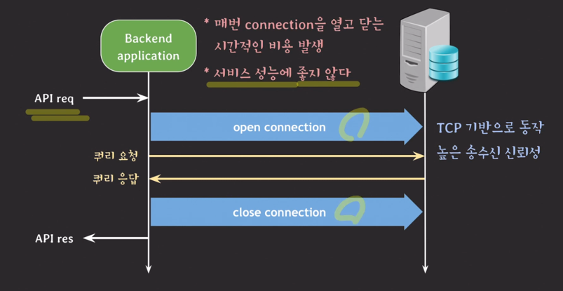
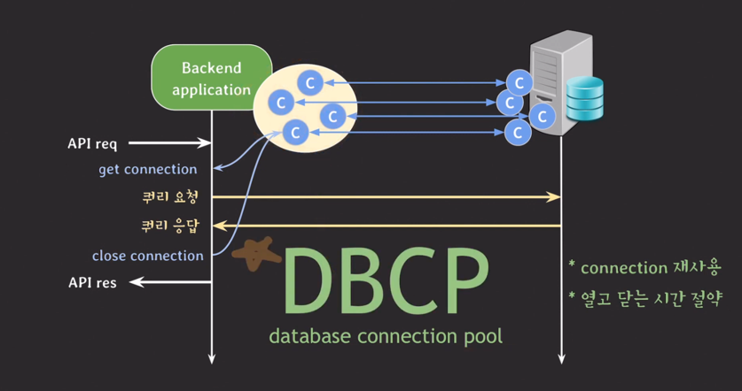
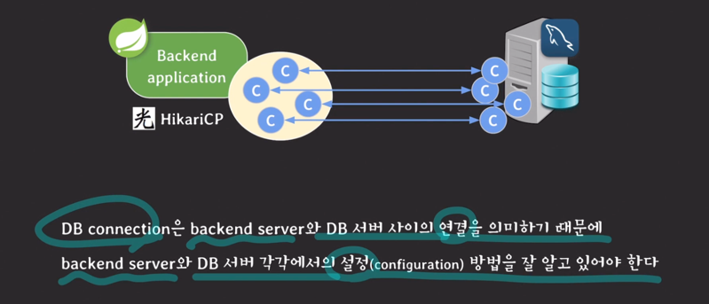
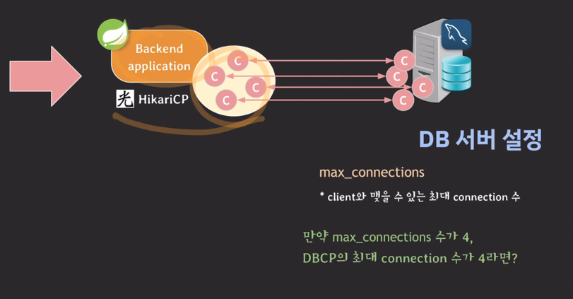
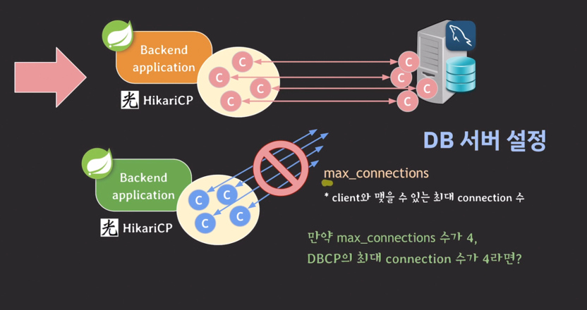
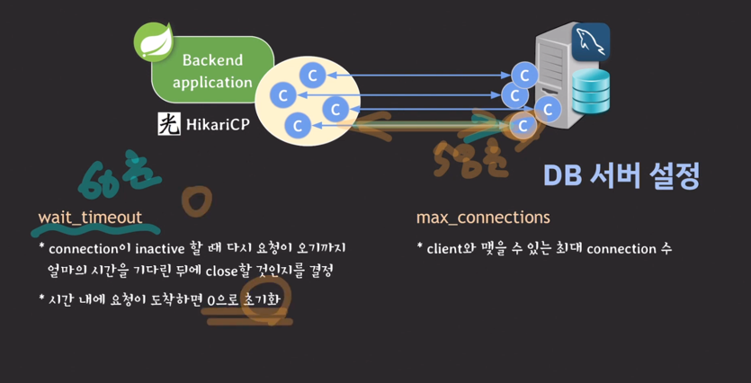
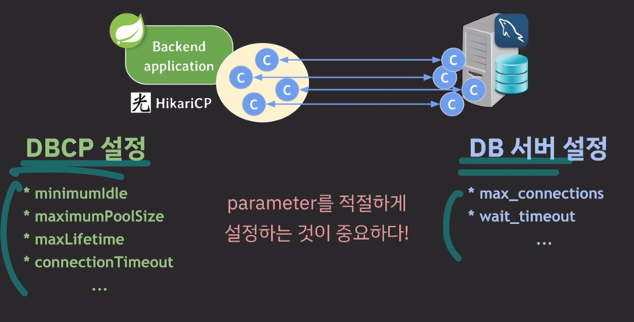
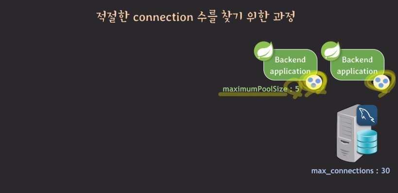
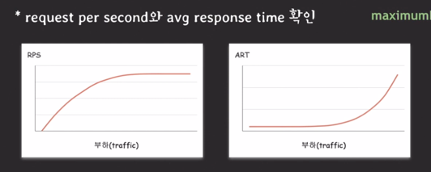

---
## DBCP 설정 방법, HikariCP, Mysql 기준

### DB 서버 설정
- max_connections
  - max_connections 를 4로 맞춰놨는데 백엔드 서버에 성능적으로 무리가 감
    - 
  - 그래서 백엔드 서버 하나 더 추가
    - 하지만 새로운 백엔드 서버가 실행되어 커넥션을 맺으려해도 max_connection가 4라서 연결을 못함
      - 
- wait_timeout
  - DB 서버 입장에서 x초 동안 아무런 연결이 안오면 끊어버림
    - 

### 백엔드 서버 DBCP 설정
- minimunIdle
  - pool에서 유지하는 최소한의 idle connection 수
  - idle connection 수가 minimumIdle보다 작고, 전체 connection 수도 maximumPoolSize보다 작다면 신속하게 추가로 connection을 만든다.
    - 만약 minimumIdle이 2, maximumPoolSize가 4라면?
      - 처음엔 두개의 커넥션만 존재
      - 한 개의 요청을 처리하느라 커넥션 하나가 사용됨
        - 이 순간 idle의 수는 1개가 됨
      - 그런데 minimumIdle은 2이므로 추가적으로 하나의 커넥션 만듬
      - 이제 3개가 됐는데, 그중에 하나 더 사용해서 2개 사용, 1개 미사용임
        - 이때도 idle의 수가 1개이므로 minimumidle=2 보다 작기때문에 하나의 커넥션 또 만듬
      - 이제 4개가 됐는데, 그중에 하나 더 사용해서 3개 사용, 1개 미사용임
        - 이번에도 minimumidle 보다 작아져서 연결 하나를 더 추가해줘야될 것 같지만, maximumPoolSize=4 이기때문에 추가하지 않음
      - 다 연결이 끝나서 돌아오면, 4개중에 2개를 끊어줌(minimumIdle)
  - 디폴트 권장 값은 maximumPoolSize와 동일 (=pool size 고정)
    - maximumPoolSize보다 작으면 커넥션을 또 생성하는 비용이 생기니.. ㅇㅇ
- maximunPoolSize
  - pool이 가질 수 있는 최대 connection 수
  - idle과 active(in-use) connection 합쳐서 최대 수
- maxLifetime
  - 풀에서 커넥션의 최대 수명
  - maxLifetime을 넘기면 idle일 경우 pool에서 바로제거, active인 경우 pool로 반환된 후 제거
  - 풀로 반환이 안되면 maxLifetime은 동작하지 않음
    - 그래서 wait_timeout이 지나면 exception 반환
  - DB의 connection time limit보다 몇 초 짧게 설정해야 한다.
    - 만약 DB의 wait_timeout이 60초, DBCP의 maxLifetime이 60초라면?
    - 요청이 와서 59초에 연결을 맺으려고 시도함
    - DB서버에 쿼리를 날리다가 60초 넘으면 wait timeout 발동해서 커넥션 끊김
- connectionTimeout
  - 풀에서 connection을 받기 위한 대기 시간
  - 만약 connectionTimeout이 30초라면?
    - 커넥션 풀의 모든 커넥션이 active인 상태
    - 커넥션이 다 사용중이라 기다려야함
    - 어떤 요청들은 받겠지만 다른 요청들은 기다리다가 connectionTimeout 지나면 끊김

---

---
## 적절한 커넥션 수를 찾기 위한 과정
- 
- 트래픽이 더 생길 것 같은데 이 설정으로 가능할까?
  - 모니터링 환경 구축(서버 리소스, 서버 스레드 수, DBCP 등등)
  - 백엔드 시스템 부하 테스트
  - request per second 와 avg response time을 확인
    - 
  - 백엔드 서버, DB 서버의 CPU, MEM 등등 리소스 사용률 확인
    - 백엔드 서버의 CPU/MEM 사용량이 너무 높았다면
      - 백엔드 서버를 스케일 아웃
    - DB 서버의 CPU/MEM 사용량이 너무 높았다면
      - select문이 많아서 그렇다면 레플리케이션 도입
      - db와 백엔드 서버 사이에 캐시 레이어를 도입하여 부하 낮춰줄 수도 있고
      - 샤딩을 할 수도 있음
    - 백엔드 서버도 괜찮고 DB 서버도 괜찮음
      - 그래프가 가파라지는 포인트에서
      - thread per request 모델이라면, 스레드 수가 병목현상의 원인이 될 수도 있음
        - 스레드가 5/5 라면 스레드 풀을 좀 늘려주고, 50/100 이 active 스레드라면 널널한데, 왜 전체 처리량이 안좋은걸까?
      - 이땐 DBCP의 active connection 수 확인
        - maximumPoolSize가 5개일때, active가 5개라면?
        - maximumPoolSize를 늘리면서 테스트
        - maximmumPoolSize를 늘리다가 max_connection와 같은 값이 됐는데도 괜찮다? 그럼 max_connection값도 올리면서 테스트
        - 
