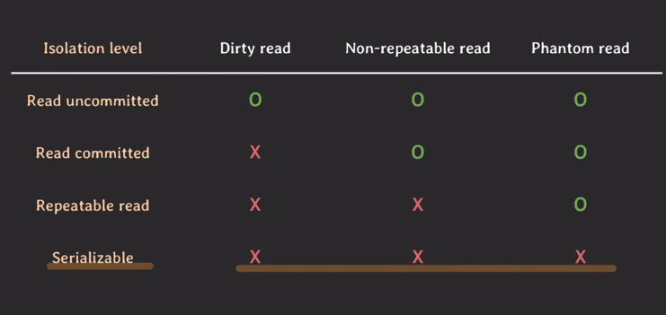

## 트랜잭션들이 동시에 실행될 때 발생 가능한 이상 현상들, isolation level

- Dirty read
  - 커밋되지 않은 변화를 읽음
- Non-repeatable read
  - 한 트랜잭션 내에서 같은 데이터의 값이 달라짐 (처음 읽을 땐 1, 두번째 읽었더니 2)
- Phantom read
  - 없던 데이터가 생김 (값이 10인 row를 읽었는데 두번째 읽으니 10인 row의 수가 늘어남)

---
- 이러한 이상한 현상들이 모두 발생하지 않게 만들 수 있지만 그러면 제약사항이 많아져서 동시 처리 가능한 트랜잭션 수가 줄어들어 결국 DB의 전체 처리량이 하락하게 된다.
  - isolation level
    - 일부 이상한 현상은 허용하는 몇 가지 level을 만들어서 사용자가 필요에 따라서 적절하게 선택할 수 있도록 하자

 

- 애플리케이션 설계자는 isolation level을 통해 전체 처리량과 데이터 일관성 사이에서 어느 정도 거래를 할 수 있다.
- Drity write
  - 커밋이 안된 데이터를 write 함
  - 롤백시 정상적인 recovery는 매우 중요하기 때문에 모든 isolation level에서 dirty write를 허용하면 안된다.
- Lost update
  - 업데이트를 덮어 

---
