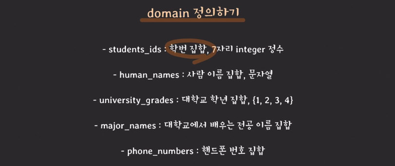
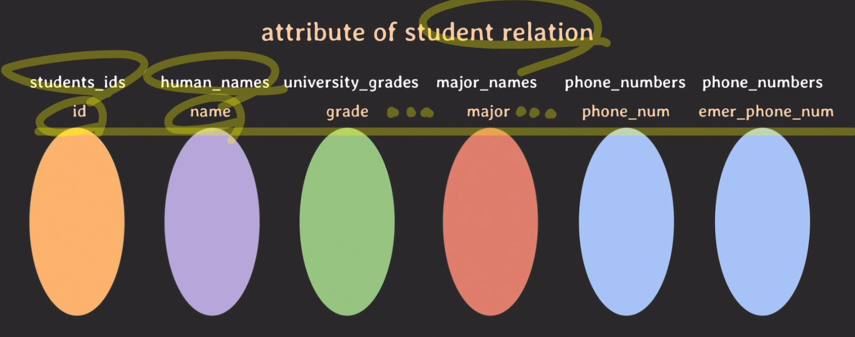
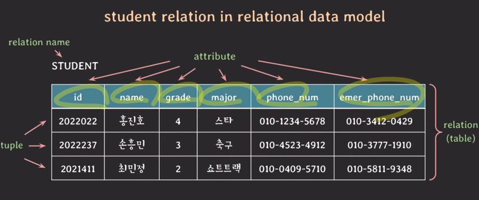
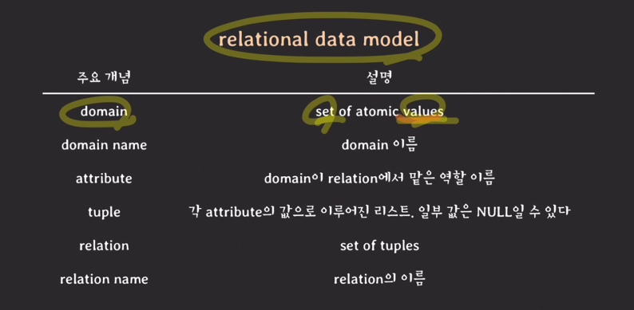
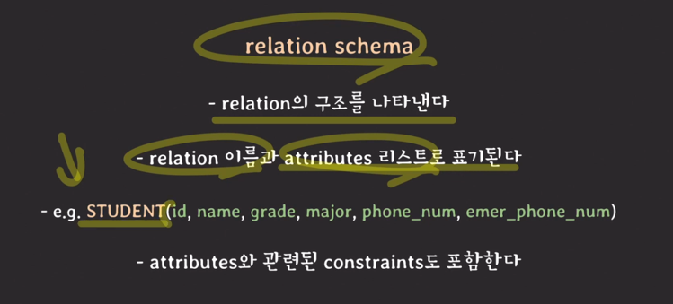
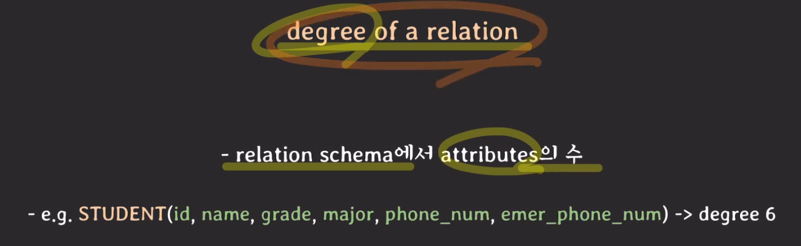
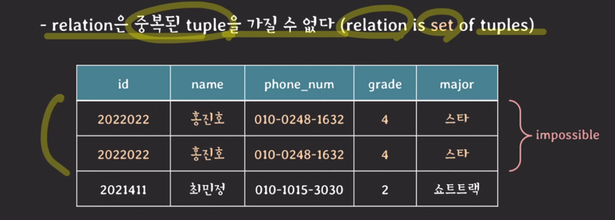

- set
  - 서로 다른 elements를 가지는 collection
  - 하나의 set에서 elements의 순서는 중요치 않다.
- relational data model
  - student relation을 예를 들어 이해해보자
  
  
  
  
  
  
- relational database
  - relational data model에 기반하여 구조화된 database
  - relational database는 여러 개의 relations로 구성된다
- relation의 특징들
  
  
  
  
  
  
- NULL의 의미
  - 값이 존재하지 않는다.
  - 값이 존재하나 아직 그 값이 무엇인지 알지 못한다.
  - 해당 사항과 관련이 없다.
- keys
  - superkey
    - realtion에서 튜플을 unique하게 식별할 수 있는 attributes set
  - candidate key
    - 어느 한 attribute라도 제거하면 unique하게 tuples를 식별할 수 없는 super key
    
  - primary key
    - relation에서 튜플을 unique하게 식별하기 위해 선택된 candidate key
    - 보통 attribute의 조합의 수가 적은걸 pk로 설정
    
  - unique key
    - primary key가 아닌 candidate keys, alternate key
    
  - foreign key
    - 다른 relation의 pk를 참조하는 attributes set
    
- constraints
  - relational database의 relation들이 언제나 항상 지켜줘야 하는 제약 사항
  - implicit constraints
    - relational data model 자체가 가지는 constraints
      - relation은 중복되는 tuple을 가질 수 없다.
      - relation 내에서는 같은 이름의 attribute를 가질 수 없다.
  - schema-based constrains
    - 주로 DDL을 통해 schema에 직접 명시할 수 있는 constraints
    - domain constraints
      - attribute의 value는 해당 attribute의 domain에 속한 value여야 한다.
    - key constraints
      - 서로 다른 tuples는 같은 value의 key를 가질 수 없다.
    - NULL value constraint
      - attribute가 NOT NULL로 명시됐다면 NULL을 값으로 가질 수 없다.
    - entity integrity constraint
      - pk는 value에 NULL을 가질 수 없다.
    - referential integrity constraint
      - FK와 PK와 도메인이 같아야 하고 PK에 없는 values를 FK가 값으로 가질 수 없다.