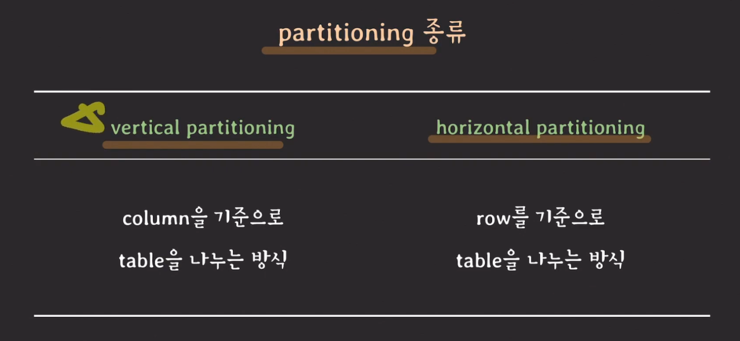
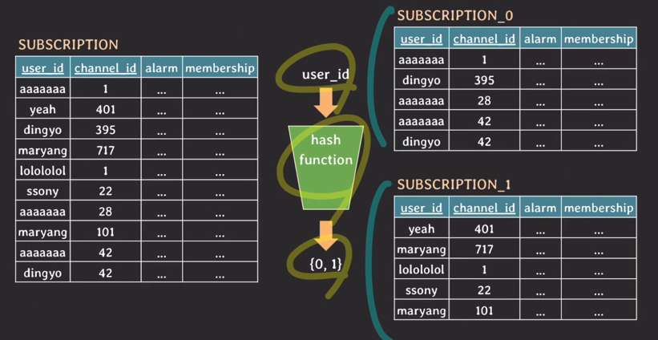
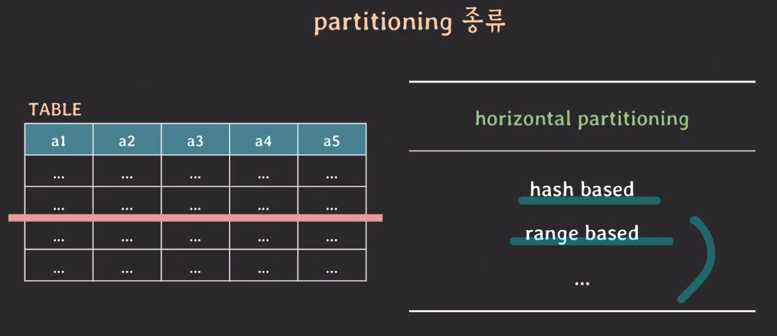
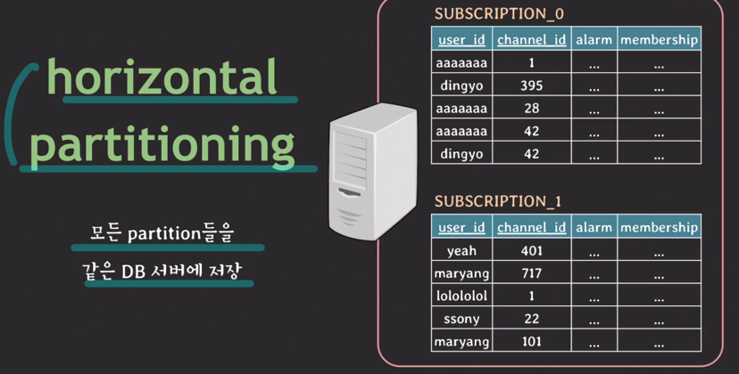
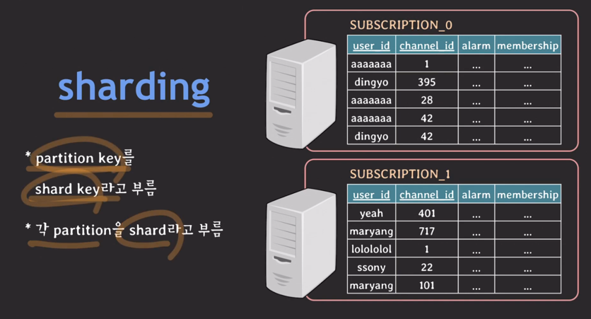
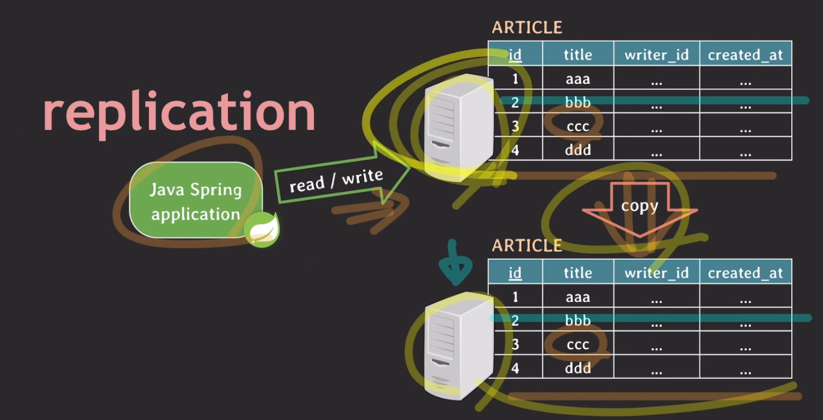
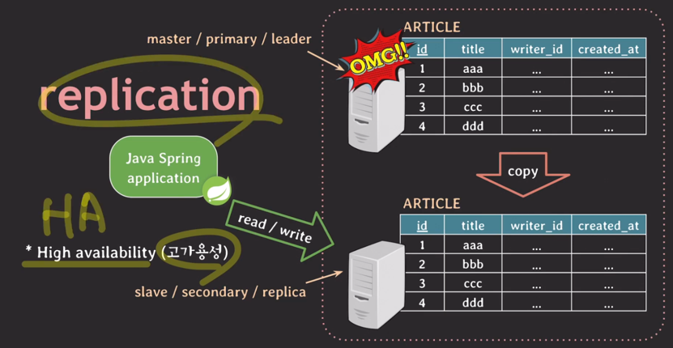
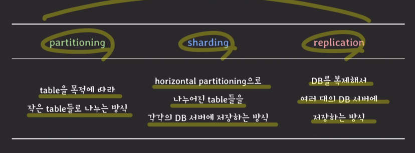

- 파티셔닝
  - 데이터 베이스 테이블을 더 작은 테이블들로 나누는 것
  - 
    - vertical partitioning
      - 정규화도 vertical partitioning
      - 컬럼의 값의 크기가 매우큰 경우 그 컬럼만 따로 vertical partitioning을 통해 떼어낼 수 있다.
      - 자주 사용하는 컬럼들 끼리도 모을 수 있음]
    - horizontal partitioning
      - 스키마는 안바꿈
      - 테이블의 크기가 커질수록 인덱스의 크기도 커진다.
        - 읽기 쓰기가 있을때마다 인덱스에서 처리되는 시간도 조금씩 늘어난다.
        - 이때 horizontal partitioning을 사용
          - 해쉬 based으로 가장 많이 사용
            - 
            - 가장 많이 사용될 패턴에 따라 파티션 key를 설정하는 것이 중요
            - 데이터가 균등하게 분배될 수 있도록 hash function을 잘 정의하는 것도 중요
            - 해쉬 based horizontal partitioning은 한번 파티션이 나눠져서 사용되면 이후에 파티션을 추가하기 까다롭다
      - 

---
- 샤딩
  - horizontal partitioning처럼 동작
  - 각 파티션이 `독립된 DB 서버`에 저장
  - 
    - 하드웨어 이슈
  - 

---
- 레플리케이션
  - 
  - 

---
