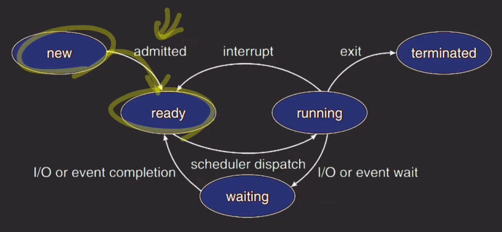

- OS에서 프로세스의 상태

- new에서 바로 ready로 감(보통)
- `ready`는 cpu에서 실행되기 위해 기다리는 상태 
- 스케쥴러에 의해 cpu에서 실행됨, `running` 상태
  - 할당된 타임 퀀텀 다 쓰면 `ready` 상태로 돌아옴
- IO 작업 or 임계구역에 들어가고 싶어서 락 획득 대기하는 상황에서 `waiting` 상태로 들어감.
  - 위 작업이 끝나면 다시 `ready` 상태로 돌아감
- terminated 상태가 되려면 running 상태를 거친다

---
- 자바 스레드의 상태 종류 (6)
  - NEW
    - 자바 스레드가 아직 시작하지 않은 상태
  - RUNNABLE
    - 실행 중인 상태
    - 다른 리소스를 기다리는 상태도 포함(OS 프로세스의 ready 상태)
  - `BLOCKED`
    - 모니터 락을 얻기 위해 기다리는 상태
    - 임계 구역으로 들어가려고 모니터 락을 얻기 위해 기다리는 상태
  - `WAITING`
    - 다른 스레드를 기다리는 상태
      - Object.wait
      - Thread.join ...
  - TIMED_WAITING
    - 제한시간을 두고 다른 스레드를 기다리는 상태
      - Object.wait with time out
      - Thread.join with time out
      - Thread.sleep ...
  - TERMINATED
    - 실행 마치고 종료된 상태

 

- java thread dump
  - thread dump : 실행 중인 자바 프로세스의 현재 상태를 담은 스냅샷
    - 프로세스의 상태 정보 볼 수 있음