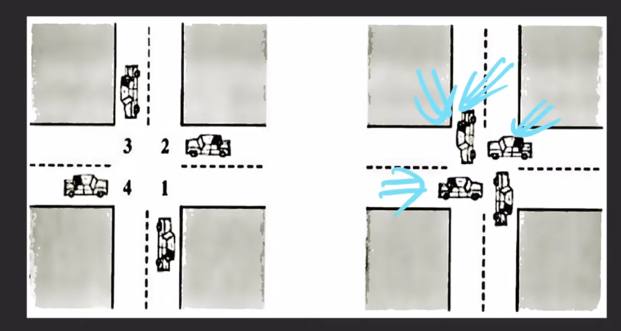

- 데드락(교착상태)
  - 두 개 이상의 프로세스 혹은 스레드가 서로가 가진 리소스를 기다리는 상태
- 데드락을 만드는 네 가지 조건
  - 상호 배제 (Mutual exclusion)
    - 리소스를 공유해서 사용할 수 없다.
  - 선점 대기 (Hold and wait)
    - 프로세스가 이미 하나 이상의 리소스를 취득한 상태에서 다른 프로세스가 사용하고 있는 리소스를 추가로 기다린다. (wait)
  - 비 선점 (No preemption)
    - 리소스 반환은 오직 그 리소스를 취득한 프로세스만 할 수 있다.
  - 원형 대기 (Circular wait)
    - 프로세스들이 순환형태로 서로의 리소스를 기다린다.

---
- OS의 데드락 해결 방법
  - 데드락 방지
    - 네 가지 조건 중 하나가 충족되지 않게 시스템을 디자인
    1. [상호 배제] 리소스를 공유하게 함 (현실적으로 불가능, 동시성 문제 발생함)
    2. [선점 대기] 사용할 리소스들을 모두 획득한 뒤에 시작 or 리소스를 전혀 가지지 않은 상태에서만 리소스 요청(리소스 사용 효율 떨어짐, 기아 현상 가능)
    3. [비 선점] 추가적인 리소스를 기다려야 한다면 이미 획득한 리소스를 다른 프로세스가 선점 가능하도록 함 (컨텍스트 스위칭과 유사)
    4. [원형 대기] 모든 리소스에 순서 체계를 부여해서 오름차순으로 리소스를 요청 (가장 많이 사용 됨)
  - 데드락 회피
    - 실행 환경에서 추가적인 정보를 활용해서 데드락이 발생할 것 같은 상황을 회피하는 것
    - 뱅커 알고리즘
      - 리소스 요청을 허락해줬을 때 데드락 발생 가능성이 있다면, 리소스를 할당해도 안전할 때 까지 계속 요청을 거절하는 알고리즘
  - 데드락 감지와 복구
    - 일단 데드락을 허용하고 데드락이 발생하면 복구하는 전략
    - 복구 방법
      1. 프로세스를 종료한다. (순차적으로 종료도 가능), (리스크가 큼, 최후의 카드)
      2. 리소스의 일시적인 선점을 허용한다. 
  - 데드락 무시
    - 아몰랑 개발자가 알아서 하겠지

---

- 프로그래밍 레벨에서 데드락

- lock1, lock2는 뮤텍스 락
- t1, t2가 서로가 있는 임계구역에 진입하기 위해 기다림으로써 데드락 발생

- 해결법
  - t1혹은 t2의 획득 락 순서를 변경해 원형 대기를 없앤다
  - lock1과 lock2를 서로 다른 블록에서 실행해 선점 대기를 없앤다.