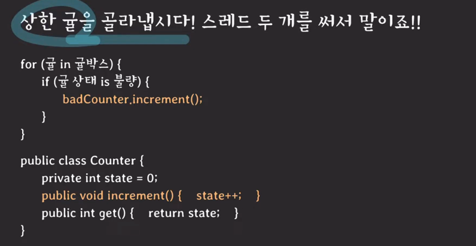

- 하나의 객체를 두 개의 스레드가 접근할 때 생긴 일

badCounter는 두 스레드가 공유.

- 이 상태일 때 메모리
  - 두 스레드가 공유하는 힙 영역에 state=0이 존재
  - state++ 가 CPU 영역에선 어떻게 실행될까
    - 프로그래밍 언어는 CPU가 이해할 수 있는 명령어로 변환해야 함.
      - LOAD state to R1
      - R1 = R1 + 1
      - STORE r1 to state
    - 스레드 T1이 increment()에 먼저 접근
      - R1에 LOAD 함 (R1 = R1 + 1)
    - 이때 컨텍스트 스위칭이 발생하면?
      - 스레드 T2가 increment()에 접근
      - state는 아직 0
      - R1에 1 더해서 로드
      - state엔 1로 바뀜.
    - 다시 컨텍스트 스위칭이 발생해 T1으로 돌아옴
      - 아까 진행을 이어서 STORE 명령부터 실행함
      - 메모리의 state는 지금 1
      - 아까 R1에 1을 저장해두었으니까 STORE로 아까 저장한 R1(1)을 state에 저장함. (STORE r1 to state)
    - 최종적으로 두 스레드가 한번씩 increment()를 호출했지만 state = 1
  - `언제 컨텍스트 스위칭이 일어나느냐에 따라 결과가 달라질 수 있음 !`

- race condition(경쟁 조건)
  - 여러 프로세스/스레드가 동시에 같은 데이터를 조작할 때 타이밍이나 접근 순서에 따라 결과가 달라질 수 있는 상황
- 동기화 (synchronization)
  - 여러 프로세스/스레드를 동시에 실행해도 공유 데이터의 일관성을 유지하는 것

- 어떻게 동기화 시킬 것인가?
  - increment()를 한 스레드에서만 실행할 수 있도록 만듬

- critical section(임계 영역)
  - 공유 데이터의 일관성을 보장하기 위해 하나의 프로세스/스레드만 진입해서 실행 가능한 영역
  - critical section에 진입하기 전에 요건을 검사하고
  - 조건이 맞으면 들어가서 작업을 함.
  - 빠져나올 때 처리를 하고 나옴
- critical section problem의 해결책이 되기 위한 조건
  - mutual exclusion (상호 배제)
    - 한번에 하나의 스레드만 임계 영역에서 실행 가능함
  - progress (진행)
    - 만약에 임계 구역이 비어있고, 어떤 프로세스나 스레드들이 이 임계구역에 들어가기를 원한다면, 그 중에 하나는 임계구역에서 실행될 수 있도록 해야 한다.
  - bounded waiting (한정된 대기)
    - 임계구역 가려고 무한정 대기하면 안됨

- Thread-unsafe를 조심하자
  - 