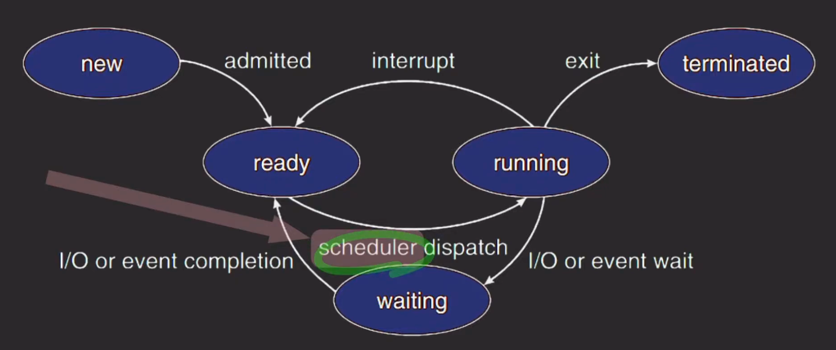

- 스케쥴러는 CPU가 놀지 않도록 프로세스를 선택하는 역할을 한다.
- ready 상태인 프로세스들을 모아둔 ready 큐
  - 스케쥴러는 레디 큐에서 다음 실행될 프로세스를 선택

- 디스페쳐
  - 스케쥴러에 의해 선택된 프로세스를 실행할 수 있도록 만드는 역할을 한다.
    - 컨텍스트 스위칭
    - 커널 모드 -> 유저모드로 전환시키는 일
    - 실행되어야 할 적절한 위치로 새로 선택된 프로세스를 이동시키는 역할

---

- 스케쥴링의 선점 방식
- 선점형 스케쥴링
  - 기본적으로 비 선점형 스케쥴링이 하는 일은 다 한다.
  - OS가 강제로 running 상태의 프로세스를 중단함.
  - 우선순위가 더 높은 프로세스가 있다면 더 낮은 프로세스 멈춰버리고 강제로 레디 상태로 바
  - 적극적, 강제적, 빠른 응답성, 데이터 일관성 문
- 비 선점형 스케쥴링
  - running에서 terminated/waiting/ready로 갈 수 있게함
    - 즉, 프로세스가 자발적으로 실행을 중단하는 것
    - OS가 강제하는 것 없음
  - 신사적, 협력적, 느린 응답성

---

- 스케쥴링 알고리즘
  - FCFS 
    - 먼저 도착한 순서대로 처리
  - SJF
    - 다음 CPU burst가 가장 짧은 프로세스부터 실행
  - SRTF
    - 남은 CPU burst가 가장 짧은 프로세스부터 실행 (하지만 선점형)
  - Priority
    - 우선순위가 높은 프로세스부터 실행
  - Round Robin
    - time slice로 나눠진 CPU time을 번갈아가며 실행
  - Multilevel queue
    - 프로세스들을 그룹화해서 그룹마다 큐를 두는 방식