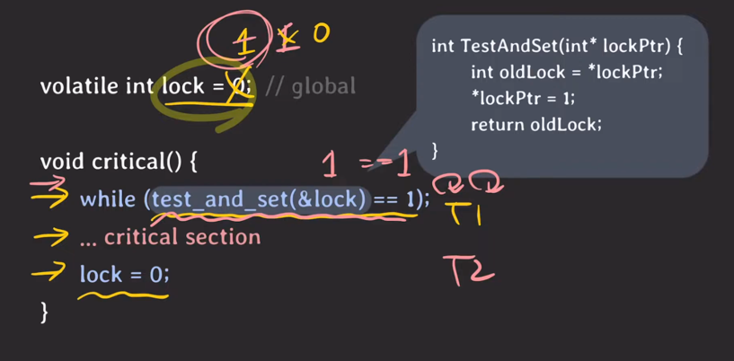
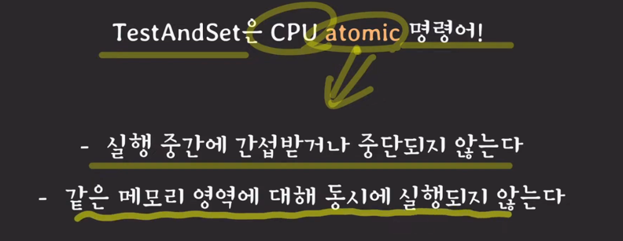
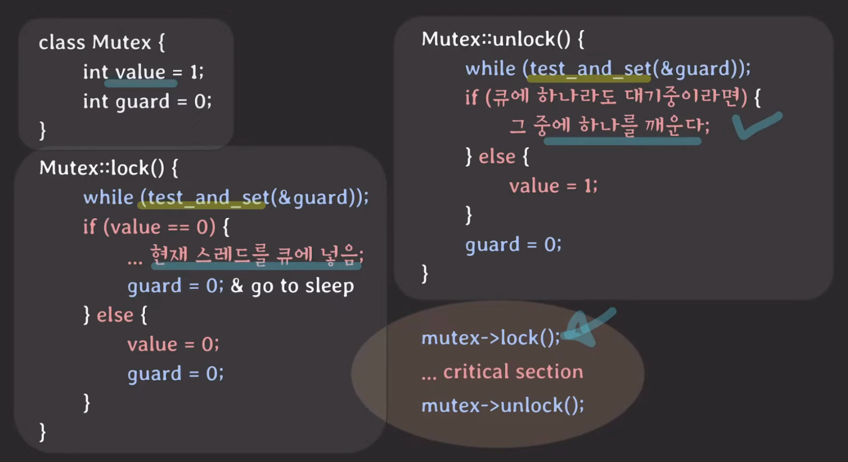
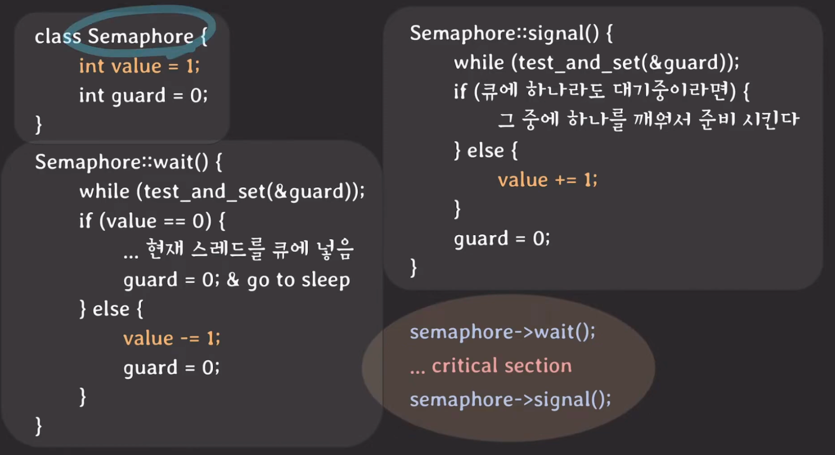

- 경쟁 조건 
  - 여러 프로세스/스레드가 동시에 같은 데이터를 조작할 때 타이밍이나 접근 순서에 따라 결과가 달라질 수 있는 상황
- 동기화
  - 여러 프로세스/스레드를 동시에 실행해도 공유 데이터의 일관성을 유지하는 것
- 임계 영역
  - 공유 데이터의 일관성을 보장하기 위해 하나의 프로세스/스레드만(상호 배제) 진입해서 실행 가능한 영역

- 어떻게 상호 배제(mutual exclusion)를 보장할 수 있을까?
  - 락을 사용하자.

CPU레벨에서 막기때문에 멀티 코어 상황에서도 동기화 가능(TestAndSet())

- 스핀락(위 사진과 같은 형태)
  - 락을 가질 수 있을 때 까지 반복해서 시도
  - 단점
    - 락을 기다리는 동안 CPU를 낭비함

---

- 뮤텍스
  - 락을 가질 수 있을 때 까지 휴식
  - 스핀락보다 항상 좋은걸까?
    - 멀티 코어 환경이고, 임계 영역에서의 작업이 컨텍스트 스위칭보다 더 빨리 끝난다면 스핀락이 뮤텍스보다 더 이점이 있다.
      - 뮤텍스는 락 기다리는 동안 잠드는데, 이를 깨울때 컨텍스트 스위칭이 발생함
      - 싱글 코어에선 이점이 없음 -> 스핀락에서도 어떻게든 컨텍스트 스위칭이 발생함

- 세마포어
  - signal mechanism을 가진, 하나 이상의 프로세스/스레드가 임계영역에 접근 가능하도록 하는 장치
  - 뮤텍스와 이진 세마포어는 같은 것 아닌가?
    - 뮤텍스는 락을 가진 자만 락을 해제할 수 있지만 세마포어는 wait를 하는 존재와 signal을 날리는 존재가 다를 수 있다.
- 상호 배제만 필요하다면 뮤텍스를, 작업 간의 실행 순서 동기화가 필요하다면 세마포어를 권장한다.