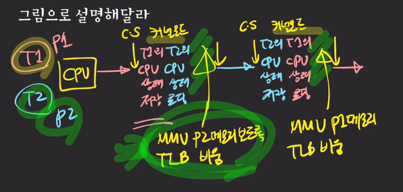

- 컨텍스트 스위칭
  - CPU/코어에서 실행 중이던 프로세스/스레드가 다른 프로세스/스레드로 교체되는 것
  - 컨텍스트란?
    - 프로세스/스레드의 상태, CPU(레지스터), 메모리 등등
  - 필요한 이유
    - 여러 프로세스/스레드를 동시에 실행시키기 위해서
  - 언제 발샐하는가
    - 주어진 time slice(quantum)를 다 사용했거나 IO 작업을 해야하거나 다른 리소스를 기다려야 하거나
  - 누구에 의해 실행되는가
    - OS 커널에 의해 실행된다. (각종 리소스를 관리/감독하는 역할)
  - 구체적으로 어떤 과정으로 일어나는가?
    - 다른 프로세스끼리 스위칭인지(process context switching)
    - 같은 프로세스의 스레드들끼리 스위칭인지(thread context switching)에 따라 다르다.
    - 공통점
      - 커널 모드에서 실행
      - CPU의 레지스터 상태를 교체 (어디까지 진행됐는지 상황을 저장해야 됨)
    - 차이점
      - 프로세스 컨텍스트 스위칭은 가상 메모리 주소 관련 처리를 추가로 수행(메모리를 공유하지 않기 때문에)
    - 스레드 컨텍스트 스위칭이 더 빠른 이유
      - 메모리 주소 관련 처리는 하지 않기 때문
  - 컨텍스트 스위칭이 미치는 간접적인 영향
    - 캐시의 오염 (캐시엔 이전의 프로세스에 관한 정보가 들어있음 -> 효율 저하)
  - 유저 관점에서 컨텍스트 스위칭
    - 순수한 오버헤드

 

- 같은 프로세스의 스레드들끼리 스위칭

- 다른 프로세스끼리 스위칭

