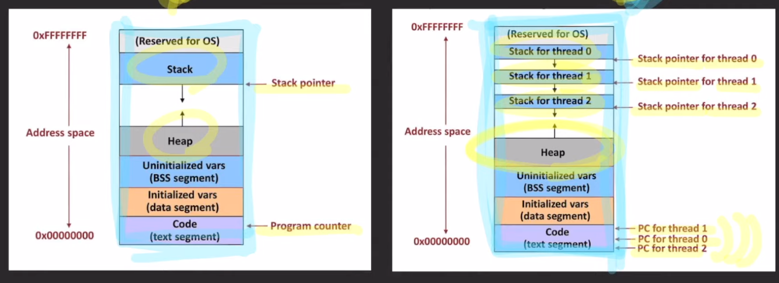

- 프로그램
  - 컴퓨터가 실행할 수 있는 명령어들의 집합
- 프로세스
  - 컴퓨터에서 실행 중인 프로그램
  - 각각의 프로세스는 독립된 메모리 공간을 할당 받음
  - 명령어들과 데이터를 가짐
- CPU
  - 명령어를 실행하는 연산 장치
- 메인 메모리
  - 프로세스가 CPU에서 실행되기 위해 대기하는 곳
- IO
  - 파일을 읽고 쓰거나, 네트워크 어딘가와 데이터를 주고 받는 것, 입출력 장치와 데이터를 주거나 받는 것

- `단일 프로세스 시스템`
  - 한 번에 하나의 프로그램만 실행됨
  - 먼저 실행되던 프로그램을 끝내고 그 다음 프로그램을 시작해야 함
  - 단점
    - CPU 사용률이 좋지 않음, IO 동안 CPU는 아무것도 하지 않게 됨.
  - 해결책 (멀티 프로그래밍)
    - 여러 개의 프로그램을 메모리에 올려놓고 동시에 실행시키자는 아이디어
    - IO 작업이 발생하면 다른 프로세스가 CPU에서 실행
- `멀티 프로그래밍`
  - CPU 사용률을 극대화 시키려는 목적
  - 단점
    - CPU 사용시간이 길어지면 다른 프로세스는 계속 대기
  - 해결책
    - 프로세스는 한번 CPU를 사용할 때 아주 짧은 시간(quantum)만 CPU에서 실행되도록 함 (`멀티 태스킹`)
    - `멀티 태스킹` -> 프로세스의 응답 시간을 최소화 시키는데 목적
  - 아쉬운 점
    - 하나의 프로세스가 동시에 여러 작업을 수행하지는 못함
    - 프로세스의 컨텍스트 스위칭은 무거운 작업
    - 프로세스끼리는 데이터 공유가 까다로움
    - 듀얼 코어(한 CPU안에 두 개의 코어)가 등장했는데 잘 쓰고 있음
  - 해결책
    - `스레드`

- `스레드`
  - 프로세스는 한 개 이상의 스레드를 가질 수 있다.
  - CPU에서 실행되는 단위
  - 같은 프로세스의 스레드들끼리 컨텍스트 스위칭은 가볍다. (+ 데이터 공유가 쉬움)
  - 스레드들은 자신들이 속한 프로세스의 메모리 영역을 공유.

- 예제
  - 코어가 두 개인 CPU와 스레드가 두 개인 프로세스가 있다면
  - 병렬적으로 한 코어는 스레드 한개, 한 코어는 스레드 한개 실행 가능 (멀티 스레딩)

- 멀티 스레딩
  - 하나의 프로세스가 동시에 여러 작업을 실행하는데 목적
  - 확장된 멀티태스킹 개념
    - 여러 프로세스와 여러 스레드가 아주 짧게 쪼개진 cpu time을 나눠 갖는것

- 멀티 프로세싱
  - 두 개 이상의 프로세서나 코어를 활용하는 시스템

- 예제
  - 싱글코어 CPU에 싱글-스레드 프로세스 두 개
    - 멀티태스킹 O (CPU는 하나의 프로세스만 견딜 수 있음)
    - 멀티스레딩 X
    - 멀티프로세싱 X (코어가 두개 이상이어야 함)
  - 싱글코어 CPU에 듀얼-스레드 프로세스 한 개
    - 멀티태스킹 O
    - 멀티스레딩 O
    - 멀티프로세싱 X (코어가 하나기 때문)
  - 듀얼코어 CPU에 싱글-스레드 프로세스 두 개
    - 멀티태스킹 X (코어 하나당 프로세스 하나 쓰면 됨)
    - 멀티스레딩 X (싱글 스레드)
    - 멀티프로세싱 O (코어 2개)
  - 듀얼코어 CPU에 듀얼-스레드 프로세스 한 개
    - 멀티태스킹 X (각 CPU가 스레드 하나씩 맡음)
    - 멀티스레딩 O (하나의 )
    - 멀티프로세싱 O (코어가 두개기 때문에)
  - 듀얼코어 CPU에 듀얼-스레드 프로세스 두 개
    - 멀티태스킹 O
    - 멀티스레딩 O
    - 멀티프로세싱 O