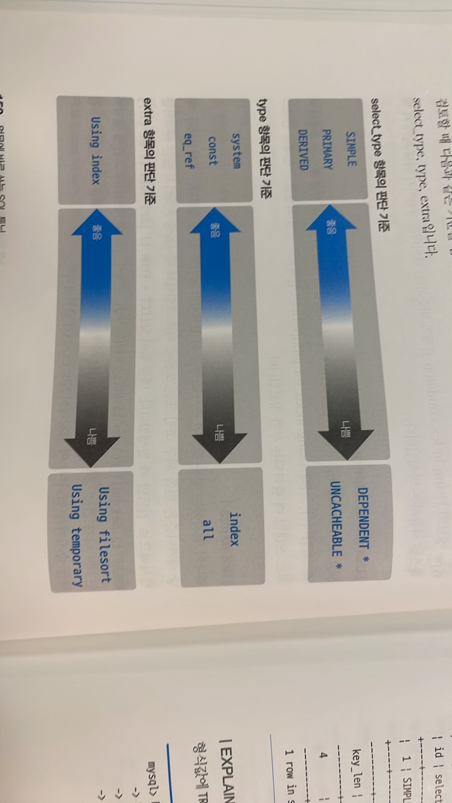

# ✍🏻 3. SQL 튜닝의 실행계획 파헤치기
# 3.2 실행 계획 수행
## 기본 실행 계획 항목 분석
### id
실행 순서를 표시하는 숫자입니다.

SQL 문이 수행되는 차례를 ID로 표기한 것으로, 조인할 때는 똑같은 ID가 표시됩니다.

### select_type
SQL문을 구성하는 SELECT 문의 유형을 출력하는 항목입니다.

SELECT문이 단순히 FROM 절에 위치한 것인지, 서브쿼리인지, UNION 절로 묶인 SELECT 문인지 등의 정보를 제공합니다.

- SIMPLE
  - UNION이나 내부 쿼리가 없는 SELECT문.
  - 단순한 SELECT 구문
- PRIMARY
  - 서브쿼리가 포함된 SQL 문이 있을 때 첫 번째 SELECT 문에 해당하는 구문에 표시되는 유형
  - 즉, 서브쿼리를 감싸는 외부 쿼리이거나, UNION이 포함된 SQL 문에서 첫 번째로 SELECT 키워드가 작성된 구문에 표시
- SUBQUERY
  - 독립적으로 수행되는 서브쿼리를 의미
- DERIVED
  - FROM 절에 작성된 서브쿼리
- UNION
  - UNION 및 UNION ALL 구문으로 합쳐진 SELECT 문에서 첫 번째 SELECT 구문을 제외한 이후의 SELECT 구문에 해다ㅏㅇ

### table
테이블 명.

테이블명이나 alias를 출력.

<derived2> 와 같은 형태로 출력되는건 조인했을 때.

### partitions
데이터가 저장된 논리적인 영역. 파티션 없다면 NULL

### type
테이블의 데이터를 어떻게 찾을지에 관한 정보. 

테이블을 처음부터 끝까지 or 인덱스를 통해 바로 찾아갈지등을 해석

- system
  - 테이블에 데이터가 없거나 한 개만 있는 경우, 성능상 최악
- const
  - 조회되는 데이터가 단 1건, 성능상 유리
- eq_ref
  - 조인이 수행될 때 드리븐 테이블의 데이터에 접근하며 고유 인덱스 또는 기본 키로 단 1건의 데이터를 조회하는 방식
- ref
  - 조인을 수행할 때 드리븐 테이블의 데이터 접근 범위가 2개 이상일 경우를 의미.
- ref_or_null
  - IS NULL 구무에 대해 인덱스를 활용하도록 최적화된 방식
- range
  - 테이블 내의 연속된 데이터 범위를 조회하는 유형
- fulltext
  - 텍스트 검색을 빠르게 하기 위해 전문 인덱스를 사용하여 데이터에 접근하는 방식
- index_merge
  - 결합된 인덱스등이 동시에 사용되는 유형
- index
  - 인덱스 풀스캔
- ALL
  - 테이블 풀 스캔
  - 활용할 수 있는 인덱스가 없거나, 인덱스를 활용하는게 오히려 더 비효율적이라고 옵티마이저가 판단했을 때
  - 전체 테이블 중 10~20% 이상 분량의 데이터를 조회할 때는 ALL이 성능상 유리할 수도 있음

### possible keys
SQL문을 최적화하고자 사용할 수 있는 인덱스 목록

### key
옵티마이저가 SQL문을 최적화하고자 사용한 기본 키 또는 인덱스 명

### key_len
인덱스의 바이트 수

### ref
테이블 조인을 수행할 때 어떤 조건으로 해당 테이블에 액세스 되었는지

### rows
SQL문을 수행하고자 접근하는 데이터의 모든 행 수를 나타내는 예측 항목

### filtered
SQL문을 통해 DB엔진으로 가져온 데이터 대상으로 필터 조건에 따라 어느정도의 비율로 데이터를 제거했는지 의미.

예를 들어 DB 엔진으로 100건의 데이터를 가져왔다고 가정하면, 이후 WHERE 절의 사원번호 between 1 and 10 조건으로 100건의 데티어가 10건으로 필터링됨.

이처럼 100건에서 10건으로 필터링 되었으므로 filtered에는 10이라는 정보가 출력.

### extra
SQL문을 어떻게 수행할 것인지에 관한 추가 정보

- Distinct
  - 중복이 제거되어 유일한 값을 찾을 때 출력되는 정보.
- Using where
  - WHERE 절의 필터 조건을 사용해 MySQL 엔진으로 가져온 데이터를 추출할 것
- Using temporary
  - 데이터의 중간 결과를 저장하고자 임시 테이블을 생성하겠다는 의미
  - 데이터를 가져와 저장한뒤 정렬하거나 중복제거하는 작업등을 수행한다.
- Using index
  - 물리적인 데이터 파일을 읽지 않고 인덱스만을 읽어서 SQL문의 요청사항을 처리할 수 있는 경우.
  - 커버링 인덱스라고 부르며, 효율적임.
- Using filesort
  - 정렬이 필요한 데이터를 메모리에 올리고 정렬을 수행한다는 의미.
- Using join buffer
  - 조인을 수행하기 위해 중간 데이터 결과를 저장하는 조인 버퍼를 사용한다는 의미.

## 좋고 나쁨을 판단하는 기준

