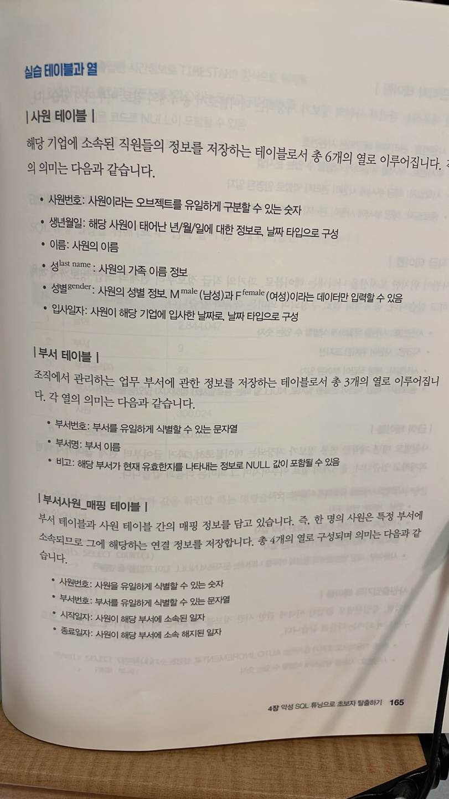
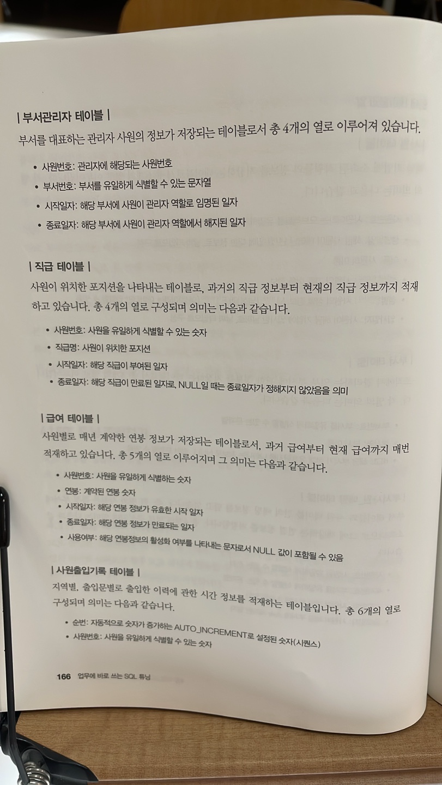
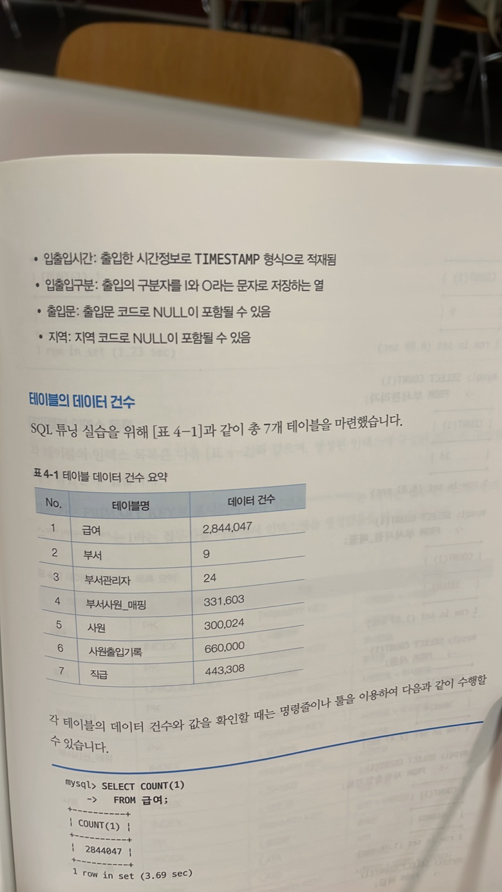
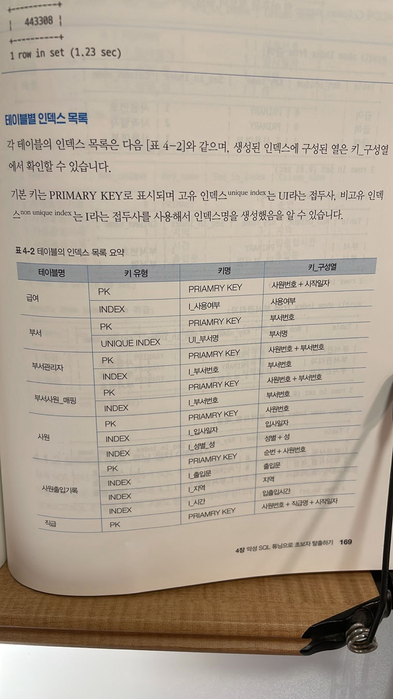
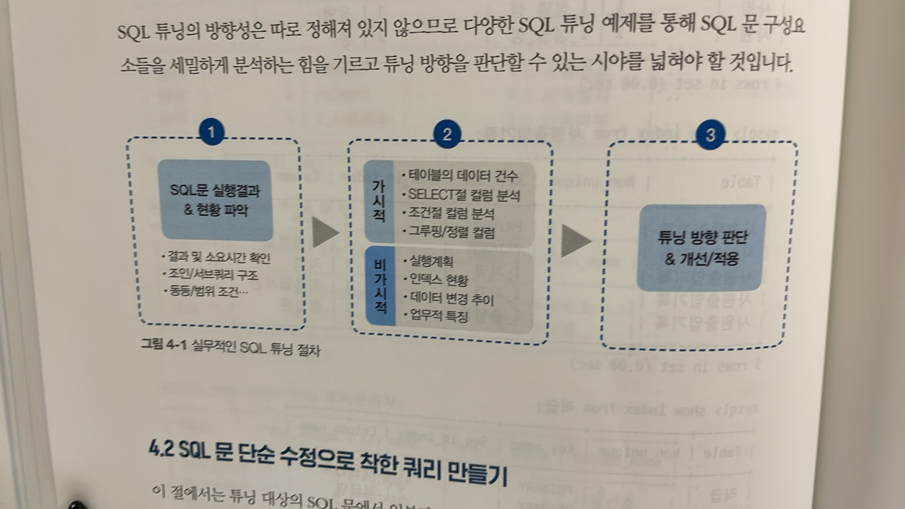

# ✍🏻 4. 악성 SQL 튜닝으로 초보자 탈출하기
# 4.1 SQL 튜닝 준비하기
## 실습 데이터 이해하기





## 실무적인 SQL 튜닝 절차 이해하기
실제 SQL 문이 주어진 상태에서 SQL 튜닝을 시작한다면 무엇부터 살펴볼지 모른다. 

튜닝 대상 SQL문의 구성요소를 살펴보고 SQL문 실행 결과와 구조도 함께 확인해야 한다.



# 4.2 SQL 문 단순 수정으로 착한 쿼리 만들기
## 기본 키를 변형하는 나쁜 SQL 문

### 현황 분석
사원번호가 1100으로 시작하면서 사원번호가 5자리인 사원의 정보를 모두 출력하는 쿼리
```sql
SELECT *
  FROM 사원
WHERE SUBSTRING(사원번호,1,4) = 1100
  AND LENGTH(사원번호) = 5
```
> 0.23 초

- 튜닝 전 실행 계획
  - 테이블 풀 스캔 방식, 인덱스 사용X

### 튜닝 수행
사원 테이블을 살펴본다. 총 30만건.

이어서 사원 테이블을 구성하는 기본 키와 인덱스 현황을 확인.

PRIMARY, I_입사일자, I_성별_성 -> 3개의 인덱스

기본키는 사원번호로 구성, I_입사일자 인덱스도 1개의 입사일자로 구성, 한편, I_성별_성_인덱스는 성별과 성의 순서대로 구성됨

튜닝해야 할 SQL문은 무엇일까?

튜닝전 SQL 문에선 사원번호 열을 조건문으로 작성했으므로 기본 키를 통해 데이터에 빠르게 접근가능.

하지만 사원번호를 그대로 쓰는 대신 SUBSTRING과 LENGTH를 사용하여 가공했으므로 기본키를 사용하지 않고 테이블 풀 스캔을 수행하게 된 것이다.

따라서 가공된 사원번호 열을 변경하여 기본 키를 사용할 수 있도록 조정하자.

### 튜닝 결과
```sql
SELECT *
  FROM 사원
WHERE 사원번호 BETWEEN 11000 AND 11009
```
> 0.00 초

- 튜닝 후 실행 계획
  - 튜닝 된 실행계획은 사원 테이블에만 접근하면 되므로 1개 행으로 출력
  - BETWEEN 구문에 의해 기본키의 특정 범위만 스캔(range)

## 사용하지 않는 함수를 포함하는 나쁜 SQL 문

### 현황 분석
사원 테이블에서 성별 기준으로 몇 명의 사원이 있는지 출력하는 쿼리

성별 값이 NULL이라면 NO DATA라고 출력할 수 있도록 IFNULL() 함수 작성.

```sql
SELECT IFNULL(성별, 'NO DATA') AS 성별, COUNT(1) 건수
  FROM 사원
GROUP BY IFNULL(성별, 'NO DATA')
```

> 0.77초

- 튜닝 전 실행 계획
  - Key 항목이 I_성별_성 인덱스.
    - 인덱스 풀 스캔 방식
  - Extra가 Using temporary이므로 임시 테이블을 생성함

### 튜닝 수행
성별 열엔 Null 값이 없음.

따라서 IFNULL() 함수를 처리하려고 DB 내부적으로 별도의 임시 테이블을 만들어서 NULL 검사할 필요가 없음.

### 튜닝 결과

```sql
SELECT 성별, COUNT(1) 건수
  FROM 사원
GROUP BY 성별
```
> 0.10초

- 튜닝 후 실행계획
  - Extra 항목이 Using index
    - 임시 테이블 없이 인덱스만 사용하여 데이터를 추출함

## 형변환으로 인덱스를 활용하지 못하는 나쁜 SQL 문
### 현황 분석
급여 테이블에서 현재 유효한 급여 정보만 조회하고자 사용여부 열의 값이 1인 데이터 출력
```sql
SELECT COUNT(1)
  FROM 급여
WHERE 사용여부 = 1
```
> 0.15초

### 튜닝 수행
급여 테이블의 사용여부 열을 살펴보면, char(1) 데이터 유형임. 

WHERE 사원번호 = 1과 같이 숫자 유형으로 써서 DBMS 내부의 묵시적 형변환이 발생했던 것.

### 튜닝 결과
```sql
SELECT COUNT(1)
  FROM 급여
WHERE 사용여부 = '1'
```
>0.01초

## 습관적으로 중복을 제거하는 나쁜 SQL 문
### 현황 분석
부서 관리자의 사원번호와 이름, 성, 부서번호 데이터를 중복 제거하여 조회하는 쿼리.

```sql
SELECT DISTINCT 사원.사원번호, 사원.이름, 사원.성, 부서관리자,부서번호
  FROM 사원
  JOIN 부서관리자
    ON (사원.사원번호 = 부서관리자.사원번호)
```
>0초

- 튜닝 전 실행계획
  - 부서 관리자 테이블의 type 항목이 index이므로 인덱스 풀 스캔방식
  - 한편, 사원 테이블의 type 항목이 eq_ref이므로 사원번호라는 기본 키를 사용하여 단 1건의 데이터를 조회하는 방식으로 조인됨
  - 또한 DISTINCT를 수행하고자 별도의 임시 테이블 Extra : Using temporary 를 만들고 있음

### 튜닝 수행
사원 테이블의 기본 키는 사원번호이다.

즉, SELECT 절에 작성된 사원.사원번호엔 중복된 데이터가 없다.

따라서 DISTINCT는 뺴자.

### 튜닝 결과
```sql
SELECT 사원.사원번호, 사원.이름, 사원.성, 부서관리자,부서번호
  FROM 사원
  JOIN 부서관리자
    ON (사원.사원번호 = 부서관리자.사원번호)
```
> 0.00초

- 튜닝 후 실행계획
  - extra 항목의 Using temporary가 사라짐.


## 인덱스 고려 없이 열을 사용하는 나쁜 SQL 문
### 현황 분석
다음은 성과 성별 순서로 그루핑하여 몇 건의 데이터가 있는지를 구하는 쿼리다.
```sql
SELECT 성, 성별, COUNT(1) as 카운트
  FROM 사원
GROUP BY 성, 성별
```
> 0.32초

- 튜닝 전 실행 계획
  - 사원 테이블의 I_성별_성 인덱스를 활용하고, 임시 테이블(Extra : Using temporary)을 생성하여 성과 성별을 그루핑해 카운트 연산을 수행
  - 특히 I_성별_성 인덱스의 구성열이 GROUP BY 절에 포함되므로, 테이블 접근 없이 인덱스만 사용하는 커버링 인덱스 (Extra : Using index)로 수행

### 튜닝 수행
I_성별_성 인덱스를 활용하는데도 메모리나 디스크에 임시 테이블을 꼭 생성해야 할까? 의문을 갖자.

인덱스만으론 카운트 연산을 수행할 수는 없는 것인가.

I_성별_성 인덱스는 성별 열과 성 열 순으로 생성된 오브젝트이다.

### 튜닝 결과
```sql
SELECT 성, 성별, COUNT(1) as 카운트
  FROM 사원
GROUP BY 성별, 성
```
>0.04초

그루핑을 성+성별 순으로 수행할 때와 성별+성 순으로 수행할 때의 결과는 동일하다.

따라서 이미 존재하는 I_성별_성 인덱스를 활용하려면 인덱스 순서대로 그루핑하면된다.

## 동등 조건으로 인덱스를 사용하는 나쁜 SQL 문
B 출입문으로 출입한 이력이 있는 정보를 모두 조회
```sql
SELECT *
  FROM 사원출입기록
WHERE 출입문 = 'B'
```
>3.7초

- 튜닝 전 실행 계획
- 사원출입기록 테이블은 I_출입문 인덱스를 사용하여 데이터에 접근한다.

### 튜닝 수행
출입문 B는 총 66만 건의 전체 데이터 중 30만 건을 차지하고 있다.

앞에서 살펴본 실행 계획에 따르면 I_출입문 인덱스로 인덱스 스캔을 수행한다.

이는 인덱스에 접근한 뒤 테이블에 랜덤 액세스하는 방식이지만, `전체 데이터의 약 50%에 달하는 데이터를 조회하려고 인덱스를 활용하는 게 과연 효율적일지 고민해봐야 한다.`

### 튜닝 결과
```sql
SELECT *
  FROM 사원출입기록 IGNORE INDEX (I_출입문)
WHERE 출입문 = 'B'
```
>0.85초

MySQL의 옵티마이저 내부 알고리즘은 완벽하지 않다.

따라서 처음 의도한 대로 SQL 문이 수행되지 않는다면 강제로 힌트를 추가하여 의도한 바를 유도할 수 있다.

- 튜닝 후 실행 계획
  - 테이블이 테이블 풀 스캔 방식 (type : ALL)
    - 인덱스를 사용하지 않은 채 약 66만 건의 전체 데이터를 가져와 WHERE 출입문 = 'B' 조건절로 필요한 데이터를 추출하는 방식.
    - 그러면 랜덤 액세스가 발생하지 않고, 한 번에 다수의 페이지에 접근하는 테이블 풀 스캔 방식으로 수행되어 더 효율적으로 튜닝가능.


# 4.3 테이블 조인 설정 변경으로 착한 쿼리 만들기
## 작은 테이블이 먼저 조인에 참여하는 나쁜 SQL 문
### 현황 분석
부서사원_매핑 테이블과 부서 테이블을 조인하여 부서 시작일자가 '2002-03-01'이후인 사원의 데이터 조회.
```sql
SELECT 매핑.사원번호, 부서.부서번호
  FROM 부서사원_매핑 매핑, 부서
  WHERE 매핑.부서번호 = 부서.부서번호
    AND 매핑.시작일자 >= '2002-03-01';
```
> 13.2초

- 튜닝 전 실행계획
  - 작은 크기의 부서 테이블에서 부서.부서번호 열만 SELECT 절과 WHERE에 필요하므로, UI_부서명 인덱스를 활용해 인덱스 풀 스캔을 한다.
  - 한편 상대적으로 큰 크기의 부서사원_매핑 테이블은 I_부서번호 인덱스로 인덱스 스캔을 수행한다.
    - 위와 같이 드리븐 테이블에서 대량의 데이터에 대해 랜덤 액세스하면 비효율적이다.
  - 또한 부서사원_매핑 테이블에는 30만 건 이상의 데이터가 있으나, MySQL 엔진으로 가져온 모든 데이터에 대해 WHERE 절의 필터조건을 수행한다. (>='2002-03-01')

### 튜닝 수행
드라이빙 테이블인 부서 테이블에는 9건의 데이터가 있고, 드리븐 테이블인 부서사원_매핑 테이블에는 약 33만 건의 데이터가 있다.

따라서 상대적으로 규모가 큰 부서사원_매핑 테이블의 매핑.시작일자 >= '2002-03-01' 조건절을 먼저 적용할 수 있다면 조인할 때 비교대상이 줄어들 것이다.

덧붙이자면, 부서사원_매핑 테이블에 대해 시작일자 열이 범위 조건으로 작성되는지, 그 범위에 해당하는 데이터가 5%이하에 불과한 소량의 데이터를 조회하는지 분석해봐야 한다.

그런 경우 부서사원_매핑 테이블에 시작일자 열 기준으로 인덱스를 생성한다면 인덱스 스캔을 통해 더 효율적으로 데이터를 조회할 수 있을 것이다.

### 튜닝 결과
STRAIGHT_JOIN 힌트를 사용하여 FROM 절에 작성된 테이블 순서대로 조인에 참여할 수 있도록 고정해야 한다.

```sql
SELECT STARIGHT_JOIN
    매핑.사원번호,
    부서.부서번호
  FROM 부서사원_매핑 매핑, 부서
  WHERE 매핑.부서번호 = 부서.부서번호
    AND 매핑.시작일자 >= '2002-03-01';
```
> 0.17초

상대적 대용량인 부서사원_매핑 테이블을 테이블 풀 스캔으로 처리하고, 부서 테이블에는 기본 키로 반복 접근하여 1개의 데이터에만 접근하는 식으로 수행