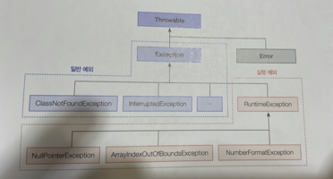

# 11 예외 처리
## 11.1 예외와 예외 클래스
컴퓨터의 하드웨어의 고장으로 인해 응용프로그램 실행 오류가 발생하는 것을 자바에서는 `에러`라고 부른다. 프로그램을 아무리 견고하게 만들어도 개발자는 이런 에러에 대처할 방법이 없다.

자바에서는 에러 이외에 예외(exception)라고 부르는 오류가 있다. 예외란 잘못된 사용 또는 코딩으로 인한 오류를 말한다. 예외가 발생되면 프로그램은 곧바로 종료된다는 점에서 에러와 동일하지만, 예외 처리를 통해 계속 실행 상태를 유지할 수 있다.

예외에는 다음 두 가지가 있다.

- 일반 예외(Exception)
  - 컴파일러가 예외 처리 코드 여부를 검사하는 예외를 말한다.
  - CheckedException
- 실행 예외(Runtime Exception)
  - 컴파일러가 예외 처리 코드 여부를 검사하지 않는 예외를 말한다.
  - UnCheckedException

자바는 예외가 발생하면 예외 클래스로부터 객체를 생성한다. 이 객체는 예외 처리 시 사용된다.



자바의 모든 에러와 예외 클래스는 `Throwable`을 상속받아 만들어지고, 추가적으로 예외 클래스는 java.lang.Exception 클래스를 상속받는다.

실행 예외는 RuntimeException과 그 자식 클래스에 해당한다. 그 밖의 예외 클래스는 모두 일반 예외이다. 자바는 자주 사용되는 예외 클래스를 표준 라이브러리로 제공한다. 위의 그림에서의 모든 예외 클래스는 표준 라이브러리에서 제공하는 것들이다.

## 11.2 예외 처리 코드
예외 처리 코드는 try-catch-finally 블록으로 구성된다. try-catch-finally 블록은 생성자 내부와 메소드 내부에서 작성된다.

try 블록에서 작성한 코드가 예외 없이 정상 실행되면 catch 블록은 실행되지 않고 finally 블록이 실행된다. 그러나 try 블록에서 예외가 발생하면 catch 블록이 실행되고 연이어 finally 블록이 실행된다.

예외 발생 여부와 상관없이 finally 블록은 항상 실행된다. 심지어 try 블록과 catch 블록에서 return 문을 사용하더라도 finally 블록은 항상 실행된다.

finally 블록은 옵션으로 생략 가능하다.

`e.getMessage()`는 예외가 발생한 이유만 리턴하지만, `e.toString()`은 아래와 같이 예외의 종류도 리턴한다.
```
java.lang.NullPointerException: Cannot invoke "String.length()" because "data" is null
```

`e.printStackTrace()`는 예외가 어디서 발생했는지 추적한 내용까지도 출력해준다.

## 11.3 예외 종류에 따른 처리
다중 catch를 사용하면 발생하는 예외에 따라 예외 처리 코드를 다르게 작성할 수 있다. catch에 적힌 타입의 예외가 발생하면 해당 catch 블록이 선택되어 실행된다.

catch 블록이 여러 개라 할지라도 catch 블록은 단 하나만 실행된다. 그 이유는 try 블록에서 동시 다발적으로 예외가 발생하지 않으며, 하나의 예외가 발생하면 즉시 실행을 멈추고 해당 catch 블록으로 이동하기 때문이다.

처리해야 할 예외 클래스들이 상속 관계에 있을 때는 `하위 클래스 catch 블록`을 `먼저` 작성하고 `상위 클래스 catch 블록`을 나중에 작성해야 한다.
예외가 발생하면 catch 블록은 위에서부터 차례대로 검사 대상이 되는데, 하위 예외도 상위 클래스 타입이므로 상위 클래스 catch 블록이 먼저 검사 대상이 되면 안된다.
(예외가 위에서 먹혀버린다는 뜻)

두 개 이상의 예외를 하나의 catch 블록으로 동일하게 예외 처리하고 싶을 때가 있다. 이 경우에는 catch 블록에 예외 클래스를 기호 `|` 로 연결하면 된다.

## 11.4 리소스 자동 닫기
리소스(resource)란 데이터를 제공하는 객체를 말한다. 리소스는 사용하기 위해 열어야(open)하며, 사용이 끝난 다음에는 닫아야(close)한다. 예를 들어 파일 내용을 읽기 위해선 파일을 열어야 하며 다 읽고 난 후에는 파일을 닫아야 다른 프로그램에서 사용할 수 있다.

리소스를 사용하다가 예외가 발생될 경우에도 안전하게 닫는 것이 중요하다. 그렇지 않으면 리소스가 불안정한 상태로 남아있게 된다.

try-with-resources 블록을 사용하면 예외 발생 여부와 상관없이 리소스를 자동으로 닫아준다. try 괄호에 리소스를 여는 코드를 작성하면 try 블록이 정상적으로 실행을 완료했거나 도중에 예외가 발생하면 자동으로 리소스의 close() 메소드가 호출된다.

```java
try(FileInputStream fis = new FileInputStream("file.txt")){
        ...
        } catch(IOException e){
        ...
        }
```

try-with-resources 블록을 사용하기 위해선 조건이 하나 있다. 리소스는 java.lang.AutoCloseable 인터페이스를 구현해서 AutoClosable 인터페이스의 close() 메서드를 재정의 해야 한다. 예를 들어 FileInputStream은 다음고 같이 AutoCloseable 인터페이스를 구현하고 있다.
```java
public class FileInputStream implements AutoCloseable {
    ...
    @Override
    public void close() throws Exception{...}
}
```

복수 개의 리소스를 사용해야 한다면 다음과 같이 try() 괄호 안에 세미콜론(;)으로 구분해서 리소스를 여는 코드를 작성하면 된다.
```java
try(
        FileInputStream fis = new FileInputStream("file.txt");
        FileInputStream fis = new FileInputStream("file.txt")

    ){
        ...
    } catch(IOException e){
        ...
    }
```

## 11.5 예외 떠넘기기
메소드 내부에서 예외가 발생할 때 try-catch 블록으로 예외를 처리하는 것이 기본이지만, 메소드를 호출한 곳으로 예외를 떠넘길 수도 있다. 이때 사용하는 키워드가 `throws`이다.
throws는 메서드 선언부 끝에 작성하는데, 떠넘길 예외 클래스를 쉼표로 구분해서 나열해주면 된다.
```java
리턴타입 메서드명(매개변수..) throws 예외클래스1, 애외클래스2, ... {
    
        }
```

throws 키워드가 붙어 있는 메서드에서 해당 예외를 처리하지 않고 떠넘겼지 때문에 이 메서드를 호출하는 곳에서 예외를 받아 처리해야 한다.

나열해야 할 예외 클래스가 많을 경우에는 throws Exception 또는 throws Throwable 만으로 모든 예외를 간단히 떠넘길 수도 있다.

main() 메서드에서도 throws 키워드를 사용해서 예외를 떠넘길 수 있는데, 결국 JVM이 최종적으로 예외 처리를 하게 된다. JVM은 예외의 내용을 콘솔에 출력하는 것으로 예외 처리를 한다.

## 11.6 사용자 정의 예외
사용자 정의 예외는 컴파일러가 체크하는 일반 예외로 선언할 수도 있고, 컴파일러가 체크하지 않는 실행 예외로 선언할 수도 있다. 통상적으로 일반 예외는 Exception의 자식 클래스로 선언하고, 실행 예외는 RuntimeException의 자식 클래스로 선언한다.

사용자 정의 예외 클래스에는 기본 생성자와 예외 메시지를 입력받는 생성자를 선언해준다. 예외 메세지는 부모 생성자 매개값으로 넘겨주는데, 그 이유는 예외 객체의 공통 메서드인 getMessage()의 리턴값으로 사용하기 위해서이다.

```java
public class XXXException extends RuntimeException {
    public XXXException() {
    }

    public XXXException(String message) {
        super(message);
    }
}
```