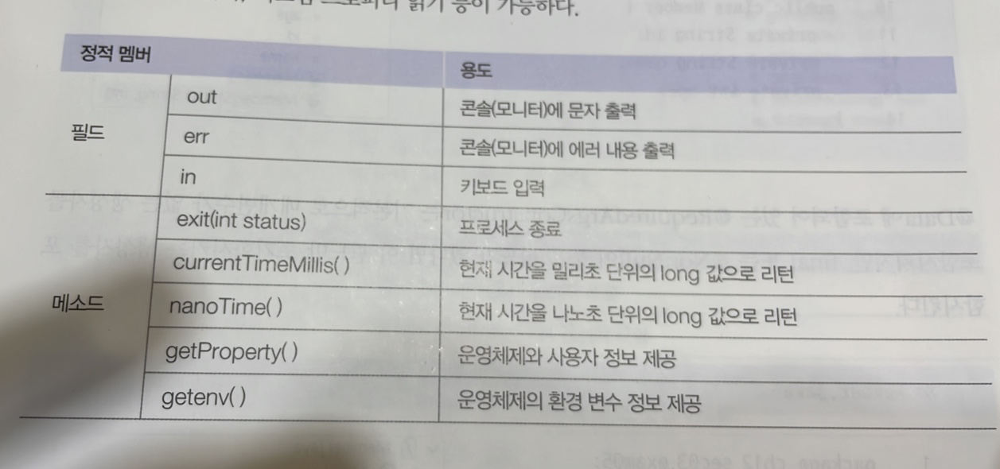
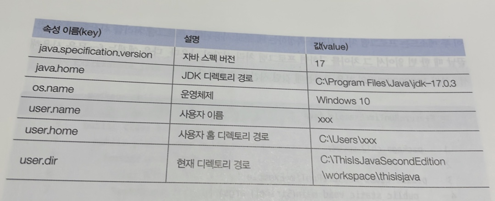

# 12. java.base 모듈
## 12.2 java.base 모듈
`java.base`는 모든 모듈이 의존하는 기본 모듈로, 모듈 중 유일하게 requires 하지 않아도 사용할 수 있다.

이 모듈에 포함되어 있는 패키지는 대부분의 자바 프로그램에서 많이 사용하는 것들이다. 다음은 java.base 모듈에 포함된 주요 패키지와 용도를 설명한 표이다.


우리가 지금까지 사용한 String, System, Integer, Double, Exception, RuntimeException 등의 클래스는 java.lang 패키지에 있고, 키보드 입력을 위해 사용한 Scanner는 java.util 패키지에 있다.

java.lang은 자바 언어의 기본적인 클래스를 담고 있는 패키지로, 이 패키지에 있는 클래스와 인터페이스는 import 없이 사용할 수 있다. 다음은 java.lang 패키지에 ㅗ함된 주요 클래스와 용도를 설명한 표이다.


## 12.3 Object 클래스
클래스를 선언할 때 extends 키워드로 다른 클래스를 상속하지 않으면 암시적으로 `java.lang.Object` 클래스를 상속하게 된다.


그렇게 때문에 Object가 가진 메서드는 모든 객체에서 사용할 수 있다. 다음은 Object가 가진 주요 메서드를 설명한 표이다.


### 객체 동등 비교
Object의 equals() 메서드는 객체의 `번지`를 비교하고 boolean 값을 리턴한다.
```java
public boolean equals(Object obj)
```

`equals()` 메서드의 매개변수 타입이 Object이므로 자동 타입 변환에 의해 모든 객체가 매개값으로 대입될 수 있다. equals() 메서드는 비교 연산자인 ==과 동일한 결과를 리턴한다. 두 객체가 동일한 객체라면 true를 리턴하고, 그렇지 않으면 false를 리턴한다.

일반적으로 Object의 equals() 메서드는 재정의해서 `동등 비교용`으로 사용된다. 동등 비교란 객체가 비록 달라도 내부의 데이터가 같은지를 비교하는 것을 말한다.

예를 들어 String은 equals() 메서드를 재정의해서 내부 문자열이 같은지를 비교한다.

다음 예제는 Member 객체의 동등 비교를 위해서 equals() 메서드를 재정의한다. Member 타입이면서 id 필드값이 같을 경우는 true를 리턴하고, 그 이외의 경우는 모두 false를 리턴한다.

```java
public class Member {
    public String id;

    public Member(String id) {
        this.id = id;
    }

    @Override
    public boolean equals(Object obj) { // Object의 equals 메서드 재정의
        if (obj instanceof Member target) { // obj가 Member 타입인지 검사하고 타입 변환 후 target 변수에 대입
            if (id.equals(target.id)) { // id 문자열이 같은지 비교
                return true;
            }
        }
        return false;
    }
}
```

### 객체 해시코드
객체 해시코드란 객체를 식별하는 정수를 말한다. Object의 hashCode() 메서드는 객체의 메모리 번지를 이용해서 해시코드를 생성하기 때문에 객체마다 다른 정수값을 리턴한다.

hashCode() 메서드의 용도는 equals() 메서드와 비슷한데, 두 객체가 `동등`한지를 비교할 때 주로 사용한다.

```java
public int hashCode()
```

equals 메서드와 마찬가지로 hashCode() 메서드 역시 객체의 데이터를 기준으로 재정의해서 새로운 정수값을 리턴하도록 하는 것이 일반적이다. 객체가 다르다 할지라도 내부 데이터가 동일하다면 같은 정수값을 리턴하기 위해서이다.

자바는 두 객체가 동등함을 비교할 때 hashCode()와 equals() 메서드를 같이 사용하는 경우가 많다.

우선 hashCode()가 리턴하는 정수값이 같은지를 확인하고, 그 다음 equals() 메서드가 true를 리턴하는지를 확인해서 `동등` 객체임을 확인한다.


다음 예제는 Student 객체를 동등 비교하기 위해 hashCode()와 equals() 메서드를 재정의했다.

학생 번호와 이름으로 해시코드를 생성하고, 학생 번호와 이름이 동일할 경우에만 equals()가 true를 리턴하도록 했다.

```java
public class Student {
    private int no;
    private String name;

    public Student(int no, String name) {
        this.no = no;
        this.name = name;
    }

    public int getNo() {
        return no;
    }

    public String getName() {
        return name;
    }

    @Override
    public int hashCode() { // Object의 hashCode() 메서드를 재정의해서 학생 번호와 이름 해시코드를 합한 새로운 해시코드를 리턴하도록함. (번호와 이름이 같으면 동일한 해시코드가 생성됨.)
        int hashCode = no + name.hashCode();
        return hashCode;
    }

    @Override
    public boolean equals(Object obj) { // Object의 equals() 메서드를 재정의해서 Student 객체인지를 확인하고, 학생 번호와 이름이 같으면 true를 리턴하도록 함.
        if (obj instanceof Student target) {
            if (no == target.getNo() && name.equals(target.getName())) {
                return true;
            }
        }
        return false;
    }
}
```
```java
public class HashCodeExample {

    public static void main(String[] args) {
        Student s1 = new Student(1, "한수현");
        Student s2 = new Student(1, "한수현");

        if (s1.hashCode() == s2.hashCode()) {
            if (s1.equals(s2)) {
                System.out.println("동등 객체입니다.");
            } else {
                System.out.println("데이터가 다르므로 동등 객체가 아닙니다.");
            }
        } else {
            System.out.println("해시코드가 다르므로 동등 객체가 아닙니다.");
        } 
    }
}
```

### 객체 문자 정보
Obejct의 `toString()` 메서드는 객체의 문자 정보를 리턴한다. 객체의 문자 정보란 객체를 문자열로 표현한 값을 말한다.

기본적으로 Object의 toString() 메서드는 `클래스명@16진수해시코드`로 구성된 문자열을 리턴한다.


객체의 문자 정보가 중요한 경우에는 Object의 toString() 메서드를 재정의해서 간결하고 유익한 정보를 리턴하도록 해야 한다.

예를 들어 Date 클래스는 현재 날짜와 시간을, String 클래스는 저장된 문자열을 리턴하도록 toString() 메서드를 재정의하고 있다.

### 레코드 선언
데이터 전달을 위한 DTO를 작성할 때 반복적으로 사용되는 코드를 줄이기 위해 Java 14부터 레코드(record)가 도입되었다. 예를 들어 사람의 정보를 전달하기 위한 Person DTO가 다음과 같다고 정의해보자.


Person의 데이터(필드)는 읽기만 가능하도록 필드를 private final로 선언하였으며, 필드 이름과 동일한 Getter 메서드(name(), age())를 가지고 있다.

그리고 동등 비교를 위해 hashCode(), equals() 메서드를 재정의하고 있고, 의미 있는 문자열 출력을 위해 toString() 메서드를 재정의하고 있다.

다음 코드는 위와 동일한 코드를 생성하는 레코드 선언이다. class 키워드 대신에 record로 대체하고 클래스 이름 뒤에 괄호를 작성해서 저장할 데이터의 종류를 변수로 선언하였다.

```java
public record Person(String name, int age) {
}
```

이렇게 선언된 레코드 소스를 컴파일하면 변수의 타입과 이름을 이용해서 private final 필드가 자동 생성되고, 생성자 및 Getter 메서드가 자동으로 추가된다. 그리고 hashCode(), equals(), toString() 메서드를 재정의한 코드도 자동으로 추가된다.

## 12.4 System 클래스
자바 프로그램은 운영체제상에서 바로 실행되는 것이 아니라 자바 가상 머신(JVM) 위에서 실행된다. 따라서 운영체제의 모든 기능을 자바 코드로 직접 접근하기란 어렵다.

하지만 java.lang 패키지에 속하는 System 클래스를 이용하면 운영체제의 일부 기능을 사용할 수 있다.

System 클래스의 정적(static) 필드와 메서드를 이용하면 프로그램 종료, 키보드 입력, 콘솔(모니터) 출력, 현재 시간 읽기, 시스템 프로퍼티 읽기 등이 가능하다.



### 콘솔 출력
out 필드를 이용하면 콘솔에 원하는 문자열을 출력할 수 있다.
```java
System.err.println("에러내용");
```

### 키보드 입력
자바는 키보드로부터 입력된 키를 읽기 위해 System 클래스에서 in 필드를 제공한다. 다음과 같이 in 필드를 이용해서 read() 메서드를 호출하면 입력된 키의 코드값을 얻을 수 있다.

```java
int keyCode = System.in.read();
```

키 코드는 각 키에 부여되어 있는 번호로, 다음과 같다.


read() 메서드는 호출과 동시에 키 코드를 읽는 것이 아니라, 엔터를 누르기 전까지는 대기 상태이다가 엔터 키를 누르면 입력했던 키들을 하나씩 읽기 시작한다.

단, read() 메서드는 IOException을 발생할 수 있는 코드이므로 예외 처리가 필요하다.

### 프로세스 종료
운영체제는 실행 중인 프로그램을 프로세스로 관리한다. 자바 프로그램을 시작하면 JVM 프로세스가 생성되고, 이 프로세스가 main() 메서드를 호출한다. 프로세스를 강제 종료하고 싶다면 System.exit() 메서드를 사용한다.
```java
System.exit(int status)
```

exit() 메서드는 int 매개값이 필요한데, 이 값을 종료 상태값이라고 한다. 종료 상태값으로 어떤 값을 주더라도 프로세스는 종료되는데 `정상 종료일 경우 0`, `비정상 종료는 1 또는 -1`로 주는 것이 관례이다.

### 진행 시간 읽기
System 클래스의 currentTimeMillis() 메서드와 nanoTime() 메서드는 1970년 1월 1일 0시 부터 시작해서 현재까지 진행된 시간을 리턴한다.

이 두 메서드는 프로그램 처리 시간을 측정하는 데 주로 사용된다. 프로그램 처리를 시작할 때 한 번, 끝날 때 한 번 읽어서 그 차이를 구하면 프로그램 처리 시간이 나온다.

### 시스템 프로퍼티 읽기
시스템 프로퍼티란 자바 프로그램이 시작될 때 자동 설정되는 시스템 속성을 말한다.

예를 들어 운영체제 종류 및 사용자 정보, 자바 버전 등의 기본 사양 정보가 해당한다. 다음은 시스템 프로퍼티의 주요 속성 이름과 값에 대해 설명한 것이다.



## 12.5 문자열 클래스
자바에서 문자열과관련된 주요 클래스는 다음과 같다.


### String 클래스
String 클래스는 문자열을 저장하고 조작할 때 사용한다. 문자열 리터럴은 자동으로 String 객체로 생성되지만, String 클래스의 다양한 생성자를 이용해서 직접 객체를 생성할 수도 있다.

프로그램을 개발하다 보면 byte 배열을 문자열로 변환하는 경우가 종종 있다. 예를 들어 네트워크 통신으로 얻은 byte 배열을 원래 문자열로 변환하는 경우이다. 이때는 String 생성자 중에서 다음 두 가지를 사용해 String 객체로 생성할 수 있다.

```java
String str = new String(byte[] bytes); // 기본 문자셋으로 byte 배열을 디코딩해서 String 객체로 생성
```
```java
String str = new String(byte[] bytes, String charsetName); // 특정 문자셋으로 byte 배열을 디코딩해서 String 객체로 생성, charsetName = ex) "EUC-KR
```

### StringBuilder 클래스
String은 내부 문제열을 수정할 수 없다. 다음 코드를 보면 다른 문자열을 결합해서 내부 문자열을 변경하는 것처럼 보이지만 사실 'ABCDEF'라는 새로운 String 객체를 생성하는 것이다.

그리고 data 변수는 새로 생성된 String 객체를 참조하게 된다.
```java
String data = "ABC";
data += "DEF";
```

문자열의 + 연산은 새로운 String 객체가 생성되고 이전 객체는 계속 버려지는 것이기 때문에 효율성이 좋다고는 볼 수 없다. 잦은 문자열 변경 작업을 한다면 String 보다는 StringBuilder를 사용하는 것이 좋다.

StringBuilder는 내부 버퍼(데이터를 저장하는 메모리)에 문자열을 저장해두고 그 안에서 추가, 수정, 삭제 작업을 하도록 설계되어 있다.

따라서 String 처럼 새로운 객체를 만들지 않고도 문자열을 조작할 수 있다. StringBuilder가 제공하는 조작 메서드는 다음과 같다.


toString()을 제외한 다른 메서드는 StringBuilder를 다시 리턴하기 때문에 연이어서 다른 메서드를 호출할 수 있는 메서드 체이닝 패턴을 사용할 수 있다.

### StringTokenizer 클래스
문자열이 구분자로 연결되어 있을 경우, 구분자를 기준으로 문자열을 분리하려면 String의 split() 메서드를 사용하거나 java.util의 StringTokenizer 클래스를 이용할 수 있다.

split은 정규 표현식으로 구분하고, StringTokenizer는 문자로 구분한다는 차이점이 있다.

다음고 같은 문자열에서 &, 쉼표, 하이픈 으로 구분된 사람 이름을 봅아낼 경우에는 정규 표현식으로 분리하는 split() 메서드를 사용해야 한다.
```java
String data = "홍길동&이수홍,박연수,김자바-최명호";
String[] names = data.split("&|,|-");
```

그러나 다음과 같이 여러 종류가 아닌 한 종류의 구분자만 있다면 StringTokenizer를 사용할 수도 있다.

첫 번째 매개값으로 전체 문자열을 주고, 두 번째 매개 값으로 구분자를 주면 된다. 만약 구분자를 생략하면 공백이 기본 구분자가 된다.

```java
String data = "홍길동/이수홍/박연수";
StringTokenizer st = new StringTokenizer(data, "/");
```
 StringTokenizer 객체가 생성되면 다음 메서드들을 이요해서 분리된 문자열을 얻을 수 있다.
 


### 포장 클래스
자바는 기본 타입(byte, char, short, int, long, float, double, boolean)의 값을 갖는 객체를 생성할 수 있다.

이런 객체를 포장(wrapper)객체라고 한다. 값을 포장하고 있다고 해서 붙여진 이름이다.

포장 객체를 생성하기 위한 클래스는 java.lang 패키지에 포함되어 있는데, `char` 타입과 `int` 타입이 각각 `Character`와 `Integer`인 것만 제외하고는 기본 타입의 첫 문자를 대문자로 바꾼 이름을 가지고 있다.


포장 객체는 `포장하고 있는 기본 타입의 값을 변경할 수 없고`, 단지 객체로 생성하는데 목적이 있다.

이런 객체가 필요한 이유는 컬렉션 객체 때문이다. 15장에서 학습할 `컬렉션 객체는 기본 타입의 값은 저장할 수 없고, 객체만 저장할 수 있다.`

### 박싱과 언박싱
기본 타입의 값을 포장 객체로 만드는 과정을 박싱이라고 하고, 반대로 포장 객체에서 기본 타입의 값을 얻어내는 과정을 언박싱이라고 한다.

박싱은 포장 클래스 변수에 기본 타입 값이 대입될 때 발생한다. 반대로 언박싱은 기본 타입 변수에 포장 객체가 대입될 때 발생한다.

```java
Integer obj = 100; // 박싱
int value = obj; // 언박싱
```

언박싱은 다음과 같이 연산 과정에서도 발생한다. obj는 50과 연산되기 전에 `언박싱`된다.
```java
int value = obj + 50; // 언박싱 후 연산
```

### 문자열을 기본 타입 값으로 변환
포장 클래스는 문자열을 기본 타입 값으로 변환할 때도 사용된다. 대부분의 포장 클래스에는 `parse+기본타입`명으로 되어있는 정적(static) 메서드가 있다. 이 메서드는 문자열을 해당 기본 타입 값으로 변환한다.

### 포장 값 비교
포장 객체는 내부 값을 비교하기 위해 `==` 와 `!=` 연산자를 사용할 수 없다. 이 연산은 내부의 값을 비교하는 것이 아니라 포장 객체의 번지를 비교하기 때문이다.

예를 들어 다음 두 Integer 객체는 300이라는 동일한 값을 갖고 있지만 `==` 연산의 결과는 false가 나온다.

예외도 있다. 포장 객체의 효율적 사용을 위해 다음 범위의 값을 갖는 포장 객체는 공유된다. 이 범위의 값을 갖는 포장 객체는 `==`와 `!=`연산자로 비교할 수 있지만, 내부 값을 비교하는 것이 아니라 객체 번지를 비교한다는 것을 알아야 한다.


포장 객체에 정확히 어떤 값이 저장될 지 모르는 상황이라면 `==`과`!=`은 사용하지 않는 것이 좋다.

대신 `equals()` 메서드로 내부 값을 비교할 수 있다. 포장 클래스의 equals() 메서드는 내부의 값을 비교하도록 재정의되어 있다.

## 12.7 수학 클래스
Math 클래스는 수학 계산에 사용할 수 있는 메서드를 제공한다. 모두 정적 메서드 이므로 바로 사용이 가능하다.


## 12.8 날짜와 시간 클래스
자바는 컴퓨터의 날짜 및 시각을 읽을 수 있도록 `java.util` 패키지에서 `Date`와 `Calendar` 클래스를 제공하고 있다.

또한 날짜와 시간을 조작할 수 있도록 `java.time 패키지에서 `LocalDateTime` 등의 클래스를 제공한다.


### Date 클래스
Date 날짜를 표현하는 클래스로 객체 간에 날짜 정보를 주고받을 때 사용된다. Date 클래스에는 여러 개의 생성자가 선언되어 있지만 대부분 Deprecated 되어 Date() 생성자만 주로 사용된다.

Date() 생성자는 컴퓨터의 현재 날짜를 읽어 Date 객체로 만든다.

현재 날짜를 문자열로 얻고 싶다면 toString() 메서드를 사용할 수 있지만 영문으로 출력되기 때문에 우리가 원하는 형식이 아니다.

### Calendar 클래스
Calendar 클래스는 달력을 표현하는 추상 클래스이다. 날짜와 시간을 계산하는 방법이 지역과 문화에 따라 다르기 때문에 특정 역법(날짜와 시간을 매기는 방법)에 따르는 달력은 자식 클래스에서 구현하도록 되어있다.

### 날짜와 시간 조작
Date와 Calendar 는 날짜와 시간 정보를 얻기에는 충분하지만, 날짜와 시간을 조작할 수는 없다.

이때는 java.time 패캐지의 `LocalDateTime` 클래스가 제공하는 다음 메서드를 이용하면 매우 쉽게 날짜와 시간을 조작할 수 있다.


## 12.10 정규 표현식 클래스
문자열이 정해져 있는 형식으로 구성되어 있는지 검증해야 하는 경우가 있다.

예를 들어 이메일이나 전화번호를 사용자가 제대로 입력했는지 검증할 때다. 자바는 `정규 표현식`을 이용해서 문자열이 올바르게 구성되어 있는지 검증한다.

### 정규 표현식 작성 방법
정규 표현식은 문자 도는 숫자와 관련된 표현과 반복 기호가 결합된 문자열이다. 다음은 정규 표현식을 구성하는 표현 및 기호에 대한 설명이다.


### Pattern 클래스로 검증
`java.util.regex` 패키지의 Pattern 클래스는 정규 표현식으로 문자열을 검증하는 `matches()` 메서드를 제공한다.

첫 번째 매개값은 정규 표현식이고, 두 번째 매개값은 검증할 문자열이다. 검증한 결과는 boolean 타입으로 리턴된다.
```java
boolean result = Pattern.matches("정규식", "검증할 문자열");
```

## 12.11 리플렉션
자바는 클래스와 인터페이스의 메타 정보를 Class 객체로 관리한다. 여기서 메타 정보란 패키지 정보, 타입 정보, 멤버(생성자, 필드, 메서드) 정보 등을 말한다.

이러한 메타 정보를 프로그램에서 읽고 수정하는 행위를 `리플렉션`이라고 한다.

프로그램에서 Class 객체를 얻으려면 다음 3가지 방법 중 하나를 이용하면 된다.

```java
1. Class clazz = 클래스이름.class; // 클래스로부터 얻는 방법
2. Class clazz = Class.forName("패키지...클래스이름"); // 클래스로부터 얻는 방법
3. Class clazz = 객체참조변수.getClass(); // 객체로부터 얻는 방법
```

1번과 2번은 클래스 이름만 가지고 Class 객체를 얻는 방법이고, 3은 객체로부터 Class 객체를 얻는 방법이다.

셋 중 어떤 방법을 사용하더라도 동일한 Class 객체를 얻을 수 있다. 예를 들어 String 클래스의 Class 객체는 다음과 같이 얻을 수 있다.


### 패키지와 타입 정보 얻기
패키지와 타입(클래스, 인터페이스) 이름 정보는 다음 메서드를 통해 얻을 수 있다.


### 멤버 정보 얻기
타입(클래스, 인터페이스)가 가지고 있는 멤버 정보는 다음 메서드를 통해 얻을 수 있다.


## 12.12 어노테이션
코드에서 @으로 작성되는 요소를 어노테이션이라고 한다. 어노테이션은 클래스 또는 인터페이스를 컴파일하거나 실행할 때 어떻게 처리해야 할 것인지를 알려주는 설정 정보이다.

어노테이션은 다음 세 가지 용도로 사용된다.
1. 컴파일 시 사용하는 정보 전달
2. 빌드 툴이 코드를 자동으로 생성할 때 사용하는 정보 전달
3. 실행 시 특정 기능을 처리할 때 사용하는 정보 전달

컴파일 시 사용하는 정보 전달의 대표적인 예는 `@Override` 어노테이션이다. `@Override`는 컴파일러가 `메서드 재정의 검사`를 하도록 설정한다. 정확히 재정의 되지 않았다면 컴파일러는 에러를 발생시킨다.

어노테이션은 자바 프로그램을 개발할 때 필수 요소가 되었다.

웹 개발에 많이 사용되는 Spring Framework 또는 Spring Boot 는 다양한 종류의 어노테이션을 사용해서 웹 애플리케이션을 설정하는 데 사용된다.

### 어노테이션 타입 정의와 적용
어노테이션도 하나의 타입이므로 어노테이션을 사용하기 위해서는 먼저 정의부터 해야 한다.

어노테이션을 정의하는 방법은 인터페이스를 정의하는 것과 유사하다. 다음과 같이 `@interface` 뒤에 사용할 어노테이션 이름이 온다.

```java
public @interface AnnotationName{}
```

이렇게 정의한 어노테이션은 코드에서 다음과 같이 사용된다.
```java
@AnnotationName
```

어노테이션은 속성을 가질 수 있다. 속성은 타입과 이름으로 구성되며, 이름 뒤에 괄호를 붙인다.

속성의 기본값은 default 키워드로 지정할 수 있다. 예를 들어 String 타입 prop1과 int 타입의 prop2 속성은 다음과 같이 선언할 수 있다.
```java
public @interface AnnotationName{
    String prop1();
    int prop2() default 1;
}
```

이렇게 정의한 어노테이션은 코드에서 다음과 같이 사용할 수 있다. prop1은 기본값이 없기 때문에 반드시 값을 기술해야 하고, prop2는 기본값이 있기 대문에 생략 가능하다.

```java
@AnnotationName(prop1 = "값");
@AnnotationName(prop1 = "값", prop2 = 3);
```

어노테이션은 기본 속성인 value를 다음과 같이 가질 수 있다.

```java
public @interface AnnotationName{
    String value();
    int prop2() default 1;
}
```

value 속성을 가진 어노테이션을 코드에서 사용할 때에는 다음과 같이 값만 기술할 수 있다. 이 값은 value 속성에 자동으로 대입된다.

```java
@AnnotationName("값");
```

### 어노테이션 적용 대상
자바에서 어노테이션은 설정 정보라고 했다. 그렇다면 어떤 대상에 설정 정보를 적용할 것인지, 즉 클래스에 적용할 것인지, 메서드에 적용할 것인지를 명시해야 한다.

적용할 수 있는 대상의 종류는 `ElementType` 열거 상수로 정의되어 있다.


적용 대상을 지정할 때에는 `@Target` 어노테이션을 사용한다. `@Target` 의 기본 속성인 value는 ElementType 배열을 값으로 가진다. 

이것은 적용 대상을 복수 개로 지정하기 위해서다. 예를 들어 다음과 같이 적용 대상을 지정했다고 가정해보자.

```java
@Target({ElementType.TYPE, ElementType.FIELD, ElementType.METHOD})
public @interface AnnotationName {
}
```

이 어노테이션은 다음과 같이 클래스, 필드, 메서드에 적용할 수 있고 생성자는 적용할 수 없다.

### 어노테이션 유지 정책
어노테이션을 정의할 때 한가지 더 추가해야 할 내용은 `@AnnotationName`을 언제까지 유지할 것인지를 지정하는 것이다. 어노테이션 유지 정책은 RetentionPolicy 열거 상수로 다음과 같이 정의 되어 있다.


유지 정책을 지정할 때에는 `@Retention` 어노테이션을 사용한다. `@Retention`의 기본 속성인 value는 RetentionPolicy 열거 상수 값을 가진다.

다음은 실행 시에도 어노테이션 설정 정보를 이용할 수 있도록 유지 정책을 `RUNTIME`으로 지정한 예이다.

```java
import java.lang.annotation.ElementType;
import java.lang.annotation.Retention;
import java.lang.annotation.RetentionPolicy;
import java.lang.annotation.Target;

@Target({ElementType.TYPE, ElementType.FIELD, ElementType.METHOD})
@Retention(RetentionPolicy.RUNTIME)
public @interface AnnotationName{
}
```

### 어노테이션 설정 정보 이용
어노테이션은 아무런 동작을 가지지 않는 설정 정보일 뿐이다. 이 설정 정보를 이용해서 어떻게 처리할 것인지는 애플리케이션의 몫이다.

**애플리케이션은 12.11절에서 학습한 `리플렉션`을 이용해서 적용 대상으로부터 어노테이션의 정보를 다음 메서드로 얻어낼 수 있다.**


다음 예제는 적용 대상을 `METHOD`, 유지 정책을 `RUNTIME`으로 하고 구분선에 대한 설정 정보를 속성으로 가지고 있는 `@PrintAnnotation`을 정의한다.

```java
import java.lang.annotation.ElementType;
import java.lang.annotation.Retention;
import java.lang.annotation.RetentionPolicy;

@Target({ElementType.METHOD})
@Retention(RetentionPolicy.RUNTIME)
public @interface PrintAnnotation {
    String value() default "-"; // 선의 종류
    int number() default 15; // 출력 횟수
}
```

`@PrintAnnotation`을 Service 클래스의 메서드에 적용하면 다음과 같다.

```java
public class Service {
    @PrintAnnotation
    public void method1() {
        System.out.println("실행 내용1");
    }

    @PrintAnnotation("*")
    public void method2() {
        System.out.println("실행 내용2");
    }

    @PrintAnnotation(value = "#", number = 20)
    public void method3() {
        System.out.println("실행 내용3");
    }
}
```

실행 클래스인 `PrintAnnotationExample`에서는 Service 클래스에 선언된 메서드를 리플렉션해서 `@PrintAnnotation` 설정 정보를 얻어낸 후, 구분선을 출력하고 해당 메서드를 호출시킨다.

```java
import java.lang.reflect.Method;

public class PrintAnnotationExample {
    public static void main(String[] args) throws Exception {
        Method[] declaredMethods = Service.class.getDeclaredMethods();
        for (Method method : declaredMethods) {
            // PrintAnnotation 얻기
            PrintAnnotation printAnnotation = method.getAnnotation(PrintAnnotation.class);
            
            // 설정 정보를 이용해서 선 출력
            printLine(printAnnotation);
            
            // 메서드 호출
            method.invoke(new Service());
            
            // 설정 정보를 이용해서 선 출력
            printLine(printAnnotation);
        }
    }

    public static void printLine(PrintAnnotation printAnnotation) {
        if (printAnnotation != null) {
            // number 속성값 얻기
            int number = printAnnotation.number();
            for (int i = 0; i < number; i++) {
                // value 속성값 얻기
                String value = printAnnotation.value();
                System.out.println(value);
            }
            System.out.println();
        }
    }
}
```

