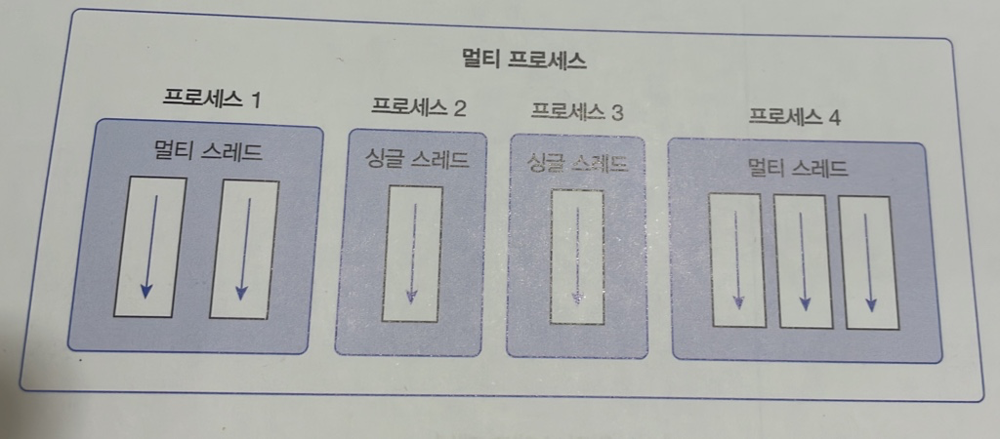
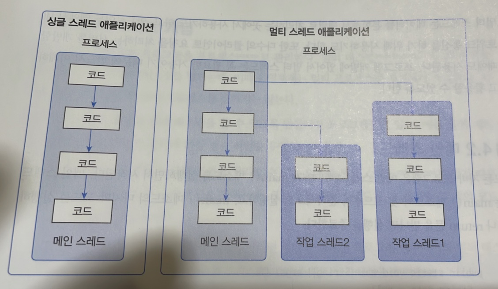
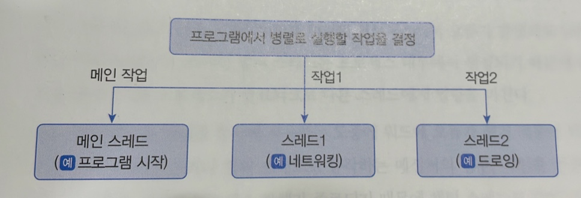
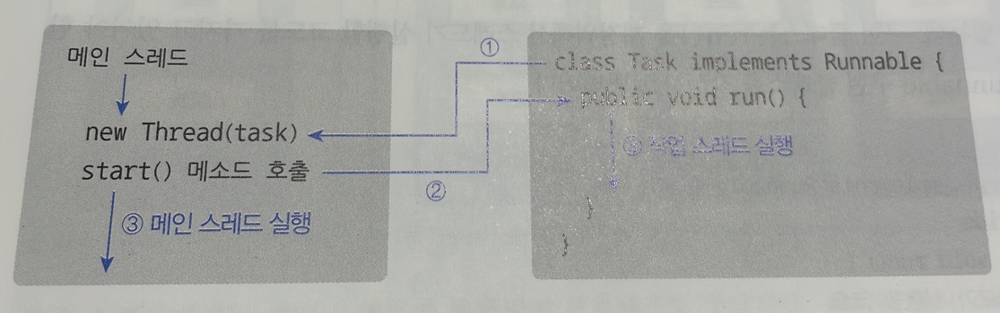
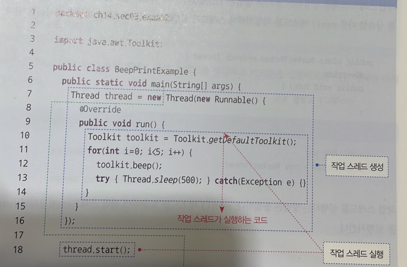
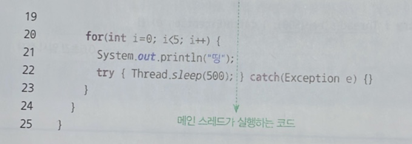
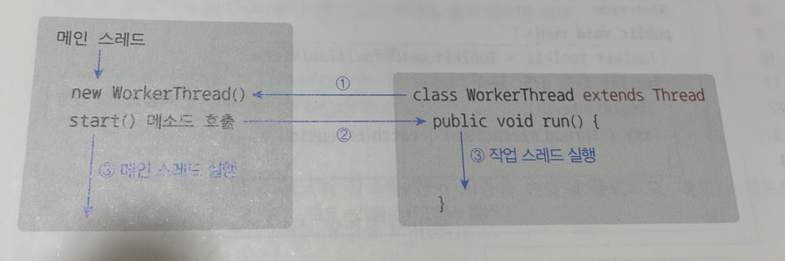
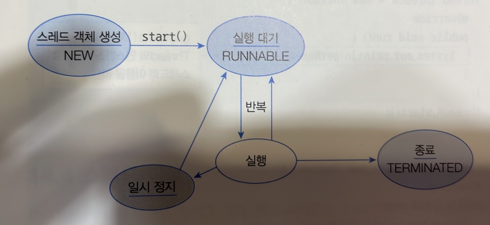
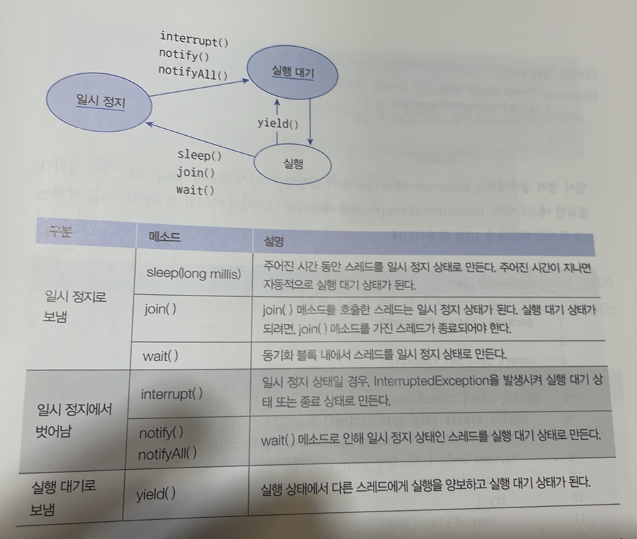
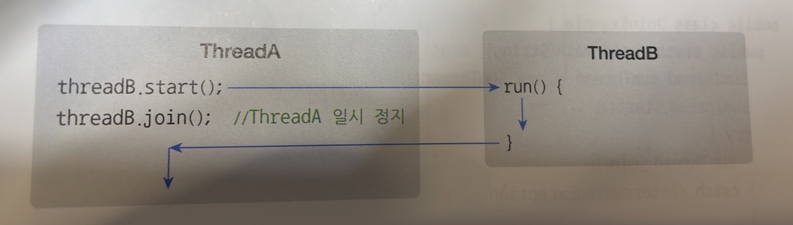

# 14. 멀티스레드
## 14.1 멀티 스레드 개념
운영체제는 실행 중인 프로그램을 프로세스로 관리한다. `멀티 태스킹`은 두 가지 이상의 작업을 동시에 처리하는 것을 말하는데, 이때 운영체제는 멀티 프로세스를 생성해서 처리한다.

하지만 멀티 태스킹이 꼭 멀티 프로세스를 뜻하지는 않는다.

하나의 프로세스 내에서 멀티 태스킹을 할 수 있도록 만들어진 프로그램들도 있다. 예를 들어 메신저는 채팅 작업을 하면서 동시에 파일 전송 작업을 수행하기도 한다.

하나의 프로세스가 두 가지 이상의 작업을 처리할 수 있는 이유는 `멀티 스레드`가 있기 때문이다. `스레드`는 코드의 실행 흐름을 말하는데, 프로세스 내에 스레드가 두 개라면 두 개의 코드 실행 흐름이 생긴다는 의미이다.

`멀티 프로세스`가 `프로그램 단위`의 `멀티 태스킹`이라면, `멀티 스레드`는 `프로그램 내부`에서의 `멀티 태스킹`이라고 볼 수 있다. 아래 그림은 멀티 프로세스와 멀티 스레드의 차이점을 보여준다.



멀티 프로세스들은 서로 독립적이므로 하나의 프로세스에서 오류가 발생해도 다른 프로세스에게 영향을 미치지 않는다. 하지만 멀티 스레드는 프로세스 내부에서 생성되기 때문에 하나의 스레드가 예외를 발생시키면 프로세스가 종료되므로 다른 스레드에게 영향을 미친다.

예를 들어 멀티스레드로 동작하는 메신저의 경우, 파일을 전송하는 스레드에서 예외가 발생하면 메신저 프로세스 자체가 종료되기 때문에 채팅 스레드도 같이 종료된다.

그렇기 때문에 멀티 스레드를 사용할 경우에는 예외 처리에 만전을 가해야 한다.

## 14.2 메인 스레드
모든 자바 프로그램은 메인 스레드(main thread)가 main() 메서드를 실행하면서 시작된다. 메인 스레드는 main() 메서드의 첫 코드부터 순차적으로 실행하고, main() 메서드의 마지막 코드를 실행하거나 return 문을 만나면 실행을 종료한다.



메인 스레드는 필요에 따라 추가 작업 스레드들을 만들어서 실행시킬 수 있다. 위 그림에서 오른쪽의 멀티 스레드를 보면 메인 스레드가 작업 스레드1을 생성하고 실행시킨 다음, 곧이어 작업 스레드2를 생성하고 실행시키는 것을 볼 수 있다.

싱글 스레드에서는 메인 스레드가 종료되면 프로세스도 종료된다. 하지만 멀티 스레드에서는 실행중인 스레드가 하나라도 있다면 프로세스는 종료되지 않는다. 메인 스레드가 작업 스레드보다 먼저 종료되더라도 작업 스레드가 계속 실행 중이라면 프로세스는 종료되지 않는다.

## 14.3 작업 스레드 생성과 실행
멀티 스레드로 실행하는 프로그램을 개발하려면 먼저 몇 개의 작업을 병렬로 실행할지 결정하고 각 작업별로 스레드를 생성해야 한다.



자바 프로그램은 메인 스레드가 반드시 존재하기 때문에 메인 작업 이외에 추가적인 작업 수만큼 스레드를 생성하면 된다. 자바는 작업 스레드도 `객체로 관리`하므로 클래스가 필요하다.

`Thread` 클래스로 직접 객체를 생성해도 되지만, 하위 클래스를 만들어 생성할 수도 있다.

### Thread 클래스로 직접 생성
`java.lang` 패키지에 있는 `Thread` 클래스로부터 작업 스레드 객체를 직접 생성하려면 다음과 같이 `Runnable` 구현 객체를 매개값으로 갖는 생성자를 호출하면 된다.
```java
Thread thread = new Thread(Runnable, target);
```
`Runnable`은 스레드가 작업을 실행할 때 사용하는 인터페이스이다.

`Runnable`에는 `run()` 메서드가 정의되어 있는데, 구현 클래스는 `run()`을 재정의해서 `스레드가 실행할 코드`를 가지고 있어야 한다.

```java
class Task implements Runnable {
    @Override
    public void run() {
        // 스레드가 실행할 코드
    }
}
```

`Runnable` 구현 클래스는 작업 내용을 정의한 것이므로, 스레드에게 전달해야 한다. `Runnable` 구현 객체를 생성한 후 `Thread` 생성자 매개값으로 `Runnable` 객체를 다음과 같이 전달하면 된다.

```java
Runnable task = new Task();

Thread thread = new Thread(task);
```

명시적인 `Runnable` 구현 클래스를 작성하지 않고 `Thread` 생성자를 호출할 때 `Runnable` 익명 구현 객체를 매개값으로 사용할 수 있다.

오히려 이 방법이 더 많이 사용된다.
```java
Thread thread = new Thread(new Runnable() {
    @Override
    public void run() {
        // 스레드가 실행할 코드
    }
});
```

작업 스레드 객체가 생성되었다고 해서 바로 작업 스레드가 실행되지는 않는다. 작업 스레드를 실행 하려면 스레드 객체의 `start()` 메서드를 다음과 같이 호출해야 한다.

```java
thread.start();
```

start() 메서드가 호출되면, 작업 스레드는 매개값으로 받은 `Runnable`의 `run()` 메서드를 실행하면서 작업을 처리한다.

다음은 작업 스레드가 생성되고 실행되기까지의 순서를 보여준다.



아래 처럼 코드를 작성하면, 0.5초 주기로 비프음을 발생시키면서 동시에 프린팅을 하는 작업이 가능해진다.

프린팅은 메인 스레드가 담당하고, 비프음을 들려주는 것은 작업 스레드가 담당하도록 하는 것이다.




### Thread 자식 클래스로 생성
작업 스레드 객체를 생성하는 또 다른 방법은 `Thread`의 자식 객체로 만드는 것이다. `Thread` 클래스를 상속한 다음 `run()`메서드를 재정의해서 스레드가 실행할 코드를 작성하고 객체를 생성하면 된다.

```java
public class WorkerThread extends Thread {
    @Override
    public void run() {
        // 스레드가 실행할 코드
    }
}

Thread thread = new WorkerThread();
thread.start();
```



명시적인 자식 클래스를 정의하지 않고, 다음과 같이 `Thread` 익명 자식 객체를 사용하는 방식을 더 많이 사용된다.
```java
Thread thread = new Thread() {
    @Override
    public void run() {
        // 스레드가 실행할 ㅗ드
    }
};
thread.start();
```

## 14.4 스레드 이름
스레드는 자신의 이름을 가지고 있다. 메인 스레드는 `main`이라는 이름을 가지고 있고, 작업 스레드는 자동적으로 `Thread-n` 이라는 이름을 가진다.

작업 스레드의 이름을 `Thread-n` 대신 다른 이름으로 설정하고 싶다면 `Thread` 클래스의 `setName()` 메서드를 사용하면 된다.

스레드 이름은 디버깅 시 어떤 스레드가 작업중인지 조사하기 위해 주로 사용된다.

현재 코드를 어떤 스레드가 실행하고 있는지 확인하려면 정적 메서드인 `currentThread()`로 스레드 객체의 참조를 얻은 다음 `getName()` 메서드로 이름을 출력해보면 된다.

## 14.5 스레드 상태
스레드 객체를 `생성(NEW)`하고, `start()` 메서드를 호출하면 곧바로 스레드가 실행되는 것이 아니라 `실행 대기 상태(RUNNABLE)`가 된다.

실행 대기하는 스레드는 CPU 스케쥴링에 따라 CPU를 점유하고 run() 메서드를 실행한다. 이때를 `실행(RUNNING)` 상태라고 한다.

실행 스레드는 run() 메서드를 모두 실행하기 전에 스케쥴링에 의해 다시 실행 대기 상태로 돌아갈 수 있다. 그리고 다른 스레드가 실행 상태가 된다.

이렇게 스레드는 실행 대기 상태와 실행 상태를 번갈아 가면서 자신의 run() 메서드를 조금씩 실행한다. 실행 상태에서 run() 메서드가 종료되면 더 이상 실행할 코드가 없기 때문에 스레드의 실행은 멈추게 된다.
이 상태를 `종료 상태(TERMINATED)`라고 한다.



실행 상태에서 일시 정지 상태로 가기도 하는데, `일시 정지 상태`는 스레드가 실행할 수 없는 상태를 말한다. 스레드가 다시 실행 상태로 가기 위해서는 일시 정지 상태에서 실행 대기 상태로 가야만 한다.

다음은 일시 정지로 가기 위한 메서드와 벗어나기 위한 메서드들을 보여준다.



위 표에서 wait(), notify(), notifyAll()은 `Object` 클래스의 메서드이고 그 외는 `Thread` 클래스의 메서드이다.

### 주어진 시간 동안 일시 정지
실행 중인 스레드를 일정 시간 멈추게 하고 싶다면 `Thread` 클래스의 정적 메서드인 `sleep()`을 이용하면 된다. 매개값에는 얼마 동안 일시 정지 상태로 있을 것인지 밀리세컨드(1/1000) 단위로 시간을 주면 된다. 아래는 1초 동안 일시 정지 상태를 만든다.

```java
try{
    Thread.sleep(1000);
} catch(InterruptedException e) {
    // interrupt() 메서드가 호출되면 실행
        }
```
일시 정지 상태에서는 `InterruptedException`이 발생할 수 있기 때문에 `sleep()`은 예외 처리가 필요한 메서드이다.

### 다른 스레드의 종료를 기다림
스레드는 다른 스레드와 독립적으로 실행하지만 다른 스레드가 종료될 때까지 기다렸다가 실행을 해야 하는 경우도 있다. 예를 들어 계산 스레드의 작업이 종료된 후 그 결과값을 받아 처리하는 경우이다.

이를 위해 스레드는 `join()` 메서드를 제공한다. 다음 그림에서 `ThreadA`가 `ThreadB`의 `join()`메서드를 호출하면 ThreadA는 ThreadB가 종료할 때까지 일시 정지 상태가 된다.

ThreadB의 `run()` 메서드가 종료되고 나서야 비로소 ThreadA는 일시 정지에서 풀려 다음 코드를 실행한다.



## 14.6 스레드 동기화
멀티 스레드는 하나의 객체를 공유해서 작업할 수도 있다. 이 경우, 다른 스레드에 의해 객체 내부 데이터가 쉽게 변경될 수 있기 때문에 의도했던 것과는 다른 결과가 나올 수 있다.

다음 그림을 보자.


- `User1Thread`는 `Calculator` 객체의 `memory`필드에 100을 먼저 저장하고 2초간 일시 정지 상태가 된다.
- 그동안 `User2Thread`가 `memory` 필드값을 50으로 변경한다. 
- 2초가 지나 `User1Thread`가 다시 실행 상태가 되어 `memory` 필드의 값을 출력하면 `User2Thread`가 저장한 50이 나온다.

그런데 이렇게 하면 `UserThread`에 저장된 데이터가 날아가버린다. 스레드가 사용 중인 객체를 다른 스레드가 변경할 수 없도록 하려면 스레드 작업이 끝날 때까지 객체에 `잠금`을 걸면 된다.

이를 위해 자바느 `동기화(synchronized)` 메서드와 블록을 제공한다.


객체 내부에 동기화 메서드와 동기화 블록이 여러 개가 있다면 스레드가 이들 중 하나를 실행할 때 다른 스레드는 해당 메서드는 물론이고 다른 동기화 메서드 및 블록도 실행할 수 없다. 

하지만 일반 메서드는 실행이 가능하다.

### 동기화 메서드 및 블록 선언
동기화 메서드를 선언하는 방법은 다음과 같이 `synchronized` 키워드를 붙이면 된다. 해당 키워드는 인스턴스와 정적 메서드 어디든 붙일 수 있다.

```java
public synchronized void method() {
    // 단 하나의 스레드만 실행하는 영역
}
```

스레드가 동기화 메서드를 실행하는 즉시 객체는 `잠금`이 일어나고, 메서드 실행이 끝나면 잠금이 풀린다.

메서드 전체가 아닌 일부 영역을 실행할 때만 객체 잠금을 걸고 싶다면 다음과 같이 동기화 블록을 만들면 된다.

```java
public void method() {
    // 여러 스레드가 실행할 수 있는 영역
    
    synchronized (공유객체) {
        // 단 하나의 스레드만 실행하는 영역
    }
    
    // 여러 스레드가 실행할 수 있는 영역
}
```

### wait()과 notify()를 이용한 스레드 제어
경우에 따라서는 두 개의 스레드를 교대로 번갈아 가며 실행할 때도 있다. 정확한 교대 작