# ✍🏻 17. 도대체 GC는 언제 발생할까?
## 자바의 Runtime data area는 이렇게 구성된다.
자바에서 사용하는 메모리 영역에 대한 상세한 설명을 보면, 명시된 영역들의 목록들은 아래와 같다.

- PC 레지스터
- JVM 스택
- 힙
- 메서드 영역
- 런타임 상수 풀
- 네이티브 메서드 스택

이 영역 중에서 GC가 발생하는 부분이 바로 힙 영역이다. 거꾸로 말하면, 나머지 영역은 GC 대상이 아니라는 것이다. 이 영역들을 그림으로 나타내면 아래와 같다.

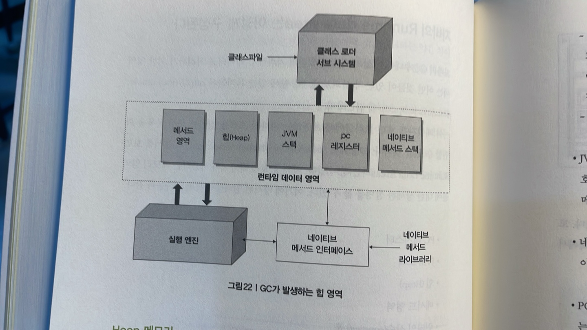

여기서 상단에 있는 '클래스 로더 서브 시스템'은 클래스나 인터페이스를 JVM으로 로딩하는 기능을 수행하고, '실행 엔진'은 로딩된 클래스의 메서들에 포함되어 있는 모든 인스트럭션 정보를 실행한다.

이 그림을 보면 좀 복잡해 보이지만, 단순하게 이야기해서 자바의 메모리 영역은 'Heap 메모리'와 'Non-heap 메모리'로 나뉜다.

### Heap 메모리
클래스 인스턴스, 배열이 이 메모리에 쌓인다.

이 메모리는 '공유 메모리'라고 불리우며, 여러 스레드에서 공유하는 데이터들이 저장되는 메모리다. 이 영역에 대한 더 자세한 내용은 다음 절에서 알아보자.

### Non-heap 메모리
이 메모리는 자바의 내부 처리를 위해서 필요한 영역이다. 여기서 주된 영역이 바로 메서드 영역이다.
- 메서드 영역 : 메서드 영역은 모든 JVM 스레드에서 공유한다. 이 영역에 저장되는 데이터들은 다음고 같다.
  - 런타임 상수 풀 : 자바의 클래스 파일에는 constant_poop 이라는 정보가 포함되어 있다. 이 constant_poop에 대한 정보를 실행 시에 참조하기 위한 영역이다. 실제 상수 값도 여기에 포함될 수 있지만, 실행 시에 변하게 되는 필드 참조 정보도 포함된다.
  - 필드 정보에는 메서드 데이터, 메서드와 생성자 코드가 있다.
- JVM 스택 : 스레드가 시작할 때 JVM 스택이 생성된다. 이 스택에는 메서드가 호출되는 정보인 프레임이 저장된다. 그리고, 지역 변수와 임시 결과, 메서드 수행과 리턴에 관련된 정보들도 포함된다.
- 네이티브 메서드 스택 : 자바 코드가 아닌 다른 언어로 된(보통은 C로 된) 코드들이 실행하게 될 때의 스택 정보를 관리한다.
- PC 레지스터 : 자바의 스레드들은 각자의 pc(Program Counter)레지스터를 갖는다. 네이티브한 코드를 제외한 모든 자바 코드들이 수행될 때 JVM의 인스트럭션 주소를 pc 레지스터에 보관한다.

> 스택의 크기는 고정하거나 가변적일 수 있다. 만약 연산을 하다가 JVM의 스택 크기의 최대치를 넘어섰을 경우에는 StackOverflowError가 발생한다. 그리고 가변적일 경우 스택의 크기를 늘이려고 할 때 메모리가 부족하거나, 스레드를 생성할 때 메모리가 부족한 경우엔 OOM이 발생한다.

여기서 Heap영역과 메서드 영역은 JVM이 시작될 때 생성된다.

지금까지 설명한 내용들을 그림으로 나타내면 다음과 같다.

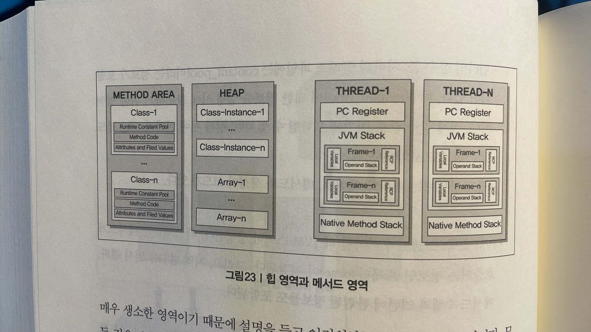

자바의 GC와 관련된 부분은 힙이므로 이 책에서는 힙 영역에 대해서만 중점적으로 살펴보자.

## GC의 원리
GC 작업을 하는 가비지 콜렉터는 다음의 역할을 한다.
- 메모리 할당
- 사용 중인 메모리 인식
- 사용하지 않는 메모리 인식

사용하지 않는 메모리를 인식하는 작업을 수행하지 않으면, 할당한 메모리 영역이 꽉 차서 JVM에 행(Hang)이 걸리거나, 더 많은 메모리를 할당하려는 현상이 발생할 것이다.

만약 JVM의 최대 메모리 크기를 지정해서 전부 사용한 다음, GC를 해도 더 이상 사용 가능한 메모리 영역이 없는데 계속 메모리를 할당하려고 하면 OOM이 발생하여 JVM이 다운될 수도 있다.

JVM의 메모리는 여러 영역으로 나뉘는데, GC와 연관된 부분은 힙이다. 따라서 가비지 콜렉터가 인식하고 할당하는 자바의 힙 영역에 대해서 상세히 알아보자.

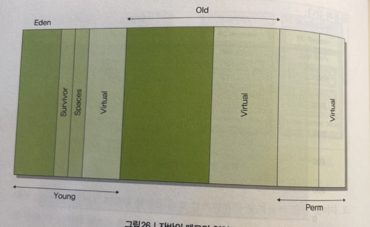

위 그림을 보면 크게 Young, Old, Perm 세 영역으로 나뉜다.

이 중 Perm(Permanent)영역은 없는 걸로 치자. 이 영역은 거의 사용되지 않는 영역으로 클래스와 메서드 정보와 같이 자바 언어 레벨에서 사용하는 영역이 아니기 때문이다.

게다가 JDK 8부터는 이 영역이 사라진다.

Virtual이라고 쓰여있는 부분 또한 가상 영역이므로 고려하지 말자.

이 두 영역을 제외하면 Young 영역과 Old 영역 일부가 남는다.

Young 영역은 다시 Eden 영역 및 두 개의 Survivor 영역으로 나뉘므로 우리가 고려해야 할 자바의 메모리 영역은 총 4개의 영역으로 나뉜다고 볼 수 있다.

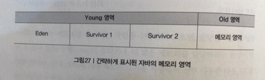

일단 메모리에 객체가 생성되면, 아래 그림의 가장 왼쪽인 Eden 영역에 객체가 지정된다.

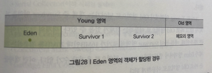

Eden 영역에 데이터가 꽉 차면, 이 영역에 있던 객체가 어디론가 옮겨지거나 삭제 되어야 한다. 이 때 옮겨가는 위치가 Survivor 영역이다.

위의 그림에서는 구분을 하기 위해서 1과 2로 나눈 것 뿐이며, 두 개의 Survivor 영역 사이에 우선 순위가 있는 것은 아니다.

이 두 개의 영역 중 한 영역은 반드시 비어 있어야 한다. 그 비어 있는 영역에 Eden영역에 있던 객체 중 GC 후에 살아 남아 있는 객체들이 이동한다.

혹은 다음과 같이 할당된다.

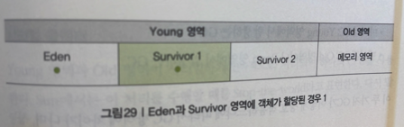

이와 같이 Eden 영역에 있던 객체는 Survivor 영역의 둘 중에 하나에 할당된다. 할당된 Survivor 영역이 차면, GC가 되면서 Eden 영역에 있는 객체와 꽉 찬 Survivor 영역에 있는 객체가 비어 있는 Survivor 영억으로 이동한다.

이러한 작업을 반복하면서 Survivor 1과 2를 왔다 갔다 하던 객체들은 Old 영역으로 이동한다.

그리고. Young 영역에서 Old 영역으로 넘어가는 객체 중 Survivor 영역을 거치지 않고 바로 Old 영역으로 이동하는 객체가 있을 수 있다.

객체의 크기가 아주 큰 경우인데, 예를들어 Survivor 영역의 크기가 16MB인데 20MB를 점유하는 객체가 Eden 영역에서 생성되면 Survivor 영역으로 옮겨갈 수가 없다.

이런 객체들은 바로 Old 영역으로 이동하게 된다.

## GC의 종류
GC는 크게 두 가지 타입으로 나뉜다. 마이너 GC와 메이저 GC의 두 가지 GC가 발생할 수 있다.

- 마이너 GC : Young 영역에서 발생하는 GC
- 메이저 GC : Old 영역이나 Perm 영역에서 발생하는 GC

이 두 가지 GC가 어떻게 상호 작용하느냐에 따라서 GC 방식에 차이가 나며, 성능에도 영향을 준다.

GC가 발생하거나 객체가 각 영역에서 다른 영역으로 이동할 때 애플리케이션의 병목이 발생하면서 성능에 영향을 주게 된다.

그래서 핫 스팟 JVM에서는 스레드 로컬 할당 버퍼라는 것을 사용한다.

이를 통하여 각 스레드별 메모리 버퍼를 사용하면 다른 스레드에 영향을 주지 않는 메모리 할당 작업이 가능해진다.

## 5가지 GC 방식
JDK 7이상에서 지원하는 GC 방식에는 다섯 가지가 있다.
- Serial Collector
- Parallel Collector
- Parallel Compacting Collector
- Concurrent Mark-Sweep Collector
- Garbage First Collector(G1 콜렉터)

여기 명시된 다섯 가지의 GC 방식은 WAS나 자바 애플리케이션 수행 시 옵션을 지정하여 선택할 수 있다.

그런데 G1 콜렉터는 JDK 7부터 정식으로 사용할 수 있다.

### 시리얼 콜렉터
Young 영역과 Old 영역에 시리얼하게(연속적으로) 처리되며 하나의 CPU를 사용한다.

Sun에서는 이 처리를 수행할 때는 Stop-the-world 라고 표현한다.

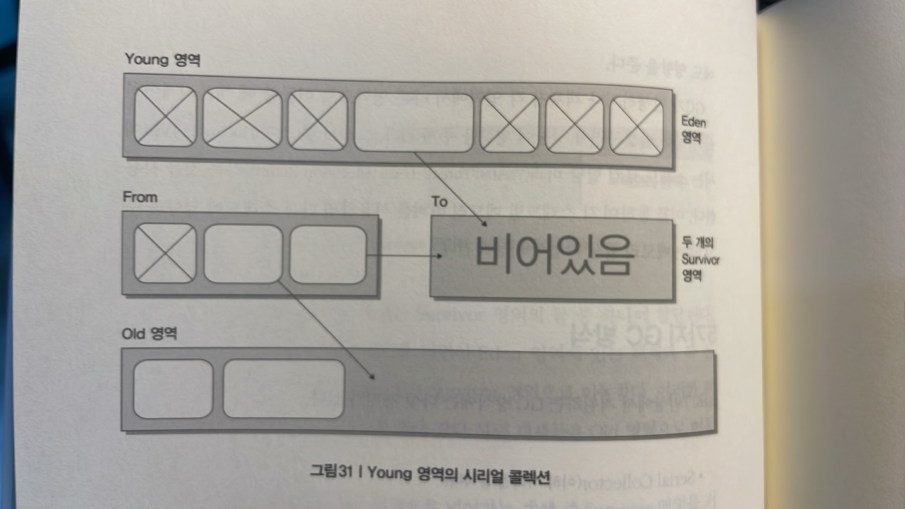

다시말하면, 콜렉션이 수행될 때 애플리케이션 수행이 정지된다.

그림의 내용은 다음과 같이 해석할 수 있다.

1. 일단 살아 있는 객체들은 Eden 영역에 있다. (각각의 둥근 사각형이 객체 하나라고 보면 된다.)
2. Edenn 영역이 꽉차게 되면 To Survivor 영역(비어있는 영역)으로 살아 있는 객체가 이동한다. 이때 Survivor 영역에 들어가기에 너무 큰 객체는 바로 Old 영역으로 이동한다. 그리고 From Survivor 영역에 있는 살아 있는 객체는 To survivor 영역으로 이동한다.
3. To Survivor 영역이 꽉 찼을 경우, Eden 영역이나 From Survivor 영역에 남아 있는 객체들은 Old 영역으로 이동한다.

이동한 결과는 다음과 같다.

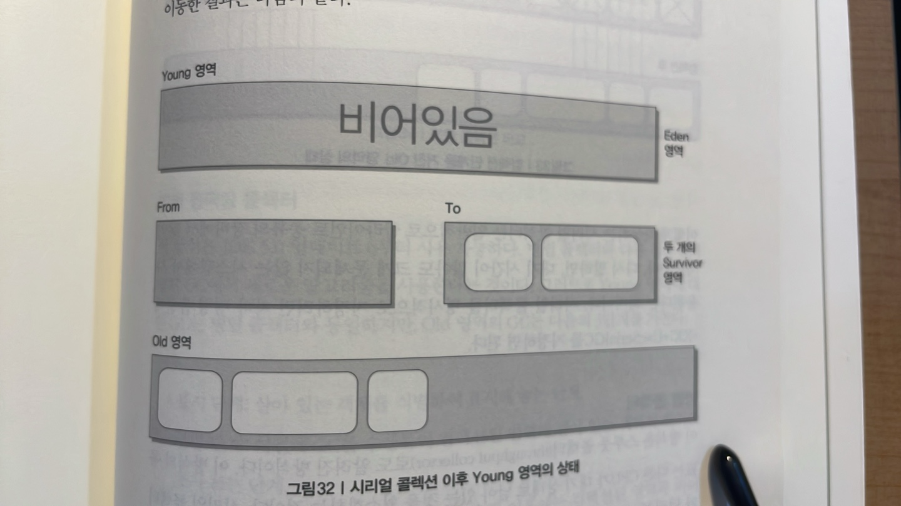

이후에 Old 영역이나 Perm 영역에 있는 객체들은 Mark-sweep-compact 콜렉션 알고리즘을 따른다.

이 알고리즘에 대해서 간단하게 말하면, 쓰이지 않는 객체를 표시해서 삭제하고 한 곳으로 모으는 알고리즘이다. Mark-sweep-compact 콜렉션 알고리즘은 다음과 같이 수행된다.

1. Old 영역으로 이동된 객체들 중 살아 있는 객체를 식별한다(표시 단계)
2. Old 영역의 객체들을 훑는 작업을 수행하여 쓰레기 객체를 식별한다(스윕 단계)
3. 필요 없는 객체들을 지우고 살아 있는 객체들을 한 곳으로 모은다(컴팩션 단계)
4. Mark-sweep-compact 단계를 거친 Old 영역은 다음과 같은 상태가 된다.

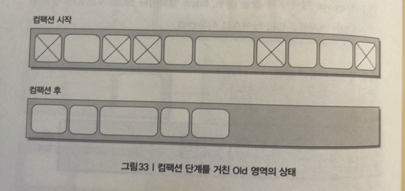

이렇게 작동하는 시리얼 콜렉터는 일반적으로 클라이언트 종류의 장비에서 많이 사용된다.

다시 말하면, 대기 시간이 많아도 크게 문제되지 않는 시스템에서 사용된다는 의미이다.

### 병렬 콜렉터
이 방식은 스루풋 콜렉터(throughput collector)로도 알려진 방식이다.

이 방식의 목표는 다른 CPU가 대기 상태로 남아 있는 것을 최소화하는 것이다.

시리얼 콜렉터와 달리 Young 영역에서의 콜렉션을 병렬로 처리한다. 많은 CPU를 사용하기 때문에 GC의 부하를 줄이고 애플리케이션의 처리량을 증가시킬 수 있다.

Old 영역의 GC는 시리얼 콜렉터오 마찬가지로 Mark-sweep-compact 콜렉션 알고리즘을 사용한다.

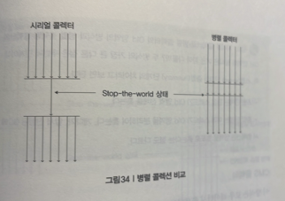

### 병렬 콤팩팅 콜렉터
병렬 콜렉터와 다른 점은 Old 영역 GC에서 새로운 알고리즘을 사용한다는 것이다.

그러므로 Young 영역에 대한 GC는 병렬 콜렉터와 동일하지만, Old 영역의 GC는 다음의 3단계를 거친다.

- 표시 단계 : 살아 있는 객체를 식별하여 표시해 놓는 단계
- 종합 단계 : 이전에 GC를 수행하여 컴팩션된 영역에 살아 있는 객체의 위치를 조사하는 단계
- 컴팩션 단계 : 컴팩션을 수행하는 단계. 수행 이후에는 컴팩션된 영역과 비어있느 영역으로 나뉜다.

병렬 콜렉터와 동일하게 이 방식도 여러 CPU를 사용하는 서버에 적합하다.

### CMS 콜렉터
이 방식은 로우 레이턴시콜렉터 로도 알려져 있으며, 힙 메모리 영역의 크기가 클 때 적합하다.

Young 영역에 대한 GC는 병렬 콜렉터와 동일하다.

Old 영역의 GC는 다음 단계를 거친다.

- 초기 표시 단계 : 매우 짧은 대기 시간으로 살아 있는 객체를 찾는 단계
- 컨커런트 표시 단계 : 서버 수행과 동시에 살아 있는 객체를 표시를 해 놓는 단계
- 재표시 단계 : 컨커런트 표시 단계에서 표시하는 동안 변경된 객체에 대해서 다시 표사하는 단계
- 컨커런트 스윕 단계 : 표시되어 있는 쓰레기를 정리하는 단계

CMS는 컴팩션 단계를 거치지 않기 때문에 왼쪽으로 메모리를 몰아 놓는 작업을 수행하지 않는다. 

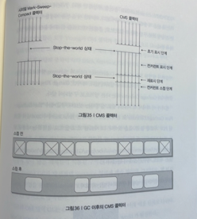

CMS 콜렉터 방식은 2개 이상의 프로세서를 사용하는 서버에 적당하다.

가장 적당한 대상으로는 웹 서버가 있다.

CMS 콜렉터는 추가적인 옵션으로 점진적 방식을 지원한다. 이 방식은 Young 영역의 GC를 더 잘게 쪼개어 서버의 대기 시간을 줄일 수 있다.

### G1 콜렉터
지금까지 설명한 모든 GC는 Eden과 Survivor 영역으로 나뉘는  Young 영역과 Old 영역으로 구성되어 있다.

하지만, Garage First (G1)는 지금까지의 Garbage Collector 와는 다른 영역으로 구성되어 있다.

먼저 G1 콜렉터가 어떻게 구서오디어 있는지 보자.

G1은 바둑판 모양으로 되어 있다.

여기서 각 바둑판의 사각형을 region이라고 하는데, Young 영역이나 Old 영역이라는 단어와 구분하기 위해서 한국말로 '구역'이라고 하자.

G1 은 Young 영역과 Old 영역이 물리적으로 나뉘어 있지 않고, 각 구역의 크기는 모두 동일하다.

앞서 살펴본 콜렉터들은 모두 Young과 Old 영역의 주소가 물리적으로 Linear하게 나열 되지만, G1은 그렇지 않다.

이 바둑판 모양의 구역이 각각 Eden, Survivor, Old 영역의 역할을 변경해 가면서 하고, Humongous라는 영역도 포함된다.

G1이 Young GC를 어떻게 하는지 살펴보면 다음과 같다.

1. 몇 개의 구역을 선정하여 Young 영역으로 지정한다.
2. 이 Linear 하지 않은 구역에 객체가 생성되면서 데이터가 쌓인다.
3. Young 영역으로 할당된 구역에 데이터가 꽉차면 GC를 수행한다.
4. GC를 수행하면서 살아있는 객체들만 Survivor 구역으로 이동시킨다.

이렇게 살아 남은 객체들이 이동된 구역은 새로운 Survivor 영역이 된다.

그 다음에 Young GC가 발생하면 Survivor 영역에 계속 쌓는다. 그러면서, 몇 번의 aging 작업을 통해서 Old영역으로 승격된다.(살아있으면)

