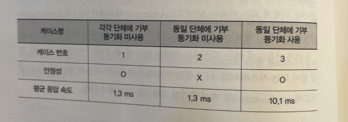
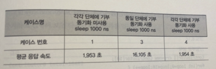

# ✍🏻 08. synchronized는 제대로 알고 써야 한다
우리가 개발하는 WAS는 여러 개의 스레드가 동작하도록 되어 있다.

그래서 synchronized를 자주 사용한다. 하지만 synchronized를 쓴다고 무조건 안정적인 것은 아니며, 성능에 영향을 미치는 부분도 있다.

스레드가 어떻게 작동되는지 간단하게 알아보고, 무엇을 조심해야 하는지 확인해보자.

## 자바에서 스레드는 어떻게 사용하나?
### 프로세스와 스레드
여러분이 클래스를 하나 수행시키거나 WAS를 기동하면, 서버에 자바 프로세스가 하나 생성된다. 하나가 생성되는지 여러 개가 생성되는지는 윈도의 자원관리자나 리눅스, 유닉스의 프로세스를 조회해 보면 된다.

하나의 프로세스에는 여러 개의 스레드가 생성된다. 단일 스레드가 생성되어 종료될 수도 있고, 여러 개의 스레드가 생성되어 수행될 수도 있다.

그러므로 프로세스와 스레드의 관계는 1:N 관계라고 보면 된다.

프로세스와 스레드는 왜 이러한 관계가 만들어질까?

스레드는 다른 말로 Lightweight Process(LWP)라고도 한다.

즉, 가벼운 프로세스이고, 프로세스에서 만들어 사용하고 있는 메모리를 공유한다.

그래서 별개의 프로세스가 하나씩 뜨는 것보다는 성능이나 자원 사용에 있어서 많은 도움이 된다.

### Thread 클래스 상속과 Runnable 인터페이스 구현
스레드의 구현은 Thread 클래스를 상속받는 방법과 Runnable 인터페이스를 구현하는 방법 두 가지가 있다.

기본적으로 Thread 클래스는 Runnable 인터페이스를 구현한 것이기 때문에 어떤 것을 사용해도 거의 차이가 없다.

대신 Runnable 인터페이스를 구현하면 원하는 기능을 추가할 수 있다. 이는 장점이 될 수도 있지만, 해당 클래스를 수행할 때 별도의 스레드 객체를 생성해야 한다는 점은 단점이 될 수도 있다.

또하나 자바는 다중 상속을 인정하지 않는다. 따라서 스레드를 사용해야 할 때 이미 상속받은 클래스가 존재하면 Runnable 인터페이스를 구현해야 한다.

그럼 이 클래스들을 어떻게 실행해야 할까?

Thread 클래스를 상속받은 경우에는 start() 메서드를 호출하면 된다. 

하지만 Runnable 인터페이스를 구현한 경우에는 Thread 클래스의 Runnable 인터페이스를 매개변수로 받는 생성자를 사용해서 Thread 클래스를 만든 후 start() 메서드를 호출해야 한다.

그렇게 하지않고 그냥 run() 메서드를 호출하면 새로운 스레드가 생성되지 않는다.

두 가지 경우를 동시에 실행해보면 알겠지만, 실행할 때 마다 결과 값이 고정되지 않는다.

스레드를 호출하면서 우선순위를 따로 지정하지 않았으므로 Thread 클래스를 상속받은 결과가 먼저 나올 수도 있고, Runnable 인터페이스를 구현한 결과가 먼저 나올수 도 있다.

### sleep(), wait(), join() 메서드
sleep()은 명시된 시간만큼 해당 스레드를 대기시킨다.

wait()도 명시된 시간만큼 해당 스레드를 대기시킨다. sleep() 메서드와 다른 점은 매개변수인데, 만약 아무런 매개변수를 지정하지 않으면 notify() 메서드 혹은 notifyAll() 메서드가 호출될 때 까지 기다린다.

join()은 명시된 시간만큼 해당 스레드가 죽기를 기다린다. 만약 아무런 매개변수를 지정하지 않으면 죽을 때 까지 기다린다.

### interrupt(), notify(), notifyAll() 메서드
아까 말한 세개의 메서드를 '모두' 멈출 수 있는 유일한 메서드는 interrupt() 메서드다.

interrupt() 메서드가 호출되면 중지된 스레드에는 InterruptedException이 발생한다.

notify(), notifyAll()는 모두 wait()을 멈추기 위한 메서드다.

전자는 객체의 모니터와 관련있는 단일 스레드를 꺠우며, 후자는 객체의 모니터와 관련 있는 모든 스레드를 깨운다.

## interrupt() 메서드는 절대적인 것이 아니다
interrupt() 메서드를 호출하여 특정 메서드를 중지시키려고 할 때 항상 해당 메서드가 멈출까?

정답은 '아니오'이다.

간단히 설명하면 interrupt()는 해당 스레드가 'block'되거나 특정 상태에서만 작동한다는 말이다.

예를 들어 무한 루프를 도는 스레드를 interrupt()하려고 했을 때, 멈추지 않는다.

interrupt()는 대기 상태일 때에만 해당 스레드를 중단시키기 때문에 이 스레드는 멈추지 않는다.

따라서 flag 값을 바꾸는 로직을 추가하거나, 중간에 sleep()을 넣어주면 이때 interrupt()메서드가 호출되면 이 스레드는 멈춘다.

## synchronized를 이해하자
웹 기반의 시스템에서 스레드 관련 부분 중 가장 많이 사용하는 것은 synchronized일 것이다.

제대로 알지 못하고 synchronized를 사용하면 성능에 악영향을 미칠 수도 있다.

사전적 의미는 다음과 같다.
> synchronize 동사 : 동시에 일어나다. 동시에 진행하다.

동시에 처리한다는 말인데, 뭘 어떻게 동시에 처리한다는 것일까?

synchronized의 문법을 간단하게 본 후 예제를 통해 더 확실하게 확인하자.

synchronized는 하나의 객체에 여러 객체가 동시에 접근하여 처리하는 상황이 발생할 때 발생한다.

하나의 객체에 여러 요청이 동시에 달려들면 원하는 처리를 하지도 못하고 이상한 결과가 나올 수 있다.

그래서 synchronized를 사용해서 동기화를 하는 것이다.

이 식별자를 사용하면 "천천히 한 명씩 들어와!" 라고 해당 메서드나 블록에서 제어하게 된다.

synchronized를 static과 연결해서 생각하면 더더울 복잡해진다. 그러니 기본적인 부분부터 확인을 해보자.

synchronized는 다음과 같이 메서드와 블록으로 사용할 수 있다. 절대로 생성자의 식별자로는 사용할 수 없다는 점을 염두에 두기 바란다.

```java
public synchronized void sampleMethod() {
    // 중간 생략
}

private Object obj = new Object();

public void sampleBlock() {
    synchronized (obj) {
        // 중간 생략
    }
}
```
이처럼 간단히 synchronized라는 식별자만 쓰면 동기화할 수 있다.

메서드를 동기화하려면 메서드 선언부에 사용하면 된다. 특정 부분을 동기화하려면 해당 블록에만 선언을 해서 사용하면 된다.

사용 방법은 단순하지만, 이 식별자의 힘은 막강하다.

그럼 언제 동기화를 사용해야 할까?

- 하나의 객체를 여러 스레드에서 동시에 사용할 경우
- static으로 선언한 객체를 여러 스레드에서 동시에 사용할 경우

간단하게 두 가지로 요약할 수 있다. 거꾸로 이야기 하면, 위의 경우가 아니면 동기화를 할 필요가 별로 없다.

## 동기화는 이렇게 사용한다 - 동일 객체 접근 시
간단한 예를 들어보자.

여러 기부자가 어떤 기부금을 처리하는 단체에 기부금을 내는 상황을 가정한다.

기부금을 내는 사람은 스레드로 구현되며, 기부금을 내는 사람의 이름 정보가 있어야 한다.

기부금을 받는 단체는 기부금을 받을 창구로 donate()라는 메서드를 제공한다.

기부한 전체 기부금을 확인하는 메서드는 getTotal()이다.

먼저 기부금을 받는 단체의 클래스를 구현한 소스를 보자.

```java
public class Contribution {
    private int amount = 0;

    public void donate() {
        amount++;
    }

    public int getTotal() {
        return amount;
    }
}
```

기부금은 계속 축적되어야 하므로, amount라는 변수로 선언되어 있다. 그럼 기부금을 내는 사람의 클래스를 구현한 소스를 보자.

```java
public class Contributor extends Thread {
    private Contribution myContribution;
    private String myName;

    public Contributor(Contribution contribution, String name) {
        myContribution = contribution;
        myName = name;
    }

    public void run() {
        for (int loop = 0; loop < 1000; loop++) {
            myContribution.donate();
        }
        System.out.println(myName, myContribution.getTotal());
    }
}
```

소스를 보면 1인당 1원씩 1000원 기부하고, 기부가 완료되면 현재까지 쌓인 기부금을 프린트하도록 되어 있다.

이제 기부를 하도록 하는 실행 파일을 보자.

```java
public class ContributeTest {
    public static void main(String[] args) {
        Contributer[] crs = new Contributer[10];
        // 기부자와 기부 단체 초기화
        for (int loop = 0; loop < 10; loop++) {
            Contribution group = new Contribution();
            crs[loop] = new Contributor(group, " Contributor" + loop);
        }

        for (int loop = 0; loop < 10; loop++) {
            crs[loop].start();
        }
    }
}
```

이렇게 수행하면 기부금을 받는 단체인 group 객체를 매번 새로 생성했기 때문에 10명의 기부자가 10개의 각기 다른 단체에 기부하는 상황이 될 것이다.

수행 결과는 아래와 같다.

```shell
Contributor0 total=1000
Contributor8 total=1000
Contributor6 total=1000
Contributor4 total=1000
Contributor2 total=1000
Contributor9 total=1000
Contributor5 total=1000
Contributor3 total=1000
Contributor7 total=1000
Contributor1 total=1000
```

수행을 할 때마다 결과는 다르겠지만. 기부자가 돈을 낸 각 기부 단체에는 1000원씩 기부되었을 것이다.

그럼 만약 기부 단체가 하나만 있을 경우엔 어떻게 될까?

앞의 ContributeTest를 다음과 같이 수정하여 매번 기부자를 생성하지 않고, 하나의 그룹을 여러 기부 단체에서 참조하도록 하면 원하는 기능이 구현될 것이다.

```java
public class ContributeTest {
    public static void main(String[] args) {
        Contributer[] crs = new Contributer[10];
        Contribution group = new Contribution();
        // 기부자와 기부 단체 초기화
        for (int loop = 0; loop < 10; loop++) {
            crs[loop] = new Contributor(group, " Contributor" + loop);
        }
        // 생략
```
예상대로라면 각 단체에서 돈을 1000원씩 냈기 때문에, 어떤 기부자가 마지막에 수행이 되든 기부금의 총 합은 10000원이 되어야 한다. 실행한 결과를 보자.

```shell
Contributor0 total=1000
Contributor8 total=9707
Contributor9 total=8707
Contributor7 total=7707
Contributor4 total=6707
Contributor5 total=5707
Contributor6 total=5676
Contributor2 total=3964
Contributor3 total=3121
Contributor1 total=2000
```
여러 번 수행해 보면 알겠지만, 간혹 10000이라는 값이 프린트 될 때도 있다.

하지만 대부분 10000이라는 값이 프린트되지 않고, 위 결과를 봐도 9707이 최대 값이다.

이렇게 되는 이유는 10개의 Contributor 객체에서 하나의 Contribution 객체의 doante() 메서드를 동시에 접근할 수 있도록 되어 있기 때문이다.

이 오류를 수정하기 위해선 아래와 같이 donate()메서드에 synchronized를 써서 동기화 식별자를 추가해야 한다.

```shell
public synchronized void donate() {
  amout++;
}
```

이렇게 하면 최종 값은 항상 10000이 될 것이다.

그렇다면 이제 기부 단체에 각각 기부할 때, 하나의 단체에 동기화를 하지 않고 기부할 때, 하나의 단체에 동기화를 하고 기부할 때 세가지 경우에 얼마나 시간 차이가 발생하는지 확인해 보자ㅏ.

소요된 평균 시간은 다음과 같다.



동일 단체에 기부하고 동기화를 사용하지 않은 경우는 정상적인 결과 값이 넘어오지 않으므로 논의할 필요가 없다.

1번 케이스는 응답 속도가 1.3ms 소요되었고, 3번 케이스는 10ms 소요되었다.

거의 7배의 차이가 발생한다.

그럼 만약 1번 케이스에 synchronized를 명시하면 어떻게 될까? 이 경우엔 2.2ms가 소요된다.

필요없는 부분에 synchronized를 사용하면 약간이지만 성능에 영향을 준다는 의미이다.

약간의 대기시간을 주기 위해 1번과 3번 케이스의 donate()메서드에 1000ns씩 쉬도록 sleep을 추가하자.

결과는 아래와 같다.



대기 시간을 넣으니 응답 시간이 많이 증가하였다.

3번 케이스는 16초나 소요된다. 필요한 부분에 동기화를 했지만, 응답 속도에 너무 많은 차이가 난다.

그러므로 반드시 필요한 부분에만 동기화를 사용해야 이와 같은 성능 저하를 줄일 수 있다.

## 동기화는 이렇게 사용한다 - static 사용 시
앞서 살펴본 예제에서 amount를 static으로 선언하고 synchronized를 사용하면 어떻게 되는지 보자.

```java
public class ContributionStatic {
  private static int amount=0;
  public void donate() {
    amount++;
  }
  public int getTotal() {
    return amount;
  }
}
```
이렇게 static으로 amount를 선언하였다.

각 단체에 기부하는 케이스를 고려해 보자.

```java
// 생략
Contributor[] crs = new Contributor[10];
for(int loop=0;loop<10;loop++){
    Contribution group = new Contribution();
    crs[loop]=new Contributor(group, "Contributor" + loop);
}
// 생략
```

각 단체에 기부하기 위해 그룹을 각 기부자별로 부여해 놓았다. 이 메서드를 수행한 결과를 보자.
```shell
Contributor0 total=10000
Contributor8 total=94786
Contributor9 total=84796
... 대충 다 다른 100000이 아닌 큰 값
```
우리가 원하는 결과가 나오지 않는다. 각 단체에 기부하는 케이스라고 하더라도, amount를 static으로 선언하면 객체의 변수가 아닌 클래스의 변수가 된다.

따라서 아무리 여러 단체가 있더라도 하나의 amount 값을 지정하게 되므로 이렇게 사용해선 절대 안된다.

그럼 synchronized만 쓰면 해결이 될까?

donate()에 synchronized를 추가하고 실행해 보면 다음과 같은 결과를 얻는다.

```shell
대충 다 다른 100000이 아닌 큰값
```

희한하게도 우리가 원하는 결과 값이 나오지 않는다.

synchronzied는 각각의 객체에 대한 동기화를 하는 것이지만, amount에 대한 동기화는 되지 않는다.

그래서 다음과 같이 수정하였다.

```shell
public class ContributionStatic {
  private static int amount=0;
  public static synchronized void donate() {
    amount++;
  }
  public int getTotal() {
    return amount;
}
```

앞서 이야기 했지만, amount는 클래스 변수이므로 메서드도 클래스 메서드로 참조하도록 static을 추가해 주어야 한다.

이렇게 하면 우리가 원하는 결과를 얻을 수 있다. (100000원이 존재하는)

응답 시간은 거의 비슷하다.

계속 강조했지만, 항상 변하는 값에 대해서 static 으로 선언하여 사용하면 굉장히 위험하다. synchronized도 꼭 필요할 때만 사용하기 바란다.

## 동기화를 위해서 자바에서 제공하는 것들
java.util.concurrent
- Lock : 실행 중인 스레드를 간단한 방법으로 정지시켰다가 실행시킨다. 상호 참조로 인해 발생하는 데드락을 피할 수 있다.
- Executors: 스레드를 더 효율적으로 관리할 수 있는 클래스들을 제공한다. 스레드 풀도 제공하므로, 필요에 따라 유용하게 사용할 수 있다.
- Concurrent 콜렉션 : 앞서 살펴본 콜렉션의 클래스들을 제공한다.
- Atomic 변수 : 동기화가 되어 있는 변수를 제공한다. 이 변수를 사용하면, synchronized 식별자를 메서드에 지정할 필요 없이 사용할 수 있다.
