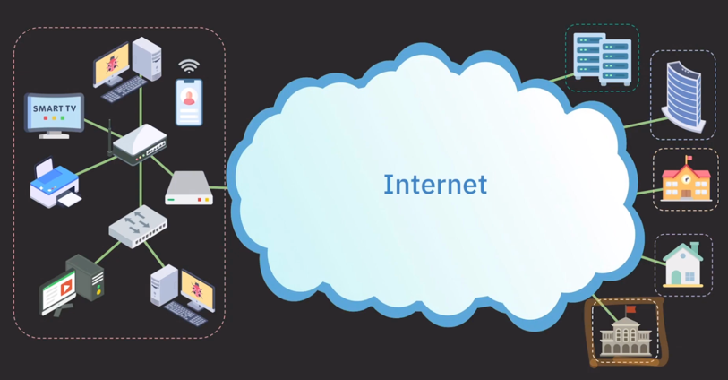
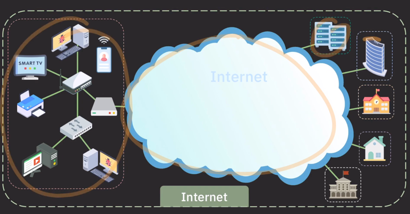
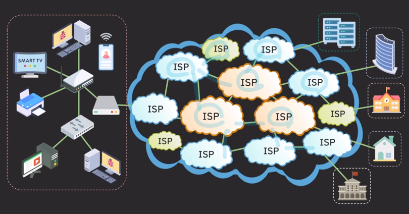
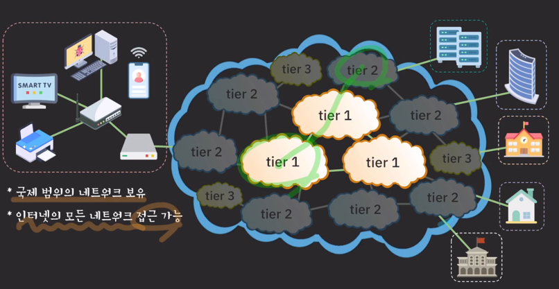
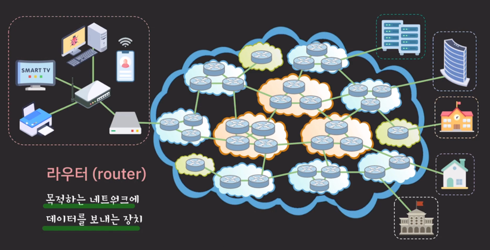
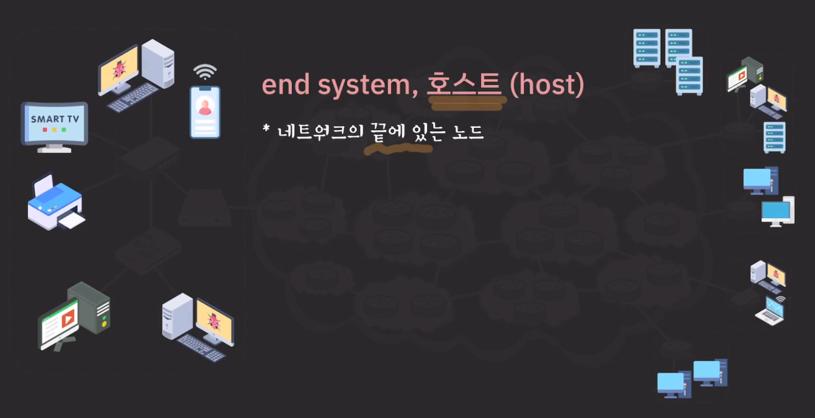

- 공유기를 통해 같은 네트워크 내에 컴퓨터, 폰, 인쇄기 등등 연결 가능.
  - 이때 랜 포트가 부족하면 `스위치`를 통해 더 많은 기기 연결가능
- LAN
  - 집, 학교, 회사 건물 등 제한된 범위 내에서 컴퓨터나 기타 기기들을 연결해서 데이터나 리소스를 공유할 수 있게 하는 네트워크
    - 
  - 이더넷 (유선통신), Wi-fi (무선통신)
- WAN
  - 여러 LAN이나 다른 종류의 네트워크들을 하나로 묶어서 멀리 떨어진 기기들도 통신이 가능하도록 만든 네트워크
  - 훨씬 더 넓은 범위를 커버하는 네트워크
  - 인터넷, LTE , ATM 등등
- 인터넷
  - 이 전체가 인터넷임
    - 
  - 세계에서 가장 큰 WAN
- ISP
  - 일반 사용자나 회사, 기관 등이 인터넷을 사용할 수 있도록 인터넷 연결 서비스를 제공하는 존재
  - 
  - 역할과 규모에 따라 tier가 나뉜다
    - 
    - tier1
      - 국제 범위의 네트워크 보유
      - 인터넷의 모든 네트워크 접근 가능
      - 인터넷의 중추 역할(backbone)
      - 트래픽 전송 비용 없음
        - 하위 티어가 티어1에 가려면 비용을 내지만 티어1끼리는 비용x
    - tier2
      - 국가/지방 범위 네트워크 보유 (KT, LG, SK)
      - 일반 사용자나 기업 대상 서비스
      - 인터넷의 모든 영역에 연결되기 위해 tier 1 ISP에 비용을 내고 트래픽 전송 (거쳐갈때 tier1있으면 비용냄)
    - tier3
      - 작은 지역 범위 서비스 제공
      - 일반 사용자나 기업 대상 서비스
      - 상위 ISP들에게 비용을 내고 인터넷 트래픽을 구매해서 이를 통해 서비스
  - 그렇다면 ISP 네트워크간에는 어떻게 연결되는 걸까
    - 
    - 라우터
      - 목적하는 네트워크에 데이터를 보내는 장치

---

---
## 장치
- 노드
  - 네트워크를 이루는 장치(device)
  - 호스트 : 네트워크의 끝에 있는 노드
    - 
    - 네트워크를 `사용하기 위해` 연결된 노드
    - 클라이언트와 서버로 나뉨
  - 클라이언트
    - 다른 호스트의 데이터나 리소스를 요청하는 호스트
  - 서버
    - 다른 호스트에게 서비스를 제공하는 호스트
    - 요청에 따라 데이터나 리소스를 제공
  - 