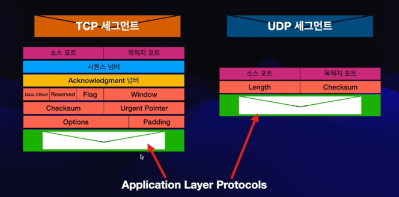
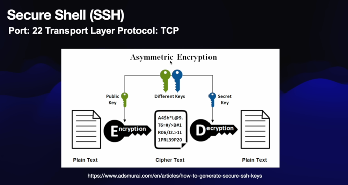
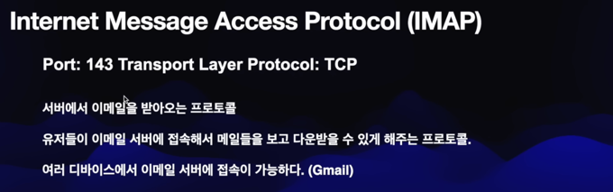
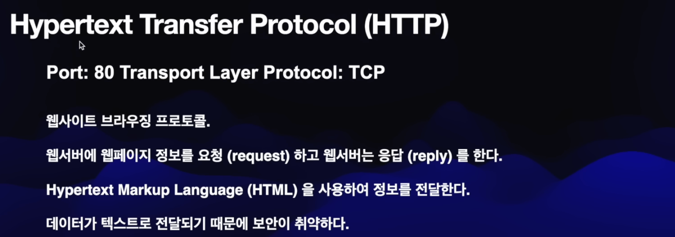
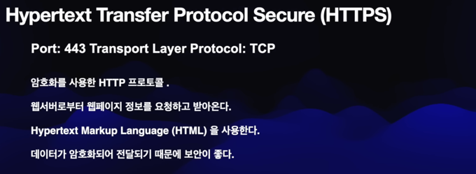

## Dynamic Host Configuration Protocol (DHCP)

## DNS

## Daytime

## Secure Shell (SSH)

## File Transfer Protocol (FTP)

## Secure File Transfer Protocol (SFTP)

## Simple Mail Transfer Protocol (SMTP)

## Internet Message Access Protocol (IMAP)

## Hypertext Transfer Protocol (HTTP)

## Hypertext Transfer Protocol Secure (HTTPS)
