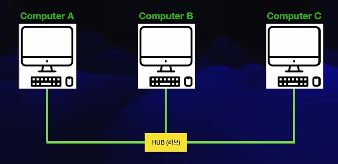
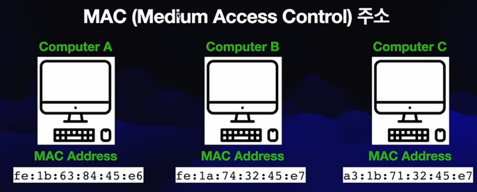
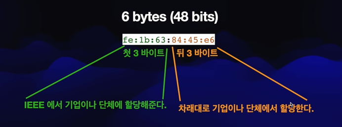
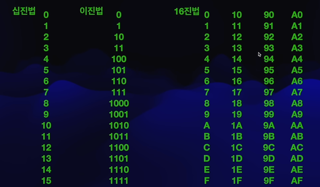
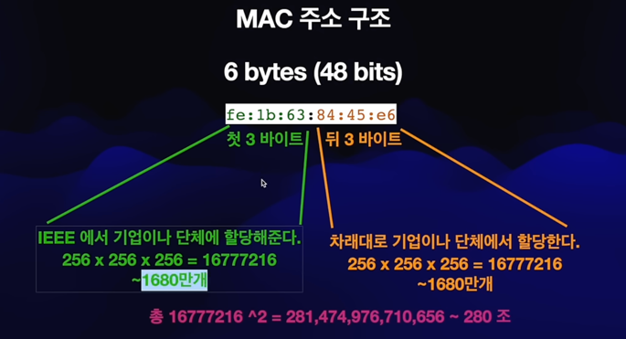
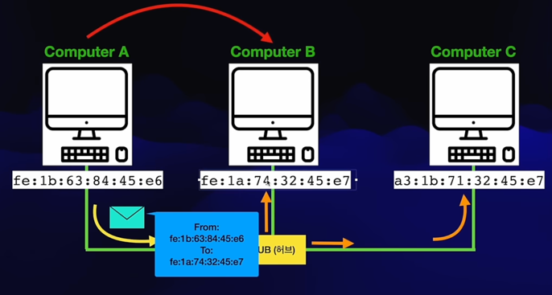
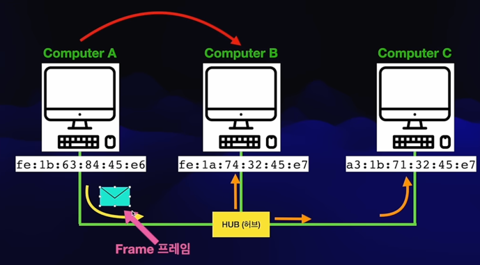
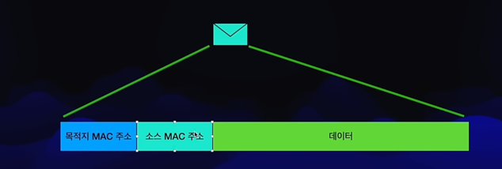
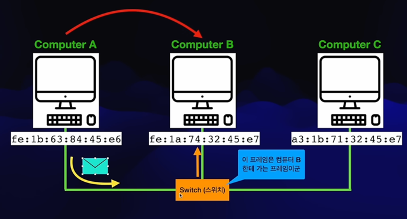
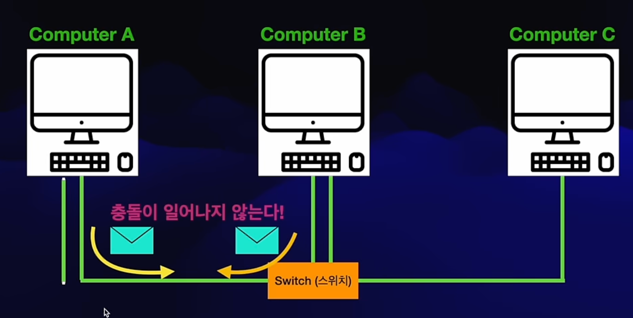

## 허브
- 컴퓨터가 여러 대 일때, 케이블을 연결시키면 컴퓨터끼리 소통 가능.
  - 이 연결을 도와주는 것이 허브
  - 
  - 하지만 더이상 사용되지 않는다.
  - 문제점
    - 정보가 연결된 모든 컴퓨터에 전달된다.
    - 정보가 충돌한다. (A에서 보내는데 B에서도 보내면 서로 충돌이 일어날 수 있음)
  - 해결
    - 충돌 있는지 확인 위해 더미 정보 보내서, 충돌이면 좀더 기다렸다가 정보를 보냄
      - 더미 정보 보냈을 때 잘 보내지면 그때 정보를 보내기 시작함
      - 시간이 오래걸림
      - CSMA/CD라고 부름
    - 정보가 모든 컴퓨터로 가는 문제는 문제를 해결하는 방법
      - 데이터를 보내면서 이 데이터는 컴퓨터 B 한테 보내는 데이터라는 정보를 같이 보냄
      - C는 본인에게 온 정보가 아니므로 안 읽고 버림
      - 그럼 위에 말한 "정보"는 무엇을 말하는걸까?
        - MAC 주소

## MAC 주소
- 
- 각 컴퓨터마다 고유의 MAC 주소를 가지게 된다.
- 네트워크 인터페이스 카드에 각인된 물리적 주소. 
  - 네트워크 인터페이스 카드는 네트워크에 연결되는 디바이스들에 존재한다.
    - 컴퓨터, 블루투스, 핸드폰 등등
- 구조
  - 
  - 6 bytes (48bits)
  - 첫 3바이트는 IEEE 에서 기업이나 단체에 할당해줌.
  - 뒤 3바이트는 차례대로 기업이나 단체에서 할당한다.

- 자세한 구조
  - 
  - fe가 1바이트라고 했는데, 왜 그럴까
    - 
  - 맥 주소는 16진법으로 나타낸 것임

- 정리
  - 
  - 
  - 
  - 그래서 허브에서 MAC 주소를 통해 누가 보내는 신호인지 판별했던 것임

## 프레임
- 
- (이더넷)프레임 단위로 보냄.
- 

## 스위치
- 지금까진 허브로 네트워크를 연결시켰다.
  - 하지만 여러 문제로 더이상 쓰지 않는다.
- 스위치는 똑똑하다. MAC 주소들을 저장하고 있기 때문에
  - 
- 스위치는 똑똑하다. 충돌이 일어나지 않기 때문에
  - 각 컴퓨터마다 두 케이블을 지니고, 하나는 받는쪽, 하나는 전달하는 쪽으로 이루어짐
  - 
