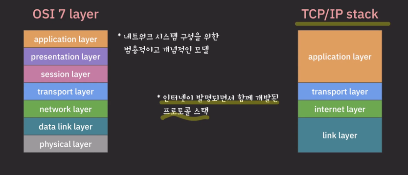

### TCP/IP 스택 기준으로 설명
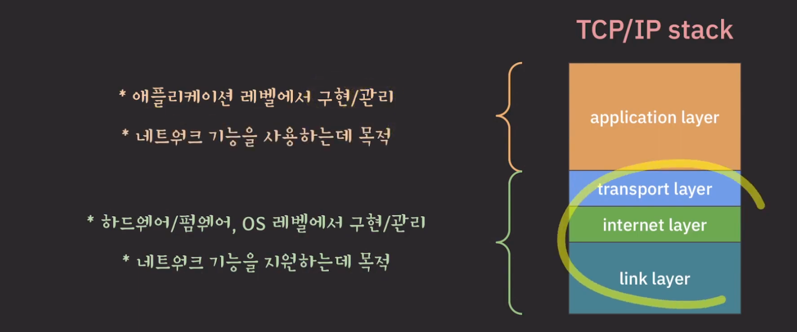
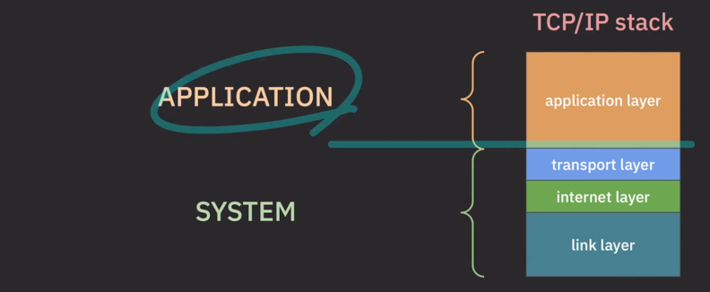
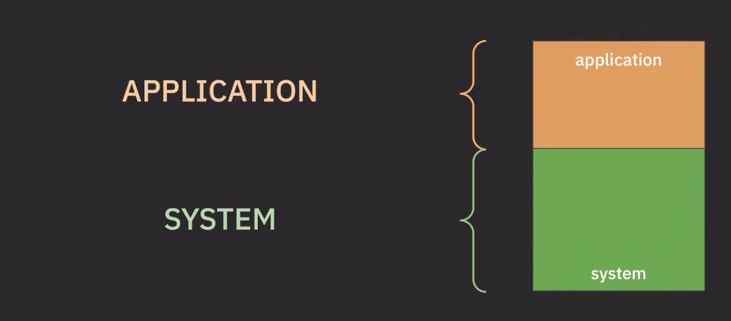

## 포트
- 애플리케이션 계층의 프로세스 하나가 다른 애플리케이션으로 데이터를 전달하고 싶다면 `포트`를 통해 시스템 계층으로 들어가야 함
  - 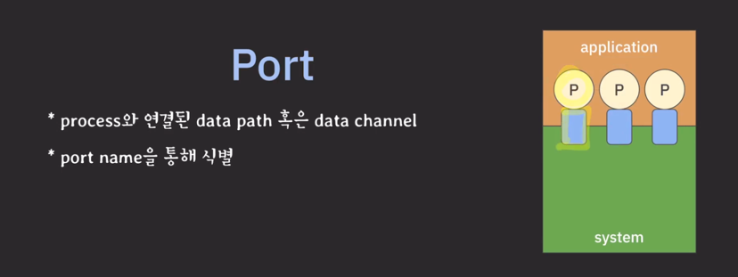

## TCP
- connection-oriented(연결지향) protocol
- 서로 다른 컴퓨터의 프로세스끼리 통신을 하려고 하는 상황
  - 인터넷 프로토콜은 신뢰성을 완전히 보장해주지 않기 때문에 TCP 프로토콜 도입
    - 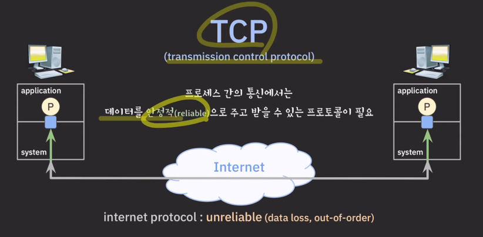
- Connection
  - 프로세스 간의 안정적이고 논리적인 통신 통로
  - 통신 과정
    - 커넥션을 열고(3way handshake), 데이터를 주고 받고, 커넥션을 닫는다(4way handshake)
    - connection-oriented (커넥션 기반의 통신이라는 뜻)
  - 인터넷 상에서 어떻게 포트를 유니크하게 식별할까?
    - 포트(number) 정의
      - 16비트로 이루어진 숫자 (0~65535)
      - 하지만 포트 넘버 만으로는 유니크하게 식별할 수 없다.
      - 그런데 인터넷 어드레스로 각 호스트를 유니크하게 식별할 수 있다.
    - 따라서 internet address + port number = socket
      - 
      - 인터넷 상에 존재하는 각 포트를 유니크하게 식별하기 위한 주소
      - 각 소켓은 인터넷 상에서 유니크 하다.

## 커넥션과 소켓(TCP)
- 각 커넥션을 유니크하게 식별할 수 있어야 한다.
- 한 쌍의 소켓은 커넥션을 유니크하게 식별한다. (커넥션(유일) = 소켓1(유일) + 소켓2(유일))
- 하나의 소켓은 동시에 여러 커넥션들에서 사용될 수 있다.

## UDP
- connectionless 프로토콜
  - 연결을 맺지 않고 바로 데이터를 주고 받는다.
- unreliable
  - 인터넷 프로토콜을 거의 그대로 사용
- UDP 표준을 보면 소켓이란 단어가 등장하지 않는다.
- 이후에 자연스럽게 UDP 에도 소켓 개념을 쓰기 시작
  - `소켓은 <protocol, ip adress, port number>로 유니크하게 식별`

## TCP/IP 스택에서는..
- 아래와 같은 경우는 허용되지 않음 (각각이 유니크하지 않은 소켓이므로)
  - 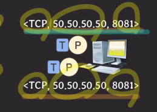
- 이건 허용 됨
  - 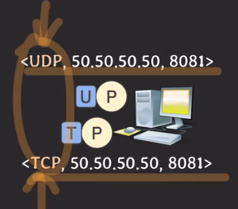
  - 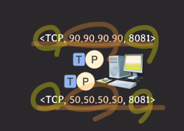
  - 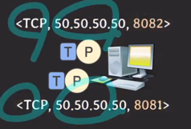
- 아래와 같은 상황에선
  - 
  - 각각의 커넥션은 유니크하게 식별 가능
    - 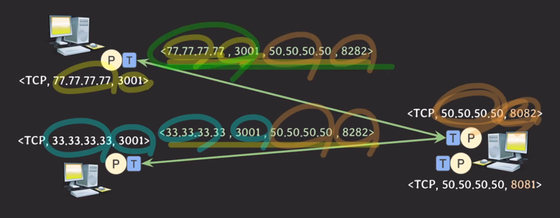

---
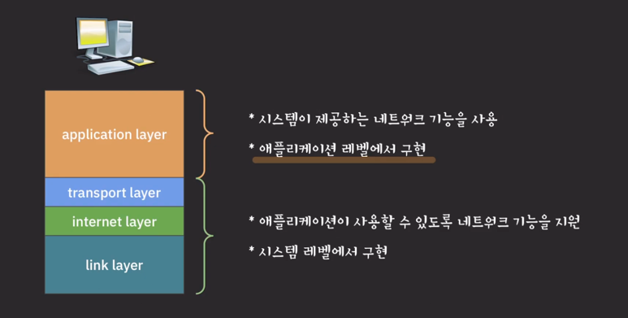
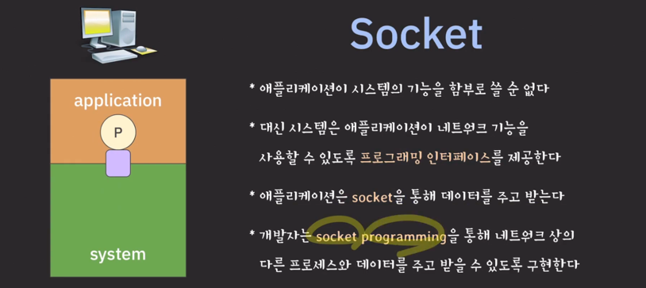

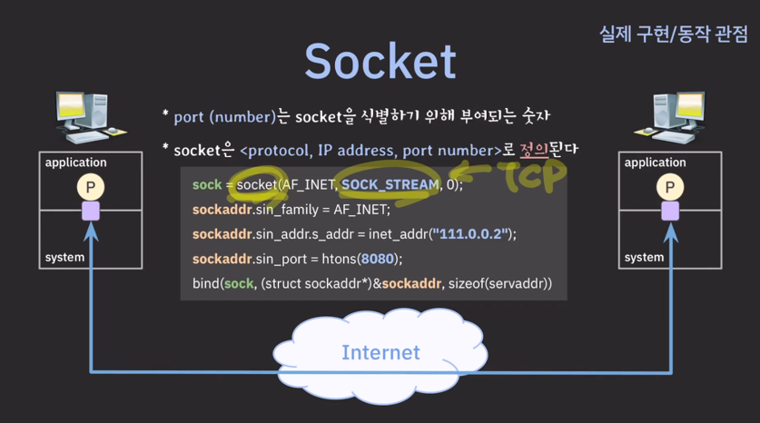
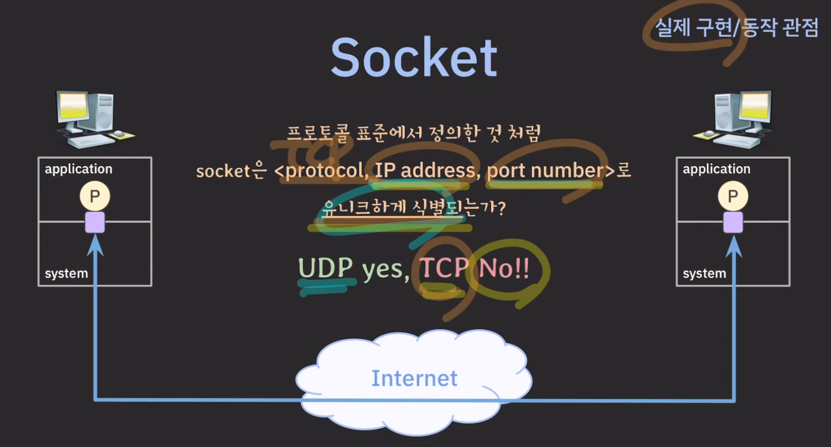

---
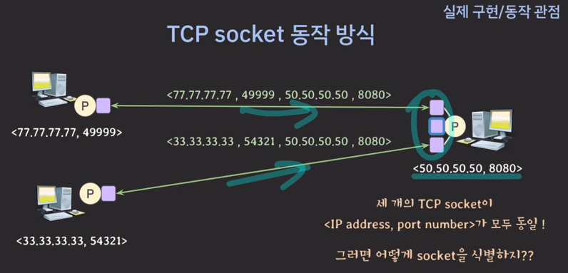
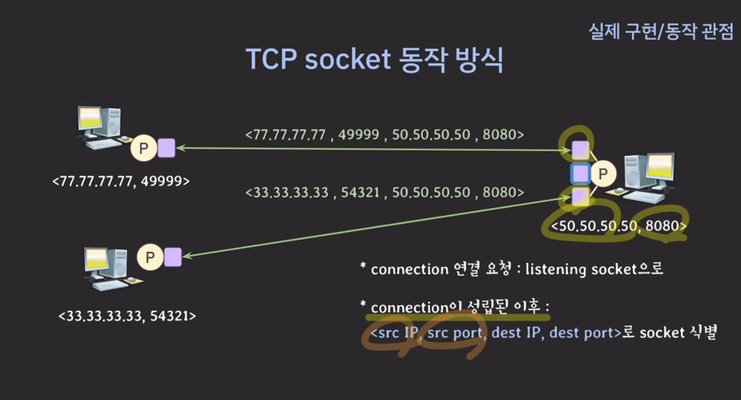

---

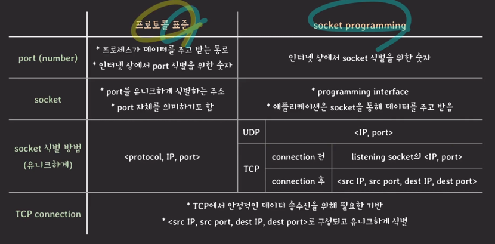