- 이진 탐색 트리(BST)
  - 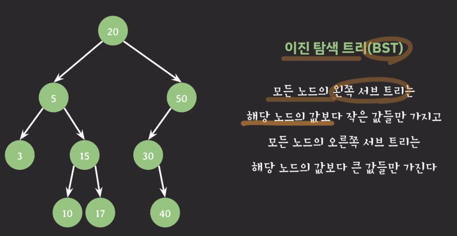
  - 자녀 노드는 최대 두 개까지만 가질 수 있음
  - 자녀 노드를 세 개까지 가지고 싶다면?
    - 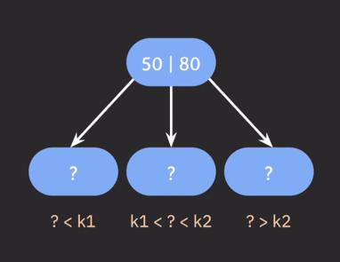
    - 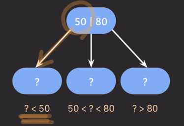
    - 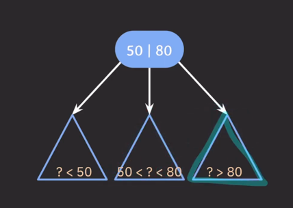
    - 자녀 노드의 최대 개수를 늘리기 위해서 부모 노드에 key를 하나 이상 저장한다.
      - 부모 노드의 key들을 오름차순으로 정렬한다.
      - 정렬된 순서에 따라 자녀 노드들의 key 값의 범위가 결정된다.
- 그래서 이런 구조를 가지는 트리를 `B tree` 라고 부른다.
  - 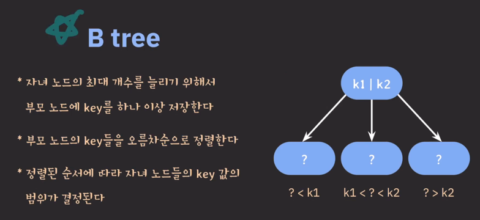
  - 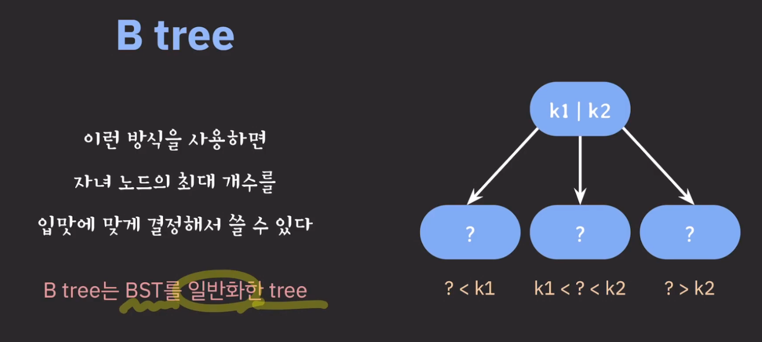
  - 최대 몇 개의 자녀 노드를 가질 것인지가 B tree를 사용할 때 중요한 파라미터!

---
- B tree의 파라미터
  - 종류
    - M : 각 노드의 최대 자녀 노드 수
      - 최대 M개의 자녀를 가질 수 있는 B tree를 M차 B tree라고 부른다
    - M-1 : 각 노드의 최대 key 수
    - M/2(반올림) : 각 노드의 최소 자녀 노드 수
      - root node, leaf node 제외
    - M/2(반올림)-1 : 각 노드의 최소 key 수
  - M만 넘겨주면 자동으로 정해짐
- B tree의 특징
  - internal 노드의 key 수가 x개라면 자녀 노드의 수는 언제나 x+1개다
    - 이런거 안됨
      - 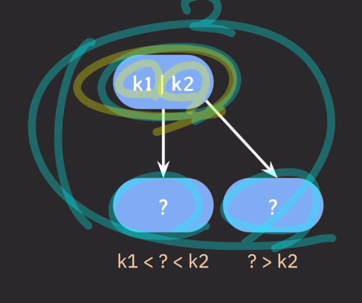
  - internal 녿이 key 수가 x개라면 자녀 노드의 수는 언제나 x+1 개다.
  - 노드가 최소 하나의 key는 가지기 때문에 몇 차 B tree인지와 상관없이 internal 노드는 최소 두 개의 자녀는 가진다.
- B tree의 데이터 삽입
  - 추가는 항상 leaf 노드에 한다.
  - 노드가 넘치면 가운데 key를 기준으로 좌우 key들은 분할하고 가운데 key는 승진한다.
  - 예제) 3차 B tree 데이터 삽입
    - 1 추가
      - 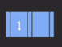
    - 15 추가
      - 
    - 2 추가 (가운데인 2 승진)
      - 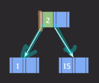
    - 5 추가
      - 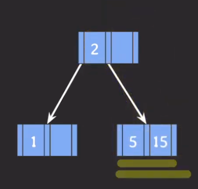
    - 30 추가
      - 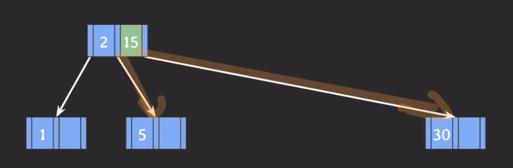
    - 90 추가
      - 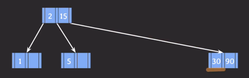
    - 20 추가
      - 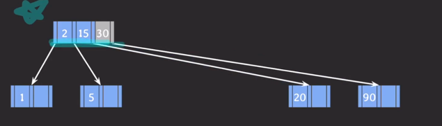
      - 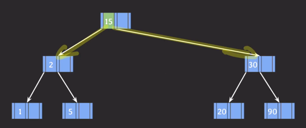
    - 7 추가
      - 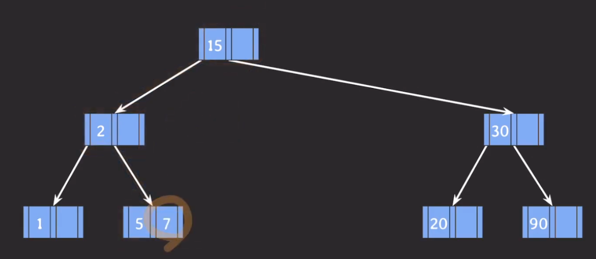
    - 9 추가
      - 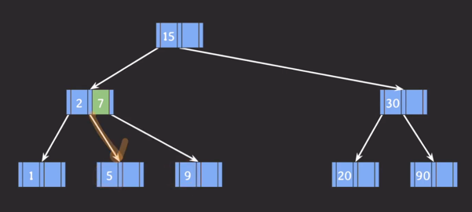
    - 8 추가
      - 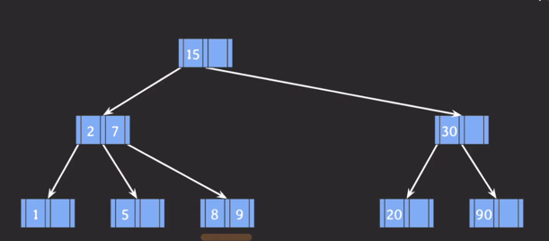
    - 10 추가
      - 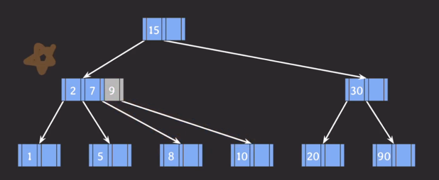
      - 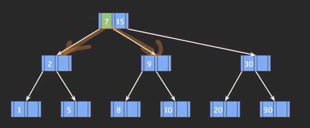
  - 모든 리프 노드들은 같은 레벨에 있다.
    - balanced tree
    - 검색의 avg/worst case -> O(log N)