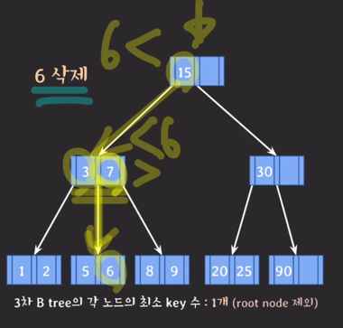
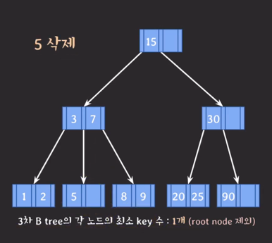
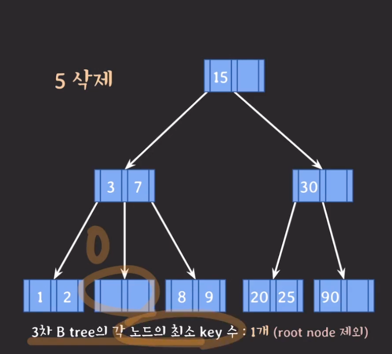
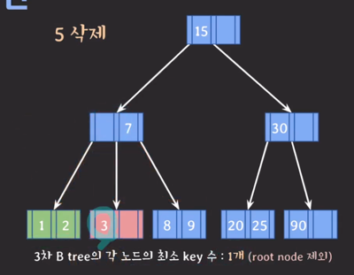
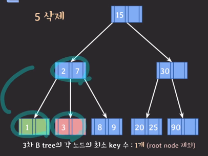
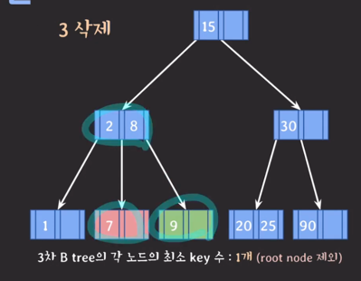
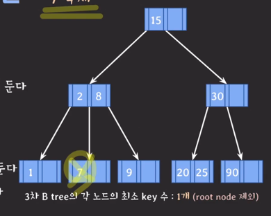
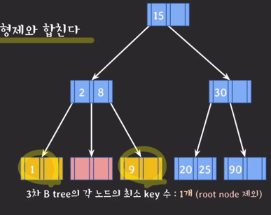

- B tree 데이터 삭제
  - 삭제도 항상 leaf 노드에서 발생
  - 삭제 후 최소 key 수보다 적어졌다면 재조정한다
    - M/2 - 1

---
- 6삭제
  - 
  - 
- 5 삭제
  - 
1) key 수가 여유있는 형제의 지원을 받는다.
- 5 삭제
  - 
  - 
- 3 삭제
  - 
2) 1번이 불가능하면 부모의 지원을 받고 형제와 합친다.
- 7 삭제
  - 
  - 
  - 
3) 2번 후 부모에 문제가 있다면 거기서 다시 재조정한다.