- 문제점
  - 단순히 값 하나 바꾸는 것보다 더 복잡한 과정
  - 같은 데이터에 또다른 read/write가 있다면 예상치 못한 동작을 할 수 있다.
- Lock
  - 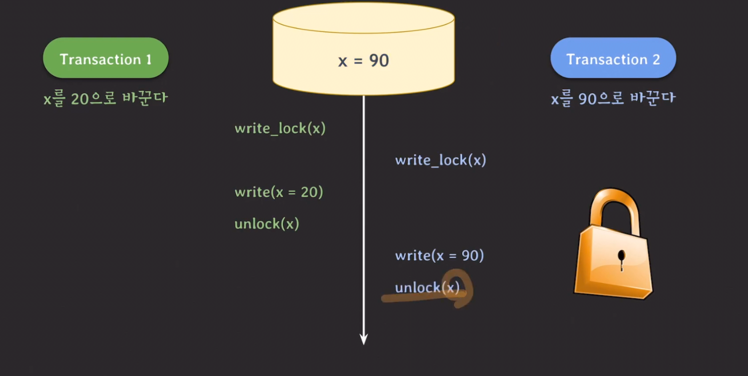
  - 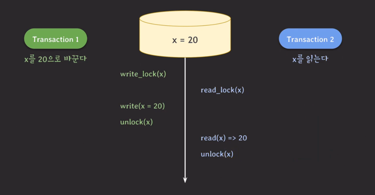
  - write-lock (exclusive lock)
    - read/write할 때 사용한다
    - 다른 트랜잭션이 같은 데이터를 read/write 하는 것을 허용하지 않는다.
  - read-lock (shared lock)
    - read할 때 사용한다
    - 다른 트랜잭션이 같은 데이터를 읽는 것은 허용한다.
    - 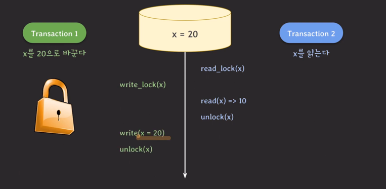
    - 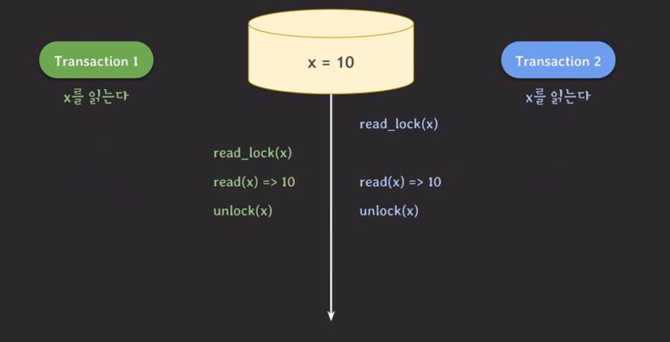
  - lock 호환성
    - 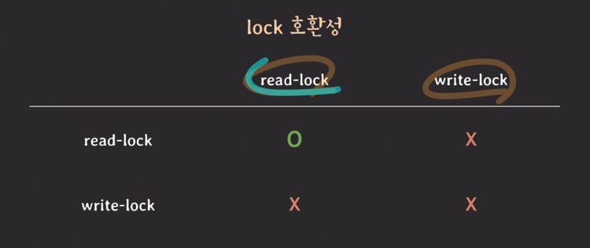

---
- lock을 사용했음에도 이상한 상황 발생 가능
  - 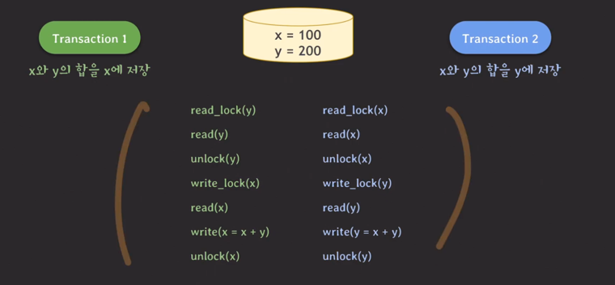
  - t1 -> t2
    - 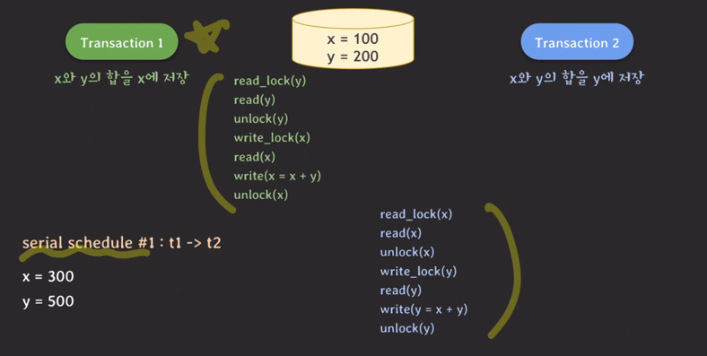
  - t2 -> t1
    - 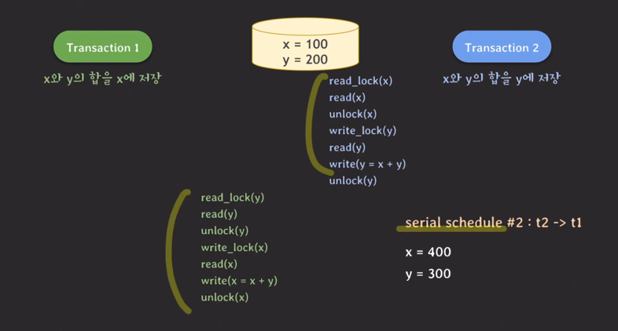
  - 동시
    - 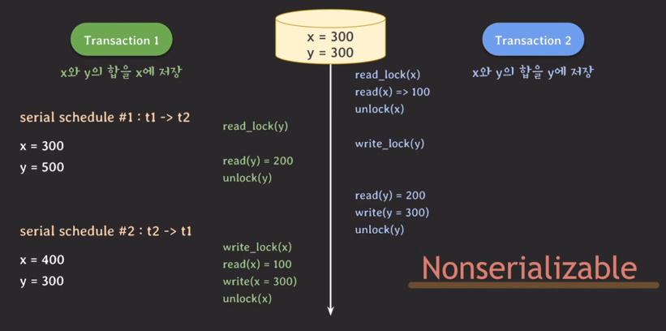
      - lock을 사용해도 nonserializable임
    - 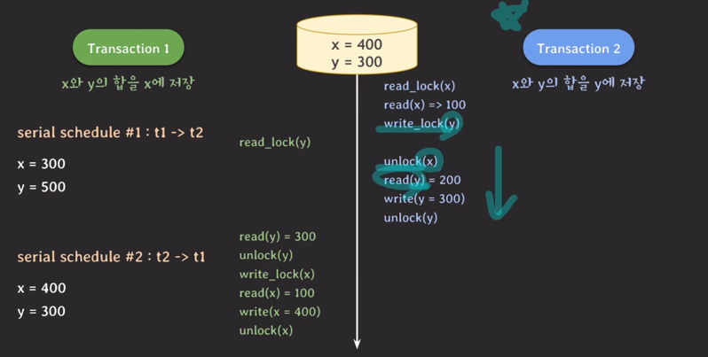
      - 이렇게 바꿈
    - 트랜잭션에서 모든 locking operation이 최초의 unlock operation 보다 먼저 수행되도록 하는 것 (2PL protocol)
      - 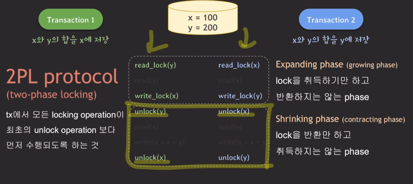
      - serializability 보장
        - 문제점
          - 데드락
            - 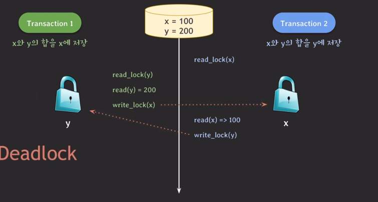

---
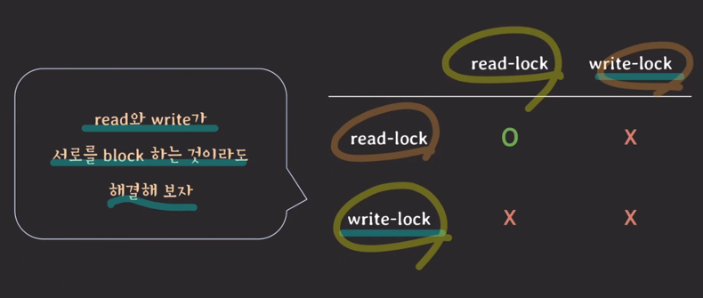
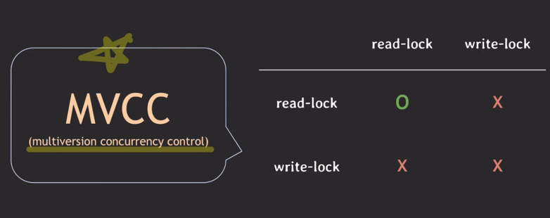
