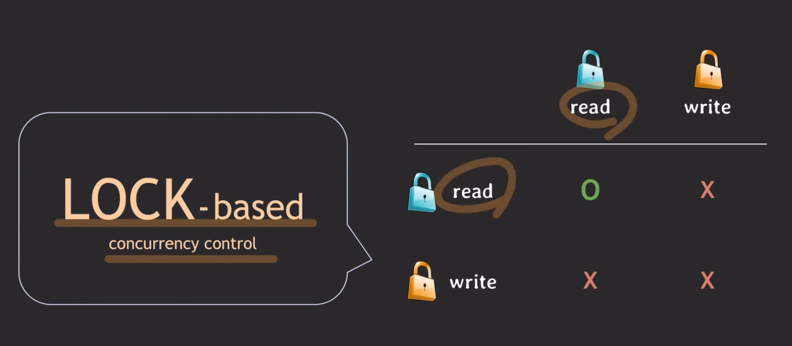
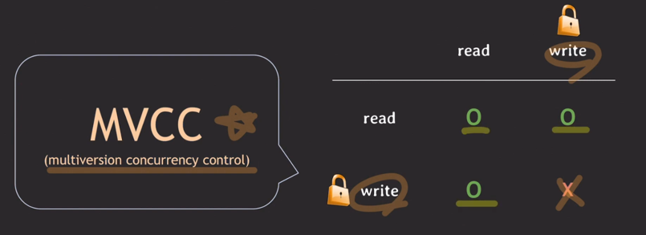
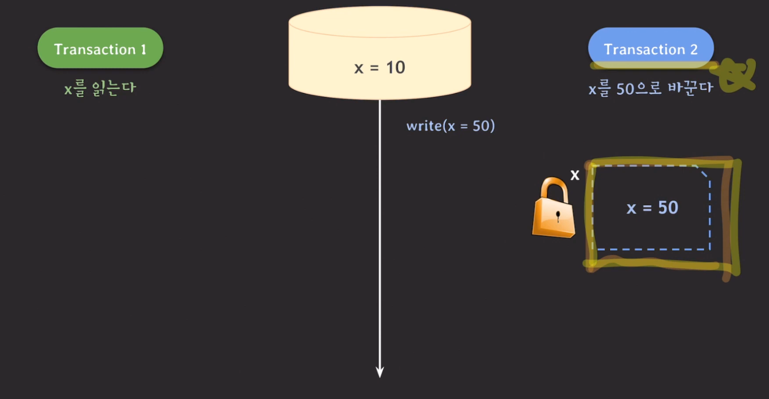
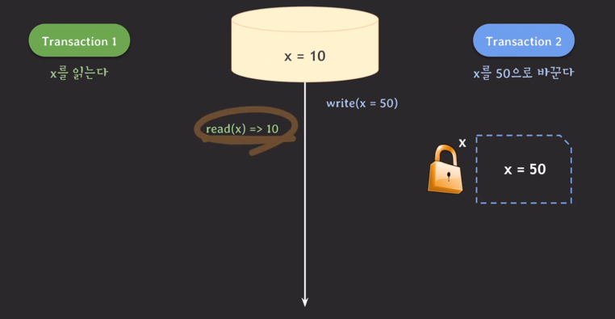
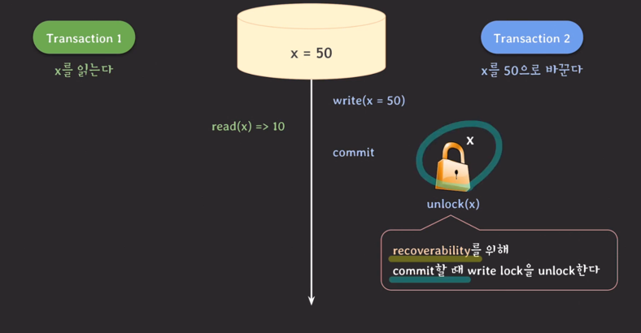

## MVCC, isolation level과 함께 MVCC case study
- 동시성 낮은 lock based concurrency control
  - 
- MVCC로 해결 (multiversion concurrency control)
  - 

---
- MVCC가 어떻게 동작하는지 살펴보자
  - write해도 바로 적용하는게 아니라 따로 x=50을 보관함
    - 
  - 그럼 t1가 read를 할땐 실제 db의 값을 읽게됨
    - 
    - `MVCC는 커밋된 데이터만 읽는다`
  - t2가 커밋을 하면, x=50이 db에 반영이 됨, 그리고 write lock을 풀음
    - 
  - t1이 다시한번 x를 읽는다면 어떤 값을 읽을까?
    - t1의 isolation level에 따라 다름
      - read committed라면
        - read하는 시간(현재)을 기준으로 그 전에 커밋된 데이터를 읽는다. , x=50으로 읽음
      - repeatable read
        - 트랜잭션 시작 시간 기준으로 그 전에 커밋된 데이터를 읽는다. , x=10으로 읽음
        - `MVCC`
          - 데이터를 읽을 때 특정 시점 기준으로 가장 최근에 커밋된 데이터를 읽는다. -> Consistent read
          - 데이터 변화(write)이력을 관리한다. -> 추가적인 저장공간을 사용함
          - read와 write는 서로를 block하지 않는다. -> 동시 트랜잭션 처리량이 늘어남
      - serializable
        - MVCC로 동작하기 보다는 lock으로 동작한다.
        - SSI(Serializable Snapshot Isolation)기법이 적용된 MVCC로 동작한다.
      - read uncommitted
        - MVCC는 committed된 데이터를 읽기 때문에 이 level에서는 보통 MVCC가 적용되지 않는다.

---
- repeatable read에서는 같이 데이터에 먼저 update한 트랜잭션이 커밋되면 나중 트랜잭션은 롤백된다. -> first-updater win
- 
