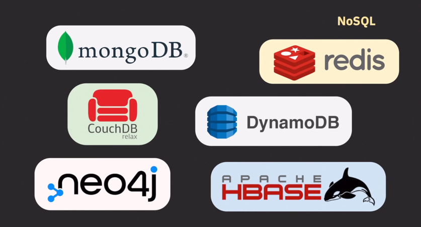

- RDB의 단점
  - 새로운 컬럼을 추가해야된다면 필연적으로 스키마의 변경이 발생함.
  - 유연한 확장성의 부족
  - 중복 제거를 위해 정규화 진행
    - JOIN이 많아질 수 있음 -> CPU 많이 사용, 응답시간 길어짐
  - 성능 문제
    - 스케일 업 하면 성능 개선 가능 
    - 레플리케이션 가능
      - 하지만 Write가 늘어난다면?
        - 소스 서버의 성능이 점차 안좋아짐
    - multi-master, sharding 같은 방법도 있지만 일반적으로 RDB는 스케일 아웃에 유연한 DB는 아님
  - ACID
    - ACID를 보장하려다 보니 DB 서버의 퍼포먼스에 어느 정도 영향을 미침
  - RDBMS로는 감당하기 힘든 처리량이 필요해짐
    - 
  - 그래서 NoSQL 등장 (Not only SQL)

---
## NoSQL

- 일반적인 특징
  - flexible schema
  - 중복 허용(join 회피)
    - application 레벨에서 중복된 데이터들이 모두 최신 데이터를 유지할 수 있도록 관리해야 함
  - 스케일 아웃에 최적화 되어 있음
    - 서버 여러대로 하나의 클러스터 구성하여 사용
- 단점
  - 스키마 관리를 application 레벨에서 해야 함
  - ACID의 일부를 포기하고 high-throughput, low-latency 추구
  - 금융 시스템처럼 consistency가 중요한 환경에서는 사용하기가 조심스러움

---
## Redis
- 인메모리 key value 데이터베이스, 캐시.. 등등으로 사용됨
- 

