- unrecoverable schedule

  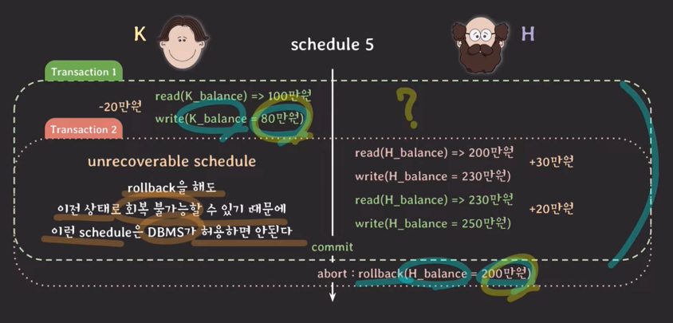
  - t2는 롤백했지만, t1은 커밋함
- recoverable schedule(최종 목표)
  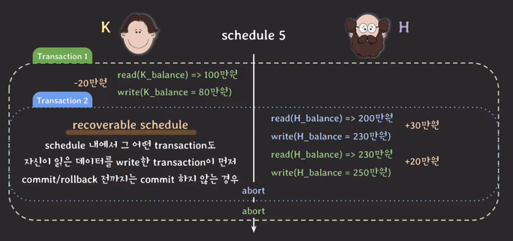
- cascading rollback

  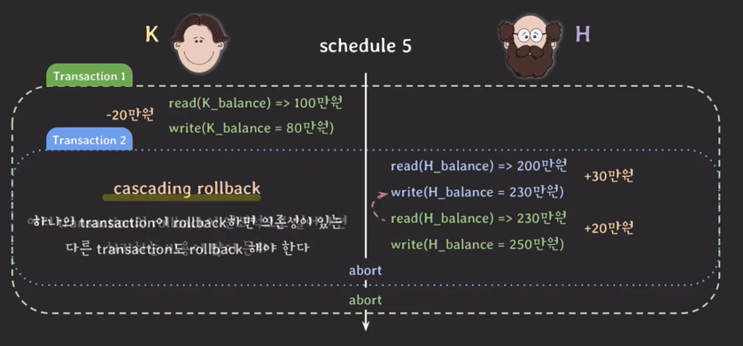

  - 하지만 여러 트랜잭션의 롤백이 연쇄적으로 일어나면 cascading rollback 방식으론 처리하는 비용이 많이 든다.
    - 해결 -> 데이터를 write한 transaction이 commit/rollback 한 뒤에 데이터를 읽는 schedule만 허용하자!
      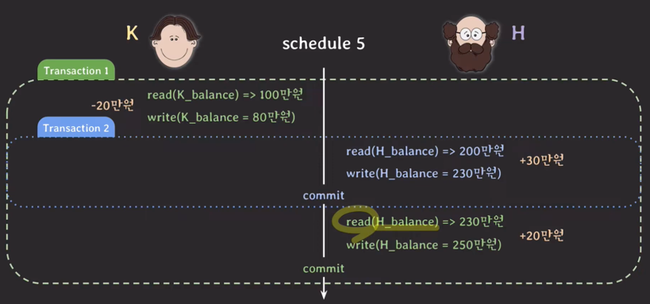
      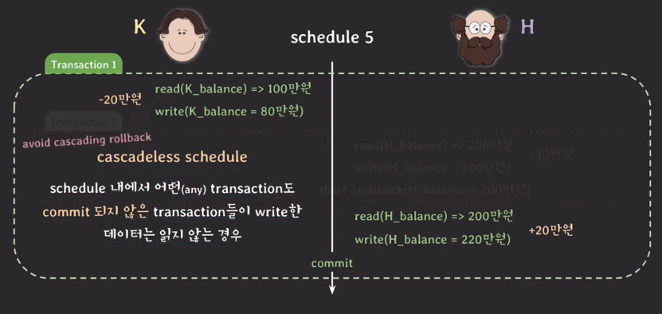
      - 하지만 문제 존재
      
        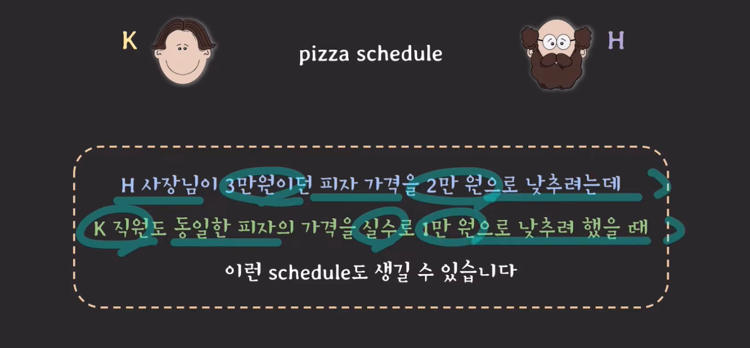
        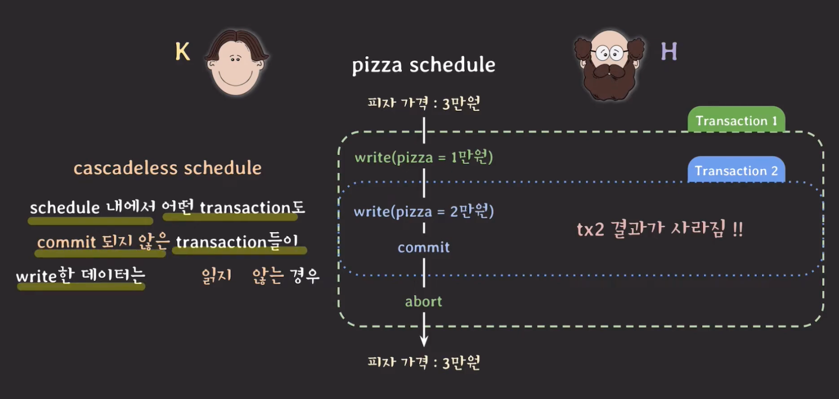
      - 보강 필요
      
        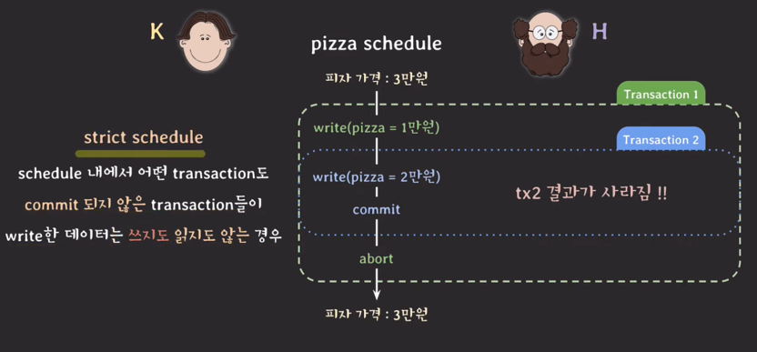
        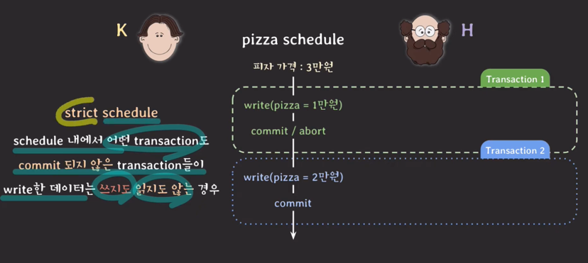
      - strict schedule
        - 롤백을 할 때 recovery가 쉽다.
        - 트랜잭션 이전 상태로 돌려놓기만 하면 된다.
---

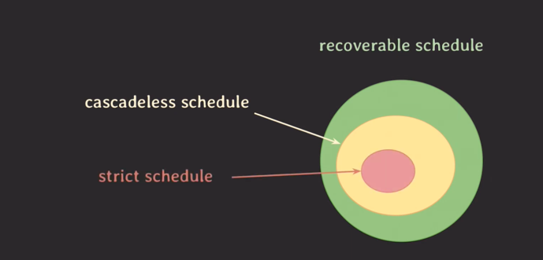

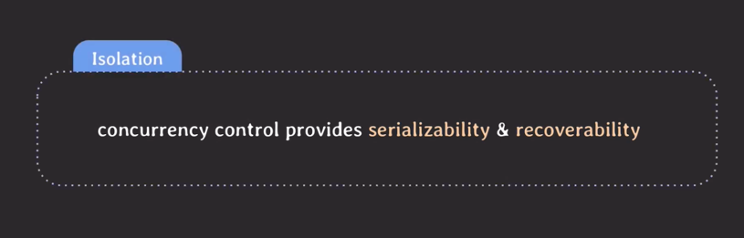