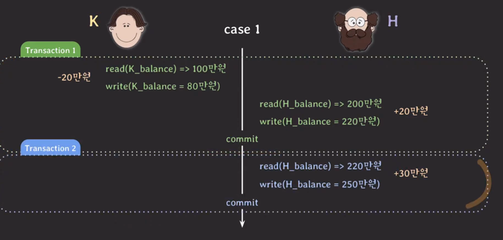
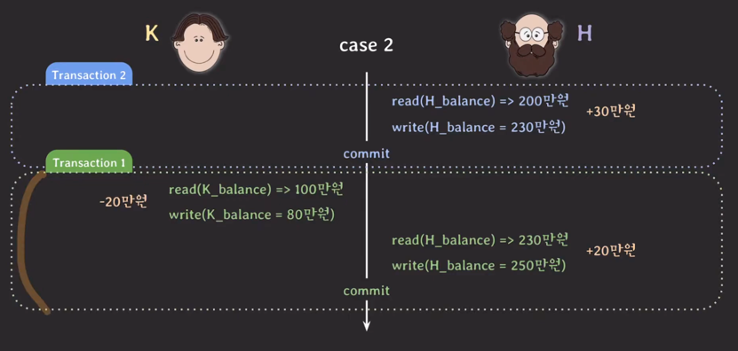
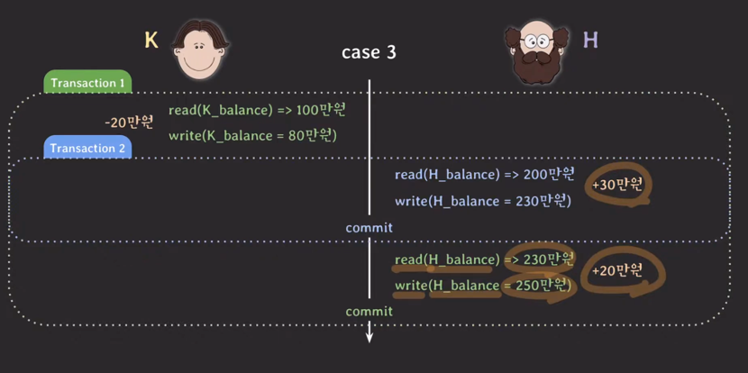
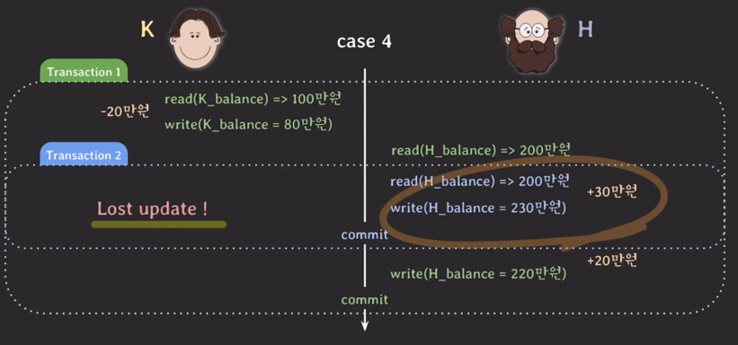
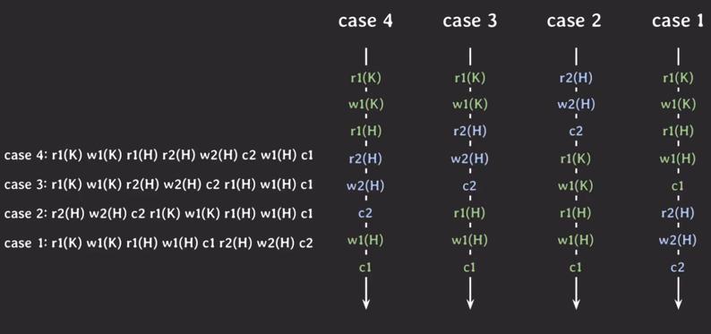
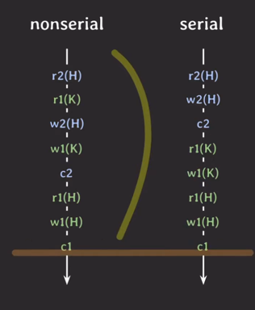

- 상황
  - 
  - 
  - 
  - 
  - 
- 
  - 스케쥴 
    - 여러 트랜잭션들이 동시에 실행될 때 각 트랜잭션에 속한 오퍼레이션들의 실행 순서
    - 각 트랜잭션 내의 오퍼레이션들의 순서는 바뀌지 않는다
  
  - Serial schedule
    - 트랜잭션들이 겹치지 않고 한 번에 하나씩 실행된다.
    - 성능 & 단점
      - 트랜잭션에서 IO가 발생할 동안 계속 다른 트랜잭션들은 기다려야 함.
      - 안전하지만, 한 번에 하나의 트랜잭션만 실행되기 때문에 좋은 성능을 낼 수 없고, 현실적으로 사용할 수 없는 방식이다.
  - Nonserial schedule
    - 트랜잭션들이 겹쳐서 실행되는 스케쥴
    - 성능 & 단점
      - 트랜잭션들이 겹쳐서 실행되기 때문에 동시성이 높아져서 같은 시간 동안 더 많은 트랜잭션들을 처리할 수 있다.
      - 트랜잭션들이 어떤 형태로 겹쳐서 실행되는지에 따라 이상한 결과가 나올 수 있다.
  - 고민거리
    - 성능 때문에 여러 트랜잭션들을 겹쳐서 실행할 수 있으면 좋다.(nonserial schedule)
    - 하지만 이상한 결과가 나오는 것은 싫다.
    - 그래서 nonserial schedule로 실행해도 이상한 결과가 나오지 않을 수 있는 방법을 연구하기 시작
  - 아이디어
    - serial schedule과 동일한 nonserial schedule을 실행하면 되겠다!
    - 그렇다면 'schedule이 동일하다'의 의미가 무엇인지부터 정의하는 것이 필요하겠군.
  - Conflict
    - 두 operatioin이 세 가지 조건을 모두 만족하면 conflict하다고 설정
      1) 서로 다른 transaction 소속
      2) 같은 데이터에 접근
      3) 최소 하나는 write operation
    - conflict operation은 순서가 바뀌면 결과도 바뀐다.
  - conflict equivalent
    - 두 개의 schedules이 두 조건 모두 만족하면 conflict equivalent
      1) 두 schedule은 같은 트랜잭션들을 가진다
      2) 어떤 conflicting operations의 순서도 양쪽 schedule 모두 동일하다
      
        - sched.3와 sched.2는 serial schedule!, conflict equivalent!
        - sched.2는 serial schedule이다. 그런데 sched.3은 sched.2와 conflict equivalent 하기 때문에 sched.3은 nonserial schedule이지만 Conflict serializable이다.
  - 해결책
    - conflict serializable한 nonserial schedule을 허용하자!
    - 구현 이슈(어떻게 구현할 것인가)
      - 여러 트랜잭션이 실행될 때 마다 해당 schedule이 conflict serializable인지 확인 (X, 실제론 안쓰임, 많은 요청들 마다 해당 트랜잭션이 conflict serializable인지 확인하는건 비용이큼)
    - 구현
      - 여러 트랜잭션을 동시에 실행해도 스케쥴이 conflict serializable 하도록 보장하는 프로토콜 적용