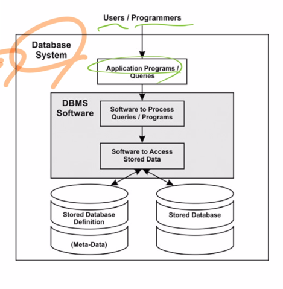
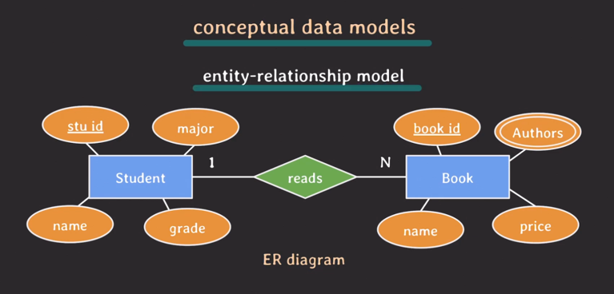
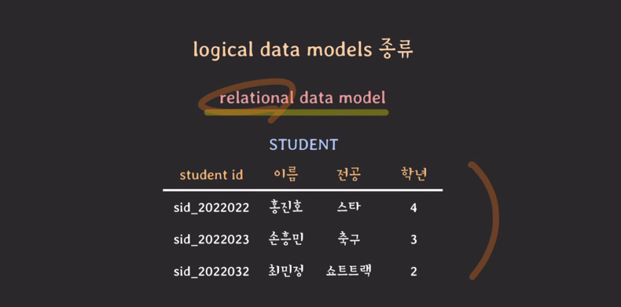
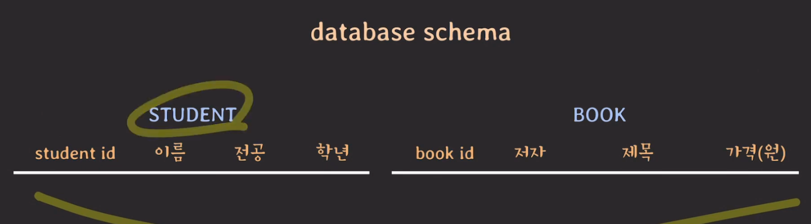
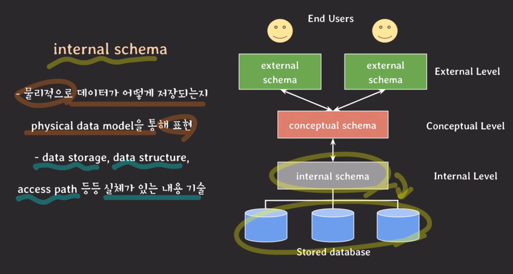

- database
  - 전자적으로 저장되고 사용되는 관련있는 데이터들의 조직화된 집합
- DBMS(database management systems)
  - 사용자에게 DB를 정의하고 만들고 관리하는 기능을 제공하는 소프트웨어 시스템
- database system
  - database + DBMS + 연관된 application, 줄여서 database라고도 부름

- data models
  - DB의 구조를 기술하는데 사용될 수 있는 개념들이 모인 집합
    - DB 구조(데이터 유형, 데이터관계, 제약사항 등)를 추상화해서 표현할 수 있는 수단을 제공한다.
  - 여러 종류가 있으며 추상화 수준과 DB 구조화 방식이 조금씪 다르다.
    - DB에서 읽고 쓰기 위한 기본적인 동작들도 포함한다.
  - 분류
    - conceptual
      
      - 일반 사용자들이 쉽게 이해할 수 있는 모델, 추상화 수준 가장 높음
    - logical
      
      - 이해하기 어렵지 않으면서도 디테일하게 DB를 구조화할 수 있는 개념들 제공
      - 데이터가 컴퓨터에 저장될 때의 구조와 크게 다르지 않게 DB 구조화를 가능하게 함
      - 특정 DBMS나 storage에 종속되지 않는 수준에서 DB를 구조화할 수 있는 모델
    - physical
      - 컴퓨터에 데이터가 어떻게 파일 형태로 저장되는지를 기술할 수 있는 수단을 제공
- database schema
  
  - data model을 바탕으로 database의 구조를 기술한 것
  - schema는 database를 설계할 때 정해지며, 한번 정해진 후엔 자주 바뀌지 않는다
- database state
  - database에 있는 실제 데이터는 꽤 자주 바뀔 수 있다.
  - 특정 시점에 database에 있는 데이터를 database state 혹은 snapshot이라고 한다.
  - 혹은 database에 있는 현재 instances의 집합이라고도 한다.
- three-schema architecture
  - 정의
    - database system을 구축하는 아키텍쳐중의 하나
    - user application으로 부터 물리적인 database를 분리시키는 목적
    - 세가지 level이 존재하며 각각의 level마다 schema가 정의되어 있다.
    - 각 레벨을 독립시켜서 어느 레벨에서의 변화가 상위 레벨에 영향을 주지 않기 위함
    - 데이터는 internal level에 존재
  - 종류
    
    - external schemas at external level
      - external views, user vies라고도 불림
      - 특정 유저들이 필요로 하는 데이터만 표현, logical data model을 통해 표현
    - conceptual schemas at conceptual level
      - 전체 데이터베이스에 대한 구조를 기술
      - 물리적인 저장 구조에 관한 내용은 숨김
      - 엔티티, 데이터 타입, 관계, 제약사항에 집중, logical data moel로 표현
    - internal schemas at internal level
      - 물리적으로 데이터가 어떻게 저장되는지 physical data model로 표현
      - data storage, data structure, access path 등 실체가 있는 내용 기술
- data definition language(DDL)
  - conceptual schema를 정의하기 위해 사용되는 언어
  - internal schema까지 정의할 수 있는 경우도 있음
- storage definition language(SDL)
  - internal schema를 정의하는 용도로 사용되는 언어
  - 요즘은 특히 RDBMS에서는 SDL이 거의 없고 파라미터 등의 설정으로 대체됨
- view definition language(VDL)
  - external schemas를 정의하기 위해 사용되는 언어
  - 대부분의 DBMS에서는 DDL이 VDL역할까지 수행
- data manipulation language(DML)
  - database에 있는 data를 활용하기 위한 언어
  - data의 추가,삭제,수정,검색 등등의 기능을 제공하는 언어
- 통합된언어
  - 오늘날의 DBMS는 DML,VDL,DDL이 따로 존재하기 보다는 통합된 언어로 존재
    - 대표적인 예가 SQL