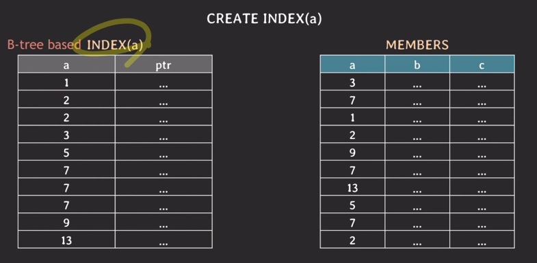
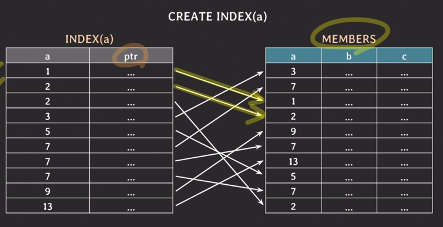
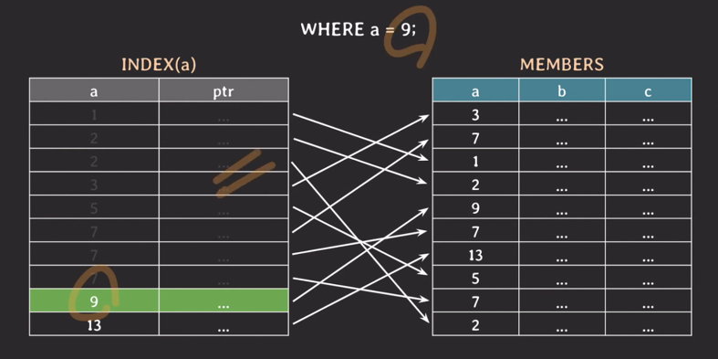
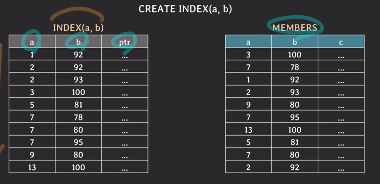
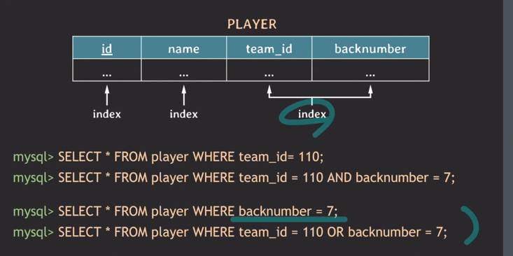
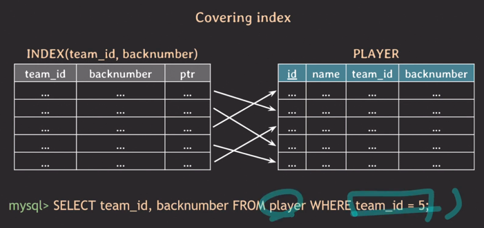

- B-Tree 기반 인덱스
  - 
  - 
  - a=9인 튜플을 찾으려고 함
    - binary search 이용
      - 
  - a=7이고 b=95인 튜플들을 찾으려고 함
    - a의 인덱스만을 통해 실행한다면
      - b의 조건에 대해서는 실제로는 하나씩 실제 튜플에가서 직접 비교해야 한다.(풀 스캔)
      - 성능적 비효율
    - a와 b의 복합 인덱스를 설정한다면
      - 
      - 왼쪽(a)를 기준으로 정렬이 되고, a의 값이 같다면 오른쪽(b)를 기준으로 그 안에서 정렬이 됨.

---

- 첫 번째 쿼리는 세번째 인덱스 사용
- 두 번째 쿼리도 세번째 인덱스 사용
- 세 번째 쿼리가 세번째 인덱스를 사용한다면 성능이 매우 안좋음, team_id를 먼저 탐색하기 때문에, 풀스캔
- 네 번째 쿼리는 OR 조건이므로 team_id에 대해선 세번째 인덱스를 사용하면 되겠지만 backnumber에 대해선 풀스캔

### 사용되는 쿼리에 맞춰서 적절하게 인덱스를 걸어줘야 쿼리가 빠르게 처리될 수 있다.

---
- 인덱스를 만들면 인덱스를 위한 테이블이 생성됨
  - 본 테이블에 write할 때마다 인덱스도 변경 발생
  - 추가적인 저장 공간 차지
  - 불필요한 인덱스를 만들지 말자

---
- 커버링 인덱스
  - 
  - 실제로 가져오려는 정보가 인덱스내에 이미 다 있어서 실제 테이블에 가지 않아도 커버가 됨
  - 조회 성능이 더 빠름

---
- Hash 인덱스
  - hash table을 사용하여 index를 구현
  - 시간복잡도 O(1)
  - rehashing에 대한 부담
  - equality 비교만 가능, range 비교 불가능
  - multicolumn index의 경우 전체 attributes에 대한 조회만 가

---
- 인덱스 보다 풀 스캔이 더 좋은 경우
  - 테이블에 데이터가 조금 있을 때 (몇 십, 몇 백건 정도)
  - 조회하려는 데이터가 테이블의 상당 부분을 차지할 때
- 그 외
  - order by나 group by에도 인덱스가 사용될 수 있다.
  - fk에는 인덱스가 자동으로 생성되지 않을 수 있다 (join 관련), mysql은 됨
  - 이미 데이터가 몇 백만건 이상 있는 테이블에 인덱스를 생성하는 경우 시간이 몇 분 이상 소요될 수 있고 DB 성능에 안좋은 영향을 줄 수 있다.