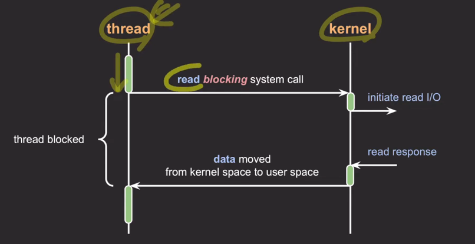
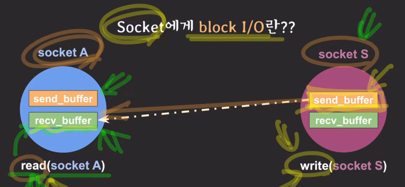
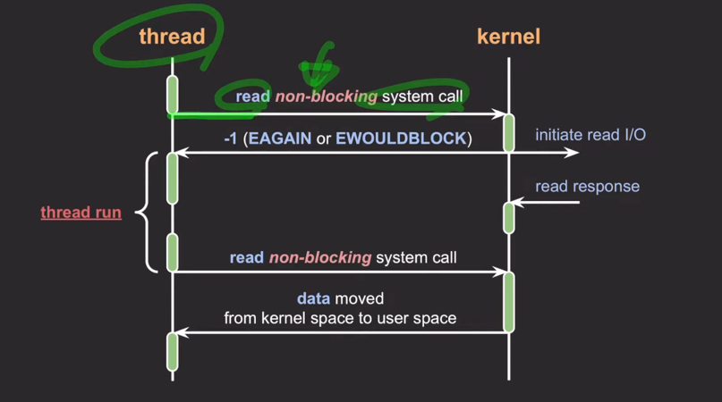
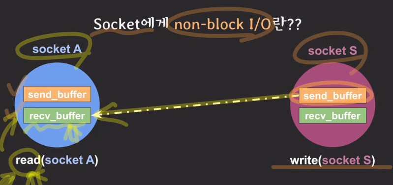
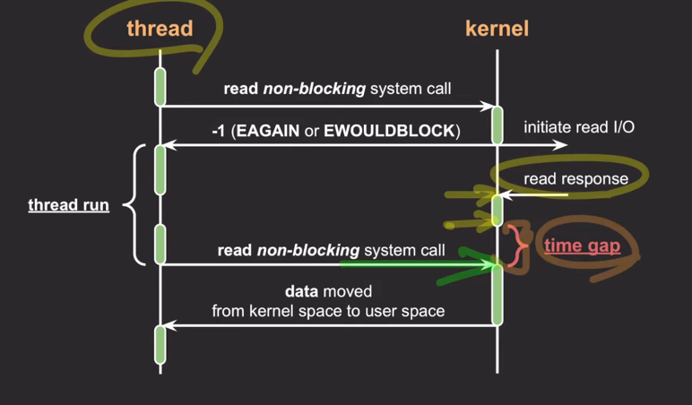
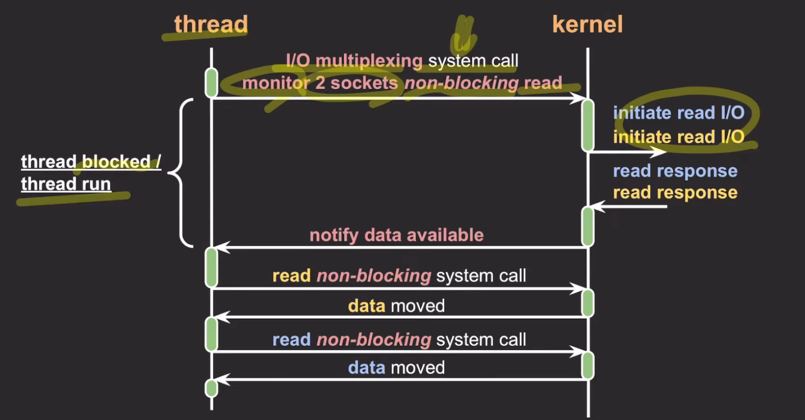
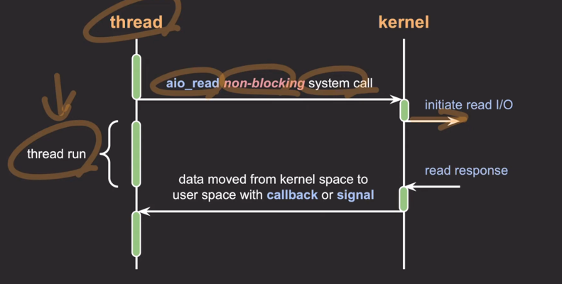
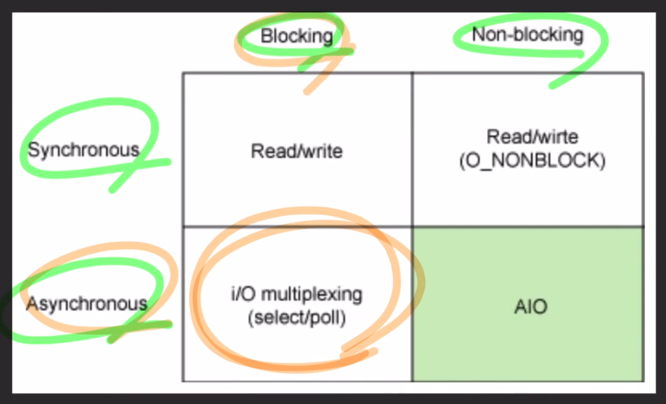

- IO
  - input/output, 데이터의 입출력
  - 종류
    - 네트워크(socket)
    - file
    - pipe(프로세스간 통신)
    - device
  - 소켓
    - 네트워크 통신은 소켓을 통해 데이터가 입출력 된다.
    - 백엔드 서버는 네트워크 상의 요청자들과 각각 소켓을 열고 통신한다.

---

- block IO
  
  - IO작업을 요청한 프로세스/스레드는 요청이 완료될 때까지 블락됨 
  
  - 소켓에선, receive 버퍼와 send 버퍼의 상태에 따라 block이 됨
- non-block IO
  
  - 프로세스/스레드를 블락시키지 않고 요청에 대한 현재 상태를 즉시 리턴
  - 블락되지 않고 즉시 리턴하기 때문에 스레드가 다른 작업을 수행할 수 있다.
  
  - 소켓에서는 블락과 다르게 read 스레드에서 recv_buffer에 값이 없어도 안기다림. write 스레드에서도 send_buffer가 꽉차도 안기다림

---
- non-block IO의 이슈 - IO 작업 완료를 어떻게 확인할 것인가?
  - 결과 처리 방식
    1) 완료됐는지 반복적으로 확인
       - 완료된 시간과 완료를 확인한 시간 사이의 갭으로 인해 처리 속도가 느려질 수 있음
       
       - 완료됐는지 반복적으로 확인하는 것은 CPU 낭비가 발생
    2) IO multiplexing(다중 입출력) 사용
       - 관심있는 IO작업들을 동시에 모니터링하고 그 중에 완료된 IO 작업들을 한번에 알려줌
       
       - 종류
         - select (x, 성능 안좋음)
         - poll (x,성능 안좋음)
         - epoll
           - 소켓들에 대해 하나라도 read가 발생하면 알려줘
           - 요청받은 소켓만 응답함
         - kqueue
         - IOCP(IO completion port)
       - 네트워크 통신에 많이 사용
    3) callback/signal 사용
       
       - 널리 사용되진 않음

---

