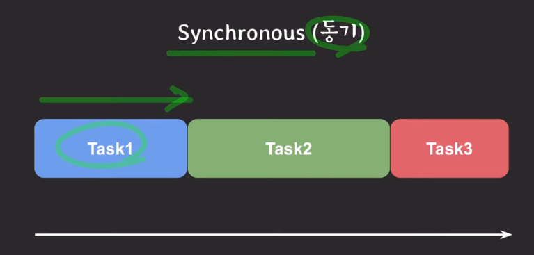
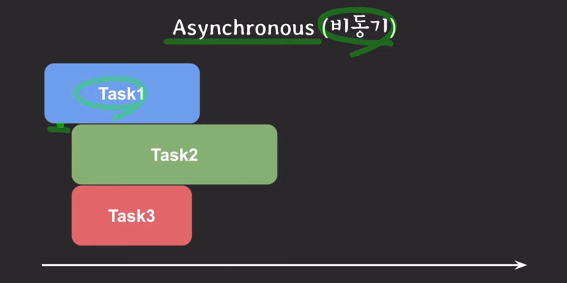
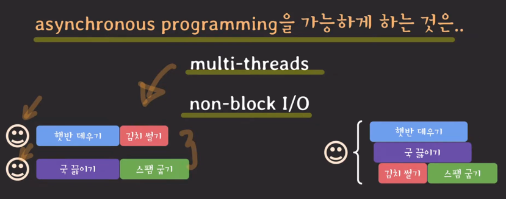
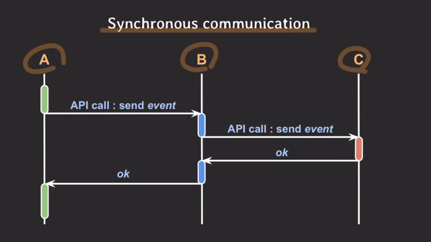
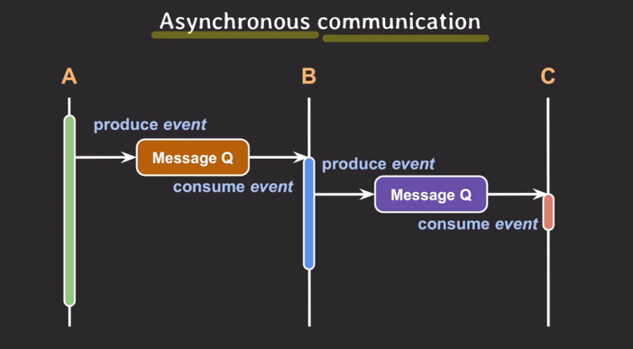

- sync
  
  - 여러 작업들을 순차적으로 실행하도록 개발
- async
  
  - 여러 작업들을 독립적으로 실행하도록 개발
  - async programming을 가능하게 하는 것은
    
    - multi-threads
    - non-block IO
  - 백엔드 프로그래밍의 추세는 스레드를 적게 쓰면서도 non-block IO를 통해 전체 처리량을 늘리는 방향으로 발전 
  - IO 관점에서의 async
    - synchronous IO = block IO & asynchronous IO = non-block IO
    - sync IO : 요청자가 IO 완료까지 챙겨야 할 때 & async IO : 완료를 noti주거나 callback으로 처리
    - async IO : block IO를 다른 thread에서 실행
      
  - 백엔드 아키텍쳐 개념
    - 하나의 서비스는 기능과 역할에 따라 여러 개의 마이크로 서비스로 구성되고 이들 사이에선 빈번하게 커뮤니케이션이 발생한다.
    - sync communication
      
    - async communication
      
      - 하지만 만약 A에서 B가 제공하는 데이터가 필요할 땐, 
        - 메세지 큐 보다 API를 사용하는게 더 좋을 수 있음

- asynchronous programming != multithreading
  - 여러 작업을 동시에 실행하는 프로그래밍 방법론 vs async programming의 한 종류