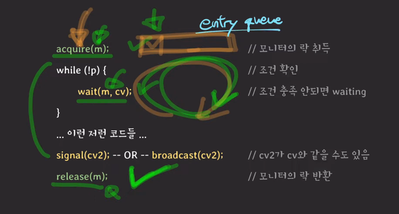
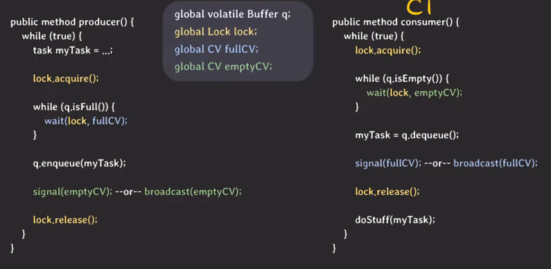
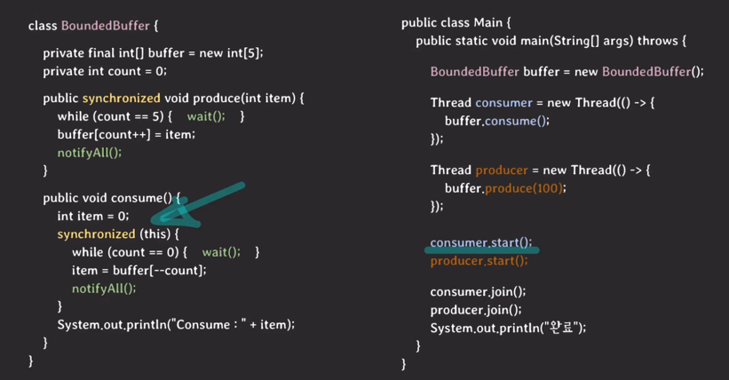

- 모니터
  - 상호 배제를 보장
  - 조건에 따라 스레드가 대기상태로 전환가능
- 언제 사용?
  - 한번에 하나의 스레드만 실행되어야 할 때
  - 여러 스레드와 협업이 필요할 때
- 구성 요소
  - 뮤텍스
    - 임계영역에 진입하려면 뮤텍스 락을 취득해야 함
    - 락을 취득하지 못한 스레드는 큐에 들어간 후 대기상태로 전환
    - 뮤텍스락을 쥔 스레드가 락을 반환하면 락을 기다리며 큐에 대기하면 스레드 중 하나가 실행
  - condition variable
    - waiting queue 를 가짐
      - 조건이 충족되길 기다리는 스레드들이 대기 상태로 머무는 곳
    - 주요 동작(operation)
      - wait
        - 스레드가 자기 자신을 condition variable의 waiting queue에 넣고 대기 상태로 전환
      - signal
        - waiting queue에서 대기중인 스레드중 하나를 깨움
      - broadcast
        - waiting queue에서 대기중인 스레드 전체를 깨움

---

- 노란색 글씨는 condition variable에 관련된 부분
  - wait(m,cv)
    - cv(condition variable)을 인자로 주어 waiting queue에 넣고 대기 상태로 전환함.
  - signal(cv2), broadcast(cv2)
    - 조건이 충족되면 꺠움
- 모니터에 존재하는 두 개의 큐
  - entry queue : 임계 구역에 진입을 기다리는 큐 (뮤텍스에 의해 관리)
  - waiting queue : 조건이 충족되길 기다리는 큐 (condition variable에 의해 관리)

---
- bounded producer/consumer problem

- producer가 갖는 문제점
  - 버퍼가 가득차서 넣을 공간이 없는데도 아이템을 생성하면 이젠 공간이 없기 때문에 빈 공간이 생길때 까지 계속 확인해야 하는가?
- consumer가 갖는 문제점
  - 버퍼에서 아이템을 가져오려고 봤더니 아무런 것도 없는 상태, 컨슈머는 버퍼에 아이템이 있는지없는지 계속 확인해야 하는가?

-> 모니터를 통해 해결할 수 있음

- producer와 consumer가 buffer를 같이 사용하기 때문에 상호 배제가 보장되어야 함
  - 락을 통해 임계 구역으로 관리
- producer 입장에서 버퍼가 다 찼다면 기다림 = 웨이팅 큐에 드감(wait(lock, fullCV), signal(fullCV) or broadcast(fullCV))
  - 버퍼에서 아이템 가져오고 버퍼에 빈 칸이 생겼다면,
  - 웨이팅 큐에서 대기중인 프로듀서 스레드들을 컨슈머에서 받아서 signal이나 broadcast를 통해 꺠워줌 
- consumer 입장에서 버퍼에 아이템이 하나 없어서 기다림 = 웨이팅 큐에 드감 (wait(lock, emptyCV), signal(emptyCV) or broadcast(emptyCV))
  - 버퍼에 아이템 넣고,
  - 웨이팅 큐에서 대기중인 컨슈머 스레드들을 프로듀서에서 받아서 signal이나 broadcast를 통해 깨워줌

---
- 자바에서 모니터란
  - 자바에서 모든 객체는 내부적으로 모니터를 가진다.
  - 모니터의 상호 배제 기능은 synchronized 키워드로 사용한다.
  - 자바의 모니터는 condition variable을 하나만 가진다.
  - 자바 모니터의 세 가지 동작
    - wait
    - notify
    - notifyAll

- producer consumer 문제를 자바에서 해결하는 방식
  - 블록에서 synchronized를 실행할 시 인자로 락이 필요한데, 그때 this(객체 자신)을 넣어주어 자기 자신의 뮤텍스 락을 쥐고 들어간다. (객체는 하나의 모니터를 갖기에)
  - 두 가지 이상의 condition variable이 필요하다면 따로 구현이 필요함
  - java.util.concurrent에 동기화 기능이 탑재된 여러 클래스 존재