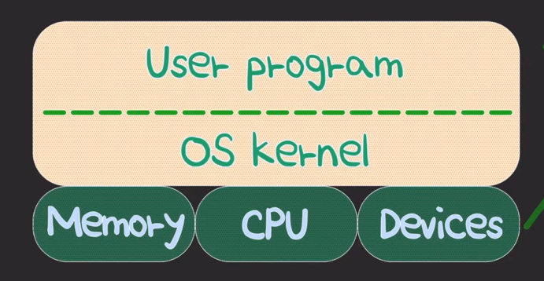
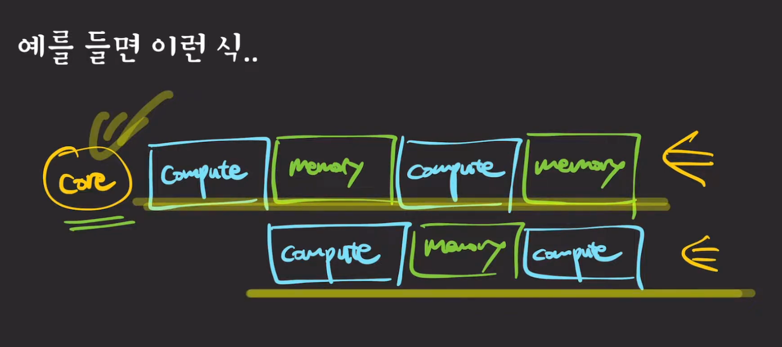

- 하드웨어, OS, 프로그램 (3레벨)

---
- 하드웨어 스레드
  - 코어의 고민
    - 메모리에서 데이터를 기다리는 시간이 꽤 오래걸린다.
    - 메모리를 기다리는 동안 다른 스레드를 실행하는건 어떨까
      - 두 개의 서로 다른 스레드(하드웨어 스레드)를 실행시킴
      
  - OS 관점에선 가상의 `코어`이다.
    - 만약에 싱글 코어 CPU에 하드웨어 스레드가 두 개라면 OS는 이 CPU를 듀얼 코어로 인식하고 듀얼 코어에 맞춰서 OS 레벨의 스레드들을 스케쥴링 한다.

---
- OS 스레드
  - OS 커널 레벨에서 생성되고 관리되는 스레드
    - 커널 - 운영체제의 핵심, 시스템 전반을 관리, 하드웨어에 접근
  - CPU에서 실제로 실행되는 단위, `CPU 스케쥴링의 단위`
  - OS 스레드의 컨텍스트 스위칭은 커널이 개입 -> 비용 발생
  - 사용자 코드와 커널 코드 모두 OS 스레드에서 실행된다.
  - 아래와 같이 불리기도 함
    - 네이티브 스레드
    - 커널 스레드(*)
    - 커널-레벨 스레드
    - OS-레벨 스레드

---
- 유저 스레드
  - 스레드 개념을 프로그래밍 레벨에서 추상화 한 것
    - Thread thread = new Thread(); thread.start();
  - 유저 스레드가 CPU에서 실행되려면 반드시 OS 스레드와 연결돼야 한다.
  - 유저 스레드와 OS 스레드를 어떻게 연결시킬 것인가?
    - One to One model (자바)
      - 유저 스레드와 OS 레벨의 스레드가 1:1로 연결됨
      - 스레드 관리를 OS에 위임, 스케쥴링도 커널이 수행
      - 한 스레드가 블락이 되도 다른 스레드는 잘 동작(OS 스레드가 여러개이므로)
      - race condition 가능성, 멀티코어 활용 가능
    - Many To One model
      - 유저 여러개, OS 하나.
      - 컨텍스트 스위칭이 빠름.
        - 컨텍스트 스위칭이 유저레벨에서만 일어나기 떄문
      - 유저 스레드 간의 스위칭이 빠름
      - race condition 가능성 적음, 멀티코어 활용 못함, 한 스레드가 블락이 되면 모든 스레드들이 블락(OS 스레드는 하나 이므로)
    - Many To Many model
      - 위 둘의 장점을 합친 것
      - 구현이 복잡

- Green thread
  - 자바 초창기 버전