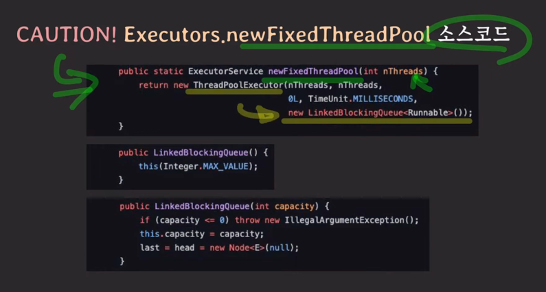

- Thread per request model
  - request 마다 스레드를 하나씩 할당함.
  - 만약 이 모델의 동작 방식이 서버에 들어오는 요청마다 스레드를 새로 만들어서 처리하고 처리가 끝난 스레드는 버리는 식으로 동작한다면 어떤 문제점이 있을까요?
    - 스레드 생성에 소요되는 시간 때문에 요청 처리가 더 오래 걸림
    - 처리 속도보다 더 빠르게 요청이 늘어나면
      - 스레드 계속 생성
      - 컨텍스트 스위칭이 더 자주발생
      - CPU 오버헤드 증가로 CPU time 낭비
      - 어느 순간 서버 전체가 응답 불가능 상태에 빠짐
    - 메모리가 점점 고갈됨(스레드도 메모리를 차지함)

---
- 스레드 풀
  - 원리
    - 미리 정해진 개수만큼 스레드들을 만들어두고, 요청들은 스레드 풀에 지정된 큐로 들어옴
    - 스레드 풀안의 스레드 중 일이 없는 스레드에게 요청이 할당 됨
    - 할당 받은 스레드는 요청을 처리
    - 처리 후, 스레드 풀로 반납
  - 미리 스레드를 여러 개 만들어 놓고 재사용
    - 스레드 생성 시간 절약
  - 제한된 개수의 스레드를 운용
    - 스레드가 무제한으로 생성되는 것을 방지
  - 사례
    - 여러 작업을 동시에 처리해야 할 때
      - `동시`에 어떤 작업을 처리할 때
  - 사용 팁
    1) 스레드 풀에 몇 개의 스레드를 만들어 두는게 적절한가?
       - CPU의 코어 개수와 task의 성향에 따라 다름
       - CPU bound task 라면 스레드풀의 스레드 개수를 코어 개수만큼, 혹은 그보다 몇개 많은 정도로 설정
       - IO bound task라면, 코어 개수보다 1.5배, 두 배, 세배 -> 경험적으로 찾아야 함
    2) 스레드 풀에서 실행될 task 개수에 제한이 없다면
       - 스레드 풀의 큐가 사이즈 제한이 있는지 꼭 확인할 것
         - 요청이 엄청많은데 스레드 풀에 남은 스레드가 없다면 스레드 풀 안의 큐에 요청이 엄청 쌓이게 된다.
         - 만약 `큐 사이즈`에 `제한이 없다면` 요청들이 계속 쌓임 -> `메모리 고갈시킬 위험`
       - Executors.newFixedThreadPool(10);
         - 스레드 풀의 크기는 10개로 고정
       - newFixedThreadPool의 내부
       
       - capacity는 queue size임, 현재는 MAX_VALUE로 설정되어있음, 즉 큐 사이즈에 제한이 없다는 뜻
       - 따라서 안심하고 쓰면 안됨
        